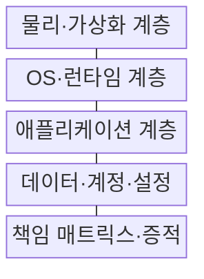
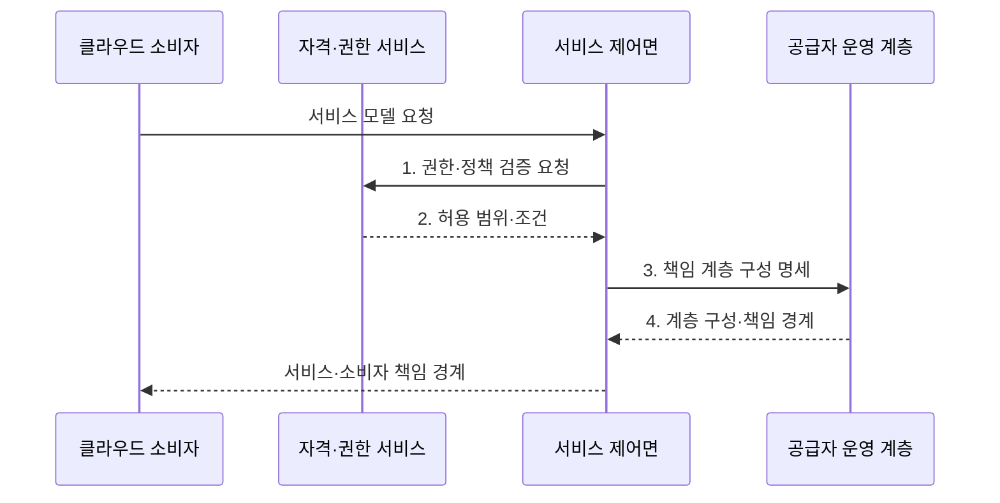

---
sidebar:
  order: 141
  label: "141. 클라우드 서비스 모델: IaaS·PaaS·SaaS (Cloud Service Models)"
  badge:
    text: "기출 · 70%"
    variant: note
title: "클라우드 서비스 모델: IaaS·PaaS·SaaS (Cloud Service Models)"
date: "2026-08-02T12:00:00+09:00"
tags:
  - "notes-software"
weight: 141
extra:
  question_no: "141"
  source_status: "기출"
  source_history: "120회, 125회, 131회, 132회"
  priority: 70
  priority_note: "서비스별 운영 책임 경계가 반복 출제됨"
---

## Ⅰ. 개요

핵심 용어

- **서비스형 인프라(Infrastructure as a Service, IaaS)**: 공급자가 물리·가상화 인프라를 제공하고 소비자가 운영체제부터 관리하는 서비스 모델이다.
- **서비스형 플랫폼(Platform as a Service, PaaS)**: 공급자가 운영체제와 런타임까지 제공하고 소비자가 애플리케이션을 관리하는 서비스 모델이다.
- **서비스형 소프트웨어(Software as a Service, SaaS)**: 공급자가 완성된 애플리케이션을 운영하고 소비자가 계정·데이터·설정을 관리하는 서비스 모델이다.

- 정의/개념: **클라우드 서비스 모델**은 인프라부터 애플리케이션까지 공급자와 소비자의 운영 책임 범위에 따라 IaaS•PaaS•SaaS를 구분하는 **서비스 분류 체계**
- 배경/필요성: 서비스 계층별 담당 미구분 시 **운영·보안 책임 공백**

#### 한줄 요약

- 건물만 빌릴지, 조리 시설까지 빌릴지, 완성된 식사를 받을지 정하는 선택이다.

## Ⅱ. 특징

핵심 용어

- **책임 이전**: IaaS에서 PaaS와 SaaS로 갈수록 공급자가 관리하는 계층이 늘어나는 특성이다.
- **서비스형 인프라(Infrastructure as a Service, IaaS)·서비스형 플랫폼(Platform as a Service, PaaS)·서비스형 소프트웨어(Software as a Service, SaaS)**: 공급자의 운영 책임 범위가 인프라에서 플랫폼과 애플리케이션으로 점차 확대되는 서비스 계층이다.
- **제어·책임 연동**: 소비자가 직접 제어하는 계층이 많을수록 해당 계층의 운영·보안 책임도 커지는 관계이다.
- **공통 책임**: 서비스 모델과 무관하게 소비자가 맡아야 하는 계정·권한·데이터·안전한 설정의 책임이다.

- **책임 이전**: IaaS→PaaS→SaaS로 공급자 운영 범위가 확대
- **제어·책임 연동**: 소비자 제어가 클수록 운영 책임도 증가
- **공통 책임**: 계정·권한·데이터·안전한 설정은 소비자가 담당

#### 한줄 요약

- 맡기는 층이 많을수록 손은 덜 가지만 직접 바꿀 수 있는 범위도 줄어든다.

## Ⅲ. 구조 및 구성요소

핵심 용어

- **책임 매트릭스·증적**: 계층과 보안 통제별 담당자 및 감사 근거를 명시하는 구성요소이다.
- **물리·가상화 계층**: 서버·저장소·네트워크와 이를 논리 자원으로 분할하는 기반 계층이다.
- **운영체제(Operating System, OS)·런타임 계층**: 애플리케이션 실행에 필요한 운영체제와 언어·미들웨어 환경을 제공하는 계층이다.
- **애플리케이션 계층**: 업무 기능을 구현한 프로그램과 그 배포·운영을 담당하는 계층이다.
- **데이터·계정·설정**: 소비자가 서비스 안에서 분류·권한·보호 수준을 결정해야 하는 관리 대상이다.

| 구성요소 | 책임 |
|:---|:---|
| 물리·가상화 계층 | 공급자의 서버·저장소·**네트워크 운영** 책임 |
| OS·런타임 계층 | 모델별 **운영체제·런타임** 책임 분리 |
| 애플리케이션 계층 | IaaS·PaaS 소비자와 SaaS **공급자 운영** 분리 |
| 데이터·계정·설정 | 소비자의 **데이터 분류·권한 설정** 책임 |
| 책임 매트릭스·증적 | 계층·통제별 **책임자·감사 근거** 명시 |

#### 한줄 요약

- 건물만 빌릴지 조리 시설이나 완성된 식사까지 받을지 정한다.

## Ⅳ. 흐름도

핵심 용어

- **4. 계층 구성·책임 경계**: 선택한 서비스에서 공급자와 소비자가 맡을 계정·설정·데이터 통제를 분리한 결과이다.
- **1. 권한·정책 검증 요청**: 요청자의 역할과 조직 정책상 허용되는 서비스·설정 범위를 조회하는 단계이다.
- **2. 허용 범위·조건**: 사용할 수 있는 서비스 모델과 자원·보안 설정의 한도를 확정하는 단계이다.
- **3. 책임 계층 구성 명세**: 선택한 서비스 모델에서 공급자가 운영할 계층을 지정하는 단계이다.

**동작 원리**

1. **권한·정책 검증 요청**: 요청자 역할과 조직 정책의 허용 범위 조회
2. **허용 범위·조건**: 사용 가능한 서비스 모델과 설정 한도 확정
3. **책임 계층 구성 명세**: 선택 모델에 따른 공급자 운영 계층 지정
4. **계층 구성·책임 경계**: 소비자가 맡을 계정·설정·데이터 통제 분리

#### 한줄 요약

- 공급자가 운영할 층을 만든 뒤 소비자가 맡은 설정과 데이터를 넣고 양쪽의 상태를 함께 감시한다.

## Ⅴ. 종류 및 비교

핵심 용어

- **서비스형 인프라(Infrastructure as a Service, IaaS)**: 공급자가 인프라를 제공하고 소비자가 운영체제·런타임·애플리케이션을 관리하는 모델이다.
- **서비스형 플랫폼(Platform as a Service, PaaS)**: 공급자가 운영체제와 런타임을 관리하고 소비자가 애플리케이션을 배포하는 모델이다.
- **서비스형 소프트웨어(Software as a Service, SaaS)**: 공급자가 완성된 애플리케이션까지 운영하고 소비자가 사용자·데이터·설정을 관리하는 모델이다.

| 서비스 모델 | IaaS | PaaS | SaaS |
|:---|:---|:---|:---|
| 적용 기준 | **자체 OS·네트워크 제어** | **빠른 앱 개발·플랫폼 위임** | **표준 업무 기능 사용** |
| 핵심 특징 | 인프라 제공·소비자 **OS 관리** | 플랫폼 제공·소비자 **앱 관리** | 완성 앱 제공·소비자 **설정 관리** |
| 한계 | 소비자의 **패치·가용성 운영** 부담 | **런타임 제약·플랫폼 종속** | **맞춤화·데이터 이동** 제약 |

#### 한줄 요약

- IaaS는 운영체제부터, PaaS는 앱부터 관리하고 SaaS는 완성된 앱의 사용자와 데이터를 관리한다.

## Ⅵ. 실무 고려사항 및 대책

핵심 용어

- **책임 경계 불일치**: 계약서의 계층별 담당과 실제 운영 주체가 달라 통제가 누락되는 문제이다.
- **책임·승인·협의·통보(Responsible, Accountable, Consulted, Informed, RACI)**: 업무별 수행자·최종 책임자·협의자·통보 대상을 구분하는 책임 배정 기법이다.
- **복구 시간 목표(Recovery Time Objective, RTO)·복구 시점 목표(Recovery Point Objective, RPO)**: 장애 후 허용되는 최대 복구 시간과 최대 데이터 손실 구간을 나타내는 복구 기준이다.
- **통제 상속·소비자 증거**: 공급자 통제를 재사용할 부분과 소비자가 직접 운영·입증할 부분을 분리한 감사 근거이다.

| 문제 | 대책 | 효과 |
|:---|:---|:---|
| 계약과 실제 운영의 계층별 **책임 경계 불일치** | **RACI·계약 조항** 대조 | 장애별 **책임 주체 오인** 방지 |
| 소비자 설정 오류로 데이터·서비스 공개 | **기준 구성·최소 권한** 적용 | **공개 범위·과다 권한** 축소 |
| 공급자 복구 범위만 믿으면 업무 복구 목표 미달 | **백업 복원·RTO/RPO** 시험 | **업무 복구 시간·손실량** 검증 |
| 공급자 통제 상속만으로 소비자 증적 누락 | **통제 상속·소비자 증거** 분리 | **규정 준수 범위** 명확화 |
| 공급자 고유 형식 의존으로 서비스 이전 지연 | **데이터 내보내기·종료** 시험 | **이전 소요 시간** 사전 확인 |

#### 한줄 요약

- 가상 서버를 빌려도 그 안의 운영체제 업데이트는 대개 사용자가 해야 한다.

## Ⅶ. 결론

핵심 용어

- **제어 수준·운영 역량**: 직접 변경할 범위와 책임질 수 있는 업무를 함께 평가하는 서비스 모델 선택 기준이다.
- **서비스형 인프라(Infrastructure as a Service, IaaS)·서비스형 플랫폼(Platform as a Service, PaaS)·서비스형 소프트웨어(Software as a Service, SaaS)**: 소비자가 원하는 제어 범위와 감당할 운영 책임에 따라 선택하는 클라우드 서비스 계층이다.

- **제어 수준·운영 역량**에 따라 IaaS·PaaS·SaaS 선택

#### 한줄 요약

- 직접 고칠 범위와 직접 책임질 일을 함께 감당할 수 있는 모델을 골라야 한다.
