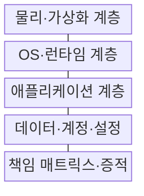
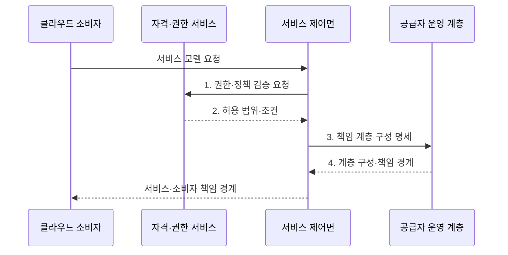

---
sidebar:
  order: 141
  label: "141. 클라우드 서비스 모델: IaaS·PaaS·SaaS (Cloud Service Models)"
  badge:
    text: "기출 · 70%"
    variant: note
title: "클라우드 서비스 모델: IaaS·PaaS·SaaS (Cloud Service Models)"
date: "2026-07-30T23:41:04+09:00"
tags:
  - "notes-software"
weight: 141
extra:
  question_no: "141"
  source_status: "기출"
  source_history: "120회, 125회, 131회, 132회"
  priority: 70
  priority_note: "서비스별 운영 책임 경계가 반복 출제됨"
---

## 미리 알고가기

- **서비스형 인프라(Infrastructure as a Service, IaaS)**: 서버·저장소·네트워크를 제공하고 소비자가 운영체제부터 관리하는 서비스이다
- **서비스형 플랫폼(Platform as a Service, PaaS)**: 운영체제·실행 환경·미들웨어를 제공하고 소비자가 애플리케이션을 배포하는 서비스이다
- **서비스형 소프트웨어(Software as a Service, SaaS)**: 공급자가 운영하는 애플리케이션을 소비자가 설정해 사용하는 서비스이다
- **책임 경계**: 공급자와 소비자가 각각 운영·보호해야 할 계층을 나누는 기준이다
- **제어 범위**: 넓을수록 구성 자유도와 소비자 운영 책임이 함께 늘어난다
- **운영체제(Operating System, OS)**: 하드웨어 자원을 관리하고 프로그램 실행 기반을 제공하는 소프트웨어이다
- **런타임·미들웨어**: 프로그램 실행 환경과 애플리케이션 사이의 공통 기능을 제공하는 소프트웨어이다
- **책임 매트릭스**: 계층별 운영·보안·증적 담당자를 표로 명시한 문서이다
- **규정 준수 증적**: 보안 통제가 요구대로 수행됐음을 입증하는 기록이다
- **공급자 종속**: 특정 공급자의 기능·형식에 의존해 이전이 어려워지는 상태이다
- **책임 할당 매트릭스(Responsible·Accountable·Consulted·Informed, RACI)**: 업무별 수행·최종 책임·협의·통보 주체를 구분하는 표이다
- **복구 시간 목표(Recovery Time Objective, RTO)·복구 시점 목표(Recovery Point Objective, RPO)**: 서비스 복구 허용 시간과 허용 가능한 데이터 손실 시점을 정하는 기준이다

## Ⅰ. 개요

- 정의/개념: **운영 책임 범위**에 따라 IaaS·PaaS·SaaS를 구분하는 분류 체계
- 배경/필요성: 서비스 계층별 담당 미구분 시 **운영·보안 책임 공백**

### 쉽게 이해하기 (학습용)

- 건물만 빌릴지, 조리 시설까지 빌릴지, 완성된 식사를 받을지 정하는 선택이다.

## Ⅱ. 특징

- **책임 이전**: IaaS→PaaS→SaaS로 공급자 운영 범위가 확대
- **제어·책임 연동**: 소비자 제어가 클수록 운영 책임도 증가
- **공통 책임**: 계정·권한·데이터·안전한 설정은 소비자가 담당

### 쉽게 이해하기 (학습용)

- 맡기는 층이 많을수록 손은 덜 가지만 직접 바꿀 수 있는 범위도 줄어든다.

## Ⅲ. 구조 및 구성요소

| 구성요소 | 책임 |
|:---|:---|
| 물리·가상화 계층 | 공급자의 서버·저장소·**네트워크 운영** 책임 |
| OS·런타임 계층 | 모델별 **운영체제·런타임** 책임 분리 |
| 애플리케이션 계층 | IaaS·PaaS 소비자와 SaaS **공급자 운영** 분리 |
| 데이터·계정·설정 | 소비자의 **데이터 분류·권한 설정** 책임 |
| 책임 매트릭스·증적 | 계층·통제별 **책임자·감사 근거** 명시 |

### 쉽게 이해하기 (학습용)

- 건물만 빌릴지 조리 시설이나 완성된 식사까지 받을지 정한다.

## Ⅳ. 흐름도

**동작 원리**

1. **권한·정책 검증 요청**: 요청자 역할과 조직 정책의 허용 범위 조회
2. **허용 범위·조건**: 사용 가능한 서비스 모델과 설정 한도 확정
3. **책임 계층 구성 명세**: 선택 모델에 따른 공급자 운영 계층 지정
4. **계층 구성·책임 경계**: 소비자가 맡을 계정·설정·데이터 통제 분리

### 쉽게 이해하기 (학습용)

- 공급자가 운영할 층을 만든 뒤 소비자가 맡은 설정과 데이터를 넣고 양쪽의 상태를 함께 감시한다.

## Ⅴ. 종류 및 비교

| 서비스 모델 | IaaS | PaaS | SaaS |
|:---|:---|:---|:---|
| 적용 기준 | **자체 OS·네트워크 제어** | **빠른 앱 개발·플랫폼 위임** | **표준 업무 기능 사용** |
| 핵심 특징 | 인프라 제공·소비자 **OS 관리** | 플랫폼 제공·소비자 **앱 관리** | 완성 앱 제공·소비자 **설정 관리** |
| 한계 | 소비자의 **패치·가용성 운영** 부담 | **런타임 제약·플랫폼 종속** | **맞춤화·데이터 이동** 제약 |

### 쉽게 이해하기 (학습용)

- IaaS는 운영체제부터, PaaS는 앱부터 관리하고 SaaS는 완성된 앱의 사용자와 데이터를 관리한다.

## Ⅵ. 실무 고려사항 및 대책

| 고려사항 | 대책 | 효과 |
|:---|:---|:---|
| 계약과 실제 운영의 계층별 **책임 경계 불일치** | **RACI·계약 조항** 대조 | 장애별 **책임 주체 오인** 방지 |
| 소비자 설정 오류로 데이터·서비스 공개 | **기준 구성·최소 권한** 적용 | **공개 범위·과다 권한** 축소 |
| 공급자 복구 범위만 믿으면 업무 복구 목표 미달 | **백업 복원·RTO/RPO** 시험 | **업무 복구 시간·손실량** 검증 |
| 공급자 통제 상속만으로 소비자 증적 누락 | **통제 상속·소비자 증거** 분리 | **규정 준수 범위** 명확화 |
| 공급자 고유 형식 의존으로 서비스 이전 지연 | **데이터 내보내기·종료** 시험 | **이전 소요 시간** 사전 확인 |

### 쉽게 이해하기 (학습용)

- 가상 서버를 빌려도 그 안의 운영체제 업데이트는 대개 사용자가 해야 한다.

## Ⅶ. 결론

- **제어 수준·운영 역량**에 따라 IaaS·PaaS·SaaS 선택

### 쉽게 이해하기 (학습용)

- 직접 고칠 범위와 직접 책임질 일을 함께 감당할 수 있는 모델을 골라야 한다.
