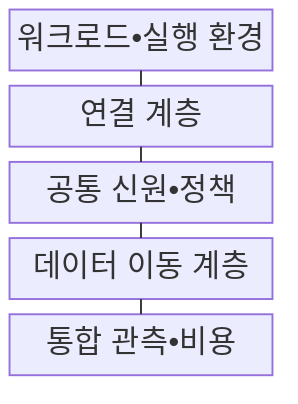
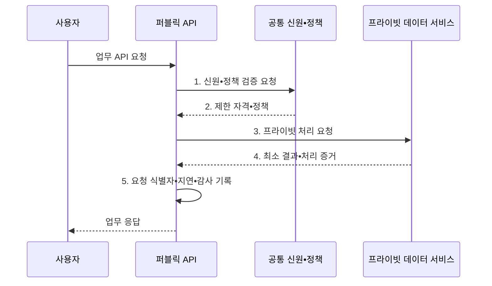

---
sidebar:
  order: 142
  label: "142. 클라우드 배포 모델: 퍼블릭•프라이빗•하이브리드•멀티 (Cloud Deployment Models)"
  badge:
    text: "기출 • 70%"
    variant: note
title: "클라우드 배포 모델: 퍼블릭•프라이빗•하이브리드•멀티 (Cloud Deployment Models)"
date: "2026-08-04T13:42:00+09:00"
tags:
  - "notes-software"
weight: 142
extra:
  question_no: "142"
  source_status: "기출"
  source_history: "131회"
  priority: 70
  priority_note: "배포 위치별 통제•비용 비교가 설계 기준임"
---

## Ⅰ. 개요

핵심 용어

- **클라우드 배포 모델(Cloud Deployment Model)**: 자원의 소유•전용 범위와 환경 간 연결 방식에 따라 워크로드 실행 환경을 구분하는 체계이다.

- 정의/개념: 소유•전용•연결 방식에 따른 **클라우드 배포 모델**
- 배경/필요성: 단일 환경으로는 데이터 위치•규제•지연 요구의 **동시 충족 제약**

#### 한줄 요약

- 공용 건물•전용 건물 중 어디에 업무를 둘지, 여러 건물을 어떻게 연결할지 정한다.

## Ⅱ. 특징

핵심 용어

- **공통 통제**: 여러 환경에서 신원•정책•연결•관측 기준을 일관되게 적용하는 운영 기반이다.
- **전용 범위**: 클라우드 자원이 한 조직만을 위해 물리적•논리적으로 분리되는 정도이다.
- **환경•공급자 조합**: 퍼블릭•프라이빗 환경의 결합인지 복수 클라우드 공급자의 병행인지 구분하는 기준이다.

- **전용 범위** 가 넓을수록 통제 수준과 구축 비용 증가
- **환경•공급자 조합** 에 따라 하이브리드와 멀티 구분
- 신원•정책•연결•관측의 **공통 통제** 로 운영 일관성 유지

#### 한줄 요약

- 장소를 늘리면 선택지는 많아지지만 출입증•도로•장부•요금도 함께 관리해야 한다.

## Ⅲ. 구조 및 구성요소

핵심 용어

- **데이터 이동 계층**: 환경 사이의 복제•동기화와 갱신 충돌 및 삭제 전파를 관리하는 구성요소이다.
- **워크로드**: 환경에 배치할 애플리케이션과 데이터 처리 단위이다.
- **실행 환경**: 데이터 등급•지연•가용성 요구에 맞춘 배치 위치이다.
- **가상 사설망(Virtual Private Network, VPN)**: 환경 간 통신을 암호화하는 사설 연결이다.
- **게이트웨이**: 환경 간 요청을 허용된 경로로 중계하는 구성요소이다.
- **공통 신원**: 여러 환경에서 같은 사용자와 서비스 주체를 식별하는 체계이다.
- **공통 정책**: 여러 환경에 일관되게 적용하는 최소 권한 기준이다.
- **통합 관측**: 환경별 지표와 로그를 한 기준으로 수집하는 활동이다.
- **통합 비용**: 환경별 사용량과 데이터 전송 비용을 함께 분석하는 정보이다.

| 구성요소 | 책임 |
|:---|:---|
| 워크로드•실행 환경 | 데이터 등급•지연•**가용성 기준** 으로 배치 결정 |
| 연결 계층 | 전용선•**VPN•게이트웨이** 경로 관리 |
| 공통 신원•정책 | **연합 신원•최소 권한** 기준 집행 |
| 데이터 이동 계층 | **복제•동기화** 와 충돌•삭제 관리 |
| 통합 관측•비용 | **지표•로그•전송 비용** 통합 수집 |

#### 한줄 요약

- 공용•전용 건물에 업무를 배치하고 출입증과 연결 도로를 함께 관리한다.

## Ⅳ. 흐름도

핵심 용어

- **5. 요청 식별자•지연•감사 기록**: 여러 환경의 처리 구간을 같은 업무 요청으로 연결해 추적하는 정보이다.
- **응용 프로그래밍 인터페이스(Application Programming Interface, API)**: 서로 다른 서비스가 정해진 요청•응답 규칙으로 기능과 데이터를 주고받는 접점이다.
- **1. 신원•정책 검증 요청**: 요청 목적과 데이터 위치를 기준으로 허용 권한을 조회하는 단계이다.
- **2. 제한 자격•정책**: 접근 가능한 환경•기능과 자격의 유효시간을 최소 범위로 확정한 결과이다.
- **3. 프라이빗 처리 요청**: 승인된 사설 경로를 통해 전용 환경의 데이터 서비스를 호출하는 단계이다.
- **4. 최소 결과•처리 증거**: 민감 원문은 이동하지 않고 업무에 필요한 결과와 처리 증적만 반환하는 단계이다.

**동작 원리**

1. **신원•정책 검증 요청**: 요청 목적과 데이터 위치에 맞는 권한 조회
2. **제한 자격•정책**: 허용된 환경•기능•유효시간 범위 확정
3. **프라이빗 처리 요청**: 승인된 사설 경로로 전용 자원 호출
4. **최소 결과•처리 증거**: 원문 이동 없이 필요한 결과와 증적 전달
5. **요청 식별자•지연•감사 기록**: 환경별 처리 구간을 같은 요청으로 연결

#### 한줄 요약

- 공용 접수창구가 전용 금고의 필요한 결과만 받아오고 양쪽 기록을 같은 거래 번호로 묶는다.

## Ⅴ. 종류 및 비교

핵심 용어

- **하이브리드**: 민감 자산을 전용 환경에 두고 퍼블릭의 탄력 확장을 결합하는 배포 모델이다.
- **퍼블릭 클라우드**: 공급자의 공유 자원을 여러 고객이 논리적으로 분리해 사용하는 배포 모델이다.
- **프라이빗 클라우드**: 한 조직을 위한 전용 자원과 통제 환경을 사용하는 배포 모델이다.
- **멀티 클라우드**: 기능 활용이나 공급자 위험 분산을 위해 둘 이상의 클라우드 공급자를 병행하는 배포 전략이다.

| 배포 모델 | 퍼블릭 | 프라이빗 | 하이브리드 | 멀티 클라우드 |
|:---|:---|:---|:---|:---|
| 적용 기준 | **탄력 확장•관리형 서비스** | **전용 통제•특수 장비** | **민감 자산•외부 확장 결합** | **복수 공급자 기능•위험 분산** |
| 핵심 특징 | 공급자의 **공유 자원 기반** | 한 조직의 **전용 자원 기반** | 프라이빗•퍼블릭 **환경 연결** | 둘 이상 **공급자 병행** |
| 한계 | **공급자 종속•전송 비용** | **초기 투자•기술 노후화** | **연결•복제 복잡도** | **운영 중복•전송 비용** |

#### 한줄 요약

- 하이브리드는 공용•전용 장소의 조합, 멀티 클라우드는 여러 임대업체를 쓰는 전략이다.

## Ⅵ. 실무 고려사항 및 대책

핵심 용어

- **복제 충돌**: 양방향 변경의 적용 순서가 달라 값이 충돌하는 문제이다.
- **삭제 누락**: 원천 삭제가 복제 대상에 전파되지 않는 문제이다.
- **연합 신원**: 같은 주체를 여러 환경에서 공통으로 식별하는 체계이다.
- **단기 자격**: 필요한 시간 동안만 발급하는 접근 권한이다.
- **이중 경로**: 환경 간 연결을 두 개 이상의 경로로 구성하는 대책이다.
- **장애 전환**: 연결 실패 시 대체 경로로 요청을 넘기는 동작이다.
- **기준 원천**: 최종 권위를 가진 데이터 위치이다.
- **복제 방향**: 변경 사항이 전파될 환경 순서이다.
- **요청 식별자**: 환경별 처리 기록을 같은 업무 요청으로 묶는 값이다.
- **시간 동기화**: 환경별 사건 순서를 같은 시간 기준으로 정렬하는 통제이다.

| 문제 | 대책 | 효과 |
|:---|:---|:---|
| 배치 근거 없이 환경을 늘리면 비용•운영 복잡도 급증 | **데이터•지연•규제 기준** 으로 배치 평가 | **무질서한 워크로드 분산** 방지 |
| 환경별 계정 분리로 권한 회수•감사 누락 | **연합 신원•단기 자격** 적용 | **계정•과다 권한 확산** 억제 |
| 단일 환경 간 경로 장애로 업무 호출 중단 | **이중 경로•장애 전환** 시험 | **연결 단일 장애점** 완화 |
| 양방향 복제로 충돌•삭제 전파 순서 불명확 | **기준 원천•복제 방향** 지정 | **복제 충돌•삭제 누락** 방지 |
| 환경별 시간•식별자 차이로 요청 원인 추적 단절 | **요청 식별자•시간 동기화** 통일 | **환경 간 장애 구간** 추적 |

#### 한줄 요약

- 개인정보 금고를 안에 두더라도 바깥 서비스와 잇는 길의 장애와 출입 기록까지 점검해야 한다.

## Ⅶ. 결론

핵심 용어

- **전용 통제**: 민감 자산을 조직 전용 환경에서 보호하는 요구이다.
- **탄력 확장**: 수요에 따라 퍼블릭 자원을 늘리는 요구이다.

- **전용 통제•탄력 확장** 을 함께 요구하면 하이브리드, 공급자 분산은 멀티 선택

#### 한줄 요약

- 장소를 늘리기 전에 왜 나누는지와 끊겼을 때 버틸 수 있는지를 증명해야 한다.
