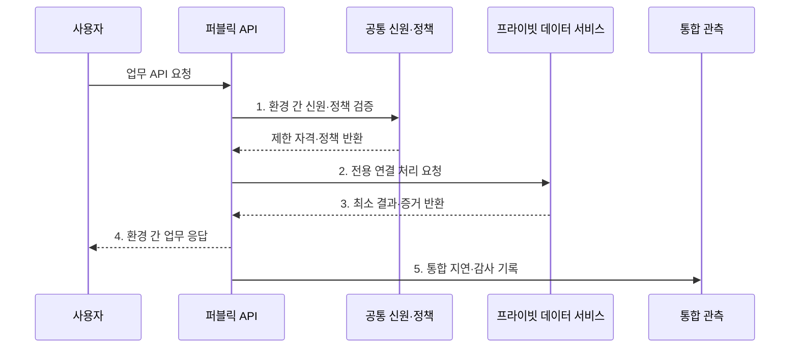

---
sidebar:
  order: 142
  label: "142. 클라우드 배포 모델: 퍼블릭·프라이빗·하이브리드·멀티 (Cloud Deployment Models)"
  badge:
    text: "기출 · 70%"
    variant: note
title: "클라우드 배포 모델: 퍼블릭·프라이빗·하이브리드·멀티 (Cloud Deployment Models)"
date: "2026-07-30T20:00:00+09:00"
tags:
  - "notes-software"
weight: 142
extra:
  question_no: "142"
  source_status: "기출"
  source_history: "131회"
  priority: 70
  priority_note: "배포 위치별 통제·비용 비교가 설계 기준임"
---

## 미리 알고가기

- **퍼블릭 클라우드**: 공급자 소유 자원을 여러 소비자에게 서비스 형태로 제공한다
- **프라이빗 클라우드**: 한 조직만 사용하는 클라우드 자원과 관리 체계를 구성한다
- **하이브리드 클라우드**: 프라이빗 환경과 퍼블릭 클라우드를 연결해 업무를 배치한다
- **멀티 클라우드**: 퍼블릭·프라이빗·하이브리드 같은 소유 형태가 아니라 둘 이상의 퍼블릭 공급자를 업무별로 병행하는 운영 구성이다
- **워크로드 배치**: 데이터 위치·규제·지연·서비스 종속성을 기준으로 실행 환경을 정하는 활동이다
- **리전**: 클라우드 공급자가 여러 데이터 센터를 묶어 서비스를 제공하는 지역 단위이다
- **응용 프로그래밍 인터페이스(Application Programming Interface, API)**: ‘에이피아이’로 읽고 영문 머리글자를 딴 표기이며 다른 서비스 기능을 호출하는 규약이다
- **공통 신원(Common Identity, Common ID)**: ‘커먼 아이디’로 읽고 Identity를 ID로 줄인 표기이며 여러 환경의 사용자 신원·권한을 연결한다
- **데이터 복제·동기화**: 데이터를 다른 환경에 복사하고 변경 내용을 일치시키는 방식이다
- **통합 관측**: 여러 환경의 지표·로그·추적 정보를 한 기준으로 수집해 상태를 판단하는 활동이다
- **공급자 종속**: 특정 공급자의 기능과 형식에 의존해 다른 환경으로 이전하기 어려운 상태이다

## Ⅰ. 개요

- 정의/개념: 자원의 소유·전용·연결 방식에 따른 **클라우드 배포 분류**
- 배경/필요성: 데이터 위치·규제·지연·복구에 맞는 **워크로드 배치**

### 쉽게 이해하기 (학습용)

- 공용 건물·전용 건물 중 어디에 업무를 둘지, 여러 건물을 어떻게 연결할지 정한다.

## Ⅱ. 특징

- **소유·전용 범위**: 공유 기반과 조직 전용 기반을 구분
- **환경 조합**: 하이브리드는 환경, 멀티는 공급자를 조합
- **공통 통제**: 신원·정책·연결·관측 기준을 통합

### 쉽게 이해하기 (학습용)

- 장소를 늘리면 선택지는 많아지지만 출입증·도로·장부·요금도 함께 관리해야 한다.

## Ⅲ. 구조 및 구성요소

| 구성요소 | 책임 |
|:---|:---|
| 워크로드·실행 환경 | 데이터 등급·지연·가용성으로 배치 결정 |
| 연결 계층 | 전용선·VPN·게이트웨이·경로 관리 |
| 공통 신원·정책 | 계정 연동·최소 권한·암호화 기준 집행 |
| 데이터 이동 계층 | 복제·동기화·정합성·삭제 관리 |
| 통합 관측·비용 | 지표·로그·감사·전송 비용 수집 |

### 쉽게 이해하기 (학습용)

- 공용·전용 건물에 업무를 배치하고 출입증과 연결 도로를 함께 관리한다.

## Ⅳ. 흐름도

**동작 원리**

- **1. 환경 간 신원·정책 검증**: 요청 목적과 데이터 위치에 맞는 최소 권한 자격 발급
- **2. 전용 연결 처리 요청**: 승인된 사설 경로로 프라이빗 자원 기능 호출
- **3. 최소 결과·증거 반환**: 원문 이동을 제한하고 필요한 결과와 처리 증거만 전달
- **4. 환경 간 업무 응답**: 퍼블릭·프라이빗 처리 결과를 사용자 계약에 맞춰 조합
- **5. 통합 지연·감사 기록**: 동일 요청 ID로 양쪽 환경의 성능·보안 상태 연결

### 쉽게 이해하기 (학습용)

- 공용 접수창구가 전용 금고의 필요한 결과만 받아오고 양쪽 기록을 같은 거래 번호로 묶는다.

## Ⅴ. 종류 및 비교

| 비교 항목 | 퍼블릭 | 프라이빗 | 하이브리드 | 멀티 클라우드 |
|:---|:---|:---|:---|:---|
| 적용 기준 | **탄력 확장·관리형 서비스** | **전용 통제·특수 장비** | **민감 자산·외부 확장 결합** | **복수 공급자 기능·위험 분산** |
| 핵심 특징 | 공급자 공유 기반 | 한 조직 전용 기반 | 프라이빗·퍼블릭 연결 | 둘 이상 공급자 병행 |
| 한계 | 종속·전송비 | 투자·기술 노후 | 연결·복제 복잡도 | 운영 중복·전송비 |

### 쉽게 이해하기 (학습용)

- 하이브리드는 공용·전용 장소의 조합, 멀티 클라우드는 여러 임대업체를 쓰는 전략이다.

## Ⅵ. 실무 고려사항 및 대책

| 고려사항 | 대책 | 효과 |
|:---|:---|:---|
| 배치 기준 | 데이터·지연·복구·규제·비용 평가 | 무질서한 분산 방지 |
| 신원·권한 | 연합 신원·짧은 자격·역할 검토 | 계정·권한 확산 억제 |
| 연결 | 이중 경로·라우팅·장애 시험 | 단일 연결 장애 완화 |
| 데이터 정합성 | 권위 원천·복제 방향·충돌 정책 | 복제 충돌·삭제 누락 방지 |
| 관측 | 공통 ID·시간 동기화·추적 표준 | 환경 간 원인 추적 |

### 쉽게 이해하기 (학습용)

- 개인정보 금고를 안에 두더라도 바깥 서비스와 잇는 길의 장애와 출입 기록까지 점검해야 한다.

## Ⅶ. 결론

- **데이터 위치·통제 수준·연결 복구·운영 복잡도**로 클라우드 배포 모델을 선택

### 쉽게 이해하기 (학습용)

- 장소를 늘리기 전에 왜 나누는지와 끊겼을 때 버틸 수 있는지를 증명해야 한다.
