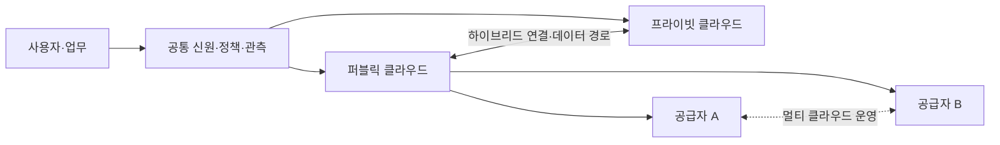
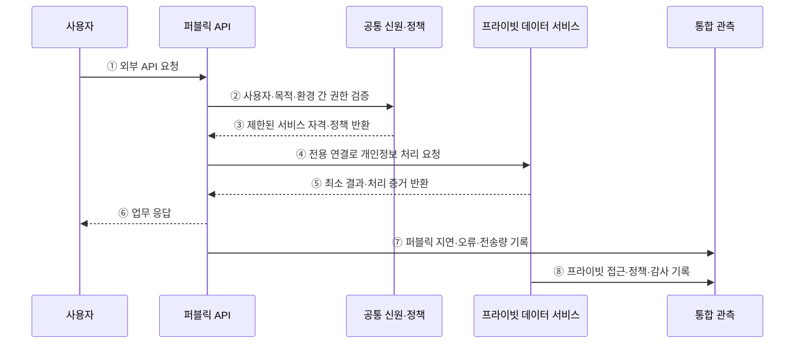

---
sidebar:
  order: 142
  label: "142. 클라우드 배포 모델 — 퍼블릭·프라이빗·하이브리드·멀티 (Cloud Deployment Models)"
  badge:
    text: "기출 · 70%"
    variant: note
title: "클라우드 배포 모델 — 퍼블릭·프라이빗·하이브리드·멀티 (Cloud Deployment Models)"
date: "2026-07-27T23:59:59+09:00"
tags:
  - "notes-software"
weight: 142
extra:
  question_no: "142"
  source_status: "기출"
  source_history: "131회"
  priority: 70
  priority_note: "배포 위치별 통제·비용 비교가 설계 기준임"
---

## 미리 알고가기

- **퍼블릭 클라우드**: 공급자 소유 자원을 여러 소비자에게 서비스 형태로 제공한다
- **프라이빗 클라우드**: 한 조직만 사용하는 클라우드 자원과 관리 체계를 구성한다
- **하이브리드 클라우드**: 프라이빗 환경과 퍼블릭 클라우드를 연결해 업무를 배치한다
- **멀티 클라우드**: 퍼블릭·프라이빗·하이브리드 같은 소유 형태가 아니라 둘 이상의 퍼블릭 공급자를 업무별로 병행하는 운영 구성이다
- **워크로드 배치**: 데이터 위치·규제·지연·서비스 종속성을 기준으로 실행 환경을 정하는 활동이다
- **리전**: 클라우드 공급자가 여러 데이터 센터를 묶어 서비스를 제공하는 지역 단위이다
- **응용 프로그래밍 인터페이스(Application Programming Interface, API)**: ‘에이피아이’로 읽고 영문 머리글자를 딴 표기이며 다른 서비스 기능을 호출하는 규약이다
- **공통 신원(Common Identity, Common ID)**: ‘커먼 아이디’로 읽고 Identity를 ID로 줄인 표기이며 여러 환경의 사용자 신원·권한을 연결한다
- **데이터 복제·동기화**: 데이터를 다른 환경에 복사하고 변경 내용을 일치시키는 방식이다
- **통합 관측**: 여러 환경의 지표·로그·추적 정보를 한 기준으로 수집해 상태를 판단하는 활동이다
- **공급자 종속**: 특정 공급자의 기능과 형식에 의존해 다른 환경으로 이전하기 어려운 상태이다

## Ⅰ. 개요

- 클라우드 배포 모델은 자원의 소유·전용 범위와 여러 환경의 연결 방식에 따라 퍼블릭·프라이빗·하이브리드로 구분하며, 멀티 클라우드는 둘 이상의 공급자를 병행하는 운영 전략이다.
- 데이터 위치·규제·지연·확장·복구·비용 요구에 맞춰 워크로드를 배치하고 여러 환경의 신원·연결·정책·관측을 통합한다.

### 쉽게 이해하기 (학습용)

- 공용 건물·전용 건물 중 어디에 업무를 둘지, 여러 건물을 어떻게 연결할지 정한다.

## Ⅱ. 특징

- **소유·전용 범위**: 퍼블릭은 공급자 공유 기반, 프라이빗은 한 조직 전용 기반을 클라우드 방식으로 운영한다.
- **환경 조합**: 하이브리드는 프라이빗과 퍼블릭을 연결하고 멀티 클라우드는 복수 공급자의 서비스를 병행한다.
- **워크로드별 배치**: 데이터 등급·규제·지연·확장·가용성·비용을 업무 단위로 평가한다.
- **공통 통제 필요**: 환경이 늘수록 신원·정책·네트워크·암호화·관측·비용 기준을 일관되게 적용해야 한다.
- **분산 복잡성**: 환경 간 호출·데이터 복제·장애 경계·전송 비용·기술 차이가 가용성과 운영비를 좌우한다.

### 쉽게 이해하기 (학습용)

- 장소를 늘리면 선택지는 많아지지만 출입증·도로·장부·요금도 함께 관리해야 한다.

## Ⅲ. 아키텍처 및 구성요소

**도표안 A — 구조도**

**도표안 B — sequenceDiagram**

| 구성요소 | 역할 |
|:---|:---|
| 워크로드·실행 환경 | 데이터 등급·지연·가용성·비용으로 배치 후보 결정 |
| 연결 계층 | 전용선·VPN·게이트웨이·이름 해석·경로·대역폭 관리 |
| 공통 신원·정책 | 계정 연동·최소 권한·구성·암호화 기준을 환경별 집행 |
| 데이터 이동 계층 | 복제·동기화·캐시·정합성·위치·삭제 관리 |
| 통합 관측·비용 | 환경별 지표·로그·추적·감사·전송·사용 비용 수집 |

**동작 원리**

- ① 사용자가 퍼블릭 환경에 배치된 외부 API를 요청한다.
- ② 퍼블릭 API가 공통 신원·정책 계층에 사용자·사용 목적·환경 간 접근 권한을 검증한다.
- ③ 신원·정책 계층이 최소 범위의 서비스 자격과 적용할 통제 조건을 반환한다.
- ④ 퍼블릭 API가 허용된 전용 연결로 프라이빗 환경의 개인정보 처리 서비스를 호출한다.
- ⑤ 프라이빗 서비스가 원문 노출을 줄인 최소 결과와 처리 증거를 반환한다.
- ⑥ 퍼블릭 API가 환경 간 처리 결과를 조합해 사용자에게 응답한다.
- ⑦ 퍼블릭 환경의 지연·오류·요청량·환경 간 전송량을 통합 관측 체계에 기록한다.
- ⑧ 프라이빗 환경의 데이터 접근·정책 판정·감사 기록도 같은 요청 식별자로 연결한다.

### 쉽게 이해하기 (학습용)

- 공용 접수창구가 전용 금고의 필요한 결과만 받아오고 양쪽 기록을 같은 거래 번호로 묶는다.

## Ⅳ. 종류 및 비교

| 비교 항목 | 퍼블릭 | 프라이빗 | 하이브리드 | 멀티 클라우드 |
|:---|:---|:---|:---|:---|
| 구조 | 공급자 공유 기반의 논리 격리 | 한 조직 전용 기반 | 프라이빗·퍼블릭 연결 | 둘 이상 공급자 병행 |
| 주요 목적 | 탄력 확장·신속한 관리형 서비스 | 전용 통제·특수 장비·내부 정책 | 민감 자산 보존과 외부 확장 결합 | 지역·특화 기능·협상·위험 분산 |
| 소비자 부담 | 계정·설정·데이터·비용 통제 | 설비·플랫폼·인력·수명주기 운영 | 연결·신원·정합성·통합 장애 관리 | API·기술·계약·관측·비용 표준화 |
| 대표 위험 | 종속·데이터 위치·전송비 | 투자·확장 지연·기술 노후화 | 경계 공격·지연·복제 충돌 | 표면적 이식성·운영 중복·전송비 |

> 하이브리드는 소유·배포 환경의 조합이고 멀티 클라우드는 공급자 수의 전략이므로 한 시스템이 둘 다일 수 있다.

### 쉽게 이해하기 (학습용)

- 하이브리드는 공용·전용 장소의 조합, 멀티 클라우드는 여러 임대업체를 쓰는 전략이다.

## Ⅴ. 실무 고려사항 및 대책

| 고려사항 | 위험 | 대책 |
|:---|:---|:---|
| 배치 기준 | 정치적 분산·기술 선호로 무질서 | 데이터·지연·복구·규제·비용 점수와 예외 승인 |
| 신원·권한 | 환경별 계정 확산·과도한 권한 | 연합 신원·짧은 자격·역할 매핑·정기 검토 |
| 연결 | 단일 전용선 장애·경로 비대칭·DNS 충돌 | 이중 경로·라우팅·이름 규칙·장애 시험 |
| 데이터 정합성 | 양방향 복제 충돌·삭제 누락 | 권위 원천·방향·지연 목표·충돌·삭제 전파 |
| 관측 | 요청이 환경 경계에서 끊겨 원인 불명 | 공통 ID·시간 동기화·로그/추적 표준 |
| 비용·종속 | 환경 간 전송·중복 도구·최저공통분모 | 단위 비용·송수신량·고유 기능의 이식성 평가 |

> **적용 사례**: 개인정보 원본은 프라이빗 환경에 두고 퍼블릭 API에는 필요한 결과만 제공하며, 전용 연결 장애와 데이터 위치·접근 증적을 정기 시험한다.

### 쉽게 이해하기 (학습용)

- 개인정보 금고를 안에 두더라도 바깥 서비스와 잇는 길의 장애와 출입 기록까지 점검해야 한다.

## Ⅵ. 결론

- 클라우드 배포 모델의 핵심은 환경 수가 아니라 워크로드·데이터를 둘 근거와 환경 경계를 안전하고 관찰 가능하게 운영하는 능력이다.
- 데이터 위치·지연·연결 복구·신원·정합성·통합 관측·전송 비용·종속성을 실제 장애와 이관 시험으로 검증해야 한다.

### 쉽게 이해하기 (학습용)

- 장소를 늘리기 전에 왜 나누는지와 끊겼을 때 버틸 수 있는지를 증명해야 한다.
