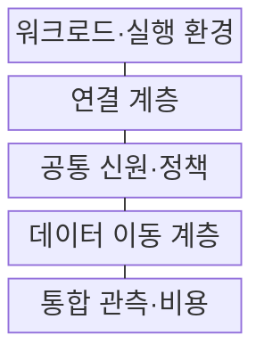
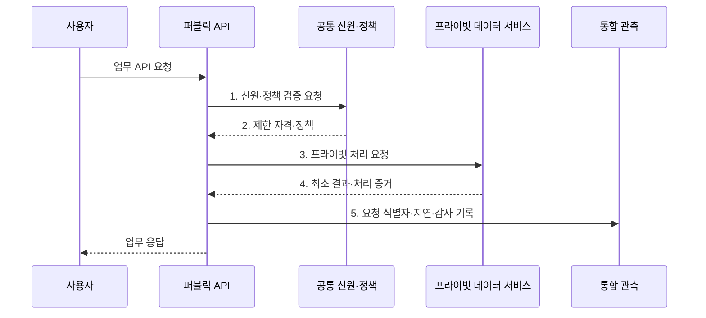

---
sidebar:
  order: 142
  label: "142. 클라우드 배포 모델: 퍼블릭·프라이빗·하이브리드·멀티 (Cloud Deployment Models)"
  badge:
    text: "기출 · 70%"
    variant: note
title: "클라우드 배포 모델: 퍼블릭·프라이빗·하이브리드·멀티 (Cloud Deployment Models)"
date: "2026-08-02T12:00:00+09:00"
tags:
  - "notes-software"
weight: 142
extra:
  question_no: "142"
  source_status: "기출"
  source_history: "131회"
  priority: 70
  priority_note: "배포 위치별 통제·비용 비교가 설계 기준임"
---

## Ⅰ. 개요

핵심 용어

- **실행 환경**: 자원의 소유·전용·연결 방식에 따라 퍼블릭·프라이빗·하이브리드·멀티로 구분하는 대상이다.

- 정의/개념: 자원의 소유·전용·연결 방식으로 **실행 환경**을 구분하는 배포 분류 체계
- 배경/필요성: 단일 환경으로는 데이터 위치·규제·지연 요구의 **동시 충족 제약**

### 쉽게 이해하기 (학습용)

- 공용 건물·전용 건물 중 어디에 업무를 둘지, 여러 건물을 어떻게 연결할지 정한다.

## Ⅱ. 특징

핵심 용어

- **공통 통제**: 여러 환경에서 신원·정책·연결·관측 기준을 일관되게 적용하는 운영 기반이다.

- **전용 범위**가 넓을수록 통제 수준과 구축 비용 증가
- **환경·공급자 조합**에 따라 하이브리드와 멀티 구분
- 신원·정책·연결·관측의 **공통 통제**로 운영 일관성 유지

### 쉽게 이해하기 (학습용)

- 장소를 늘리면 선택지는 많아지지만 출입증·도로·장부·요금도 함께 관리해야 한다.

## Ⅲ. 구조 및 구성요소

핵심 용어

- **데이터 이동 계층**: 환경 사이의 복제·동기화와 갱신 충돌 및 삭제 전파를 관리하는 구성요소이다.

| 구성요소 | 책임 |
|:---|:---|
| 워크로드·실행 환경 | 데이터 등급·지연·**가용성 기준**으로 배치 결정 |
| 연결 계층 | 전용선·**VPN·게이트웨이** 경로 관리 |
| 공통 신원·정책 | **연합 신원·최소 권한** 기준 집행 |
| 데이터 이동 계층 | **복제·동기화**와 충돌·삭제 관리 |
| 통합 관측·비용 | **지표·로그·전송 비용** 통합 수집 |

### 쉽게 이해하기 (학습용)

- 공용·전용 건물에 업무를 배치하고 출입증과 연결 도로를 함께 관리한다.

## Ⅳ. 흐름도

핵심 용어

- **5. 요청 식별자·지연·감사 기록**: 여러 환경의 처리 구간을 같은 업무 요청으로 연결해 추적하는 정보이다.

**동작 원리**

1. **신원·정책 검증 요청**: 요청 목적과 데이터 위치에 맞는 권한 조회
2. **제한 자격·정책**: 허용된 환경·기능·유효시간 범위 확정
3. **프라이빗 처리 요청**: 승인된 사설 경로로 전용 자원 호출
4. **최소 결과·처리 증거**: 원문 이동 없이 필요한 결과와 증적 전달
5. **요청 식별자·지연·감사 기록**: 환경별 처리 구간을 같은 요청으로 연결

### 쉽게 이해하기 (학습용)

- 공용 접수창구가 전용 금고의 필요한 결과만 받아오고 양쪽 기록을 같은 거래 번호로 묶는다.

## Ⅴ. 종류 및 비교

핵심 용어

- **하이브리드**: 민감 자산을 전용 환경에 두고 퍼블릭의 탄력 확장을 결합하는 배포 모델이다.

| 배포 모델 | 퍼블릭 | 프라이빗 | 하이브리드 | 멀티 클라우드 |
|:---|:---|:---|:---|:---|
| 적용 기준 | **탄력 확장·관리형 서비스** | **전용 통제·특수 장비** | **민감 자산·외부 확장 결합** | **복수 공급자 기능·위험 분산** |
| 핵심 특징 | 공급자의 **공유 자원 기반** | 한 조직의 **전용 자원 기반** | 프라이빗·퍼블릭 **환경 연결** | 둘 이상 **공급자 병행** |
| 한계 | **공급자 종속·전송 비용** | **초기 투자·기술 노후화** | **연결·복제 복잡도** | **운영 중복·전송 비용** |

### 쉽게 이해하기 (학습용)

- 하이브리드는 공용·전용 장소의 조합, 멀티 클라우드는 여러 임대업체를 쓰는 전략이다.

## Ⅵ. 실무 고려사항 및 대책

핵심 용어

- **복제 충돌·삭제 누락**: 양방향 데이터 복제에서 기준 원천과 전파 순서가 불명확해 생기는 문제이다.

| 문제 | 대책 | 효과 |
|:---|:---|:---|
| 배치 근거 없이 환경을 늘리면 비용·운영 복잡도 급증 | **데이터·지연·규제 기준**으로 배치 평가 | **무질서한 워크로드 분산** 방지 |
| 환경별 계정 분리로 권한 회수·감사 누락 | **연합 신원·단기 자격** 적용 | **계정·과다 권한 확산** 억제 |
| 단일 환경 간 경로 장애로 업무 호출 중단 | **이중 경로·장애 전환** 시험 | **연결 단일 장애점** 완화 |
| 양방향 복제로 충돌·삭제 전파 순서 불명확 | **기준 원천·복제 방향** 지정 | **복제 충돌·삭제 누락** 방지 |
| 환경별 시간·식별자 차이로 요청 원인 추적 단절 | **요청 식별자·시간 동기화** 통일 | **환경 간 장애 구간** 추적 |

### 쉽게 이해하기 (학습용)

- 개인정보 금고를 안에 두더라도 바깥 서비스와 잇는 길의 장애와 출입 기록까지 점검해야 한다.

## Ⅶ. 결론

핵심 용어

- **전용 통제·탄력 확장**: 하이브리드 클라우드를 선택할 때 함께 충족하려는 두 가지 요구이다.

- **전용 통제·탄력 확장**을 함께 요구하면 하이브리드, 공급자 분산은 멀티 선택

### 쉽게 이해하기 (학습용)

- 장소를 늘리기 전에 왜 나누는지와 끊겼을 때 버틸 수 있는지를 증명해야 한다.
