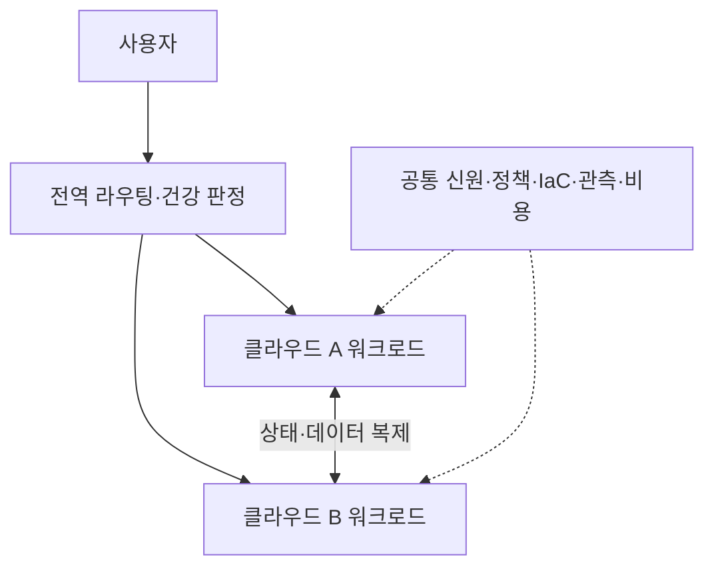
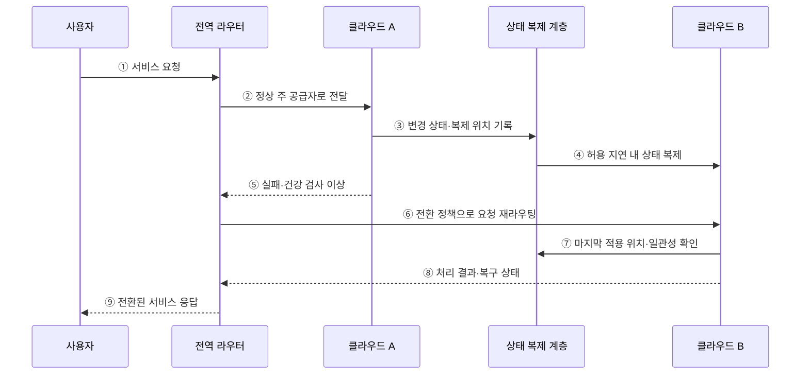

---
sidebar:
  order: 143
  label: "143. 멀티 클라우드 전략 (Multi Cloud Strategy)"
  badge:
    text: "기출 · 70%"
    variant: note
title: "멀티 클라우드 전략 (Multi Cloud Strategy)"
date: "2026-07-27T23:59:59+09:00"
tags:
  - "notes-software"
weight: 143
extra:
  question_no: "143"
  source_status: "기출"
  source_history: "135회"
  priority: 70
  priority_note: "복수 클라우드의 종속·운영 통제가 최근 출제됨"
---

## 미리 알고가기

- **멀티 클라우드**: 둘 이상의 퍼블릭 클라우드 공급자를 업무별로 병행하는 구성이다
- **분할 배치**: 애플리케이션이나 데이터 처리 단위를 공급자별로 나누는 방식이다
- **중복 배치**: 같은 서비스를 여러 공급자에 두고 장애 전환에 사용하는 방식이다
- **이식성(포터빌리티)**: 실행 패키지·배포 선언·데이터 형식을 다른 환경으로 옮길 수 있는 정도이다
- **이그레스 비용**: 클라우드 외부나 다른 공급자로 데이터를 전송할 때 발생하는 비용이다
- **공통 거버넌스**: 계정·권한·정책·비용·관측 기준을 공급자마다 일관되게 적용하는 체계이다
- **코드형 인프라(Infrastructure as Code, IaC)**: ‘아이에이시’로 읽고 영문 핵심 머리글자를 조합한 표기이며 인프라 구성을 코드로 선언해 반복 생성한다
- **지속적 통합·전달(Continuous Integration/Continuous Delivery, CI/CD)**: ‘시아이 슬래시 시디’로 읽고 두 약어를 빗금으로 이은 표기이며 변경을 자동 검증·전달하는 방식이다
- **공통 신원(Common Identity, Common ID)**: ‘커먼 아이디’로 읽고 Identity를 ID로 줄인 표기이며 사용자 신원·역할을 공급자별 권한에 연결한다
- **컨테이너**: 애플리케이션과 실행 의존성을 묶어 여러 환경에서 같은 방식으로 실행하는 단위이다
- **관리형 서비스**: 공급자가 설치·패치·확장 같은 운영 작업을 대신 수행하는 서비스이다
- **리전·라우팅**: 서비스가 제공되는 지역 단위와 요청을 목적지 경로로 전달하는 규칙이다
- **응용 프로그래밍 인터페이스(Application Programming Interface, API)**: ‘에이피아이’로 읽고 영문 머리글자를 딴 표기이며 다른 서비스 기능을 호출하는 규약이다

## Ⅰ. 개요

- 멀티 클라우드 전략은 둘 이상의 퍼블릭 클라우드 공급자를 목적에 따라 분할 또는 중복 사용하고 공통 신원·정책·배포·관측·비용 체계로 운영하는 전략이다.
- 공급자별 특화 기능·지역·협상력을 활용하거나 장애와 종속 위험을 분산할 수 있지만, 공급자 수만 늘려서는 복원력과 이식성이 생기지 않는다.

### 쉽게 이해하기 (학습용)

- 가게를 여러 곳 쓰는 것보다 무엇을 나누고 어떻게 바꿔 살지를 정하는 것이 핵심이다.

## Ⅱ. 특징

- **의도적 배치**: 특화 기능·지역·규제·지연·가격·복구 요구로 공급자별 워크로드 역할을 정한다.
- **분할과 중복**: 업무를 공급자별로 나누거나 같은 서비스를 복제해 전환하되 상태와 장애 경계를 명확히 한다.
- **공통 운영면**: 신원·정책·IaC·배포·관측·비용·사고 대응을 공통 기준으로 묶는다.
- **제한된 이식성**: 컨테이너와 공통 도구는 실행 차이를 줄이지만 관리형 API·데이터·신원·네트워크 차이는 없애지 못한다.
- **복잡성 비용**: 인력·도구·계약·데이터 이송·중복 용량·일관성·전환 시험 비용이 공급자마다 늘어난다.

### 쉽게 이해하기 (학습용)

- 예비 가게가 있어도 재고와 출입증을 맞추고 실제로 손님을 돌려보는 연습이 필요하다.

## Ⅲ. 아키텍처 및 구성요소

**도표안 A — 구조도**

**도표안 B — sequenceDiagram**

| 구성요소 | 역할 |
|:---|:---|
| 배치·전환 정책 | 지연·데이터 위치·기능·비용·RTO/RPO로 공급자와 전환 조건 결정 |
| 공통 신원·권한 | 조직 신원·역할을 공급자별 권한 모델에 최소 범위로 매핑 |
| IaC·배포 계층 | 공통 모듈과 공급자별 어댑터로 반복 가능한 환경 생성·배포 |
| 연결·데이터 계층 | 공급자 간 라우팅·암호화·복제·충돌·이그레스 관리 |
| 통합 관측·비용 | 공통 요청 ID로 지표·로그·추적·SLO·단위 비용 연결 |
| 운영·계약 체계 | 사고 지휘·지원·변경·용량·종료·이관 책임 관리 |

**동작 원리**

- ① 사용자가 공급자와 무관한 서비스 주소로 요청한다.
- ② 전역 라우터가 건강 상태와 배치 정책에 따라 정상 주 공급자 A로 요청을 전달한다.
- ③ 클라우드 A가 처리한 변경 상태와 복제 위치를 상태 복제 계층에 기록한다.
- ④ 복제 계층이 정한 RPO와 정합성 방식에 따라 클라우드 B에 상태를 전달한다.
- ⑤ 클라우드 A의 응답 실패 또는 건강 검사 이상이 전역 라우터에 감지된다.
- ⑥ 라우터가 전환 임계값·재시도 안전성·지역 정책을 확인해 클라우드 B로 요청을 보낸다.
- ⑦ 클라우드 B가 마지막 적용 위치·중복 요청·읽기/쓰기 가능 상태를 복제 계층에서 확인한다.
- ⑧ 클라우드 B가 처리 결과와 현재 복구 상태를 전역 라우터에 반환한다.
- ⑨ 전역 라우터가 사용자에게 전환된 서비스의 응답을 제공한다.

### 쉽게 이해하기 (학습용)

- 주 가게가 멈추면 복제된 마지막 재고를 확인한 예비 가게로 손님을 돌린다.

## Ⅳ. 종류 및 비교

| 비교 항목 | 분할 배치 | 중복 배치 |
|:---|:---|:---|
| 구조 | 서로 다른 업무·계층을 공급자별 담당 | 같은 서비스·데이터를 복수 공급자에 준비 |
| 주요 목적 | 특화 기능·지역·조직 격리·협상 | 공급자 수준 장애의 연속성 |
| 데이터 관계 | 공급자 간 호출·이송 최소화가 중요 | 복제 지연·충돌·권위·중복 요청 통제 |
| 비용 | 공통 운영면과 환경별 기술 인력 | 분할 비용에 중복 용량·복제·전환 시험 추가 |
| 주요 위험 | 교차 의존으로 장애·비용 경계 흐림 | 평상시 미사용 예비 환경의 설정 부패 |

> 모든 서비스를 중복 배치하기보다 공급자 장애가 허용되지 않고 전환 비용을 감당할 수 있는 핵심 경로에 한정한다.

### 쉽게 이해하기 (학습용)

- 분할은 일을 나눠 맡기고 중복은 같은 일을 대신할 준비를 한다.

## Ⅴ. 실무 고려사항 및 대책

| 고려사항 | 위험 | 대책 |
|:---|:---|:---|
| 전략 목적 | 유행으로 공급자만 늘어남 | 워크로드별 기능·복원력·협상 목표와 종료 조건 |
| 공통화 범위 | 최저 공통 기능으로 장점 상실 | 핵심 이식 계층과 허용할 고유 기능 분리 |
| 데이터 | 복제 지연·충돌·규제 위치·이그레스 | 권위 원천·RPO·충돌 정책·전송 예산 |
| 신원·정책 | 역할 의미와 통제 구현 불일치 | 공통 역할 모델·공급자 매핑·정책 시험 |
| 관측·사고 | 공급자별 화면으로 전체 요청 단절 | 공통 ID·SLO·시간·사고 지휘 절차 |
| 전환·이관 | 문서상 가능하나 실행 불가 | 정기 장애 전환·데이터 복원·종료 리허설 |

> **적용 사례**: 분석 업무를 공급자별 특화 서비스로 나눌 때 처리 단가뿐 아니라 공급자 간 데이터 이송량·이그레스 비용·지연·공통 운영 인력까지 비교한다.

### 쉽게 이해하기 (학습용)

- 싼 분석 도구라도 데이터를 옮기는 요금과 시간이 더 크면 분할 이점이 사라진다.

## Ⅵ. 결론

- 멀티 클라우드의 핵심은 공급자 수가 아니라 분할·중복 목적, 데이터 권위, 공통 통제, 실제 전환 능력을 명확히 하는 데 있다.
- 복원력·특화 기능·이식성·이그레스·중복 용량·조직 역량을 함께 계산하고 정기 전환과 이관 시험으로 편익을 증명해야 한다.

### 쉽게 이해하기 (학습용)

- 가게를 늘려 얻는 기능과 복원력이 재고 동기화·인력·이동 비용보다 커야 한다.
