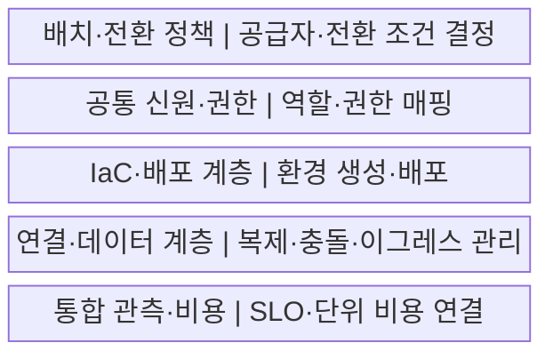
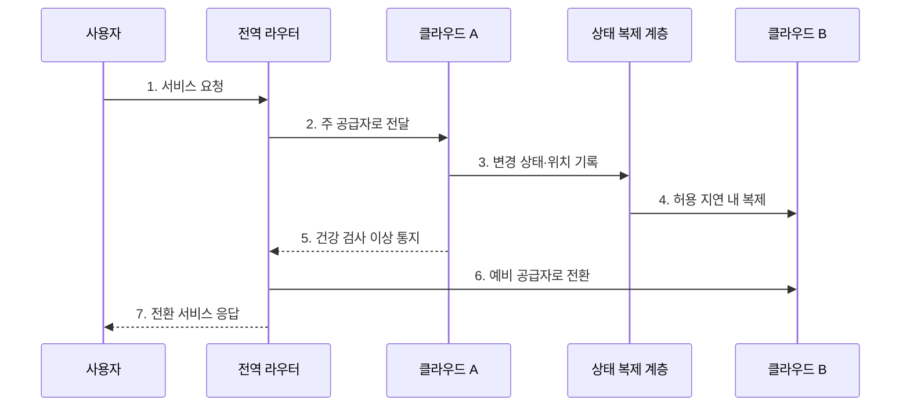

---
sidebar:
  order: 143
  label: "143. 멀티 클라우드 전략 (Multi Cloud Strategy)"
  badge:
    text: "기출 · 70%"
    variant: note
title: "멀티 클라우드 전략 (Multi Cloud Strategy)"
date: "2026-07-27T23:59:59+09:00"
tags:
  - "notes-software"
weight: 143
extra:
  question_no: "143"
  source_status: "기출"
  source_history: "135회"
  priority: 70
  priority_note: "복수 클라우드의 종속·운영 통제가 최근 출제됨"
---

## 미리 알고가기

- **멀티 클라우드**: 둘 이상의 퍼블릭 클라우드 공급자를 업무별로 병행하는 구성이다
- **분할 배치**: 애플리케이션이나 데이터 처리 단위를 공급자별로 나누는 방식이다
- **중복 배치**: 같은 서비스를 여러 공급자에 두고 장애 전환에 사용하는 방식이다
- **이식성(포터빌리티)**: 실행 패키지·배포 선언·데이터 형식을 다른 환경으로 옮길 수 있는 정도이다
- **이그레스 비용**: 클라우드 외부나 다른 공급자로 데이터를 전송할 때 발생하는 비용이다
- **공통 거버넌스**: 계정·권한·정책·비용·관측 기준을 공급자마다 일관되게 적용하는 체계이다
- **코드형 인프라(Infrastructure as Code, IaC)**: ‘아이에이시’로 읽고 영문 핵심 머리글자를 조합한 표기이며 인프라 구성을 코드로 선언해 반복 생성한다
- **지속적 통합·전달(Continuous Integration/Continuous Delivery, CI/CD)**: ‘시아이 슬래시 시디’로 읽고 두 약어를 빗금으로 이은 표기이며 변경을 자동 검증·전달하는 방식이다
- **공통 신원(Common Identity, Common ID)**: ‘커먼 아이디’로 읽고 Identity를 ID로 줄인 표기이며 사용자 신원·역할을 공급자별 권한에 연결한다
- **컨테이너**: 애플리케이션과 실행 의존성을 묶어 여러 환경에서 같은 방식으로 실행하는 단위이다
- **관리형 서비스**: 공급자가 설치·패치·확장 같은 운영 작업을 대신 수행하는 서비스이다
- **리전·라우팅**: 서비스가 제공되는 지역 단위와 요청을 목적지 경로로 전달하는 규칙이다
- **응용 프로그래밍 인터페이스(Application Programming Interface, API)**: ‘에이피아이’로 읽고 영문 머리글자를 딴 표기이며 다른 서비스 기능을 호출하는 규약이다

## Ⅰ. 개요

- 정의/개념: 둘 이상의 퍼블릭 공급자를 **분할·중복 사용**하는 전략
- 배경/필요성: 공급자별 특화 기능 활용과 **장애·종속 위험** 분산

### 쉽게 이해하기 (학습용)

- 가게를 여러 곳 쓰는 것보다 무엇을 나누고 어떻게 바꿔 살지를 정하는 것이 핵심이다.

## Ⅱ. 특징

- **의도적 배치**: 기능·지역·규제·복구로 공급자 역할을 정
- **분할·중복**: 업무를 나누거나 같은 서비스를 복제
- **공통 운영면**: 신원·정책·배포·관측·비용을 통합

### 쉽게 이해하기 (학습용)

- 예비 가게가 있어도 재고와 출입증을 맞추고 실제로 손님을 돌려보는 연습이 필요하다.

## Ⅲ. 구조 및 구성요소

| 구성요소 | 책임 |
|:---|:---|
| 배치·전환 정책 | 지연·기능·RTO/RPO로 공급자 결정 |
| 공통 신원·권한 | 조직 역할을 공급자별 권한에 매핑 |
| IaC·배포 계층 | 공통 모듈과 어댑터로 환경 생성 |
| 연결·데이터 계층 | 라우팅·복제·충돌·이그레스 관리 |
| 통합 관측·비용 | 공통 요청 ID로 SLO·단위 비용 연결 |

### 쉽게 이해하기 (학습용)

- 여러 가게를 쓰되 역할과 전환 방법을 미리 정한다.

## Ⅳ. 흐름도

**동작 원리**

- **1. 서비스 요청**: 공급자와 무관한 주소를 호출
- **2. 주 공급자로 전달**: 건강 상태와 배치 정책을 적용
- **3. 변경 상태·위치 기록**: 처리 결과와 복제 기준점을 저장
- **4. 허용 지연 내 복제**: RPO와 정합성 방식으로 상태를 전달
- **5. 건강 검사 이상 통지**: 주 공급자의 실패를 감지
- **6. 예비 공급자로 전환**: 임계값과 재시도 안전성을 확인
- **7. 전환 서비스 응답**: 예비 환경의 처리 결과를 제공

### 쉽게 이해하기 (학습용)

- 주 가게가 멈추면 복제된 마지막 재고를 확인한 예비 가게로 손님을 돌린다.

## Ⅴ. 종류 및 비교

| 비교 항목 | 분할 배치 | 중복 배치 |
|:---|:---|:---|
| 적용 기준 | **특화 기능·지역·업무 격리** | **공급자 장애 연속성** |
| 핵심 특징 | 업무·계층을 공급자별 담당 | 같은 서비스·데이터를 복제 |
| 한계 | 교차 의존·비용 경계 불명확 | 중복 비용·예비 환경 설정 부패 |

### 쉽게 이해하기 (학습용)

- 분할은 일을 나눠 맡기고 중복은 같은 일을 대신할 준비를 한다.

## Ⅵ. 실무 고려사항 및 대책

| 고려사항 | 대책 | 효과 |
|:---|:---|:---|
| 전략 목적 | 워크로드별 기능·복원력·종료 조건 명시 | 공급자 수 확대 억제 |
| 공통화 범위 | 이식 계층과 허용 고유 기능 분리 | 최저 공통 기능화 방지 |
| 데이터 | 권위 원천·RPO·충돌 정책·전송 예산 | 복제·이그레스 통제 |
| 신원·정책 | 공통 역할·공급자 매핑·정책 시험 | 권한 의미 불일치 방지 |
| 전환·이관 | 장애 전환·복원·종료 리허설 | 실제 이식성 검증 |

### 쉽게 이해하기 (학습용)

- 싼 분석 도구라도 데이터를 옮기는 요금과 시간이 더 크면 분할 이점이 사라진다.

## Ⅶ. 결론

- **특화 기능·복원력·이그레스 비용·전환 능력**으로 멀티 클라우드를 도입

### 쉽게 이해하기 (학습용)

- 가게를 늘려 얻는 기능과 복원력이 재고 동기화·인력·이동 비용보다 커야 한다.
