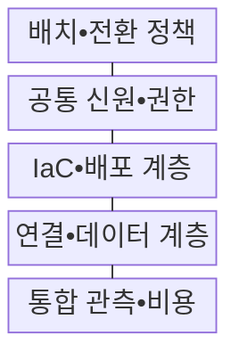
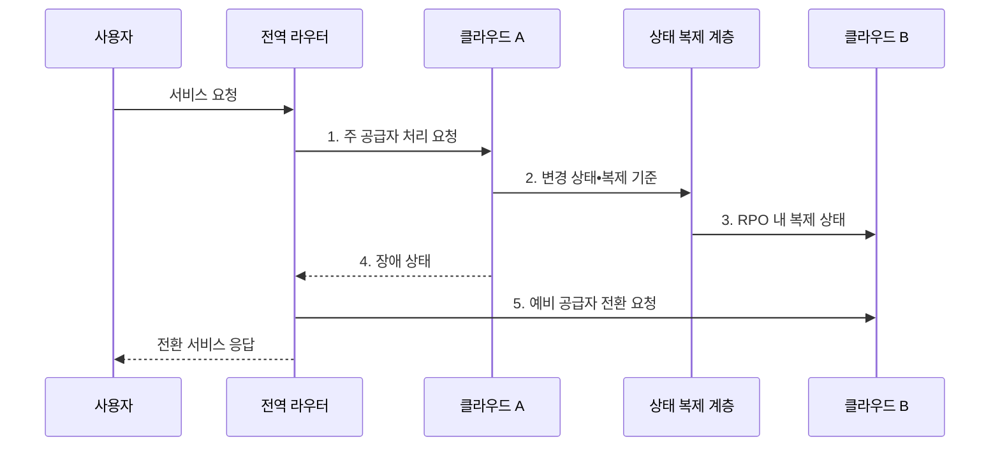

---
sidebar:
  order: 143
  label: "143. 멀티 클라우드 전략 (Multi Cloud Strategy)"
  badge:
    text: "기출 • 70%"
    variant: note
title: "멀티 클라우드 전략 (Multi Cloud Strategy)"
date: "2026-08-03T09:14:20+09:00"
tags:
  - "notes-software"
weight: 143
extra:
  question_no: "143"
  source_status: "기출"
  source_history: "135회"
  priority: 70
  priority_note: "복수 클라우드의 종속•운영 통제가 최근 출제됨"
---

## Ⅰ. 개요

핵심 용어

- **멀티 클라우드 전략(Multi-Cloud Strategy)**: 둘 이상의 퍼블릭 클라우드 공급자에 워크로드를 목적별로 분할하거나 중복 배치하는 운영 전략이다.

- 정의/개념: 둘 이상의 퍼블릭 클라우드 공급자에 워크로드를 목적에 따라 분할하거나 중복 배치하는 **멀티 클라우드 전략(Multi-Cloud Strategy)**
- 배경/필요성: 단일 공급자 **장애•종속**으로 서비스 연속성•이전 선택 제약

#### 한줄 요약

- 가게를 여러 곳 쓰는 것보다 무엇을 나누고 어떻게 바꿔 살지를 정하는 것이 핵심이다.

## Ⅱ. 특징

핵심 용어

- **공통 운영면**: 여러 공급자의 신원•정책•배포•관측•비용을 일관된 기준으로 관리하는 기반이다.
- **의도적 공급자 배치**: 기능•지역•규제•복구 조건을 근거로 워크로드별 공급자를 선택하는 원칙이다.
- **분할•중복 배치**: 업무를 공급자별로 나누거나 동일 서비스를 복제해 장애에 대비하는 방식이다.

- 기능•지역•규제•복구 조건에 따른 **의도적 공급자 배치**
- **분할•중복 배치** 로 특화 기능과 공급자 장애 대응 분리
- 신원•정책•배포•관측•비용의 **공통 운영면** 통합

#### 한줄 요약

- 예비 가게가 있어도 재고와 출입증을 맞추고 실제로 손님을 돌려보는 연습이 필요하다.

## Ⅲ. 구조 및 구성요소

핵심 용어

- **연결•데이터 계층**: 공급자 사이의 요청 라우팅과 상태 복제 및 이그레스 비용을 관리하는 구성요소이다.
- **복구 시간 목표(Recovery Time Objective, RTO)•복구 시점 목표(Recovery Point Objective, RPO)**: 허용할 최대 복구 시간과 데이터 손실 구간을 나타내는 기준이다.
- **코드형 인프라(Infrastructure as Code, IaC)•배포 계층**: 선언 코드와 공급자 어댑터로 여러 환경을 일관되게 생성하는 구성요소이다.
- **서비스 수준 목표(Service Level Objective, SLO)•단위 비용**: 서비스 품질과 요청•처리량당 비용을 공급자 간 비교하는 관측 기준이다.

| 구성요소 | 책임 |
|:---|:---|
| 배치•전환 정책 | 지연•기능•**RTO/RPO** 로 공급자 결정 |
| 공통 신원•권한 | 조직 역할과 공급자별 **권한 매핑** |
| IaC•배포 계층 | **IaC 모듈•공급자 어댑터** 로 환경 생성 |
| 연결•데이터 계층 | **라우팅•복제•이그레스** 관리 |
| 통합 관측•비용 | 요청 식별자로 **SLO•단위 비용** 연결 |

#### 한줄 요약

- 여러 가게를 쓰되 역할과 전환 방법을 미리 정한다.

## Ⅳ. 흐름도

핵심 용어

- **5. 예비 공급자 전환 요청**: 데이터 최신성을 확인한 뒤 장애 난 공급자에서 예비 환경으로 라우팅을 바꾸는 단계이다.
- **1. 주 공급자 처리 요청**: 건강 상태•데이터 주권•비용 정책을 평가해 실행 위치를 결정하는 단계이다.
- **2. 변경 상태•복제 기준**: 처리 결과에 복제 순서와 장애 후 재시작 지점을 부여하는 단계이다.
- **3. 복구 시점 목표(Recovery Point Objective, RPO) 내 복제 상태**: 허용 가능한 손실 시점까지 예비 공급자의 데이터를 동기화한 상태이다.
- **4. 장애 상태**: 오류 지속시간과 건강 상태를 기준으로 일시 오류와 공급자 장애를 구분한 결과이다.

**동작 원리**

1. **주 공급자 처리 요청**: 건강 상태•데이터 주권•비용 정책으로 실행 위치 결정
2. **변경 상태•복제 기준**: 처리 결과에 복제 순서와 재시작 지점 부여
3. **RPO 내 복제 상태**: 허용 손실 시점까지 예비 공급자 상태 동기화
4. **장애 상태**: 임계 지속시간으로 일시 오류와 공급자 실패 구분
5. **예비 공급자 전환 요청**: 데이터 최신성 확인 후 라우팅 변경

#### 한줄 요약

- 주 가게가 멈추면 복제된 마지막 재고를 확인한 예비 가게로 손님을 돌린다.

## Ⅴ. 종류 및 비교

핵심 용어

- **중복 배치**: 같은 서비스와 데이터를 여러 공급자에 준비해 공급자 장애에 대응하는 전략이다.
- **분할 배치**: 업무•계층을 공급자별 특화 기능•지역•격리 요구에 따라 나눠 운영하는 전략이다.

| 배치 전략 | 분할 배치 | 중복 배치 |
|:---|:---|:---|
| 적용 기준 | **특화 기능•지역•업무 격리** | **공급자 장애 연속성** |
| 핵심 특징 | 업무•계층별 **공급자 역할 분리** | 같은 서비스•데이터의 **공급자 간 복제** |
| 한계 | **교차 의존•비용 경계** 불명확 | **중복 비용•예비 환경 설정 부패** |

#### 한줄 요약

- 분할은 일을 나눠 맡기고 중복은 같은 일을 대신할 준비를 한다.

## Ⅵ. 실무 고려사항 및 대책

핵심 용어

- **복제 충돌•이그레스 비용**: 기준 원천 없이 양방향 복제할 때 데이터 충돌과 전송 비용이 커지는 문제이다.
- **이식 계층•고유 기능 경계**: 공통화할 구성과 특정 공급자 기능을 사용할 구성을 구분한 설계 경계이다.
- **복구 시점 목표(Recovery Point Objective, RPO)•전송 예산**: 허용 데이터 손실 구간과 공급자 간 전송에 쓸 비용 한도이다.
- **공통 역할•권한 매핑**: 조직의 표준 역할을 공급자별 권한 체계에 대응시키는 통제이다.

| 문제 | 대책 | 효과 |
|:---|:---|:---|
| 목적 없는 공급자 추가로 운영•계약 비용 급증 | 워크로드별 **기능•복원력•종료 조건** 명시 | **공급자 수•운영 비용** 확산 억제 |
| 전면 공통화로 공급자 특화 기능의 이점 상실 | **이식 계층•고유 기능 경계** 분리 | **최저 공통 기능화** 방지 |
| 기준 원천 없이 양방향 복제하면 충돌•전송비 증가 | **기준 원천•RPO•전송 예산** 지정 | **복제 충돌•이그레스 비용** 통제 |
| 공급자별 역할 의미가 달라 과다 권한 발생 | **공통 역할•권한 매핑** 시험 | **권한 의미 불일치** 방지 |
| 문서상 이식성만 믿으면 장애 시 전환 실패 | **장애 전환•복원•종료** 리허설 | **실제 전환 시간•이식성** 검증 |

#### 한줄 요약

- 싼 분석 도구라도 데이터를 옮기는 요금과 시간이 더 크면 분할 이점이 사라진다.

## Ⅶ. 결론

핵심 용어

- **특화 기능•복원력**: 멀티 클라우드 도입 비용과 비교해 충분한 이득이 있는지 평가해야 하는 가치이다.
- **이그레스•전환 비용**: 공급자 밖으로 데이터를 전송하고 다른 환경으로 서비스를 옮기는 데 드는 비용이다.

- **특화 기능•복원력** 이득이 **이그레스•전환 비용** 보다 클 때만 멀티 클라우드 도입

#### 한줄 요약

- 가게를 늘려 얻는 기능과 복원력이 재고 동기화•인력•이동 비용보다 커야 한다.
