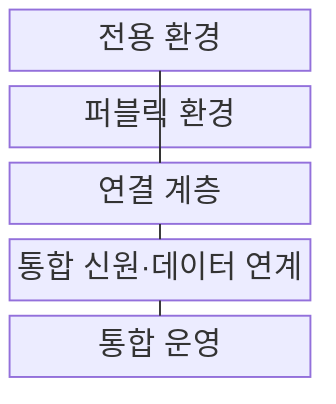
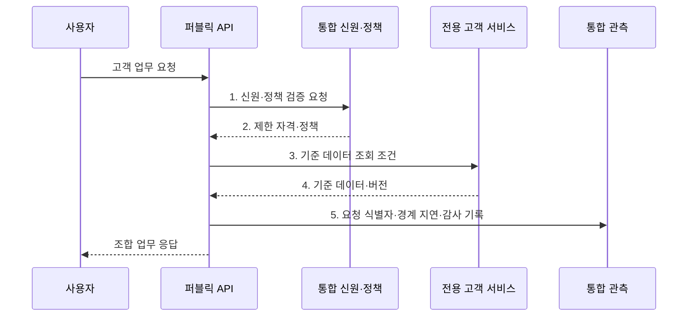

---
sidebar:
  order: 144
  label: "144. 하이브리드 클라우드 (Hybrid Cloud)"
  badge:
    text: "기출 · 70%"
    variant: note
title: "하이브리드 클라우드 (Hybrid Cloud)"
date: "2026-07-31T10:45:24+09:00"
tags:
  - "notes-software"
weight: 144
extra:
  question_no: "144"
  source_status: "기출"
  source_history: "135회"
  priority: 70
  priority_note: "공용·사설 환경 연결과 책임 분리가 핵심임"
---

## 미리 알고가기

- **전용 환경**: 프라이빗 클라우드와 기존 데이터센터처럼 조직이 직접 통제하는 실행 환경이다
- **하이브리드 클라우드**: 전용 환경과 퍼블릭 클라우드를 연결해 하나의 업무를 구성한다
- **워크로드 배치**: 데이터 규제·응답 지연·자원 변동에 따라 실행 환경을 선택한다
- **클라우드 버스팅**: 기본 부하를 전용 환경에서 처리하고 초과 부하를 퍼블릭으로 확장한다
- **데이터 동기화**: 환경별 사본의 변경 순서와 일관성 수준을 관리한다
- **경계 지연**: 전용 환경과 퍼블릭 클라우드 사이의 왕복 시간이며 전송 대역폭과 함께 성능을 제한한다
- **전용선·가상 사설망(Virtual Private Network, VPN)**: 전용 통신 회선과 공용망 위의 암호화된 사설 경로로 환경을 연결한다
- **키 관리**: 암호화와 인증에 쓰는 키의 생성·보관·회전·폐기를 통제하는 활동이다
- **응용 프로그래밍 인터페이스(Application Programming Interface, API)**: 프로그램이 다른 환경의 서비스 기능을 정해진 형식으로 호출하는 규약이다
- **로그**: 시스템의 요청·오류·변경 사건을 시간순으로 기록한 데이터이다
- **연합 신원(Federated Identity)**: 여러 환경이 하나의 인증 결과를 신뢰해 사용자·서비스 권한을 연결하는 체계이다
- **복구 시점 목표(Recovery Point Objective, RPO)**: 장애 후 복구할 때 허용 가능한 데이터 손실 시점을 정하는 기준이다
- **비동기 처리·캐시**: 호출 결과를 기다리지 않고 후속 처리하거나 반복 조회 결과를 임시 저장해 경계 왕복을 줄이는 방식이다

## Ⅰ. 개요

- 정의/개념: 전용 환경과 퍼블릭 클라우드를 연결하는 **통합 배포 모델**
- 배경/필요성: 전용 환경만으로는 변동 부하와 **관리형 서비스 확장** 제약

### 쉽게 이해하기 (학습용)

- 내부 금고는 유지하고 외부의 넓은 접수창구와 필요한 길만 연결한다.

## Ⅱ. 특징

- 규제·지연·부하 조건에 따른 **목적별 환경 배치**
- 전용선·VPN·게이트웨이를 통한 **경계 연결**
- 신원·정책·데이터 정합성·관측의 **통합 통제**

### 쉽게 이해하기 (학습용)

- 두 장소를 잇는 순간 길의 지연과 끊김, 양쪽 장부의 차이까지 관리해야 한다.

## Ⅲ. 구조 및 구성요소

| 구성요소 | 책임 |
|:---|:---|
| 전용 환경 | **규제 데이터·기존 시스템** 운영 |
| 퍼블릭 환경 | **탄력 처리·관리형 서비스** 제공 |
| 연결 계층 | 전용선·**VPN·게이트웨이** 경로 관리 |
| 통합 신원·데이터 연계 | **연합 신원·데이터 정합성** 통제 |
| 통합 운영 | 요청 식별자로 **로그·추적·비용** 연결 |

### 쉽게 이해하기 (학습용)

- 내부 금고와 외부 창구를 필요한 경로로 연결한다.

## Ⅳ. 흐름도

**동작 원리**

1. **신원·정책 검증 요청**: 환경 경계에서 동일 주체와 최소 권한 확인
2. **제한 자격·정책**: 허용된 데이터·기능·유효시간 범위 확정
3. **기준 데이터 조회 조건**: 전용 연결로 필요한 데이터·기능만 호출
4. **기준 데이터·버전**: 원문 이동 없이 결과와 변경 기준점 제공
5. **요청 식별자·경계 지연·감사 기록**: 양쪽 처리 구간과 접근 증거 연결

### 쉽게 이해하기 (학습용)

- 외부 창구가 권한을 확인한 뒤 내부 금고에서 필요한 결과만 받아오고 양쪽 기록을 연결한다.

## Ⅴ. 종류 및 비교

| 배포 구성 | 하이브리드 클라우드 | 멀티 클라우드 |
|:---|:---|:---|
| 적용 기준 | **전용 자산·퍼블릭 확장 결합** | **복수 공급자 기능·위험 분산** |
| 핵심 특징 | 전용·퍼블릭 **환경 연결** | 둘 이상 퍼블릭 **공급자 병행** |
| 한계 | **경계 지연·정합성·이중 운영** | **API 차이·이그레스 비용** |

### 쉽게 이해하기 (학습용)

- 하이브리드는 전용·공용 장소의 연결이고 멀티 클라우드는 여러 공급자를 쓰는 전략이다.

## Ⅵ. 실무 고려사항 및 대책

| 고려사항 | 대책 | 효과 |
|:---|:---|:---|
| 잦은 환경 간 호출로 **경계 지연·전송량 증가** | **업무 경계 분리·비동기·캐시** 적용 | **경계 왕복 횟수** 감소 |
| 단일 연결 경로 장애로 환경 간 업무 중단 | **이중 경로·VPN 대체 경로** 시험 | **연결 단일 장애점** 완화 |
| 환경별 계정·키 수명 차이로 과다 권한 발생 | **연합 신원·단기 자격·키 회전** | **권한·자격 노출 시간** 감소 |
| 양방향 동기화로 갱신 충돌·삭제 누락 발생 | **기준 원천·RPO·충돌 규칙** 지정 | **동기화 충돌·데이터 손실** 방지 |
| 시간·요청 식별자 불일치로 장애 구간 단절 | **요청 식별자·시간 동기화** 통일 | **환경 간 요청 경로** 추적 |

### 쉽게 이해하기 (학습용)

- 고객 금고와 외부 창구 사이의 길이 끊기거나 느려질 때도 안전하게 처리되는지 확인한다.

## Ⅶ. 결론

- **전용 자산 유지 이득**이 **경계 지연·이중 운영 비용**보다 클 때만 하이브리드 채택

### 쉽게 이해하기 (학습용)

- 외부 자원의 이점이 두 장소를 잇고 함께 운영하는 비용보다 커야 한다.
