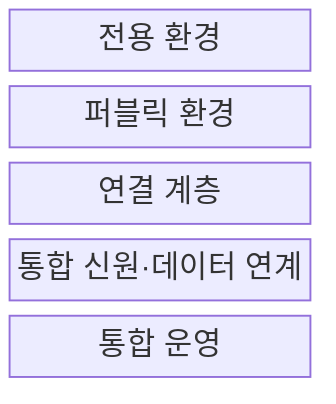
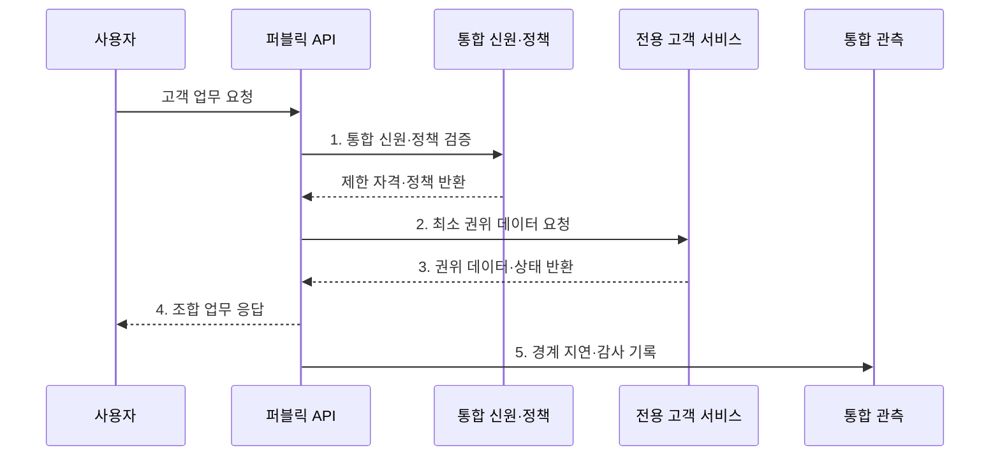

---
sidebar:
  order: 144
  label: "144. 하이브리드 클라우드 (Hybrid Cloud)"
  badge:
    text: "기출 · 70%"
    variant: note
title: "하이브리드 클라우드 (Hybrid Cloud)"
date: "2026-07-30T20:00:00+09:00"
tags:
  - "notes-software"
weight: 144
extra:
  question_no: "144"
  source_status: "기출"
  source_history: "135회"
  priority: 70
  priority_note: "공용·사설 환경 연결과 책임 분리가 핵심임"
---

## 미리 알고가기

- **전용 환경**: 프라이빗 클라우드와 기존 데이터센터처럼 조직이 직접 통제하는 실행 환경이다
- **하이브리드 클라우드**: 전용 환경과 퍼블릭 클라우드를 연결해 하나의 업무를 구성한다
- **워크로드 배치**: 데이터 규제·응답 지연·자원 변동에 따라 실행 환경을 선택한다
- **클라우드 버스팅**: 기본 부하를 전용 환경에서 처리하고 초과 부하를 퍼블릭으로 확장한다
- **통합 식별자(Identity, ID)**: ‘아이디’로 읽고 Identity의 머리글자를 딴 표기이며 사용자·서비스 계정을 환경 간 연동하고 같은 접근 정책을 적용한다
- **데이터 동기화**: 환경별 사본의 변경 순서와 일관성 수준을 관리한다
- **경계 지연**: 전용 환경과 퍼블릭 클라우드 사이의 왕복 시간과 전송 대역폭에 좌우된다
- **전용선·가상 사설망(Virtual Private Network, VPN)**: ‘브이피엔’으로 읽고 Virtual·Private·Network의 머리글자를 딴 표기이며 전용 통신 회선과 암호화된 사설 경로로 환경을 연결한다
- **키 관리**: 암호화와 인증에 쓰는 키의 생성·보관·회전·폐기를 통제하는 활동이다
- **응용 프로그래밍 인터페이스(Application Programming Interface, API)**: ‘에이피아이’로 읽고 세 영문 단어의 머리글자를 딴 표기이며 프로그램이 다른 환경의 서비스 기능을 호출하는 규약이다
- **데이터베이스(Database, DB)·메시지**: ‘디비’는 Database의 관례적 축약 표기이며 데이터베이스는 구조화된 데이터를 저장하고 메시지는 시스템 간 비동기 전달 단위로 쓰인다
- **로그**: 시스템의 요청·오류·변경 사건을 시간순으로 기록한 데이터이다

## Ⅰ. 개요

- 정의/개념: 전용 환경과 퍼블릭 클라우드를 연결하는 **통합 배포 모델**
- 배경/필요성: 규제·기존 자산 유지와 **탄력 자원·관리형 서비스** 활용

### 쉽게 이해하기 (학습용)

- 내부 금고는 유지하고 외부의 넓은 접수창구와 필요한 길만 연결한다.

## Ⅱ. 특징

- **목적별 배치**: 규제·지연·부하로 환경 역할을 분리
- **경계 연결**: 전용선·VPN·게이트웨이로 환경을 연결
- **통합 통제**: 신원·정책·데이터 정합성·관측을 연결

### 쉽게 이해하기 (학습용)

- 두 장소를 잇는 순간 길의 지연과 끊김, 양쪽 장부의 차이까지 관리해야 한다.

## Ⅲ. 구조 및 구성요소

| 구성요소 | 책임 |
|:---|:---|
| 전용 환경 | 규제 데이터·기존 시스템·내부 업무 운영 |
| 퍼블릭 환경 | 외부 접점·탄력 처리·관리형 서비스 제공 |
| 연결 계층 | 전용선·VPN·게이트웨이·라우팅 관리 |
| 통합 신원·데이터 연계 | 계정 연합·최소 권한·정합성 통제 |
| 통합 운영 | 공통 요청 ID로 로그·추적·비용 연결 |

### 쉽게 이해하기 (학습용)

- 내부 금고와 외부 창구를 필요한 경로로 연결한다.

## Ⅳ. 흐름도

**동작 원리**

- **1. 통합 신원·정책 검증**: 온프레미스·클라우드 경계에서 동일 주체와 최소 권한 확인
- **2. 최소 권위 데이터 요청**: 전용 연결로 업무에 필요한 데이터·기능만 호출
- **3. 권위 데이터·상태 반환**: 시스템 오브 레코드가 원문 이동을 줄인 결과와 버전 제공
- **4. 조합 업무 응답**: 클라우드 처리와 온프레미스 권위 결과를 하나의 응답으로 결합
- **5. 경계 지연·감사 기록**: 동일 요청 ID로 양쪽 성능·실패·접근 증거 연결

### 쉽게 이해하기 (학습용)

- 외부 창구가 권한을 확인한 뒤 내부 금고에서 필요한 결과만 받아오고 양쪽 기록을 연결한다.

## Ⅴ. 종류 및 비교

| 비교 항목 | 하이브리드 클라우드 | 멀티 클라우드 |
|:---|:---|:---|
| 적용 기준 | **전용 자산·퍼블릭 확장 결합** | **복수 공급자 기능·위험 분산** |
| 핵심 특징 | 전용·퍼블릭 환경 연결 | 둘 이상 퍼블릭 공급자 병행 |
| 한계 | 경계 지연·정합성·이중 운영 | API 차이·이그레스·기술 중복 |

### 쉽게 이해하기 (학습용)

- 하이브리드는 전용·공용 장소의 연결이고 멀티 클라우드는 여러 공급자를 쓰는 전략이다.

## Ⅵ. 실무 고려사항 및 대책

| 고려사항 | 대책 | 효과 |
|:---|:---|:---|
| 업무 분할 | 응집도 높은 경계·비동기·캐시 적용 | 경계 왕복 감소 |
| 연결 | 이중 경로·VPN 대체·용량 시험 | 단일 연결 장애 완화 |
| 신원·키 | 연합 신원·짧은 자격·키 회전 | 권한·자격 노출 감소 |
| 데이터 | 권위 원천·방향·RPO·충돌 규칙 | 동기화 충돌 방지 |
| 관측 | 공통 요청 ID·시간 동기화·로그 표준 | 환경 간 추적 연결 |

### 쉽게 이해하기 (학습용)

- 고객 금고와 외부 창구 사이의 길이 끊기거나 느려질 때도 안전하게 처리되는지 확인한다.

## Ⅶ. 결론

- **데이터 위치·경계 지연·연결 복구·이중 운영 비용**으로 하이브리드 클라우드를 도입

### 쉽게 이해하기 (학습용)

- 외부 자원의 이점이 두 장소를 잇고 함께 운영하는 비용보다 커야 한다.
