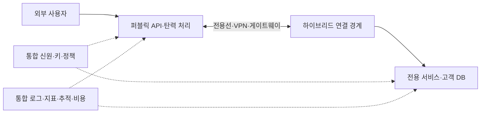
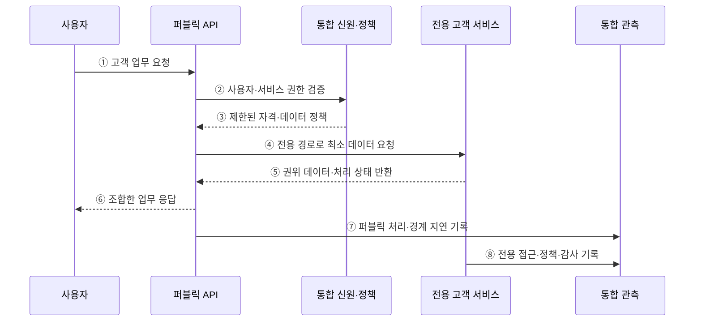

---
sidebar:
  order: 144
  label: "144. 하이브리드 클라우드 (Hybrid Cloud)"
  badge:
    text: "기출 · 70%"
    variant: note
title: "하이브리드 클라우드 (Hybrid Cloud)"
date: "2026-07-27T23:59:59+09:00"
tags:
  - "notes-software"
weight: 144
extra:
  question_no: "144"
  source_status: "기출"
  source_history: "135회"
  priority: 70
  priority_note: "공용·사설 환경 연결과 책임 분리가 핵심임"
---

## 미리 알고가기

- **전용 환경**: 프라이빗 클라우드와 기존 데이터센터처럼 조직이 직접 통제하는 실행 환경이다
- **하이브리드 클라우드**: 전용 환경과 퍼블릭 클라우드를 연결해 하나의 업무를 구성한다
- **워크로드 배치**: 데이터 규제·응답 지연·자원 변동에 따라 실행 환경을 선택한다
- **클라우드 버스팅**: 기본 부하를 전용 환경에서 처리하고 초과 부하를 퍼블릭으로 확장한다
- **통합 식별자(Identity, ID)**: ‘아이디’로 읽고 Identity의 머리글자를 딴 표기이며 사용자·서비스 계정을 환경 간 연동하고 같은 접근 정책을 적용한다
- **데이터 동기화**: 환경별 사본의 변경 순서와 일관성 수준을 관리한다
- **경계 지연**: 전용 환경과 퍼블릭 클라우드 사이의 왕복 시간과 전송 대역폭에 좌우된다
- **전용선·가상 사설망(Virtual Private Network, VPN)**: ‘브이피엔’으로 읽고 Virtual·Private·Network의 머리글자를 딴 표기이며 전용 통신 회선과 암호화된 사설 경로로 환경을 연결한다
- **키 관리**: 암호화와 인증에 쓰는 키의 생성·보관·회전·폐기를 통제하는 활동이다
- **응용 프로그래밍 인터페이스(Application Programming Interface, API)**: ‘에이피아이’로 읽고 세 영문 단어의 머리글자를 딴 표기이며 프로그램이 다른 환경의 서비스 기능을 호출하는 규약이다
- **데이터베이스(Database, DB)·메시지**: ‘디비’는 Database의 관례적 축약 표기이며 데이터베이스는 구조화된 데이터를 저장하고 메시지는 시스템 간 비동기 전달 단위로 쓰인다
- **로그**: 시스템의 요청·오류·변경 사건을 시간순으로 기록한 데이터이다

## Ⅰ. 개요

- 하이브리드 클라우드는 프라이빗 클라우드·기존 데이터센터 같은 전용 환경과 퍼블릭 클라우드를 연결해 하나의 업무·데이터 흐름으로 운영하는 배포 모델이다.
- 전면 이전이 어려운 규제·기존 자산은 전용 환경에 두면서 퍼블릭의 탄력 자원과 관리형 서비스를 활용한다.

### 쉽게 이해하기 (학습용)

- 내부 금고는 유지하고 외부의 넓은 접수창구와 필요한 길만 연결한다.

## Ⅱ. 특징

- **목적별 배치**: 데이터 위치·규제·지연·기존 시스템 결합·부하 변동으로 전용과 퍼블릭의 역할을 나눈다.
- **경계 연결**: 전용선·VPN·게이트웨이·이름 해석·라우팅으로 양쪽의 통신 경로와 신뢰 경계를 만든다.
- **신원·정책 연계**: 사용자·서비스 신원을 연합하고 환경별 권한·키·보안 기준을 일관되게 적용한다.
- **데이터 정합성**: API·메시지·복제 방식에 따라 권위 원천·지연·충돌·삭제 전파를 통제한다.
- **분산 운영비**: 환경 간 지연·대역폭·전송비·장애 전파와 이중 기술·도구·인력 비용이 증가한다.

### 쉽게 이해하기 (학습용)

- 두 장소를 잇는 순간 길의 지연과 끊김, 양쪽 장부의 차이까지 관리해야 한다.

## Ⅲ. 아키텍처 및 구성요소

**도표안 A — 구조도**

**도표안 B — sequenceDiagram**

| 구성요소 | 역할 |
|:---|:---|
| 전용 환경 | 규제 데이터·기존 시스템·저지연 내부 업무 운영 |
| 퍼블릭 환경 | 외부 접점·탄력 처리·관리형 서비스 제공 |
| 연결 계층 | 전용선·VPN·게이트웨이·라우팅·DNS·대역폭 관리 |
| 통합 신원·키·정책 | 사용자·서비스 계정 연합과 최소 권한·암호화 적용 |
| 데이터 연계 | API·메시지·복제의 권위·정합성·지연·오류 처리 |
| 통합 운영 | 공통 요청 ID로 배포·로그·지표·추적·비용 연결 |

**동작 원리**

- ① 사용자가 퍼블릭 환경의 외부 API에 고객 업무를 요청한다.
- ② 퍼블릭 API가 통합 신원·정책 계층에 사용자와 서비스 간 권한을 검증한다.
- ③ 통합 신원 계층이 짧고 제한된 자격과 허용 데이터 정책을 반환한다.
- ④ 퍼블릭 API가 전용 연결과 게이트웨이를 통해 필요한 최소 데이터만 전용 고객 서비스에 요청한다.
- ⑤ 전용 서비스가 권위 데이터와 처리 상태를 반환하고 원문 이동을 최소화한다.
- ⑥ 퍼블릭 API가 결과를 조합해 사용자에게 업무 응답을 제공한다.
- ⑦ 퍼블릭 처리 시간·오류와 환경 경계의 왕복 지연·전송량을 통합 관측에 기록한다.
- ⑧ 전용 서비스의 데이터 접근·정책 판정·감사 기록을 같은 요청 ID로 연결한다.

### 쉽게 이해하기 (학습용)

- 외부 창구가 권한을 확인한 뒤 내부 금고에서 필요한 결과만 받아오고 양쪽 기록을 연결한다.

## Ⅳ. 종류 및 비교

| 비교 항목 | 하이브리드 클라우드 | 멀티 클라우드 |
|:---|:---|:---|
| 구성 기준 | 전용 환경과 퍼블릭의 결합 | 둘 이상 퍼블릭 공급자의 병행 |
| 주요 목적 | 기존·규제 자산 보존과 외부 확장 | 특화 기능·지역·협상·공급자 위험 분산 |
| 핵심 연결 | 내부-외부 네트워크·신원·데이터 | 공급자 간 배포·신원·데이터·관측 |
| 대표 위험 | 경계 공격·지연·이중 운영·정합성 | API 차이·이그레스·기술 중복·표면적 이식성 |
| 관계 | 여러 퍼블릭 공급자를 쓰면 멀티와 중첩 가능 | 전용 환경까지 연결하면 하이브리드와 중첩 가능 |

> 구분 기준은 “내부와 외부” 대 “공급자 수”이며, 한 아키텍처가 하이브리드이면서 멀티 클라우드일 수 있다.

### 쉽게 이해하기 (학습용)

- 하이브리드는 전용·공용 장소의 연결이고 멀티 클라우드는 여러 공급자를 쓰는 전략이다.

## Ⅴ. 실무 고려사항 및 대책

| 고려사항 | 위험 | 대책 |
|:---|:---|:---|
| 업무 분할 | 채팅성 호출로 경계 왕복 급증 | 응집도 높은 서비스 경계·비동기·캐시 |
| 연결 | 전용선 단일 장애·대역폭 포화 | 이중 경로·VPN 대체·용량·라우팅 시험 |
| 신원·키 | 장기 자격·환경별 권한 불일치 | 연합 신원·짧은 자격·역할 매핑·키 회전 |
| 데이터 | 양방향 동기화 충돌·삭제 미전파 | 권위 원천·방향·RPO·충돌·삭제 규칙 |
| 관측 | 환경 경계에서 추적 단절 | 공통 요청 ID·시간 동기화·로그 표준 |
| 복구·비용 | 양쪽 장애 절차와 고정 비용 누락 | 결합 장애 훈련·총비용·종료 조건 |

> **적용 사례**: 고객 DB는 전용 환경에 두고 퍼블릭 API가 최소 필드만 조회하게 하며, 전용선 장애·권한 만료·경계 지연·감사 추적을 함께 시험한다.

### 쉽게 이해하기 (학습용)

- 고객 금고와 외부 창구 사이의 길이 끊기거나 느려질 때도 안전하게 처리되는지 확인한다.

## Ⅵ. 결론

- 하이브리드 클라우드의 핵심은 두 환경을 보유하는 것이 아니라 업무 경계와 데이터 권위를 명확히 하고 연결 장애·지연·보안을 통제하는 데 있다.
- 퍼블릭 활용 편익이 신원·네트워크·정합성·관측·이중 운영 비용보다 큰지 실제 결합 장애와 복구 시험으로 검증해야 한다.

### 쉽게 이해하기 (학습용)

- 외부 자원의 이점이 두 장소를 잇고 함께 운영하는 비용보다 커야 한다.
