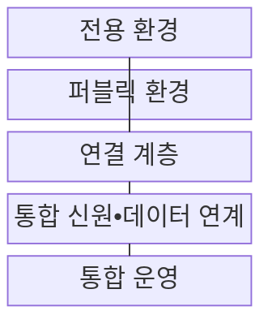
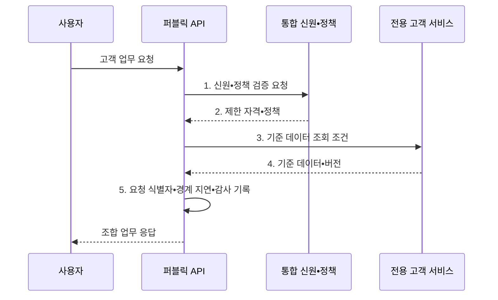

---
sidebar:
  order: 144
  label: "144. 하이브리드 클라우드 (Hybrid Cloud)"
  badge:
    text: "기출 • 70%"
    variant: note
title: "하이브리드 클라우드 (Hybrid Cloud)"
date: "2026-08-03T09:14:20+09:00"
tags:
  - "notes-software"
weight: 144
extra:
  question_no: "144"
  source_status: "기출"
  source_history: "135회"
  priority: 70
  priority_note: "공용•사설 환경 연결과 책임 분리가 핵심임"
---

## Ⅰ. 개요

핵심 용어

- **하이브리드 클라우드(Hybrid Cloud)**: 전용 환경과 퍼블릭 클라우드를 연결해 데이터와 워크로드를 목적별로 배치•연동하는 통합 배포 모델이다.

- 정의/개념: 전용 환경과 퍼블릭 클라우드를 연결해 데이터와 워크로드를 목적별로 배치•연동하는 **하이브리드 클라우드(Hybrid Cloud)** 통합 배포 모델
- 배경/필요성: 전용 환경만으로는 변동 부하와 **관리형 서비스 확장** 제약

#### 한줄 요약

- 내부 금고는 유지하고 외부의 넓은 접수창구와 필요한 길만 연결한다.

## Ⅱ. 특징

핵심 용어

- **경계 연결**: 전용선•VPN•게이트웨이로 전용 환경과 퍼블릭 환경의 통신 경로를 구성하는 특성이다.
- **가상 사설망(Virtual Private Network, VPN)**: 공용망 위에 암호화된 사설 통신 경로를 구성하는 연결 기술이다.
- **목적별 환경 배치**: 규제•지연•부하 조건에 따라 워크로드와 데이터를 전용 또는 퍼블릭 환경에 두는 원칙이다.
- **통합 통제**: 두 환경의 신원•정책•데이터 정합성•관측을 일관된 기준으로 관리하는 방식이다.

- 규제•지연•부하 조건에 따른 **목적별 환경 배치**
- 전용선•VPN•게이트웨이를 통한 **경계 연결**
- 신원•정책•데이터 정합성•관측의 **통합 통제**

#### 한줄 요약

- 두 장소를 잇는 순간 길의 지연과 끊김, 양쪽 장부의 차이까지 관리해야 한다.

## Ⅲ. 구조 및 구성요소

핵심 용어

- **통합 신원•데이터 연계**: 환경 간 인증 결과와 데이터 변경 기준을 일관되게 통제하는 구성요소이다.
- **전용 환경**: 규제 데이터와 기존 시스템을 조직 전용 자원에서 운영하는 환경이다.
- **퍼블릭 환경**: 공급자의 공유 자원에서 탄력 처리와 관리형 서비스를 사용하는 환경이다.
- **연결 계층**: 전용선•가상 사설망•게이트웨이로 두 환경의 통신 경로를 관리하는 구성요소이다.
- **통합 운영**: 요청 식별자로 환경별 로그•추적 정보와 비용을 연결하는 구성요소이다.

| 구성요소 | 책임 |
|:---|:---|
| 전용 환경 | **규제 데이터•기존 시스템** 운영 |
| 퍼블릭 환경 | **탄력 처리•관리형 서비스** 제공 |
| 연결 계층 | 전용선•**VPN•게이트웨이** 경로 관리 |
| 통합 신원•데이터 연계 | **연합 신원•데이터 정합성** 통제 |
| 통합 운영 | 요청 식별자로 **로그•추적•비용** 연결 |

#### 한줄 요약

- 내부 금고와 외부 창구를 필요한 경로로 연결한다.

## Ⅳ. 흐름도

핵심 용어

- **4. 기준 데이터•버전**: 원문 전체를 이동하지 않고 필요한 결과와 변경 기준점을 퍼블릭 환경에 제공하는 정보이다.
- **응용 프로그래밍 인터페이스(Application Programming Interface, API)**: 서로 다른 서비스가 정해진 요청•응답 규칙으로 기능과 데이터를 주고받는 접점이다.
- **1. 신원•정책 검증 요청**: 환경 경계에서 요청 주체와 최소 권한을 확인하는 단계이다.
- **2. 제한 자격•정책**: 허용된 데이터•기능과 자격의 유효시간을 최소 범위로 확정한 결과이다.
- **3. 기준 데이터 조회 조건**: 전용 연결을 통해 필요한 데이터와 기능만 호출하도록 정한 조건이다.
- **5. 요청 식별자•경계 지연•감사 기록**: 양쪽 환경의 처리 구간•지연•접근 증거를 하나의 업무 요청으로 연결한 기록이다.

**동작 원리**

1. **신원•정책 검증 요청**: 환경 경계에서 동일 주체와 최소 권한 확인
2. **제한 자격•정책**: 허용된 데이터•기능•유효시간 범위 확정
3. **기준 데이터 조회 조건**: 전용 연결로 필요한 데이터•기능만 호출
4. **기준 데이터•버전**: 원문 이동 없이 결과와 변경 기준점 제공
5. **요청 식별자•경계 지연•감사 기록**: 양쪽 처리 구간과 접근 증거 연결

#### 한줄 요약

- 외부 창구가 권한을 확인한 뒤 내부 금고에서 필요한 결과만 받아오고 양쪽 기록을 연결한다.

## Ⅴ. 종류 및 비교

핵심 용어

- **하이브리드 클라우드**: 전용 자산을 유지하면서 퍼블릭 클라우드의 탄력성과 관리형 서비스를 결합하는 구성이다.
- **멀티 클라우드(Multi-Cloud)**: 복수 퍼블릭 클라우드 공급자의 기능을 병행하거나 공급자 위험을 분산하는 전략이다.
- **이그레스 비용(Egress Cost)**: 클라우드 공급자 환경 밖으로 데이터를 전송할 때 부과되는 비용이다.

| 배포 구성 | 하이브리드 클라우드 | 멀티 클라우드 |
|:---|:---|:---|
| 적용 기준 | **전용 자산•퍼블릭 확장 결합** | **복수 공급자 기능•위험 분산** |
| 핵심 특징 | 전용•퍼블릭 **환경 연결** | 둘 이상 퍼블릭 **공급자 병행** |
| 한계 | **경계 지연•정합성•이중 운영** | **API 차이•이그레스 비용** |

#### 한줄 요약

- 하이브리드는 전용•공용 장소의 연결이고 멀티 클라우드는 여러 공급자를 쓰는 전략이다.

## Ⅵ. 실무 고려사항 및 대책

핵심 용어

- **경계 지연•전송량 증가**: 환경을 자주 왕복 호출해 응답 시간과 네트워크 사용량이 커지는 문제이다.
- **업무 경계 분리•비동기•캐시**: 환경 간 동기 호출을 줄이도록 기능을 묶고 지연 처리와 결과 재사용을 적용하는 대책이다.
- **이중 경로•가상 사설망(Virtual Private Network, VPN) 대체 경로**: 주 연결 장애 시 사용할 독립 통신 경로를 마련하는 가용성 대책이다.
- **연합 신원•단기 자격•키 회전**: 공통 신원을 사용하고 자격 유효시간을 줄이며 인증 키를 주기적으로 교체하는 통제이다.
- **복구 시점 목표(Recovery Point Objective, RPO)•충돌 규칙**: 허용 가능한 데이터 손실 구간과 동시 변경 시 우선 적용할 값을 정한 기준이다.
- **요청 식별자•시간 동기화**: 두 환경의 처리 기록을 같은 요청과 시간축으로 연결하는 추적 수단이다.

| 문제 | 대책 | 효과 |
|:---|:---|:---|
| 잦은 환경 간 호출로 **경계 지연•전송량 증가** | **업무 경계 분리•비동기•캐시** 적용 | **경계 왕복 횟수** 감소 |
| 단일 연결 경로 장애로 환경 간 업무 중단 | **이중 경로•VPN 대체 경로** 시험 | **연결 단일 장애점** 완화 |
| 환경별 계정•키 수명 차이로 과다 권한 발생 | **연합 신원•단기 자격•키 회전** | **권한•자격 노출 시간** 감소 |
| 양방향 동기화로 갱신 충돌•삭제 누락 발생 | **기준 원천•RPO•충돌 규칙** 지정 | **동기화 충돌•데이터 손실** 방지 |
| 시간•요청 식별자 불일치로 장애 구간 단절 | **요청 식별자•시간 동기화** 통일 | **환경 간 요청 경로** 추적 |

#### 한줄 요약

- 고객 금고와 외부 창구 사이의 길이 끊기거나 느려질 때도 안전하게 처리되는지 확인한다.

## Ⅶ. 결론

핵심 용어

- **전용 자산 유지 이득**: 경계 지연과 이중 운영 비용보다 커야 하이브리드 채택이 타당한 가치이다.
- **경계 지연•이중 운영 비용**: 환경 간 통신 지연과 두 운영 체계를 함께 유지하면서 발생하는 추가 비용이다.

- **전용 자산 유지 이득** 이 **경계 지연•이중 운영 비용** 보다 클 때만 하이브리드 채택

#### 한줄 요약

- 외부 자원의 이점이 두 장소를 잇고 함께 운영하는 비용보다 커야 한다.
