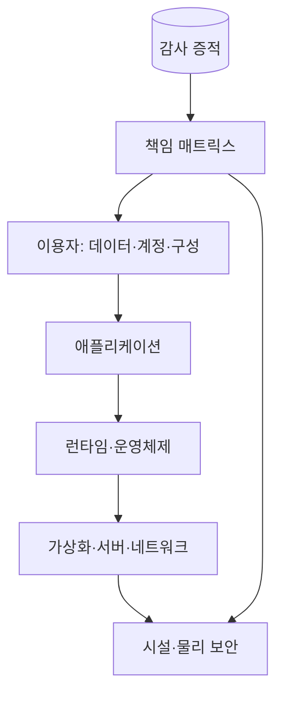
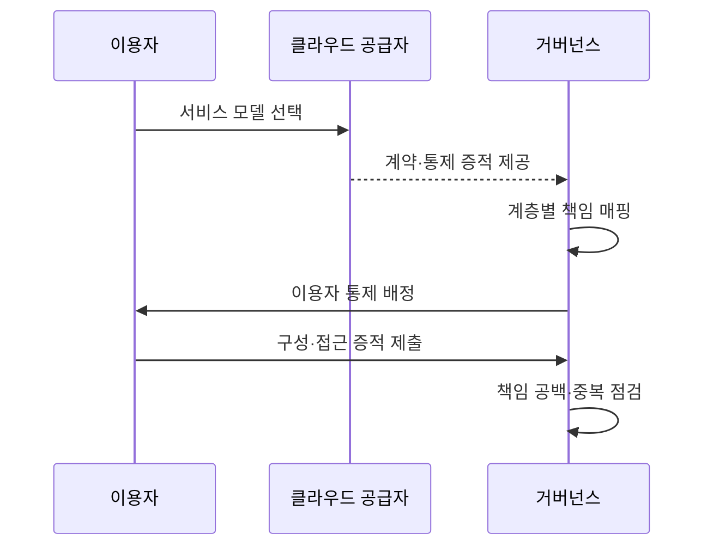

---
sidebar:
  order: 145
  label: "145. 클라우드 공유 책임 모델 (Shared Responsibility Model)"
  badge:
    text: "기출 · 70%"
    variant: note
title: "클라우드 공유 책임 모델 (Shared Responsibility Model)"
date: "2026-07-27T23:59:59+09:00"
tags: ["notes-software"]
weight: 145
extra:
  question_no: "145"
  source_status: "기출"
  source_history: "137회"
  priority: 70
  priority_note: "서비스별 공급자·사용자 책임 경계가 최근 출제됨"
---

## 미리 알고가기

- **공유 책임 모델(Shared Responsibility Model)**: 클라우드 공급자와 이용자의 보안·운영·규정 준수 책임 경계를 정한 모델
- **서비스형 인프라(Infrastructure as a Service, IaaS)**: ‘아이에이에스’로 읽고 영문 머리글자를 딴 약어이며, 공급자는 인프라를 제공하고 이용자는 운영체제부터 관리함
- **서비스형 플랫폼(Platform as a Service, PaaS)**: ‘파스’로 읽고 영문 머리글자를 딴 약어이며, 공급자가 운영체제·런타임까지 관리함
- **서비스형 소프트웨어(Software as a Service, SaaS)**: ‘사스’로 읽고 영문 머리글자를 딴 약어이며, 공급자가 완성된 애플리케이션까지 운영함
- **통제 상속(Control Inheritance)**: 공급자가 수행한 물리·플랫폼 통제와 감사 증적을 이용자가 활용하는 방식
- **책임 매트릭스(Responsibility Matrix)**: 통제 항목별 수행·승인·증적 보유 주체를 명시한 표
- **감사 증적(Audit Evidence)**: 보안 통제가 실제 수행됐음을 보여 주는 로그·설정 이력·보고서
- **정책 코드화(Policy as Code)**: 허용 구성과 위반 조건을 코드로 선언해 자동 검사하는 방식

## Ⅰ. 개요

- **정의/개념**: 서비스 계층별 **공급자·이용자 책임 경계** 정의
- **기존 한계**: 클라우드 도입 후 **보안 책임 오인·통제 누락**

### 쉽게 이해하기 (학습용)

- 임대 건물의 시설 관리는 건물주가 맡아도 출입 권한과 내부 자료는 입주자가 지키는 것과 같다.

## Ⅱ. 특징

- 공급자의 **클라우드 자체 보안**
- 이용자의 **클라우드 내 데이터·구성 보안**
- 서비스 모델별 **관리 계층·책임 범위 이동**

### 쉽게 이해하기 (학습용)

- 관리형 서비스가 많아질수록 공급자의 관리 범위는 넓어지지만 계정·데이터·접근 권한 책임은 이용자에게 남는다.

## Ⅲ. 아키텍처 및 구성요소

| 구성요소 | 책임 |
|:---|:---|
| 공급자 | **시설·하드웨어·기반 서비스** 보호 |
| 이용자 | **데이터·계정·서비스 구성** 보호 |
| 서비스 계약 | 계층별 **책임·보장 범위** 명시 |
| 책임 매트릭스 | 통제별 **수행·승인 주체** 지정 |
| 감사 증적 | 통제 수행의 **검증 근거 보존** |

> 요약: 서비스 계약과 책임 매트릭스로 계층별 통제 주체 확정

### 쉽게 이해하기 (학습용)

- 건물의 각 층과 설비마다 누가 잠그고 검사하며 기록을 보관할지 분담표로 정한다.

## Ⅳ. 원리 및 절차 흐름

| 절차 | 설명 |
|:---|:---|
| 서비스 모델 선택 | 공급자의 **관리 계층 확인** |
| 증적 제공 | 공급자 통제의 **상속 근거 확보** |
| 책임 매핑 | 계층·통제별 **담당 주체 지정** |
| 이용자 통제 수행 | 계정·데이터·**구성 보안 적용** |
| 공백 점검 | 미배정·중복 통제의 **보완 조치** |

> 요약: 상속 통제를 확인하고 남은 이용자 통제의 공백 제거

### 쉽게 이해하기 (학습용)

- 공급자가 맡은 항목의 검사 기록을 확인한 뒤 나머지 항목을 내부 담당자에게 배정하고 빠진 일이 없는지 점검한다.

## Ⅴ. 종류 및 비교

| 서비스 모델 | IaaS | PaaS | SaaS |
|:---|:---|:---|:---|
| 적용 기준 | 운영체제·**인프라 구성 통제** | 코드 중심·**플랫폼 관리 위임** | 표준 업무·**완성 서비스 이용** |
| 핵심 특징 | 이용자의 **OS 이상 계층 관리** | 공급자의 **OS·런타임 관리** | 공급자의 **애플리케이션 운영** |
| 한계 | 이용자 책임·**운영 부담 최대** | 플랫폼 제약·**구성 책임 잔존** | 제어 범위·**데이터 책임 잔존** |

> 요약: 관리형 계층이 늘어도 계정·데이터 책임은 이용자에게 잔존

### 쉽게 이해하기 (학습용)

- 빈 공간을 빌리면 내부를 직접 관리하고 완성 서비스를 빌리면 관리 범위는 줄지만 사용자와 자료 책임은 남는다.

## Ⅵ. 실무 사례

1. IaaS 서버는 이용자가 **OS 패치·방화벽 규칙** 관리
2. SaaS 협업 도구는 이용자가 **계정·공유 권한** 관리

### 쉽게 이해하기 (학습용)

- 가상 서버의 운영체제는 고객이 고치고 완성형 도구를 써도 누가 문서를 볼지는 고객이 정한다.

## Ⅶ. 결론

- 공급자 통제는 **상속 증적**, 이용자 통제는 **구성 검증**으로 확인

### 쉽게 이해하기 (학습용)

- 공급자 인증만 믿지 말고 자신에게 남은 데이터·계정·설정 책임을 별도로 검사해야 한다.
