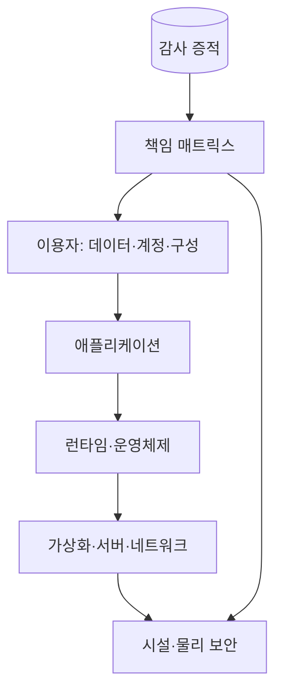
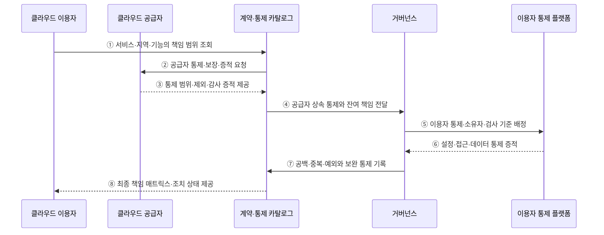

---
sidebar:
  order: 145
  label: "145. 클라우드 공유 책임 모델 (Shared Responsibility Model)"
  badge:
    text: "기출 · 70%"
    variant: note
title: "클라우드 공유 책임 모델 (Shared Responsibility Model)"
date: "2026-07-27T23:59:59+09:00"
tags: ["notes-software"]
weight: 145
extra:
  question_no: "145"
  source_status: "기출"
  source_history: "137회"
  priority: 70
  priority_note: "서비스별 공급자·사용자 책임 경계가 최근 출제됨"
---

## 미리 알고가기

- **공유 책임 모델(Shared Responsibility Model)**: 클라우드 공급자와 이용자의 보안·운영·규정 준수 책임 경계를 정한 모델
- **서비스형 인프라(Infrastructure as a Service, IaaS)**: ‘아이에이에스’로 읽고 영문 머리글자를 딴 약어이며, 공급자는 인프라를 제공하고 이용자는 운영체제부터 관리함
- **서비스형 플랫폼(Platform as a Service, PaaS)**: ‘파스’로 읽고 영문 머리글자를 딴 약어이며, 공급자가 운영체제·런타임까지 관리함
- **서비스형 소프트웨어(Software as a Service, SaaS)**: ‘사스’로 읽고 영문 머리글자를 딴 약어이며, 공급자가 완성된 애플리케이션까지 운영함
- **통제 상속(Control Inheritance)**: 공급자가 수행한 물리·플랫폼 통제와 감사 증적을 이용자가 활용하는 방식
- **책임 매트릭스(Responsibility Matrix)**: 통제 항목별 수행·승인·증적 보유 주체를 명시한 표
- **감사 증적(Audit Evidence)**: 보안 통제가 실제 수행됐음을 보여 주는 로그·설정 이력·보고서
- **정책 코드화(Policy as Code)**: 허용 구성과 위반 조건을 코드로 선언해 자동 검사하는 방식

## Ⅰ. 개요

- 클라우드 공유 책임 모델은 서비스 계층과 보안 통제별로 공급자와 이용자의 수행·승인·증적·대응 책임을 나누는 모델이다.
- 클라우드를 쓰면 보안을 모두 공급자가 맡는다는 오해를 막고 상속할 통제와 이용자가 구현할 통제의 공백·중복을 제거한다.

### 쉽게 이해하기 (학습용)

- 건물주가 시설을 지켜도 입주자가 출입 권한과 내부 자료를 지켜야 하는 것과 같다.

## Ⅱ. 특징

- **클라우드 자체의 보안**: 공급자가 시설·하드웨어·가상화·관리 서비스 기반을 보호하고 가용하게 운영한다.
- **클라우드 안의 보안**: 이용자가 데이터·신원·권한·네트워크 노출·서비스 설정·사용 방식을 보호한다.
- **서비스별 이동**: IaaS→PaaS→SaaS로 갈수록 공급자 관리 계층이 넓어지지만 계정·데이터 책임은 남는다.
- **통제 상속**: 공급자의 인증·감사 보고서는 특정 통제의 증거이며 이용자 업무 전체의 준수를 자동 보장하지 않는다.
- **공동·분담 책임**: 패치처럼 한쪽이 수행하는 통제도 있고 암호화·로그·사고 대응처럼 양쪽 역할이 연결되는 통제도 있다.

### 쉽게 이해하기 (학습용)

- 공급자에게 맡긴 층이 늘어도 누가 들어오고 어떤 자료를 넣는지는 이용자가 책임진다.

## Ⅲ. 아키텍처 및 구성요소

**도표안 A — 구조도**

**도표안 B — sequenceDiagram**

| 구성요소 | 책임 |
|:---|:---|
| 공급자 | 시설·하드웨어·가상화·기반 서비스의 보호·가용성·패치 |
| 이용자 | 데이터·계정·권한·서비스 설정·업무 사용·단말 보호 |
| 서비스 계약·통제 카탈로그 | 제품·지역·기능별 책임·제외·보장·증적 범위 명시 |
| 책임 매트릭스 | 통제별 수행자·승인자·증적 보유자·사고 대응자 지정 |
| 정책·검증 플랫폼 | 이용자 설정을 코드로 검사하고 위반·예외·조치 증적 보존 |

**동작 원리**

- ① 이용자가 사용할 서비스·지역·기능의 책임 범위를 계약·통제 카탈로그에서 조회한다.
- ② 카탈로그가 공급자에게 해당 제품의 통제 구현·보장·감사 증적을 요청한다.
- ③ 공급자가 수행 범위·전제 조건·제외 사항·유효한 감사 증적을 제공한다.
- ④ 카탈로그가 상속 가능한 공급자 통제와 이용자에게 남는 책임을 거버넌스에 전달한다.
- ⑤ 거버넌스가 잔여 통제별 소유자·구현 기준·검사 주기·사고 대응 역할을 이용자 플랫폼에 배정한다.
- ⑥ 플랫폼이 실제 계정·권한·네트워크·암호화·로그·데이터 설정의 증적을 반환한다.
- ⑦ 거버넌스가 책임 공백·중복·예외를 찾아 보완 통제와 만료일을 카탈로그에 기록한다.
- ⑧ 카탈로그가 공급자와 이용자를 합친 최종 책임 매트릭스와 미조치 상태를 이용자에게 제공한다.

### 쉽게 이해하기 (학습용)

- 건물주 검사표를 확인하고 남은 출입·자료·내부 설정 책임을 담당자에게 배정해 빈칸을 없앤다.

## Ⅳ. 종류 및 비교

| 비교 항목 | IaaS | PaaS | SaaS |
|:---|:---|:---|:---|
| 공급자 책임 확대점 | 물리·가상화·기반 네트워크 | IaaS 범위+OS·런타임·미들웨어 | PaaS 범위+공급 애플리케이션 |
| 이용자 주요 책임 | 게스트 OS·앱·설정·계정·데이터 | 앱 코드·설정·계정·데이터 | 사용자·권한·설정·데이터·사용 |
| 대표 통제 공백 | OS 패치·호스트 방화벽·백업 | 공개 종단점·비밀·앱 취약점 | 과도한 공유·관리자 권한·데이터 보존 |
| 검증 초점 | 이미지·패치·네트워크·복구 | 배포물·설정·신원·데이터 경계 | 테넌트 설정·접근·감사·내보내기 |

> 정확한 경계는 제품과 기능마다 다르므로 서비스 모델의 일반 표를 실제 계약·설정 문서 대신 사용해서는 안 된다.

### 쉽게 이해하기 (학습용)

- 완성 서비스에 가까울수록 시설 관리는 줄지만 사용자와 자료를 관리할 책임은 남는다.

## Ⅴ. 실무 고려사항 및 대책

| 고려사항 | 위험 | 대책 |
|:---|:---|:---|
| 제품별 경계 | 일반 책임표를 모든 서비스에 적용 | 기능·지역·계약별 통제 카탈로그 |
| 상속 증적 | 공급자 인증으로 전체 준수 충족 오판 | 통제 범위·기간·제외·이용자 전제 확인 |
| 책임 배정 | 공급자와 이용자 사이 미배정·중복 | 수행·승인·증적·대응 RACI |
| 설정 검증 | 문서상 책임만 있고 실제 오구성 | 정책 코드·지속 검사·자동 교정 |
| 사고 대응 | 장애·침해 때 상대방 연락과 증거 지연 | 공동 Runbook·연락·로그·통지 훈련 |
| 변경 관리 | 공급자 기능 변경으로 경계 이동 | 변경 알림·정기 재평가·예외 만료 |

> **적용 사례**: IaaS 가상 서버는 공급자의 하이퍼바이저 패치 증적을 상속하되 이용자의 게스트 OS 패치·방화벽·백업 복원은 별도 통제로 검사한다.

### 쉽게 이해하기 (학습용)

- 공급자 서버가 안전해도 그 안의 낡은 운영체제와 열린 방화벽은 이용자가 고쳐야 한다.

## Ⅵ. 결론

- 공유 책임 모델의 핵심은 책임을 둘로 나누는 표가 아니라 각 통제의 수행·승인·증적·사고 대응을 공급자와 이용자 사이에서 끝까지 연결하는 데 있다.
- 제품별 경계와 상속 증적을 확인하고 남은 이용자 책임을 정책 코드와 실제 구성 검사로 이행해야 한다.

### 쉽게 이해하기 (학습용)

- 공급자 인증을 확인한 뒤에도 자신에게 남은 계정·데이터·설정을 직접 검사해야 한다.
