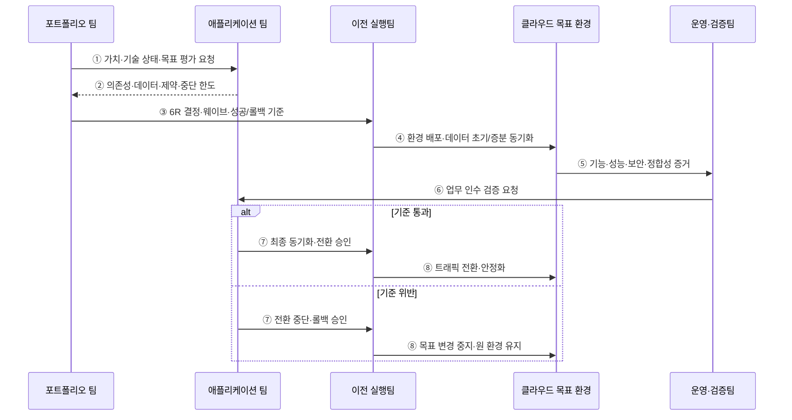

---
sidebar:
  order: 146
  label: "146. 클라우드 마이그레이션 6R (Cloud Migration 6R)"
  badge:
    text: "기출 · 70%"
    variant: note
title: "클라우드 마이그레이션 6R (Cloud Migration 6R)"
date: "2026-07-27T23:59:59+09:00"
tags: ["notes-software"]
weight: 146
extra:
  question_no: "146"
  source_status: "기출"
  source_history: "138회"
  priority: 70
  priority_note: "이전 방식 선택과 단계별 위험 통제가 최근 출제됨"
---

## 미리 알고가기

- **6R**: ‘식스 알’로 읽고 여섯 전략의 영문 이름이 R로 시작해 개수를 붙인 분류이며, 재호스팅·재플랫폼화·재구매·재설계·유지·폐기를 포함함
- **재호스팅(Rehost)**: 다시를 뜻하는 Re-와 Host를 결합한 명칭이며, 애플리케이션 구조를 유지하고 실행 인프라만 이전함
- **재플랫폼화(Replatform)**: Re-와 Platform을 결합한 명칭이며, 코드 변경을 줄이고 일부 플랫폼을 관리형 서비스로 전환함
- **재구매(Repurchase)**: Re-와 Purchase를 결합한 명칭이며, 기존 제품을 다른 상용·서비스형 소프트웨어로 대체함
- **재설계(Refactor)**: 구조·코드를 클라우드 특성에 맞게 재구성하는 전략
- **유지(Retain)**: 규제·의존성·투자 시점 때문에 기존 환경에 남기는 전략
- **폐기(Retire)**: 업무 가치가 없거나 중복된 시스템을 종료하는 전략
- **이전 웨이브(Migration Wave)**: 의존성과 전환 시간대를 기준으로 함께 이전할 애플리케이션 묶음
- **클라우드 네이티브(Cloud Native)**: 탄력 확장·자동화·관리형 서비스를 활용하도록 설계한 실행 방식
- **롤백(Rollback)**: 이전 실패 시 트래픽·데이터·실행 환경을 이전 상태로 되돌리는 조치

## Ⅰ. 개요

- 클라우드 마이그레이션 6R은 애플리케이션별 업무 가치·기술 상태·의존성·이전 목표에 따라 Rehost·Replatform·Repurchase·Refactor·Retain·Retire를 선택하는 포트폴리오 분류이다.
- 모든 시스템을 같은 방식으로 옮길 때 생기는 불필요한 변경·기술 부채 존치·과도한 비용·중단 위험을 워크로드별 전략과 이전 웨이브로 조정한다.

### 쉽게 이해하기 (학습용)

- 짐마다 그대로 이동·일부 수리·교체·재제작·보관·폐기를 다르게 정하는 분류표이다.

## Ⅱ. 특징

- **포트폴리오 판단**: 업무 중요도·비용·수명·기술 부채·클라우드 적합성·중단 허용 시간을 함께 평가한다.
- **변경 범위 절충**: 빠른 이전은 기술 부채를 남기고 큰 재설계는 장기 편익과 함께 기간·실패 위험을 키운다.
- **의존성 기반 웨이브**: 호출·데이터·신원·배치·운영 의존성을 따라 함께 전환하거나 선행할 시스템을 묶는다.
- **데이터·트래픽 전환**: 초기 복사·증분 동기화·정합성·동결·최종 전환·역동기화 여부를 설계한다.
- **가역성과 검증**: 기능·성능·보안·비용·복구 기준과 전환 중단점·롤백 가능 시한을 미리 정한다.

### 쉽게 이해하기 (학습용)

- 빨리 옮길 것과 오래 고칠 것을 나누고 서로 연결된 짐은 같은 이동 묶음으로 계획한다.

## Ⅲ. 아키텍처 및 구성요소

**도표안 A — 구조도**

**도표안 B — sequenceDiagram**

| 구성요소 | 책임 |
|:---|:---|
| 자산 목록 | 시스템·소유자·사용자·비용·수명·데이터·규제 식별 |
| 의존성 지도 | 호출·데이터·신원·배치·운영·외부 계약 연결 식별 |
| 평가 기준 | 업무 가치·기술 상태·중단·적합성·장기 편익 평가 |
| 6R 결정 기록 | 전략·근거·목표 상태·가정·재평가 시점 보존 |
| 이전 웨이브 | 선후 관계·변경 동결·인력·전환 시간대로 묶음 구성 |
| 검증·롤백 계획 | 성공 기준·중단점·데이터 역동기화·원 환경 종료 조건 정의 |

**동작 원리**

- ① 포트폴리오 팀이 애플리케이션의 업무 가치·기술 상태·이전 목표 평가를 요청한다.
- ② 애플리케이션 팀이 실제 호출·데이터·운영 의존성과 규제·중단 한도를 제출한다.
- ③ 포트폴리오 팀이 6R 전략·목표 구조·이전 웨이브·성공과 롤백 기준을 실행팀에 전달한다.
- ④ 이전팀이 코드·인프라를 목표 환경에 배포하고 데이터 초기 복사와 증분 동기화를 수행한다.
- ⑤ 목표 환경이 기능·성능·보안·복구·데이터 정합성 검증에 필요한 증거를 운영팀에 제공한다.
- ⑥ 운영팀이 기술 검증 결과와 함께 실제 업무 시나리오의 인수 검증을 애플리케이션 팀에 요청한다.
- ⑦ 기준을 통과하면 최종 동기화와 트래픽 전환을 승인하고, 위반하면 전환 중단과 롤백을 승인한다.
- ⑧ 이전팀이 승인 결과에 따라 트래픽을 전환·안정화하거나 목표 변경을 중지하고 원 환경을 유지한다.

### 쉽게 이해하기 (학습용)

- 처리 방법과 이동 묶음을 정해 옮기고 새 장소의 기능·자료를 확인한 뒤 통과하거나 되돌린다.

## Ⅳ. 종류 및 비교

| 6R 전략 | 재호스팅 | 재플랫폼화 | 재구매 | 재설계 | 유지 | 폐기 |
|:---|:---|:---|:---|:---|:---|:---|
| 핵심 변화 | 구조 유지·인프라 이동 | 코드 최소 변경·일부 관리형 전환 | 기존 제품을 SaaS·새 제품으로 대체 | 구조·코드를 클라우드 특성에 맞게 변경 | 기존 환경 운영 지속 | 서비스 종료·데이터 보존/삭제 |
| 적합 상황 | 철수 기한·변경 최소화 | 빠른 이전과 운영 개선 절충 | 표준 업무·대체 제품 적합 | 전략 시스템·확장/배포 개선 편익 큼 | 규제·의존성·계약·시기 제약 | 저가치·중복·미사용 |
| 주요 위험 | 기술 부채·운영 방식·비용 잔존 | 혼합 제약·숨은 코드 영향 | 기능·데이터·사용자 전환 종속 | 긴 기간·비용·범위 팽창·실패 | 이중 운영·재평가 없는 영구 잔류 | 하위 의존·보존·삭제·감사 누락 |

> 6R 명칭과 개수는 방법론마다 다를 수 있으므로 용어 암기보다 각 시스템의 목표 상태·변경 범위·근거를 명시하는 것이 중요하다.

### 쉽게 이해하기 (학습용)

- 그대로 옮길지, 조금 고칠지, 제품을 바꿀지, 새로 만들지, 남길지, 없앨지를 각각 정한다.

## Ⅴ. 실무 고려사항 및 대책

| 고려사항 | 위험 | 대책 |
|:---|:---|:---|
| 자산 발견 | 숨은 시스템·소유자·비용 누락 | 자동 발견+업무 인터뷰+사용/비용 대사 |
| 의존성 | 전환 후 호출·배치·인증 단절 | 실행 흐름 관찰·웨이브 그래프·모의 차단 |
| 6R 결정 | 일정 압박으로 모두 Rehost | 목표 상태·편익·부채·재평가 시점 기록 |
| 데이터 전환 | 장시간 동결·누락·이중 쓰기 충돌 | 초기+증분 복제·대사·동결·역동기화 |
| 검증 | 기술 정상만 보고 업무 오류 미탐지 | 기능·성능·보안·복구·업무 인수 기준 |
| 원 환경 종료 | 조기 폐기로 롤백·감사 불가 | 안정화 기간·증적 보존·폐기 승인·비용 추적 |

> **적용 사례**: 데이터센터 철수 기한이 임박한 서버는 Rehost로 옮기되 주문 시스템은 후속 Refactor 목표·예산·기술 부채 제거 시점을 결정 기록에 남긴다.

### 쉽게 이해하기 (학습용)

- 급한 서버는 먼저 그대로 옮기되 중요한 주문 시스템은 언제 어떻게 다시 설계할지 함께 약속한다.

## Ⅵ. 결론

- 6R의 핵심은 분류표 자체가 아니라 시스템별 목표 상태와 변경 범위를 업무 가치·기술 부채·의존성·이전 기한에 맞춰 결정하는 데 있다.
- 이전 웨이브·데이터 정합성·업무 검증·롤백·원 환경 종료와 후속 개선까지 연결해야 이동이 실제 현대화로 이어진다.

### 쉽게 이해하기 (학습용)

- 빨리 옮기는 일과 오래 좋아지게 만드는 일을 구분하고 둘의 약속을 이어야 한다.
