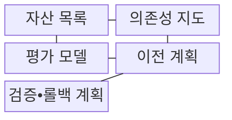
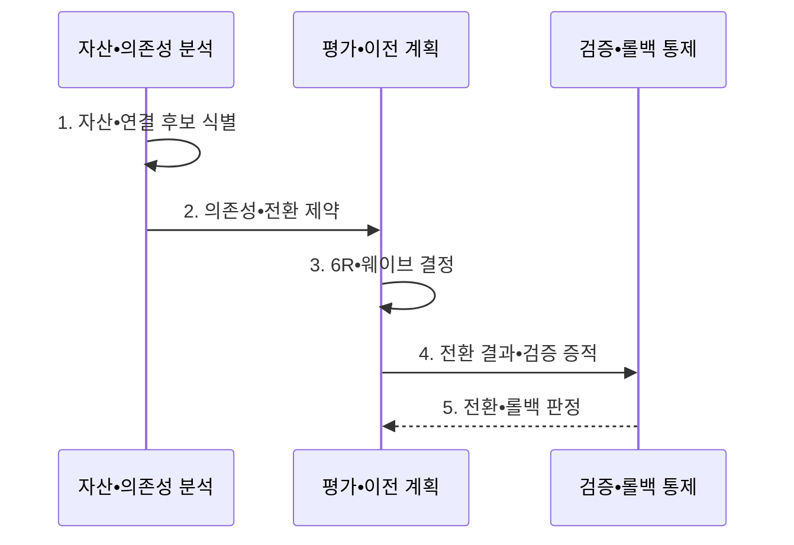

---
sidebar:
  order: 146
  label: "146. 클라우드 마이그레이션 6R (Cloud Migration 6R)"
  badge:
    text: "기출 • 70%"
    variant: note
title: "클라우드 마이그레이션 6R (Cloud Migration 6R)"
date: "2026-08-03T09:14:20+09:00"
tags: ["notes-software"]
weight: 146
extra:
  question_no: "146"
  source_status: "기출"
  source_history: "138회"
  priority: 70
  priority_note: "이전 방식 선택과 단계별 위험 통제가 최근 출제됨"
---

## Ⅰ. 개요

핵심 용어

- **6R 전략**: 워크로드의 가치•기술 상태•기한•제약에 따라 이전 또는 잔존 방식을 정하는 분류이다.
- **클라우드 마이그레이션 6R(Cloud Migration 6R)**: 재호스팅•재플랫폼화•재구매•재설계•유지•폐기 중 워크로드별 이전 또는 잔존 방식을 선택하는 분류 체계이다.

- 정의/개념: 워크로드의 업무 가치•기술 상태•이전 제약에 따라 이전•현대화•잔존 방식을 선택하는 **클라우드 마이그레이션 6R(Cloud Migration 6R)** 포트폴리오 분류 체계
- 배경/필요성: 일괄 이전은 저가치 자산의 **과잉 변경•기술 부채** 잔존

#### 한줄 요약

- 이삿짐마다 그대로 옮길지, 수리하거나 새로 살지, 창고에 남기거나 버릴지를 정하듯 워크로드별 목표와 제약에 맞춰 이전 전략을 나눈다.

## Ⅱ. 특징

핵심 용어

- **의존성 웨이브**: 호출•데이터 관계로 분리하기 어려운 시스템을 같은 이전 묶음으로 구성하는 방식이다.
- **포트폴리오 판단**: 개별 시스템이 아니라 전체 자산의 업무 가치•기술 상태•비용을 함께 비교해 전략을 정하는 방식이다.
- **이전 기간•현대화 편익**: 변경 범위가 커질수록 늘어나는 전환 소요 시간과 장기 운영 개선 효과이다.

- 업무 가치•기술 상태를 함께 보는 **포트폴리오 판단**
- 변경 범위 확대에 따른 **이전 기간•현대화 편익** 증가
- 호출•데이터 관계를 보존하는 **의존성 웨이브**

#### 한줄 요약

- 급히 비워야 할 짐은 그대로 옮기고 오래 쓸 설비는 고쳐 옮기되, 전원선으로 연결된 장비처럼 함께 움직여야 할 시스템은 같은 웨이브로 묶는다.

## Ⅲ. 구조 및 구성요소

핵심 용어

- **검증•롤백 계획**: 전환 성공•중단•원 환경 복귀의 판정 조건을 정하는 구성요소이다.
- **자산 목록**: 시스템별 소유자•가치•비용•수명 정보를 정리한 구성요소이다.
- **의존성 지도**: 시스템 사이 호출•데이터•신원 연결 관계를 나타낸 구성요소이다.
- **평가 모델**: 가치•기술 상태•중단 제약을 6R 선택 기준으로 평가하는 구성요소이다.
- **이전 계획**: 전략별 전환 웨이브와 선후 관계를 관리하는 구성요소이다.

| 구성요소 | 책임 |
|:---|:---|
| 자산 목록 | 시스템별 **가치•비용•수명** 식별 |
| 의존성 지도 | 호출•데이터•신원의 **연결 관계** 식별 |
| 평가 모델 | 가치•기술 상태•중단의 **6R 기준** |
| 이전 계획 | 전략별 **웨이브•선후 관계** 관리 |
| 검증•롤백 계획 | 성공•중단•복귀의 **판정 조건** |

#### 한줄 요약

- 자산 목록과 연결 지도를 평가표에 겹쳐 본 뒤, 각 시스템의 처리 방법과 함께 움직일 웨이브를 정하고 실패하면 돌아올 조건까지 붙인다.

## Ⅳ. 흐름도

핵심 용어

- **5. 전환•롤백 판정**: 검증 기준을 통과하면 전환하고 위반하면 이전 환경으로 복귀하는 단계이다.
- **1. 자산•연결 후보 식별**: 소유자•수명•비용과 조사할 의존 관계 범위를 확정하는 단계이다.
- **2. 의존성•전환 제약**: 호출•데이터 관계와 허용 중단 시간으로 분리 가능성을 판정하는 단계이다.
- **3. 6R•웨이브 결정**: 자산별 이전•잔존 전략과 함께 전환할 시스템 묶음을 확정하는 단계이다.
- **4. 전환 결과•검증 증적**: 기능•성능•데이터 정합성을 성공 기준과 대조한 기록이다.

**동작 원리**

1. **자산•연결 후보**: 소유자•수명•비용과 조사할 관계 범위 확정
2. **의존성•전환 제약**: 호출•데이터•중단 한도로 분리 가능성 판정
3. **6R•웨이브 결정**: 자산별 전략과 함께 전환할 묶음 확정
4. **전환 결과•검증 증적**: 기능•데이터 정합성과 성공 기준 대조
5. **전환•롤백 판정**: 기준 통과 시 전환, 위반 시 원 환경 복귀

#### 한줄 요약

- 연결된 장비를 한 차량에 묶고 도착지에서 작동과 자료를 확인한 뒤, 검사표를 통과하면 사용처를 바꾸고 실패하면 원래 장소로 돌린다.

## Ⅴ. 종류 및 비교

핵심 용어

- **재플랫폼화**: 코드 변경은 제한하면서 일부 실행 플랫폼을 관리형 서비스로 전환하는 전략이다.
- **재호스팅(Rehosting)**: 애플리케이션 구조는 유지하고 실행 인프라만 클라우드로 이전하는 전략이다.
- **재구매(Repurchasing)**: 기존 시스템을 서비스형 소프트웨어나 새 제품으로 대체하는 전략이다.
- **재설계(Refactoring)**: 장기 현대화를 위해 애플리케이션 구조와 코드를 클라우드 방식으로 변경하는 전략이다.
- **유지(Retaining)•폐기(Retiring)**: 제약 때문에 기존 환경에 남기거나 가치가 낮은 시스템의 사용을 종료하는 잔존 전략이다.

| 이전•현대화 전략 | 재호스팅 | 재플랫폼화 | 재구매 | 재설계 |
|:---|:---|:---|:---|:---|
| 적용 기준 | **철수 기한** 우선 | **운영 개선** 병행 | **표준 업무** 대체 | **장기 현대화** 우선 |
| 핵심 특징 | 구조 유지•**인프라 이전** | 일부 **관리형 전환** | **서비스형 소프트웨어•새 제품** 대체 | 구조•코드 **재설계** |
| 한계 | **기술 부채** 잔존 | 기존•관리형 **혼합 제약** | 기능•데이터 **전환 비용** | 기간•비용의 **실패 위험** |

| 잔존 전략 | 유지 | 폐기 |
|:---|:---|:---|
| 적용 기준 | 규제•의존성의 **이전 제약** | 저가치•중복 **시스템 종료** |
| 핵심 특징 | **기존 환경** 운영 지속 | 서비스•자원의 **사용 중단** |
| 한계 | 환경별 **이중 운영** | 의존성•보존 의무 **누락 위험** |

#### 한줄 요약

- 이사 기한이 급하면 그대로 옮기고 장기 가치가 크면 고쳐 옮기며, 규제 때문에 못 옮기면 남기고 쓰지 않는 시스템은 연결 관계를 확인한 뒤 종료한다.

## Ⅵ. 실무 고려사항 및 대책

핵심 용어

- **의존성**: 교차 호출 때문에 시스템을 따로 이전하기 어려워 같은 웨이브로 묶어야 하는 관계이다.
- **숨은 자산**: 비용이나 실제 호출에는 존재하지만 공식 자산 목록에서 빠진 시스템•자원이다.
- **데이터 대사**: 이전 전후 데이터의 건수•키•합계•내용을 비교해 누락과 충돌을 확인하는 검증이다.
- **폐기 승인**: 성공 기준과 안정화 기간을 충족한 뒤 원 환경 종료를 공식 허용하는 통제이다.

| 문제 | 대책 | 효과 |
|:---|:---|:---|
| 비용에는 있으나 목록에 없는 **숨은 자산** | 자동 발견•인터뷰•**비용 대사** | **자산 누락 감소** |
| 교차 호출로 분리하기 힘든 **의존성** | **의존 그래프 기반 웨이브** 구성 | 전환 뒤 **연결 단절 방지** |
| 기한만 보고 반복하는 **재호스팅** | 목표 상태•편익•부채의 **재평가** | 장기 **기술 부채 감소** |
| 전환 중 변경되는 **업무 데이터** | 초기•증분 복제 뒤 **데이터 대사** | **누락•충돌 감소** |
| 안정화 전 **원 환경 종료** | 성공 기준 충족 뒤 **폐기 승인** | **롤백 경로 보존** |

#### 한줄 요약

- 창고 목록과 전원선 지도를 함께 확인하고 연결된 장비를 같은 차량에 싣듯, 숨은 자산과 의존성을 찾은 뒤 성공 기준을 통과한 시스템만 원 환경에서 내린다.

## Ⅶ. 결론

핵심 용어

- **이전 웨이브**: 호출•데이터 의존 관계를 기준으로 함께 전환할 워크로드 묶음이다.

- 가치•기한으로 **6R 전략**, 의존 관계로 **이전 웨이브** 결정

#### 한줄 요약

- 이사 기한과 장기 사용 가치를 함께 보고 짐마다 옮길 방법을 고른 뒤, 서로 연결된 장비는 같은 웨이브로 묶는다.
