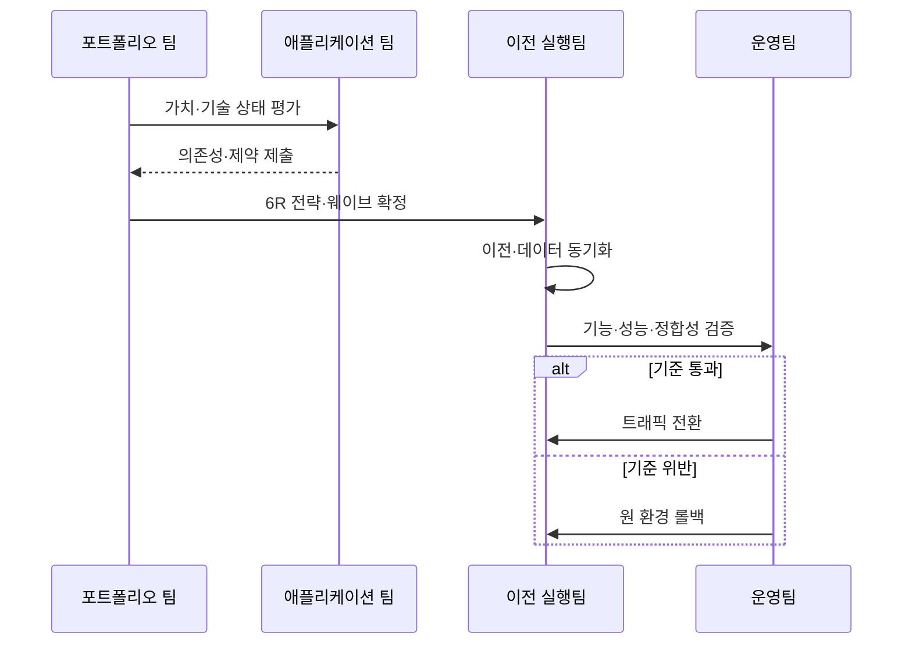

---
sidebar:
  order: 146
  label: "146. 클라우드 마이그레이션 6R (Cloud Migration 6R)"
  badge:
    text: "기출 · 70%"
    variant: note
title: "클라우드 마이그레이션 6R (Cloud Migration 6R)"
date: "2026-07-27T23:59:59+09:00"
tags: ["notes-software"]
weight: 146
extra:
  question_no: "146"
  source_status: "기출"
  source_history: "138회"
  priority: 70
  priority_note: "이전 방식 선택과 단계별 위험 통제가 최근 출제됨"
---

## 미리 알고가기

- **6R**: ‘식스 알’로 읽고 여섯 전략의 영문 이름이 R로 시작해 개수를 붙인 분류이며, 재호스팅·재플랫폼화·재구매·재설계·유지·폐기를 포함함
- **재호스팅(Rehost)**: 다시를 뜻하는 Re-와 Host를 결합한 명칭이며, 애플리케이션 구조를 유지하고 실행 인프라만 이전함
- **재플랫폼화(Replatform)**: Re-와 Platform을 결합한 명칭이며, 코드 변경을 줄이고 일부 플랫폼을 관리형 서비스로 전환함
- **재구매(Repurchase)**: Re-와 Purchase를 결합한 명칭이며, 기존 제품을 다른 상용·서비스형 소프트웨어로 대체함
- **재설계(Refactor)**: 구조·코드를 클라우드 특성에 맞게 재구성하는 전략
- **유지(Retain)**: 규제·의존성·투자 시점 때문에 기존 환경에 남기는 전략
- **폐기(Retire)**: 업무 가치가 없거나 중복된 시스템을 종료하는 전략
- **이전 웨이브(Migration Wave)**: 의존성과 전환 시간대를 기준으로 함께 이전할 애플리케이션 묶음
- **클라우드 네이티브(Cloud Native)**: 탄력 확장·자동화·관리형 서비스를 활용하도록 설계한 실행 방식
- **롤백(Rollback)**: 이전 실패 시 트래픽·데이터·실행 환경을 이전 상태로 되돌리는 조치

## Ⅰ. 개요

- 정의/개념: 업무 가치·기술 제약별 **클라우드 이전 전략 분류**
- 기존 한계: 일괄 이전 방식의 **과도한 변경·비용·중단 위험**

### 쉽게 이해하기 (학습용)

- 모든 짐을 같은 방식으로 옮기지 않고 가치와 상태에 따라 그대로 이동·수리·교체·보관·폐기하는 분류표다.

## Ⅱ. 특징

- 업무 가치·기술 상태의 **포트폴리오 평가**
- 전략별 **변경 범위·효과·위험 절충**
- 의존성 기반의 **이전 웨이브·롤백 설계**

### 쉽게 이해하기 (학습용)

- 빠른 이전과 장기 개선 중 우선순위를 정하고 서로 연결된 시스템을 같은 전환 묶음으로 계획한다.

## Ⅲ. 아키텍처 및 구성요소

| 구성요소 | 책임 |
|:---|:---|
| 자산 목록 | 시스템의 **소유자·비용·수명** 식별 |
| 의존성 지도 | **호출·데이터·운영 연결** 식별 |
| 평가 기준 | 가치·위험·**클라우드 적합성** 평가 |
| 6R 결정 기록 | 전략 선택의 **근거·목표** 보존 |
| 이전 웨이브 | 의존 시스템의 **전환 순서·범위** 구성 |
| 검증·롤백 계획 | 정합성 확인과 **복귀 조건** 정의 |

> 요약: 자산·의존성 평가가 전략과 이전 순서를 결정

### 쉽게 이해하기 (학습용)

- 물건 목록과 연결 관계를 확인해 처리 방법을 정하고 함께 움직여야 할 짐과 되돌릴 조건을 묶는다.

## Ⅳ. 원리 및 절차 흐름

| 절차 | 설명 |
|:---|:---|
| 상태 평가 | 업무 가치·**기술 부채 측정** |
| 의존성 확인 | 선후 관계·**동시 전환 범위** 도출 |
| 전략·웨이브 확정 | 시스템별 **6R·순서 결정** |
| 이전·동기화 | 인프라·코드·**데이터 이동** |
| 검증 | 기능·성능·**데이터 정합성 확인** |
| 전환·롤백 | 통과 시 전환, 실패 시 **원 환경 복귀** |

> 요약: 전략별 이전 후 정합성을 검증해 전환 또는 롤백

### 쉽게 이해하기 (학습용)

- 처리 방법과 순서를 정해 옮긴 뒤 새 장소의 기능과 자료를 확인하고 문제가 있으면 원래 장소로 돌아간다.

## Ⅴ. 종류 및 비교

| 6R 전략 | 재호스팅 | 재플랫폼화 | 재구매 | 재설계 | 유지 | 폐기 |
|:---|:---|:---|:---|:---|:---|:---|
| 적용 기준 | 신속 이전·**변경 최소화** | 일부 관리형 **운영 개선** | 표준 업무·**제품 대체 가능** | 전략 시스템·**민첩성 확보** | 규제·의존성·**시기 제약** | 저가치·**중복 기능** |
| 핵심 특징 | 구조 유지·**인프라 이동** | 플랫폼 일부 **관리형 전환** | 기존 제품의 **SaaS 대체** | 구조·코드의 **클라우드 재구성** | 기존 환경의 **운영 지속** | 서비스·데이터의 **종료·보존** |
| 한계 | 기술 부채·**운영 방식 잔존** | 혼합 구조·**제약 증가** | 기능 차이·**전환 종속성** | 기간·비용·**변경 위험 최대** | 혁신 지연·**이중 운영 비용** | 규정 보존·**의존 기능 영향** |

> 요약: 가치·변경 허용 범위·목표 효과로 6R 전략 선택

### 쉽게 이해하기 (학습용)

- 빨리 옮길지, 일부 고칠지, 제품을 바꿀지, 새로 설계할지, 남길지, 없앨지를 시스템마다 선택한다.

## Ⅵ. 실무 사례

1. 단기 데이터센터 철수는 **재호스팅**으로 우선 이전
2. 핵심 주문 서비스는 **재설계**로 탄력 확장 적용

### 쉽게 이해하기 (학습용)

- 철수 기한이 급한 서버는 구조를 유지해 옮기고 장기 경쟁력이 필요한 주문 시스템은 단계적으로 재구성한다.

## Ⅶ. 결론

- 긴급 이전은 **재호스팅**, 운영 개선은 **재플랫폼화**, 전략 혁신은 **재설계**

### 쉽게 이해하기 (학습용)

- 이전 속도와 장기 효과 중 무엇이 중요한지에 따라 변경 범위를 선택한다.
