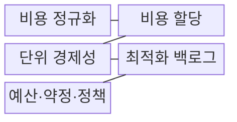
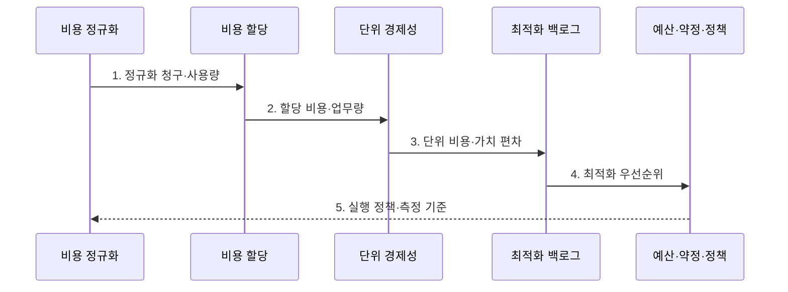

---
sidebar:
  order: 147
  label: "147. FinOps 클라우드 비용 최적화 (FinOps)"
  badge:
    text: "기출 · 70%"
    variant: note
title: "FinOps 클라우드 비용 최적화 (FinOps)"
date: "2026-08-02T12:00:00+09:00"
tags: ["notes-software"]
weight: 147
extra:
  question_no: "147"
  source_status: "기출"
  source_history: "123회, 135회"
  priority: 70
  priority_note: "비용 가시화·최적화·운영 순환이 반복 출제됨"
---

## Ⅰ. 개요

핵심 용어

- **클라우드 비용·가치**: 기술·재무·업무 조직이 비용을 사업 성과와 연결해 공동 관리하는 대상이다.

- 정의/개념: 기술·재무·업무 조직이 **클라우드 비용·가치**를 공동 관리하는 운영 체계
- 배경/필요성: 종량 지출은 소유자·업무 성과 미연결 시 **낭비 판단 불가**

### 쉽게 이해하기 (학습용)

- 공동 수도 계량기만 보고 물을 줄이지 않고 가구별 사용량과 생산량을 함께 보듯, 비용 소유자와 업무 성과를 연결해 낭비와 투자 가치를 구분한다.

## Ⅱ. 특징

핵심 용어

- **단위 경제성**: 사용자·거래·매출 같은 업무 단위당 클라우드 비용과 가치를 연결한 지표이다.

- 조직·제품에 지출을 귀속하는 **비용 할당**
- 업무 단위당 비용·가치를 잇는 **단위 경제성**
- 정보 제공·최적화·운영의 **반복 순환**

### 쉽게 이해하기 (학습용)

- 전기 사용량, 요금제, 기계 구조를 차례로 바꾸듯 자원 사용량을 줄이고 안정 수요의 단가를 낮춘 뒤 처리 구조까지 반복해서 개선한다.

## Ⅲ. 구조 및 구성요소

핵심 용어

- **최적화 백로그**: 절감액·실행 노력·서비스 위험으로 개선 후보의 우선순위를 관리하는 구성요소이다.

| 구성요소 | 책임 |
|:---|:---|
| 비용 정규화 | 청구·통화·기간의 **비용 단위** 통일 |
| 비용 할당 | 태그·계정으로 **조직·제품 비용** 귀속 |
| 단위 경제성 | 업무량·수익과 **단위 비용** 연결 |
| 최적화 백로그 | 절감액·노력·**서비스 위험** 우선순위 |
| 예산·약정·정책 | 예측·이상·**약정 적용률** 관리 |

### 쉽게 이해하기 (학습용)

- 여러 가게의 영수증 단위를 맞춰 상품별로 나눈 뒤 판매 한 건당 원가를 계산하고, 개선 순서와 예산 규칙을 한 장부에 연결한다.

## Ⅳ. 흐름도

핵심 용어

- **4. 최적화 우선순위**: 절감 효과와 실행 노력 및 서비스 위험을 비교해 작업 순서를 정한 결과이다.

**동작 원리**

1. **정규화 청구·사용량**: 공급자별 가격·기간·사용 단위 통일
2. **할당 비용·업무량**: 공유 비용을 조직·제품의 업무량에 귀속
3. **단위 비용·가치 편차**: 기준선 대비 낭비와 투자 후보 식별
4. **최적화 우선순위**: 절감액·노력·서비스 위험으로 실행 순서 결정
5. **실행 정책·측정 기준**: 예산·약정·자동화 범위와 재측정 확정

### 쉽게 이해하기 (학습용)

- 영수증을 팀과 상품에 나눠 판매 한 건당 원가를 계산하고, 절감액과 서비스 위험을 비교해 고칠 순서를 정한 뒤 같은 기준으로 다시 측정한다.

## Ⅴ. 종류 및 비교

핵심 용어

- **요율 최적화**: 안정적인 사용량에 약정·예약 할인을 적용해 동일 수요의 단가를 낮추는 방식이다.

| FinOps 최적화 방식 | 사용량 최적화 | 요율 최적화 | 아키텍처 최적화 |
|:---|:---|:---|:---|
| 적용 기준 | **유휴·과대 용량** 존재 | **안정 수요**의 단가 절감 | **처리·저장 구조**가 비용 지배 |
| 핵심 특징 | 중지·**크기 조정**·자동 확장 | 약정·예약·**요율 할인** | 실행 방식·저장 계층·**캐시 재설계** |
| 한계 | 여유 축소에 따른 **성능 저하** | 수요 감소 시 **미사용 약정** | 개발비·복잡성·**새 종속성** |

### 쉽게 이해하기 (학습용)

- 빈 방을 먼저 없애고 계속 쓸 방은 장기 계약으로 단가를 낮추며, 방 배치 자체가 비싸면 건물 구조를 바꾸듯 세 최적화의 적용 순서와 비용이 다르다.

## Ⅵ. 실무 고려사항 및 대책

핵심 용어

- **단위 경제성**: 총액 감소가 업무량 감소 때문인지 실제 효율 개선인지 구분하게 하는 측정 기준이다.

| 문제 | 대책 | 효과 |
|:---|:---|:---|
| 공유 자원의 **비용 미할당** | 태그·계정별 **배분 규칙**과 미할당률 관리 | 조직별 **비용 책임 식별** |
| 총액 절감이 숨기는 **업무량 감소** | 거래·사용자별 **단위 경제성** 측정 | 가치 없는 **절감 오판 방지** |
| 평균 사용량 기준의 **크기 조정** | 백분위·계절성·**여유 용량** 반영 | 피크 구간의 **성능 저하 방지** |
| 변동 수요보다 큰 **약정 구매** | 기준선·분산 만기·**사용률** 관리 | **미사용 약정 감소** |

### 쉽게 이해하기 (학습용)

- 밤에 빈 사무실 전기를 끈 뒤 업무가 느려지지 않았는지 확인하고, 장기 계약은 매일 쓰는 최소 전력만큼만 사듯 단위 비용과 안정 수요를 함께 본다.

## Ⅶ. 결론

핵심 용어

- **단위 경제성·서비스 영향**: 클라우드 비용 절감이 사업 가치와 성능을 훼손하지 않는지 함께 판단하는 기준이다.

- **단위 경제성·서비스 영향**으로 사용량 개선 후 안정 수요만 약정

### 쉽게 이해하기 (학습용)

- 매출이 줄어 전기료만 내려간 경우를 절감으로 보지 않고, 주문 한 건당 비용과 서비스 속도를 확인한 뒤 매일 쓰는 양만 장기 계약한다.
