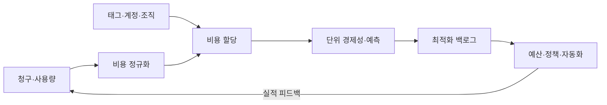
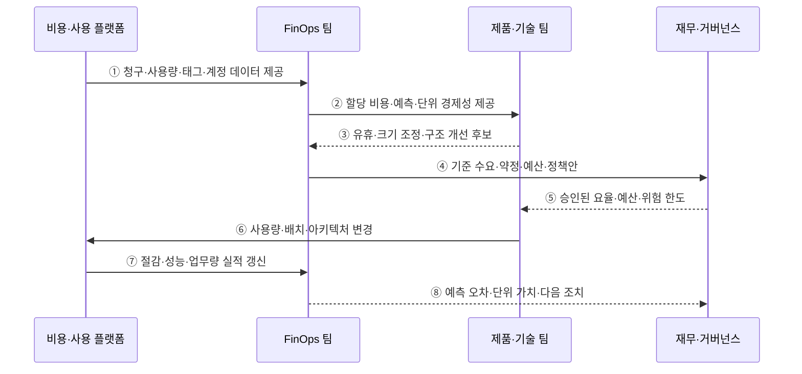

---
sidebar:
  order: 147
  label: "147. FinOps 클라우드 비용 최적화 (FinOps)"
  badge:
    text: "기출 · 70%"
    variant: note
title: "FinOps 클라우드 비용 최적화 (FinOps)"
date: "2026-07-27T23:59:59+09:00"
tags: ["notes-software"]
weight: 147
extra:
  question_no: "147"
  source_status: "기출"
  source_history: "123회, 135회"
  priority: 70
  priority_note: "비용 가시화·최적화·운영 순환이 반복 출제됨"
---

## 미리 알고가기

- **FinOps**: ‘핀옵스’로 읽고 Finance와 DevOps를 결합한 명칭이며, 기술·재무·업무 조직이 클라우드 비용과 사업 가치를 공동 관리하는 운영 체계
- **비용 할당(Cost Allocation)**: 태그·계정·조직 정보로 공용 비용을 책임 조직·제품에 귀속하는 활동
- **단위 경제성(Unit Economics)**: 사용자·거래·매출 같은 업무 단위당 비용과 가치를 연결한 지표
- **크기 조정(Rightsizing)**: 실제 사용량에 맞춰 자원의 종류·용량을 변경하는 최적화
- **요율 최적화(Rate Optimization)**: 약정·할인 구매로 같은 사용량의 단가를 낮추는 활동
- **쇼백·차지백(Showback·Chargeback)**: 조직별 비용을 알리거나 실제 내부 비용으로 부과하는 방식
- **약정 적용률(Coverage)**: 할인 약정이 전체 대상 사용량에 적용된 비율
- **약정 사용률(Utilization)**: 구매한 할인 약정 중 실제 사용한 비율
- **정보 제공·최적화·운영(Inform·Optimize·Operate)**: 비용을 이해하고 개선한 뒤 정책·자동화로 반복 운영하는 FinOps 순환

## Ⅰ. 개요

- FinOps는 기술·재무·업무 조직이 클라우드 사용량·비용·사업 가치를 같은 데이터로 보고 속도·품질·비용을 함께 판단하는 운영 체계이다.
- 중앙 청구서만으로는 누가 왜 얼마를 썼고 어떤 성과를 냈는지 알기 어려운 문제를 비용 할당·단위 경제성·공동 책임으로 해결한다.

### 쉽게 이해하기 (학습용)

- 지출만 자르지 않고 누가 어떤 성과를 위해 얼마를 쓰는지 보고 함께 개선한다.

## Ⅱ. 특징

- **비용 가시성과 할당**: 청구·사용·태그·계정 정보를 조직·제품·환경·소유자에 귀속한다.
- **단위 경제성**: 총액을 사용자·주문·추론·매출 같은 업무 단위당 비용과 가치로 바꿔 본다.
- **분산 의사결정**: 재무는 예측·요율, 기술은 사용량·구조, 제품은 성과·우선순위를 공동 책임진다.
- **다층 최적화**: 낭비 사용량을 줄이고 안정 수요의 요율을 낮춘 뒤 비싼 구조 자체를 개선한다.
- **지속 운영**: 예산·예측·이상 탐지·정책·자동화·성과 검증을 반복하며 일회성 절감으로 끝내지 않는다.

### 쉽게 이해하기 (학습용)

- 쓰는 양을 줄일지 단가를 낮출지 구분하고 주문 한 건당 비용과 가치를 본다.

## Ⅲ. 아키텍처 및 구성요소

**도표안 A — 구조도**

**도표안 B — sequenceDiagram**

| 구성요소 | 책임 |
|:---|:---|
| 비용 정규화 | 공급자별 청구 항목·통화·기간·사용 단위 통일 |
| 비용 할당 | 직접 태그·계정·공유 비용 규칙으로 조직·제품 귀속 |
| 단위 경제성 | 업무량·수익·품질과 비용을 연결해 단위당 가치 측정 |
| 최적화 백로그 | 절감 잠재량·노력·성능·가용성 위험으로 우선순위화 |
| 예산·예측·정책 | 계획 대비 지출·이상·한도를 알림·승인·자동화 |
| 약정 포트폴리오 | 기준 수요·Coverage·Utilization·만기로 요율 위험 관리 |

**동작 원리**

- ① 비용·사용 플랫폼이 공급자 청구·자원 사용량·태그·계정·가격 정보를 FinOps 팀에 제공한다.
- ② FinOps 팀이 공유 비용을 규칙으로 배분하고 예측·조직별 비용·업무 단위당 비용을 제품·기술 팀에 제공한다.
- ③ 제품·기술 팀이 성능과 SLO를 고려해 유휴 제거·Rightsizing·스케줄링·아키텍처 개선 후보를 제출한다.
- ④ FinOps 팀이 최적화 후 안정적인 기준 수요로 약정 규모·예산·이상 비용 정책을 재무·거버넌스에 제안한다.
- ⑤ 재무·거버넌스가 승인한 할인 요율·예산·서비스 위험 한도를 제품·기술 팀에 전달한다.
- ⑥ 제품·기술 팀이 승인 범위에서 자원 사용량·배치·저장 계층·아키텍처를 변경한다.
- ⑦ 비용 플랫폼이 변경 전후 비용·성능·가용성·업무량 실적을 같은 기준으로 갱신한다.
- ⑧ FinOps 팀이 절감액뿐 아니라 예측 오차·단위 경제성·약정 사용률·부작용을 보고하고 다음 조치를 정한다.

### 쉽게 이해하기 (학습용)

- 영수증을 팀과 상품에 나누고 낭비·단가·구조를 고친 뒤 성과당 비용이 실제 좋아졌는지 다시 잰다.

## Ⅳ. 종류 및 비교

| 비교 항목 | 사용량 최적화 | 요율 최적화 | 아키텍처 최적화 |
|:---|:---|:---|:---|
| 바꾸는 대상 | 자원 수량·용량·실행 시간 | 같은 사용량의 구매 단가 | 처리·저장·호출 방식과 시스템 구조 |
| 대표 방법 | 유휴 삭제·중지·Rightsizing·자동 확장 | 약정·예약·스팟·계약 할인 | 서버리스·계층화·캐시·데이터 이동 축소 |
| 선행 조건 | 사용·성능·SLO 관찰 | 최적화 후 안정 기준 수요·예측 | 단위 경제성과 변경 편익·기술 역량 |
| 주요 위험 | 성능·가용성 저하·재증설 | 미사용 약정·수요 변화·집중 위험 | 개발비·복잡성·새로운 종속 |

> 과대 사용량에 약정을 먼저 걸면 낭비를 장기 구매하므로 사용량을 조정한 뒤 안정적인 기준선에 요율 최적화를 적용한다.

### 쉽게 이해하기 (학습용)

- 낭비를 먼저 없애고 계속 쓸 양의 단가를 낮춘 뒤 비싼 구조를 바꾼다.

## Ⅴ. 실무 고려사항 및 대책

| 고려사항 | 위험 | 대책 |
|:---|:---|:---|
| 할당 | 미태그·공유 비용으로 책임 왜곡 | 태그 정책·계정 구조·공유 배분 근거·미할당률 |
| 단위 지표 | 총액 절감이 성장·품질 저하로 오판 | 업무량·수익·SLO와 단위 비용 동시 측정 |
| Rightsizing | 평균만 보고 피크 성능 훼손 | 백분위·계절성·Headroom·되돌리기 |
| 약정 | 과다 구매·Coverage만 높고 Utilization 낮음 | 기준선·분산 만기·사용률·재할당 |
| 자동 통제 | 비용 경보가 업무를 임의 중단 | 위험 등급·승인·예외·안전 중지 목록 |
| 조직 행동 | 중앙 절감팀과 제품팀 목표 충돌 | 공동 목표·Showback/Chargeback·절감 귀속 |

> **적용 사례**: 개발 환경을 야간 자동 중지하되 배치·장애 대응 예외를 두고 절감액과 개발 대기 시간·실패율을 함께 비교한다.

### 쉽게 이해하기 (학습용)

- 밤 서버를 끄되 개발이 느려지지 않았는지 보고, 성장기에는 총액보다 주문 한 건당 비용을 본다.

## Ⅵ. 결론

- FinOps의 핵심은 비용 최소화가 아니라 클라우드 지출을 업무 가치와 연결해 가장 나은 속도·품질·비용 결정을 반복하는 데 있다.
- 정확한 할당·단위 경제성·사용량 우선 최적화·안정 수요 약정·정책 자동화·공동 책임을 실적 피드백으로 운영해야 한다.

### 쉽게 이해하기 (학습용)

- 돈만 덜 썼는지보다 같은 비용으로 더 큰 업무 가치를 냈는지 확인한다.
