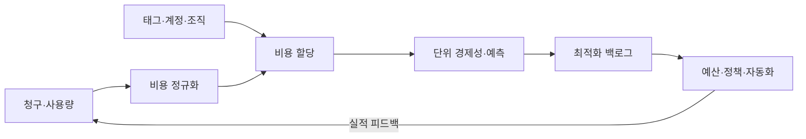
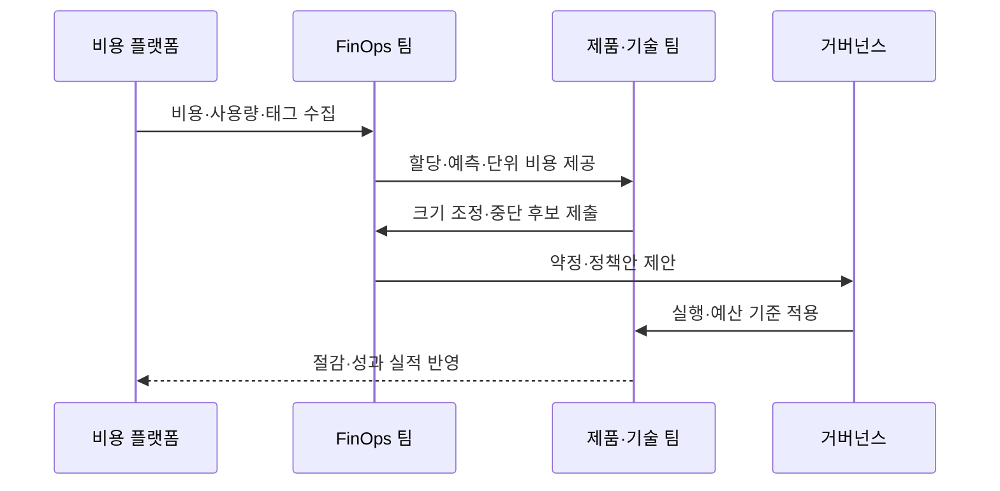

---
sidebar:
  order: 147
  label: "147. FinOps 클라우드 비용 최적화 (FinOps)"
  badge:
    text: "기출 · 70%"
    variant: note
title: "FinOps 클라우드 비용 최적화 (FinOps)"
date: "2026-07-27T23:59:59+09:00"
tags: ["notes-software"]
weight: 147
extra:
  question_no: "147"
  source_status: "기출"
  source_history: "123회, 135회"
  priority: 70
  priority_note: "비용 가시화·최적화·운영 순환이 반복 출제됨"
---

## 미리 알고가기

- **FinOps**: ‘핀옵스’로 읽고 Finance와 DevOps를 결합한 명칭이며, 기술·재무·업무 조직이 클라우드 비용과 사업 가치를 공동 관리하는 운영 체계
- **비용 할당(Cost Allocation)**: 태그·계정·조직 정보로 공용 비용을 책임 조직·제품에 귀속하는 활동
- **단위 경제성(Unit Economics)**: 사용자·거래·매출 같은 업무 단위당 비용과 가치를 연결한 지표
- **크기 조정(Rightsizing)**: 실제 사용량에 맞춰 자원의 종류·용량을 변경하는 최적화
- **요율 최적화(Rate Optimization)**: 약정·할인 구매로 같은 사용량의 단가를 낮추는 활동
- **쇼백·차지백(Showback·Chargeback)**: 조직별 비용을 알리거나 실제 내부 비용으로 부과하는 방식
- **약정 적용률(Coverage)**: 할인 약정이 전체 대상 사용량에 적용된 비율
- **약정 사용률(Utilization)**: 구매한 할인 약정 중 실제 사용한 비율
- **정보 제공·최적화·운영(Inform·Optimize·Operate)**: 비용을 이해하고 개선한 뒤 정책·자동화로 반복 운영하는 FinOps 순환

## Ⅰ. 개요

- 정의/개념: 클라우드 비용·사업 가치를 **공동 의사결정으로 최적화**
- 기존 한계: 중앙 청구서의 **비용 소유·사용 가치 불명확**

### 쉽게 이해하기 (학습용)

- 단순히 지출을 줄이지 않고 누가 어떤 성과를 위해 얼마를 쓰는지 보여 주고 함께 개선하는 방식이다.

## Ⅱ. 특징

- 비용의 **조직·제품별 가시성·책임**
- 사용량·요율의 **분리 최적화**
- 단위 경제성 기반의 **비용·가치 절충**

### 쉽게 이해하기 (학습용)

- 자원을 줄일지 할인 계약을 살지 구분하고 총액보다 주문 한 건 같은 업무 성과당 비용을 본다.

## Ⅲ. 아키텍처 및 구성요소

| 구성요소 | 책임 |
|:---|:---|
| 비용 정규화 | 공급자별 **항목·단위 통일** |
| 비용 할당 | 비용의 **조직·제품 귀속** |
| 단위 경제성 | 업무 성과당 **비용·가치 측정** |
| 최적화 백로그 | 효과·위험 기반 **개선 순위화** |
| 예산·정책·자동화 | 이상 비용의 **통제·반복 실행** |

> 요약: 비용을 책임 조직과 업무 가치에 연결해 개선을 반복

### 쉽게 이해하기 (학습용)

- 영수증 항목을 같은 기준으로 정리해 각 팀에 배분하고 성과당 비용이 나쁜 항목부터 개선한다.

## Ⅳ. 원리 및 절차 흐름

| 절차 | 설명 |
|:---|:---|
| 비용·사용량 수집 | 청구·자원의 **공통 데이터 구성** |
| 할당·단위 비용 제공 | 조직별 **비용·성과 가시화** |
| 사용량 최적화 | 유휴 제거·**용량 크기 조정** |
| 요율 최적화 | 기준 수요의 **약정 할인 적용** |
| 정책 운영 | 예산·이상 비용의 **자동 통제** |
| 실적 반영 | 절감과 업무 성과의 **재측정** |

> 요약: 정보 제공·최적화·운영을 실적 데이터로 반복

### 쉽게 이해하기 (학습용)

- 지출 원인을 보여 주고 낭비 자원과 단가를 개선한 뒤 결과를 다시 측정해 다음 결정을 내린다.

## Ⅴ. 종류 및 비교

| 최적화 방식 | 사용량 최적화 | 요율 최적화 | 아키텍처 최적화 |
|:---|:---|:---|:---|
| 적용 기준 | 유휴·과대 **자원 제거** | 안정 기준선의 **단가 절감** | 단위 비용의 **구조적 개선** |
| 핵심 특징 | 중지·삭제·**크기 조정** | 예약·약정·**스팟 조합** | 관리형·탄력형 **설계 전환** |
| 한계 | 성능 저하·**재증설 위험** | 미사용 약정·**수요 예측 오차** | 변경 비용·**운영 복잡성** |

> 요약: 사용량을 먼저 줄이고 기준 수요의 요율과 구조 개선

### 쉽게 이해하기 (학습용)

- 쓰지 않는 양을 먼저 없애고 계속 쓸 양의 단가를 낮춘 뒤 장기적으로 비싼 구조를 바꾼다.

## Ⅵ. 실무 사례

1. 개발 환경은 **야간 자동 중지**로 유휴 사용량 제거

### 쉽게 이해하기 (학습용)

- 밤에 쓰지 않는 서버는 끄고 전체 비용이 늘어도 주문 한 건당 비용이 개선되는지 함께 본다.

## Ⅶ. 결론

- 낭비는 **사용량**, 단가는 **요율**, 가치는 **단위 경제성**으로 관리

### 쉽게 이해하기 (학습용)

- 비용 절감만 목표로 삼지 말고 같은 업무 성과를 더 적은 자원으로 내는지 확인한다.
