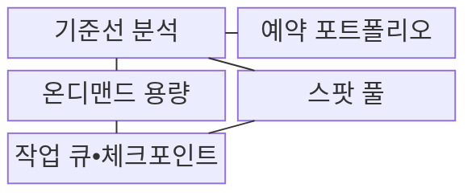
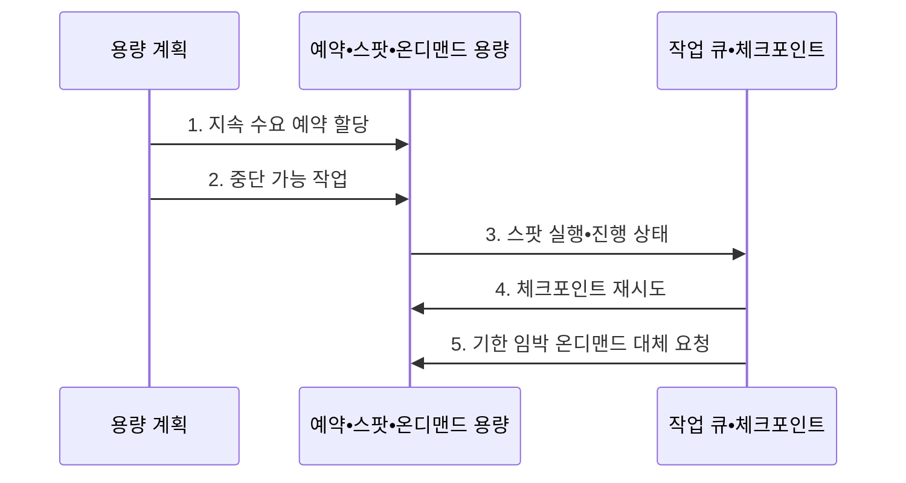

---
sidebar:
  order: 148
  label: "148. 예약 인스턴스•스팟 인스턴스 (Reserved Spot Instance)"
  badge:
    text: "기출 • 50%"
    variant: note
title: "예약 인스턴스•스팟 인스턴스 (Reserved Spot Instance)"
date: "2026-08-03T08:48:47+09:00"
tags: ["notes-software"]
weight: 148
extra:
  question_no: "148"
  source_status: "기출"
  source_history: "135회"
  priority: 50
  priority_note: "약정 할인과 중단 위험 비교가 비용 설계에 포함됨"
---

## Ⅰ. 개요

핵심 용어

- **예약 인스턴스(Reserved Instance)**: 예측 가능한 사용량을 일정 기간 약정해 온디맨드보다 낮은 단가를 적용받는 구매 방식이다.
- **스팟 인스턴스(Spot Instance)**: 공급자가 회수할 수 있는 여유 자원을 중단 위험을 수용하는 조건으로 할인받는 구매 방식이다.

- 정의/개념: 일정 사용량을 약정하거나 공급자의 자원 회수를 수용해 온디맨드보다 컴퓨팅 단가를 낮추는 **예약 인스턴스(Reserved Instance)•스팟 인스턴스(Spot Instance)** 구매 방식
- 배경/필요성: 온디맨드만 사용하면 지속 수요 비용과 **할인 기회 손실**

#### 한줄 요약

- 매일 타는 구간은 정기권을 사고 자리를 빼앗겨도 다음 차에서 이어 갈 일은 빈 좌석 표를 사듯, 수요 지속성과 중단 복구 가능성에 따라 구매 방식을 나눈다.

## Ⅱ. 특징

핵심 용어

- **스팟 용량**: 공급자가 회수할 수 있는 미사용 자원을 할인 요율로 제공하는 방식이다.
- **예약 할인**: 예측 가능한 기준 수요의 사용 기간•범위를 약정해 단가를 낮추는 방식이다.
- **온디맨드(On-Demand)**: 장기 약정이나 중단 조건 없이 필요한 시점에 기본 요율로 즉시 사용하는 방식이다.

- 기준 수요의 사용 기간을 약정하는 **예약 할인**
- 회수 가능한 여유 자원을 쓰는 **스팟 용량**
- 약정•중단 없이 변동분을 받는 **온디맨드**

#### 한줄 요약

- 매일 필요한 좌석은 정기권, 중간에 내릴 수 있는 작업은 빈 좌석 표, 갑자기 생긴 이동은 일반 표를 사듯 수요 성격마다 가격과 위험이 달라진다.

## Ⅲ. 구조 및 구성요소

핵심 용어

- **작업 큐•체크포인트**: 스팟 중단 시 작업을 다시 배정하고 마지막 진행 상태부터 재개하게 하는 구성요소이다.
- **기준선 분석**: 수요를 지속•변동•중단 허용 범위로 분리해 구매 모델을 정하는 구성요소이다.
- **예약 포트폴리오**: 약정 범위와 할인 적용률•실제 사용률을 관리하는 구성요소이다.
- **온디맨드 용량**: 급증 수요와 예측 오차를 약정 없이 처리하는 대체 용량이다.
- **스팟 풀**: 인스턴스 유형•가용 영역별 여유 자원을 묶어 탐색하는 구성요소이다.

| 구성요소 | 책임 |
|:---|:---|
| 기준선 분석 | 지속•변동•**중단 허용 수요** 분리 |
| 예약 포트폴리오 | 약정 범위•**적용률•사용률** 관리 |
| 온디맨드 용량 | 급증•예측 오차의 **대체 용량** |
| 스팟 풀 | 유형•영역별 **여유 용량** 탐색 |
| 작업 큐•체크포인트 | 재시도와 **진행 상태** 보존 |

#### 한줄 요약

- 수요 분석표가 매일 필요한 좌석은 예약 장부로, 중단 가능한 작업은 스팟 풀과 진행표로, 갑작스러운 작업은 온디맨드 좌석으로 연결한다.

## Ⅳ. 흐름도

핵심 용어

- **4. 체크포인트 재시도**: 회수된 작업을 저장된 진행 지점부터 다른 스팟 풀에서 다시 실행하는 단계이다.
- **1. 지속 수요 예약 할당**: 예측 가능한 최소 사용량만 예약 범위로 확정하는 단계이다.
- **2. 중단 가능 작업**: 기한 안에 재시도할 수 있고 상태를 외부에 보존한 작업을 스팟에 배정하는 단계이다.
- **3. 스팟 실행•진행 상태**: 실행 결과와 중단 후 복구할 지점을 외부 저장소에 기록하는 단계이다.
- **5. 기한 임박 온디맨드 대체 요청**: 남은 시간이 부족하면 작업을 온디맨드 용량으로 전환하는 단계이다.

**동작 원리**

1. **지속 수요 예약 할당**: 예측 가능한 최소 사용량만 예약 범위로 확정
2. **중단 가능 작업**: 기한 내 복구•상태 보존 작업의 스팟 배정
3. **스팟 실행•진행 상태**: 작업 결과와 복구 지점을 외부에 기록
4. **체크포인트 재시도**: 회수된 작업을 다른 스팟 풀에서 재개
5. **기한 임박 온디맨드 대체 요청**: 남은 시간 부족 시 온디맨드로 전환

#### 한줄 요약

- 빈 좌석에서 작업하다 자리를 돌려줘야 하면 바깥 장부에 적은 마지막 진행 지점부터 다른 좌석에서 이어 가고, 마감이 가까우면 일반 표로 바꾼다.

## Ⅴ. 종류 및 비교

핵심 용어

- **온디맨드**: 장기 약정 없이 신규•급증 수요를 기본 요율로 즉시 처리하는 구매 모델이다.
- **예약•약정 할인**: 예측 가능한 기준 수요의 사용 기간과 범위를 약정해 단가를 낮추는 모델이다.
- **스팟(Spot)**: 중단 복구가 가능한 작업에 회수 가능한 여유 자원을 할인 요율로 사용하는 모델이다.

| 컴퓨팅 구매 모델 | 예약•약정 할인 | 스팟 | 온디맨드 |
|:---|:---|:---|:---|
| 적용 기준 | 예측 가능한 **기준 수요** | **중단 복구 가능 작업** | 신규•급증 **변동 수요** |
| 핵심 특징 | 기간•범위의 **사용 약정** | 저가 여유 용량•**회수 가능** | **무약정** 기본 요율 |
| 한계 | 수요 감소 시 **미사용 약정** | 중단•부족에 따른 **작업 지연** | 높은 단가의 **비용 변동** |

#### 한줄 요약

- 매일 쓰는 좌석은 예약이 싸고, 자리를 잃어도 이어 갈 일은 스팟이 싸며, 갑작스러운 이동은 비싸더라도 온디맨드가 바로 대응한다.

## Ⅵ. 실무 고려사항 및 대책

핵심 용어

- **체크포인트**: 스팟 중단 뒤 전체 작업을 다시 하지 않도록 외부에 저장하는 진행 상태이다.
- **과대 기준선**: 일시적 피크를 지속 수요로 잘못 간주해 필요 이상으로 예약한 용량 기준이다.
- **만기 분산**: 약정 종료 시점을 나눠 수요•가격•기술 변화에 맞춰 구매량을 조정하는 방식이다.
- **다중 풀**: 동시 회수 위험을 줄이기 위해 여러 인스턴스 유형과 가용 영역의 스팟 자원을 함께 요청하는 방식이다.
- **시간 임계값**: 업무 마감 전에 스팟 재시도를 멈추고 온디맨드로 전환할 시점을 정한 기준이다.

| 문제 | 대책 | 효과 |
|:---|:---|:---|
| 피크를 기준으로 잡은 **과대 기준선** | 크기 조정 뒤 **계절•성장분 분리** | **미사용 약정 감소** |
| 한 시점에 몰린 **약정 만기** | 분할 구매•**만기 분산** | 수요•기술 변화의 **전환 여지 확보** |
| 내부 상태에 의존한 **스팟 작업** | 작업 분할•외부 **체크포인트** | 중단 뒤 **재처리량 감소** |
| 단일 유형의 **스팟 부족** | 유형•영역별 **다중 풀** 요청 | 동시 회수의 **작업 지연 완화** |
| 기한 임박 작업의 **재시도 지연** | 온디맨드 전환 **시간 임계값** | 업무 **마감 시각 준수** |

#### 한줄 요약

- 평균이 아니라 매일 유지되는 최소 좌석만 예약하고, 스팟 작업은 진행표를 밖에 보관하며 마감 시각 전에는 온디맨드로 넘어가도록 임계값을 둔다.

## Ⅶ. 결론

핵심 용어

- **지속 수요**: 예측 가능한 최소 사용량으로 예약 할인 구매에 적합한 수요이다.
- **복구 가능 작업**: 중단되어도 외부 체크포인트에서 재시작해 기한 안에 완료할 수 있는 스팟 적합 작업이다.
- **온디맨드(On-Demand)**: 약정 없이 갑작스러운 변동 수요를 즉시 처리하는 구매 방식이다.

- **지속 수요** 는 예약, **복구 가능 작업** 은 스팟, 변동분은 온디맨드

#### 한줄 요약

- 매일 필요한 좌석은 정기권으로 사고, 진행표를 들고 옮길 수 있는 일은 빈 좌석을 쓰며, 갑자기 늘어난 일은 일반 표로 처리한다.
