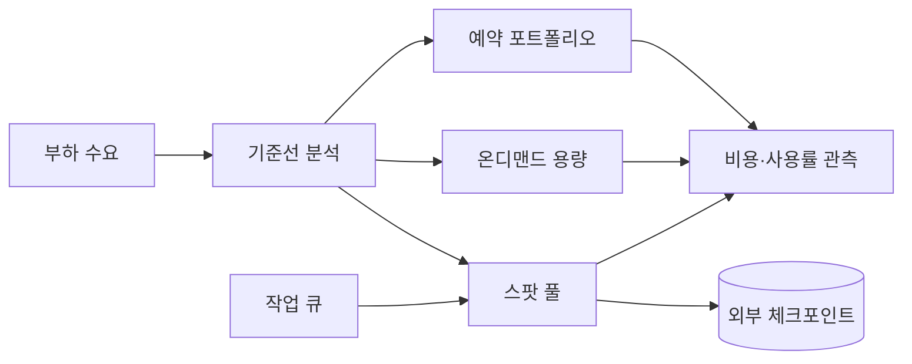
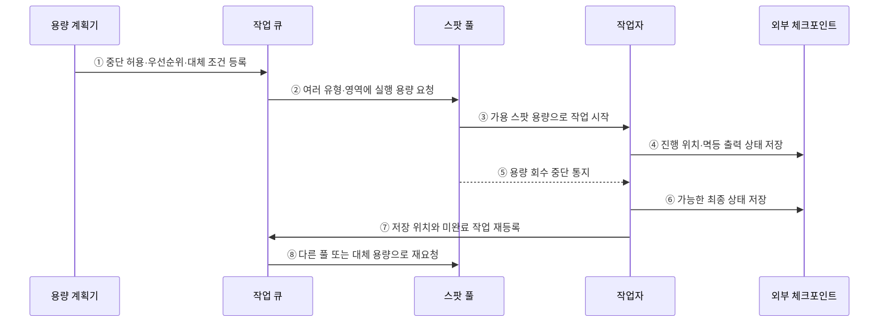

---
sidebar:
  order: 148
  label: "148. 예약 인스턴스·스팟 인스턴스 (Reserved Spot Instance)"
  badge:
    text: "기출 · 50%"
    variant: note
title: "예약 인스턴스·스팟 인스턴스 (Reserved Spot Instance)"
date: "2026-07-27T23:59:59+09:00"
tags: ["notes-software"]
weight: 148
extra:
  question_no: "148"
  source_status: "기출"
  source_history: "135회"
  priority: 50
  priority_note: "약정 할인과 중단 위험 비교가 비용 설계에 포함됨"
---

## 미리 알고가기

- **예약 인스턴스(Reserved Instance)**: 일정 기간·조건의 사용을 약정해 일치하는 인스턴스 사용량에 할인 요율을 적용하는 구매 모델
- **스팟 인스턴스(Spot Instance)**: 공급자의 미사용 컴퓨팅 용량을 할인 요율로 사용하되 공급자 회수로 중단될 수 있는 구매 모델
- **온디맨드(On-Demand)**: 장기 약정 없이 사용한 컴퓨팅 시간에 기본 요율을 지불하는 방식
- **예약 적용률(Coverage)**: 전체 대상 사용량 중 예약 할인으로 처리된 비율
- **예약 사용률(Utilization)**: 구매한 예약 범위 중 실제 사용된 비율
- **체크포인트(Checkpoint)**: 작업 진행 상태를 외부 저장소에 기록해 중단 후 이어서 처리하도록 만든 복구 지점
- **수요 기준선(Baseline Demand)**: 시간 변화와 무관하게 지속되는 최소 수요
- **스팟 풀(Spot Pool)**: 인스턴스 유형·가용 영역별로 구분된 대체 가능한 스팟 용량 집합
- **작업 큐(Work Queue)**: 처리할 작업을 저장하고 사용 가능한 실행 자원에 배분하는 구성요소

## Ⅰ. 개요

- 예약 할인·스팟 인스턴스는 각각 일정 사용량의 약정과 공급자 회수 가능성을 받아들이는 대신 온디맨드보다 컴퓨팅 단가를 낮추는 구매 방식이다.
- 지속 기준선·예측 불가 변동·중단 허용 작업을 구분해 예약·온디맨드·스팟을 조합하면 비용과 가용성 위험을 함께 조절할 수 있다.

### 쉽게 이해하기 (학습용)

- 계속 쓸 좌석은 장기권으로, 회수돼도 되는 작업은 남는 좌석으로 싸게 이용한다.

## Ⅱ. 특징

- **예약 할인**: 예측 가능한 기준 수요를 기간·범위에 맞춰 약정해 단가를 낮추지만 과다 약정은 미사용 비용을 만든다.
- **스팟 용량**: 공급자의 여유 용량을 낮은 단가로 쓰지만 회수·용량 부족·가격 변동 조건을 감수한다.
- **온디맨드 완충**: 약정 없이 즉시 늘리고 줄여 신규·급증·예측 오차를 처리하되 단가가 높다.
- **위험 분산**: 인스턴스 유형·가용 영역·스팟 풀을 다양화하고 온디맨드 대체 용량을 둔다.
- **중단 복구**: 작업 큐·외부 체크포인트·멱등 출력으로 회수된 작업을 다른 용량에서 이어서 실행한다.

### 쉽게 이해하기 (학습용)

- 계속 필요한 양, 중단돼도 되는 양, 갑자기 필요한 양을 다른 표로 산다.

## Ⅲ. 아키텍처 및 구성요소

**도표안 A — 구조도**

**도표안 B — sequenceDiagram**

| 구성요소 | 책임 |
|:---|:---|
| 기준선 분석 | 지속·변동·계절·중단 허용 수요 분리 |
| 예약 포트폴리오 | 약정 범위·기간·Coverage·Utilization·만기 관리 |
| 온디맨드 용량 | 신규·급증·예측 오차·스팟 부족의 탄력 처리 |
| 스팟 풀 | 대체 가능한 유형·영역의 저가 여유 용량 탐색 |
| 작업 큐·체크포인트 | 작업 소유권·재시도·진행 상태·멱등 출력 관리 |
| 비용·신뢰성 관측 | 단가·중단률·대기·재처리·완료 지연 측정 |

**동작 원리**

- ① 용량 계획기가 작업의 중단 허용성·우선순위·기한·대체 가능 조건을 작업 큐에 등록한다.
- ② 작업 큐가 단일 인스턴스에 고정하지 않고 여러 유형·가용 영역의 스팟 풀에 용량을 요청한다.
- ③ 스팟 풀이 현재 가용한 저가 용량에 작업자를 할당해 작업을 시작한다.
- ④ 작업자가 진행 위치와 이미 반영한 멱등 출력 상태를 외부 저장소에 주기적으로 기록한다.
- ⑤ 공급자가 용량을 회수할 때 스팟 풀이 가능한 범위의 중단 통지를 작업자에게 전달한다.
- ⑥ 작업자가 남은 시간에 처리 중 입력과 진행 상태를 외부 체크포인트에 저장한다.
- ⑦ 작업자가 체크포인트 위치와 미완료 작업을 큐에 다시 등록해 소유권을 반환한다.
- ⑧ 작업 큐가 다른 스팟 풀 또는 정책상 허용된 온디맨드 용량에 이어서 실행을 요청한다.

### 쉽게 이해하기 (학습용)

- 남는 좌석이 회수되면 바깥에 저장한 진행표를 들고 다른 좌석에서 이어서 일한다.

## Ⅳ. 종류 및 비교

| 비교 항목 | 예약·약정 할인 | 스팟 | 온디맨드 |
|:---|:---|:---|:---|
| 가격 조건 | 기간·범위·결제 조건의 사용 약정 | 여유 용량·회수 가능 조건 | 장기 약정 없는 기본 요율 |
| 용량 특성 | 할인과 용량 보장은 상품별로 별도 확인 | 공급자 상황에 따라 부족·회수 가능 | 요청 시 가용 용량 범위에서 사용 |
| 적합 부하 | 최적화 후 예측 가능한 기준 수요 | 체크포인트 가능한 배치·분산·무상태 작업 | 신규·급증·짧은 사용·대체 용량 |
| 주요 지표 | Coverage·Utilization·만기·절감 | 중단률·대기·재처리·완료 지연 | 사용 시간·피크·단위 비용 |
| 주요 위험 | 과다 약정·수요/기술 변화 | 중단 폭주·용량 부족·상태 손실 | 높은 단가·비용 변동 |

> “예약”이라는 이름이 항상 물리 용량 확보를 뜻하지 않으므로 할인 혜택과 용량 예약 기능을 상품별로 구분해야 한다.

### 쉽게 이해하기 (학습용)

- 고정량은 약정, 다시 할 수 있는 일은 스팟, 갑작스러운 양은 온디맨드가 기본이다.

## Ⅴ. 실무 고려사항 및 대책

| 고려사항 | 위험 | 대책 |
|:---|:---|:---|
| 기준선 | 피크·낭비까지 약정 | Rightsizing 후 백분위·계절·성장 기반 기준 |
| 약정 범위 | 기술·지역 변경으로 적용 불가 | 유연한 범위·분할 구매·만기 분산 |
| 스팟 적합성 | 상태ful·긴 작업이 중단 때 손실 | 작업 분할·외부 상태·멱등성·기한 판단 |
| 풀 다양화 | 단일 유형·영역의 동시 회수 | 요구 조건 완화·다중 풀·분산 배치 |
| 대체 용량 | 스팟 부족으로 기한·SLO 위반 | 온디맨드 상한·우선순위·대기 정책 |
| 절감 평가 | 표시 단가만 보고 재처리 비용 누락 | 중단·대기·재실행·운영 인력 포함 단위 비용 |

> **적용 사례**: 상시 웹 서비스의 최적화된 최소 수요만 약정하고, 이미지 변환은 외부 체크포인트와 여러 스팟 풀을 사용하며 기한이 임박하면 온디맨드로 전환한다.

### 쉽게 이해하기 (학습용)

- 늘 필요한 서버만 약정하고 다시 할 수 있는 변환 작업은 회수 가능한 싼 용량에 둔다.

## Ⅵ. 결론

- 예약·스팟·온디맨드 선택의 핵심은 가장 싼 표시 단가가 아니라 수요 지속성·예측 오차·중단 복구 능력에 위험을 맞추는 데 있다.
- 사용량을 먼저 최적화하고 기준선만 약정하며 스팟의 체크포인트·풀 다양화·대체 용량과 재처리 비용을 함께 설계해야 한다.

### 쉽게 이해하기 (학습용)

- 부하가 얼마나 계속되고 중단 뒤 얼마나 잘 이어지는지에 맞춰 표를 섞어 사야 한다.
