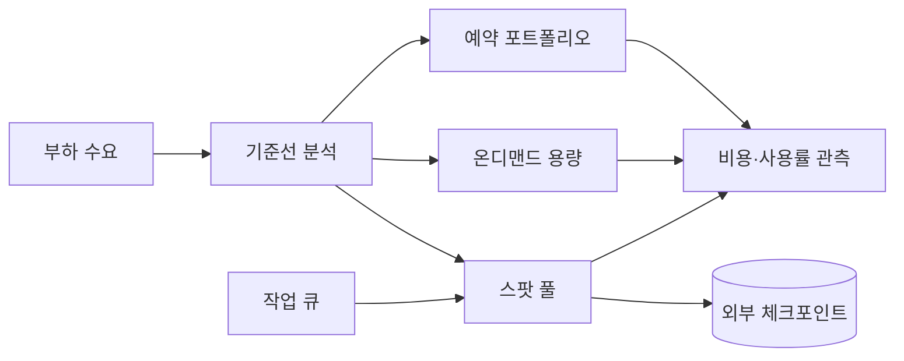
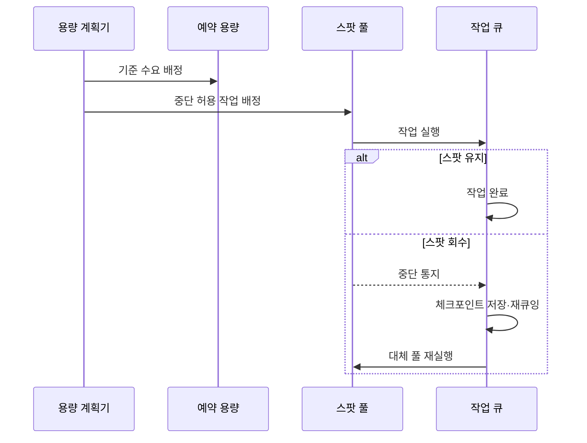

---
sidebar:
  order: 148
  label: "148. 예약 인스턴스·스팟 인스턴스 (Reserved Spot Instance)"
  badge:
    text: "기출 · 50%"
    variant: note
title: "예약 인스턴스·스팟 인스턴스 (Reserved Spot Instance)"
date: "2026-07-27T23:59:59+09:00"
tags: ["notes-software"]
weight: 148
extra:
  question_no: "148"
  source_status: "기출"
  source_history: "135회"
  priority: 50
  priority_note: "약정 할인과 중단 위험 비교가 비용 설계에 포함됨"
---

## 미리 알고가기

- **예약 인스턴스(Reserved Instance)**: 일정 기간·조건의 사용을 약정해 일치하는 인스턴스 사용량에 할인 요율을 적용하는 구매 모델
- **스팟 인스턴스(Spot Instance)**: 공급자의 미사용 컴퓨팅 용량을 할인 요율로 사용하되 공급자 회수로 중단될 수 있는 구매 모델
- **온디맨드(On-Demand)**: 장기 약정 없이 사용한 컴퓨팅 시간에 기본 요율을 지불하는 방식
- **예약 적용률(Coverage)**: 전체 대상 사용량 중 예약 할인으로 처리된 비율
- **예약 사용률(Utilization)**: 구매한 예약 범위 중 실제 사용된 비율
- **체크포인트(Checkpoint)**: 작업 진행 상태를 외부 저장소에 기록해 중단 후 이어서 처리하도록 만든 복구 지점
- **수요 기준선(Baseline Demand)**: 시간 변화와 무관하게 지속되는 최소 수요
- **스팟 풀(Spot Pool)**: 인스턴스 유형·가용 영역별로 구분된 대체 가능한 스팟 용량 집합
- **작업 큐(Work Queue)**: 처리할 작업을 저장하고 사용 가능한 실행 자원에 배분하는 구성요소

## Ⅰ. 개요

- 정의/개념: 사용 약정·중단 허용을 조건으로 **컴퓨팅 단가 절감**
- 기존 한계: 온디맨드 단일 구매의 **지속 부하 비용 증가**

### 쉽게 이해하기 (학습용)

- 계속 쓸 좌석은 장기권으로 할인받고 중간에 회수돼도 되는 자리는 남는 표를 싸게 사는 방식이다.

## Ⅱ. 특징

- 예약의 **기준 수요 약정·단가 절감**
- 스팟의 **잉여 용량 활용·중단 가능**
- 온디맨드의 **무약정 탄력성**

### 쉽게 이해하기 (학습용)

- 안정적으로 계속 쓰는 양, 중단돼도 되는 양, 예측하기 어려운 양을 서로 다른 구매 방식으로 나눈다.

## Ⅲ. 아키텍처 및 구성요소

| 구성요소 | 책임 |
|:---|:---|
| 기준선 분석 | 지속·변동·**중단 허용 부하 분리** |
| 예약 포트폴리오 | 기준 수요의 **약정·할인 관리** |
| 온디맨드 용량 | 예측 오차의 **탄력 수요 처리** |
| 스팟 풀 | 중단 가능 작업의 **저가 실행** |
| 작업 큐·체크포인트 | 중단 작업의 **재배정·재개** |
| 비용 관측 | 적용률·사용률·**중단률 측정** |

> 요약: 부하 특성을 예약·온디맨드·스팟 용량으로 분리

### 쉽게 이해하기 (학습용)

- 고정 손님은 장기 좌석, 갑작스러운 손님은 일반 좌석, 기다릴 수 있는 작업은 남는 좌석에 배정한다.

## Ⅳ. 원리 및 절차 흐름

| 절차 | 설명 |
|:---|:---|
| 기준 수요 배정 | 지속 부하의 **예약 할인 적용** |
| 스팟 작업 배정 | 중단 허용 작업의 **잉여 용량 실행** |
| 중단 통지 | 공급자 회수의 **종료 신호 전달** |
| 체크포인트 저장 | 진행 상태의 **외부 영속화** |
| 재큐잉·재실행 | 대체 용량의 **작업 이어서 처리** |

> 요약: 기준 수요는 약정하고 스팟 중단은 외부 상태로 복구

### 쉽게 이해하기 (학습용)

- 계속 필요한 작업은 예약 좌석에 두고 남는 좌석이 회수되면 진행 기록을 저장해 다른 좌석에서 이어 간다.

## Ⅴ. 종류 및 비교

| 구매 모델 | 예약 | 스팟 | 온디맨드 |
|:---|:---|:---|:---|
| 적용 기준 | 예측 가능한 **지속 기준 수요** | 중단 가능한 **배치·분산 작업** | 변동·신규 **예측 불가 수요** |
| 핵심 특징 | 기간·조건 약정의 **할인 요율** | 잉여 용량의 **고할인·회수 가능** | 무약정 **즉시 사용·해제** |
| 한계 | 미사용 약정·**수요 고정 위험** | 중단·용량 부족·**재처리 비용** | 높은 단가·**비용 변동** |

> 요약: 지속성·중단 허용성·수요 예측 수준으로 구매 조합

### 쉽게 이해하기 (학습용)

- 고정 부하는 예약, 다시 실행할 수 있는 작업은 스팟, 갑작스러운 부하는 온디맨드로 처리한다.

## Ⅵ. 실무 사례

1. 상시 웹 서버는 **기준 수요 예약 할인** 적용
2. 이미지 변환 배치는 **스팟 풀·체크포인트**로 재실행

### 쉽게 이해하기 (학습용)

- 항상 켜진 서버는 약정으로 단가를 낮추고 다시 처리할 수 있는 변환 작업은 회수 가능한 저가 용량을 쓴다.

## Ⅶ. 결론

- 기준선은 **예약**, 중단 허용 작업은 **스팟**, 변동은 **온디맨드**

### 쉽게 이해하기 (학습용)

- 가장 싼 상품이 아니라 실제 부하의 지속성과 중단 복구 능력에 맞춰 구매 방식을 섞는다.
