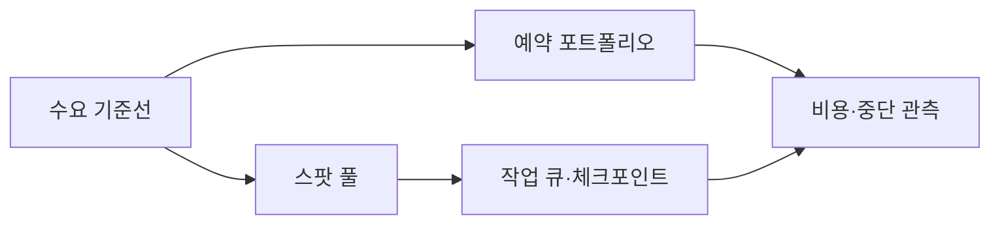
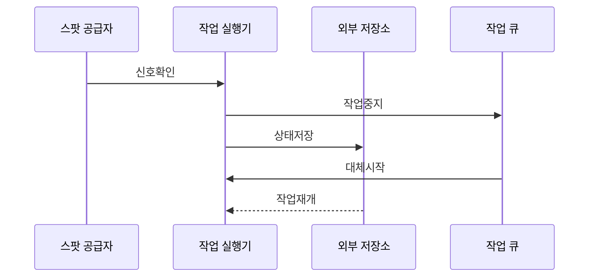

---
sidebar:
  order: 148
  label: "148. 예약 인스턴스·스팟 인스턴스 (Reserved Spot Instance)"
  badge:
    text: "기출 · 50%"
    variant: note
title: "예약 인스턴스·스팟 인스턴스 (Reserved Spot Instance)"
date: "2026-07-25T00:40:00+09:00"
tags:
  - "notes-software"
weight: 148
extra:
  question_no: "148"
  source_status: "기출"
  source_history: "135회"
  priority: 50
  priority_note: "약정 할인과 중단 위험 비교가 비용 설계에 포함됨"
---

## 미리 알고가기

- **예약 인스턴스**: 일정 기간의 인스턴스 사용을 약정해 일치하는 사용량에 할인 요율을 적용함
- **아마존 탄력적 컴퓨팅 클라우드(Amazon Elastic Compute Cloud, Amazon EC2)**: ‘아마존 이시투’로 읽고 Elastic Compute Cloud의 두 C를 숫자 2로 묶은 제품 표기이며 리전 예약은 요율 혜택을, 가용 영역 예약은 용량 예약까지 제공함
- **스팟 인스턴스**: 공급자의 미사용 용량을 할인 요율로 사용하되 용량 회수로 중단될 수 있음
- **예약 적용률**: 전체 대상 사용량 중 예약 요율이 적용된 비율임
- **예약 사용률**: 구매한 예약 범위 중 실제 사용량이 차지한 비율임
- **체크포인트**: 작업 진행 상태를 외부 저장소에 기록해 다른 인스턴스에서 이어서 처리하게 함
- **온디맨드**: 장기 약정 없이 실행한 컴퓨팅 사용량에 기본 요율을 적용하는 방식임
- **리전·가용 영역**: 리전은 지역 단위이고 가용 영역은 독립 전원·망을 가진 구역임
- **수요 기준선·변동 부하**: 기준선은 지속 최소 수요이고 변동 부하는 시간별 증감 수요임
- **스팟 풀**: 여러 인스턴스 유형·영역에서 대체 가능한 스팟 용량 묶음임
- **작업 큐**: 처리할 작업을 저장하고 사용 가능한 실행 자원에 배분하는 구성요소임

## Ⅰ. 개요

- **정의/개념**: 약정이나 잉여 자원을 조건으로 할인하는 구매 모델임
- **배경/필요성**: 부하 지속성·가격 차이로 구매 조합 필요

### 쉽게 이해하기 (학습용)
- 예약은 용량을 약정하고 스팟은 남는 용량을 사용함

## Ⅱ. 특징

- 예약은 사용 여부와 별개로 약정이 발생해 예측한다.
- 스팟은 용량 회수에 대비해 체크포인트가 필요한다.
- 기준은 예약, 변동은 스팟으로 비용 영향을 분리한다.
- 예약 적용률과 스팟 중단률을 개별 지표로 관리한다.

### 쉽게 이해하기 (학습용)
- 예약은 약정 낭비, 스팟은 업무 지속 여부를 봄

## Ⅲ. 아키텍처 및 구성요소

| 설계 요소 | 설명 |
|:---|:---|
| 수요 기준선 | 시간대별 최소 인스턴스 수와 변동 폭을 계산함 |
| 예약 포트폴리오 | 인스턴스 속성과 기간별 약정량을 관리함 |
| 스팟 풀 | 여러 인스턴스 유형에서 대체 용량을 요청함 |
| 작업 큐·체크포인트 | 작업을 배분하고 중간 결과를 외부에 보존함 |
| 비용·중단 관측 | 예약 적용률과 복구 시간을 수집함 |

> 요약: 기준 부하는 예약으로, 변동은 스팟 풀에 배분함

### 쉽게 이해하기 (학습용)
- 예측 가능한 기본 용량과 탄력 용량을 분리 구성

## Ⅳ. 원리 및 절차 흐름도

| 절차 | 설명 |
|:---|:---|
| **신호확인** | 인스턴스 회수 이벤트를 감지함 |
| **작업중지** | 작업 큐에서 해당 장비 배정을 제외함 |
| **상태저장** | 진행 상황을 기록하고 연결을 종료함 |
| **대체시작** | 다른 영역에 신규 컴퓨팅을 요청함 |
| **작업재개** | 저장한 지점부터 작업을 다시 시작함 |

> 요약: 중단 신호가 작업 중지와 상태 저장을 거쳐 재개됨

### 쉽게 이해하기 (학습용)
- 회수 알림 시 일을 멈추고 상태 저장 후 다른 곳에서 이어감

## Ⅴ. 종류 및 비교

| 비교축 | 예약 인스턴스 | 스팟 인스턴스 |
|:---|:---|:---|
| 핵심 특징 | 일치하는 사용량에 할인 요율을 적용함 | 미사용 용량에 변동 요율을 적용함 |
| 적용 기준 | 1~3년간 예측 가능하고 상시 가동할 때 | 중단이 발생해도 재처리 가능한 작업을 실행할 때 |
| 주요 위험 | 약정 미사용·수요 예측 오류 | 중단·용량 미확보 |

> 요약: 기준 부하는 예약, 재개 가능 작업은 스팟임

### 쉽게 이해하기 (학습용)
- 계속 필요한 자원은 예약, 멈춤 가능 시 스팟임

## Ⅵ. 실무 사례

1. API 서버는 예약을 적용하고 적용률을 확인함
2. 렌더링은 스팟을 쓰고 재개시간을 확인함

### 쉽게 이해하기 (학습용)
- API는 지속 기준 부하만 예약으로 구매함
- 렌더링은 체크포인트 뒤 스팟에서 재개함

## Ⅶ. 결론

- 기준 부하는 예약, 재개 가능한 작업은 스팟을 씀

### 쉽게 이해하기 (학습용)
- 계속 쓸 양만 약정하고 멈춰도 되는 일만 스팟에 둠
