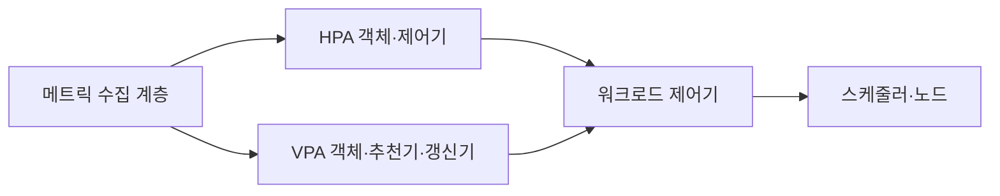

---
sidebar:
  order: 149
  label: "149. 오토 스케일링 HPA·VPA (Auto Scaling HPA VPA)"
  badge:
    text: "미출제 · 70%"
    variant: note
title: "오토 스케일링 HPA·VPA (Auto Scaling HPA VPA)"
date: "2026-07-25T00:40:00+09:00"
tags:
  - "notes-software"
weight: 149
extra:
  question_no: "149"
  source_status: "미출제"
  source_history: ""
  priority: 70
  priority_note: "복제본 수와 자원 크기 조정 비교 가치가 높음"
---

## 미리 알고가기

- **수평형 포드 오토스케일러(Horizontal Pod Autoscaler, HPA)**: ‘에이치피에이’로 읽고 세 영문 핵심어의 머리글자를 딴 표기이며 관측 메트릭과 목표값으로 포드 복제본 수를 조정함
- **수직형 포드 오토스케일러(Vertical Pod Autoscaler, VPA)**: ‘브이피에이’로 읽고 세 영문 핵심어의 머리글자를 딴 표기이며 사용량을 분석해 포드의 CPU·메모리 요청값을 추천하거나 갱신함
- **중앙처리장치(Central Processing Unit, CPU)**: ‘시피유’로 읽고 세 영문 단어의 머리글자를 딴 표기이며 포드가 요청·제한하거나 HPA가 사용률을 계산하는 처리 자원임
- **자원 요청값**: 스케줄러가 노드 배치 가능성을 판단하고 HPA가 CPU 사용률을 계산할 때 사용함
- **자원 제한값**: 컨테이너가 사용할 수 있는 CPU·메모리의 최대 범위임
- **디플로이먼트·포드·노드(Deployment·Pod·Node)**: 디플로이먼트는 포드를 관리하고 포드는 쿠버네티스의 최소 배포 단위이며 노드는 이를 실행하는 서버임
- **인플레이스 자원 조정**: Pod를 재생성하지 않고 실행 중 CPU·메모리 할당을 바꾸는 방식임
- **제어 루프·스케일 진동**: 제어 루프는 목표와 현재를 반복 비교하며 진동은 확장·축소가 반복되는 현상임
- **사용자 정의 지표**: CPU 외에 요청률·큐 길이처럼 애플리케이션이 제공하는 확장 신호임
- **메모리 부족(Out of Memory, OOM)**: ‘오오엠’으로 읽고 세 영문 단어의 머리글자를 딴 표기이며 컨테이너가 메모리 한계를 넘어 프로세스가 종료되는 상태임
- **자바 가상 머신(Java Virtual Machine, JVM)**: ‘제이브이엠’으로 읽고 세 영문 단어의 머리글자를 딴 표기이며 자바 바이트코드를 실행하고 메모리를 관리함

## Ⅰ. 개요

- 정의/개념: 메트릭을 목표값과 비교해 Pod 수나 자원을 조정함
- **배경/필요성**: 부하 변동으로 수평·수직 자원 조정 필요

### 쉽게 이해하기 (학습용)
- HPA는 일꾼 수를, VPA는 장비 크기를 조정함

## Ⅱ. 특징

- HPA는 복제본 계산값 중 최댓값을 선택한다.
- VPA는 사용 이력을 분석해 자원 요청값을 반영한다.
- 최소와 최대 범위 및 조정 속도를 제한해 통제한다.
- Pod 확장 시 노드 자원도 함께 확인해야 한다.

### 쉽게 이해하기 (학습용)
- Pod를 늘려도 노드에 빈 자리가 없으면 대기함

## Ⅲ. 아키텍처 및 구성요소

| 설계 요소 | 설명 |
|:---|:---|
| 메트릭 수집 계층 | 사용량과 사용자 정의 지표를 제공함 |
| HPA 객체·제어기 | 목표값과 현재값으로 필요 복제본 수를 계산함 |
| VPA 객체·추천기·갱신기 | 사용 이력으로 갱신 대상과 적용 방식을 결정함 |
| 워크로드 제어기 | 복제본과 Pod 템플릿을 관리함 |
| 스케줄러·노드 | Pod와 요청값을 수용할 노드를 선택함 |

> 요약: HPA는 개수를, VPA는 자원 요청값을 갱신함

### 쉽게 이해하기 (학습용)
- HPA는 개수를, VPA는 자원을 바꾸고 배치함

## Ⅳ. 원리 및 절차 흐름도

| 절차 | 설명 |
|:---|:---|
| **HPA계산** | 복제본 수를 계산하고 상하한 정책을 적용함 |
| **HPA반영** | scale 자원을 갱신하고 새 Pod 상태를 확인함 |
| **VPA계산** | 사용 분포와 OOM 신호로 추천값을 계산함 |
| **VPA반영** | 모드에 따라 추천하거나 Pod 자원을 변경함 |

> 요약: 두 제어기는 다른 워크로드 속성을 갱신함

### 쉽게 이해하기 (학습용)
- 동일 순환을 서로 다른 대상에 적용함

## Ⅴ. 종류 및 비교

| 판단 기준 | HPA | VPA |
|:---|:---|:---|
| 핵심 특징 | 현재 부하와 목표로 복제본 수를 조정함 | 사용 이력과 정책으로 자원을 조정함 |
| 적용 기준 | 무상태와 분산 워크로드에 적합함 | Pod당 자원 크기 산정이 필요할 때 적합함 |
| 주요 위험 | 지표 지연·스케일 진동 | 재시작·HPA 자원 충돌 |

> 요약: HPA는 복제본 수를, VPA는 포드당 자원 요청값을 조정함

### 쉽게 이해하기 (학습용)
- 처리 인스턴스 수를 늘릴지 크기를 바꿀지 결정함

## Ⅵ. 실무 사례

1. API는 HPA를 적용하고 완료시간을 확인함

### 쉽게 이해하기 (학습용)
- API는 요청 증가 때 HPA 완료 시간을 확인함

## Ⅶ. 결론

- 변동 부하에 필요한 성능과 자원 효율을 확보하기 위해 **확장 메트릭·Pod 시작시간·노드 여유·재시작 영향**을 검토하고, 복제본 수는 HPA, Pod 요청 자원은 VPA로 조정한다

### 쉽게 이해하기 (학습용)
- Pod 수나 크기를 바꿔도 노드에 빈 자원이 있어야 함
