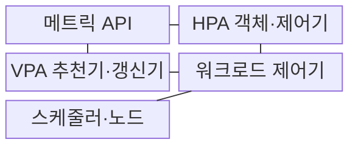
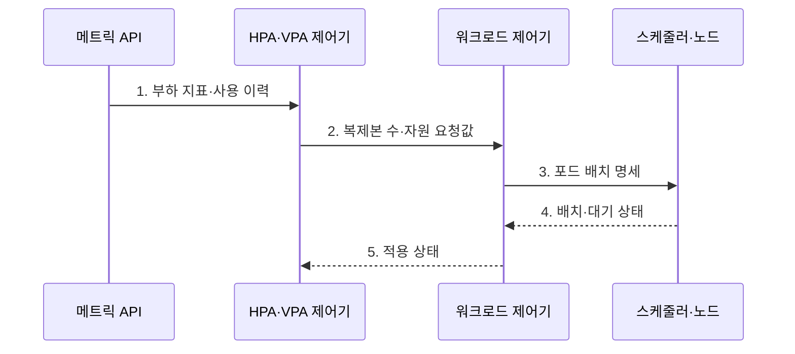

---
sidebar:
  order: 149
  label: "149. 오토 스케일링 HPA·VPA (Auto Scaling HPA VPA)"
  badge:
    text: "미출 · 70%"
    variant: note
title: "오토 스케일링 HPA·VPA (Auto Scaling HPA VPA)"
date: "2026-07-30T23:45:12+09:00"
tags:
  - "notes-software"
weight: 149
extra:
  question_no: "149"
  source_status: "미출"
  source_history: ""
  priority: 70
  priority_note: "복제본 수와 자원 크기 조정 비교 가치가 높음"
---

## 미리 알고가기

- **수평형 포드 오토스케일러(Horizontal Pod Autoscaler, HPA)**: 관측 메트릭과 목표값으로 포드 복제본 수를 조정하는 제어기
- **수직형 포드 오토스케일러(Vertical Pod Autoscaler, VPA)**: 사용량을 분석해 포드의 CPU·메모리 요청값을 추천하거나 갱신하는 제어기
- **중앙처리장치(Central Processing Unit, CPU)**: 포드가 요청·제한하고 HPA가 사용률 지표로 활용하는 처리 자원
- **자원 요청값**: 스케줄러가 노드 배치 가능성을 판단하고 HPA가 CPU 사용률을 계산할 때 사용한다.
- **자원 제한값**: 컨테이너가 사용할 수 있는 CPU·메모리의 최대 범위이다.
- **디플로이먼트·포드·노드(Deployment·Pod·Node)**: 디플로이먼트는 포드를 관리하고 포드는 쿠버네티스의 최소 배포 단위이며 노드는 이를 실행하는 서버이다.
- **인플레이스 자원 조정**: Pod를 재생성하지 않고 실행 중 CPU·메모리 할당을 바꾸는 방식이다.
- **제어 루프·스케일 진동**: 제어 루프는 목표와 현재를 반복 비교하며 진동은 확장·축소가 반복되는 현상이다.
- **사용자 정의 지표**: CPU 외에 요청률·큐 길이처럼 애플리케이션이 제공하는 확장 신호이다.
- **메모리 부족(Out of Memory, OOM)**: 컨테이너가 메모리 한계를 넘어 프로세스가 종료되는 상태
- **응용 프로그래밍 인터페이스(Application Programming Interface, API)**: 프로그램이 다른 구성요소의 기능이나 데이터를 정해진 형식으로 요청하는 규약
- **대기 상태(Pending)**: 포드를 배치할 노드 자원이 없어 스케줄링을 기다리는 상태
- **꼬리 지연(Tail Latency)**: 요청 지연을 순서대로 놓았을 때 상위 구간에서 나타나는 느린 응답 시간

> **키워드:** 오토 스케일링 HPA·VPA (Auto Scaling HPA VPA)

## Ⅰ. 개요

- 정의/개념: 메트릭으로 **포드 복제본 수·자원 요청값**을 조정하는 자동 확장 방식
- 배경/필요성: 변동 부하와 **자원 요청 오차**의 수동 대응 한계

### 쉽게 이해하기 (학습용)
- 주문이 몰리면 작업자 수를 늘리는 HPA와 작업자 한 명의 장비 크기를 바꾸는 VPA처럼, 병렬 처리량과 Pod당 자원 부족을 서로 다른 축으로 조정한다.

## Ⅱ. 특징

> 현재 복제본 4개라는 가정에서 지표가 목표의 1.5배이면 파란 계단선이 6개를 권고하는 비례 제어 예시이며, 실제 동작에는 허용 오차·안정화 창·최소·최대 범위가 함께 적용된다.

- 목표 지표로 복제본을 바꾸는 **HPA 수평 조정**
- 사용 이력으로 요청값을 바꾸는 **VPA 수직 조정**
- 허용 오차·대기 구간을 두는 **안정화 제어**

### 쉽게 이해하기 (학습용)
- 주문량이 경계값을 오갈 때마다 작업자를 뽑고 내보내지 않도록 일정 시간 기다리듯, 안정화 구간과 증감 속도가 반복 확장·축소를 억제한다.

## Ⅲ. 구조 및 구성요소

| 구성요소 | 책임 |
|:---|:---|
| 메트릭 API | 자원·사용자 정의 **확장 지표** 제공 |
| HPA 객체·제어기 | 목표 비율로 **필요 복제본** 계산 |
| VPA 추천기·갱신기 | 사용 이력으로 **자원 요청값** 산정 |
| 워크로드 제어기 | 목표 복제본·**포드 교체 상태** 관리 |
| 스케줄러·노드 | 요청값 기준 **포드 배치**와 부족 상태 제공 |

### 쉽게 이해하기 (학습용)

- 같은 측정판을 본 HPA와 VPA가 각각 작업자 수와 장비 크기를 정하고, 워크로드 제어기와 스케줄러가 실제 작업자와 자리를 배치한다.

## Ⅳ. 흐름도

**동작 원리**

1. **부하 지표·사용 이력**: HPA 목표 비율과 VPA 자원 사용 분포 산정
2. **복제본 수·자원 요청값**: 수평 또는 수직 조정 목표 확정
3. **포드 배치 명세**: 복제본 수와 CPU·메모리 요청값을 배치 조건으로 전달
4. **배치·대기 상태**: 노드 용량 충족 여부에 따라 실행·대기 구분
5. **적용 상태**: 다음 제어 주기에 실제 조정 결과 반영

### 쉽게 이해하기 (학습용)

- 주문량이 늘면 HPA가 작업자 수를 바꾸고 한 작업자가 계속 힘들어하면 VPA가 장비 크기를 바꾸며, 실제로 자리가 없으면 포드가 대기 상태로 남는다.

## Ⅴ. 종류 및 비교

| 오토스케일러 | HPA | VPA |
|:---|:---|:---|
| 적용 기준 | **병렬화 가능 부하** 변동 | 포드당 **요청값 오차** 누적 |
| 핵심 특징 | 워크로드 **복제본 수** 조정 | CPU·메모리 **요청값** 조정 |
| 한계 | 시작 지연·지표의 **스케일 진동** | 재시작·용량 부족·**HPA 충돌** |

### 쉽게 이해하기 (학습용)
- 작업을 나눌 수 있으면 같은 장비의 작업자를 늘리고, 한 작업자에게 필요한 장비 크기가 틀렸으면 CPU·메모리 요청값을 바꾼다.

## Ⅵ. 실무 고려사항 및 대책

| 고려사항 | 대책 | 효과 |
|:---|:---|:---|
| CPU와 요청량이 어긋나는 **지표 선택** | 큐 길이·요청률의 **병목 상관성** 검증 | 무관 부하의 **오확장 감소** |
| 과소 요청값이 키우는 **HPA 사용률** | VPA 권고로 **요청값 기준선** 보정 | 복제본의 **과잉 확장 감소** |
| 포드 준비보다 빠른 **부하 증가** | 여유 복제본·예측 확장·**준비 구간** | 확장 전 **꼬리 지연 완화** |
| 임계값 부근의 **스케일 진동** | 허용 오차·**안정화 구간·증감 속도** | 반복 **확장·축소 억제** |
| 노드 여유 없는 **포드 증가** | 노드 확장과 **용량 예약** 연계 | **대기 상태 누적 방지** |

### 쉽게 이해하기 (학습용)
- 주문 신호가 울린 순간이 아니라 새 작업자가 자리를 받아 일을 시작한 순간까지 재고, 작업장에 빈자리가 없으면 노드부터 늘려야 한다.

## Ⅶ. 결론

- **병렬 부하**는 HPA, **요청값 오차**는 VPA, 노드 용량 선확보

### 쉽게 이해하기 (학습용)
- 나눌 수 있는 주문은 작업자 수로, 한 작업자의 장비 부족은 장비 크기로 해결하되 작업장 자리가 먼저 확보돼야 실제 확장이 끝난다.
