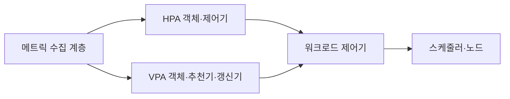
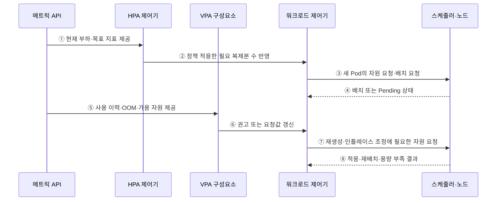

---
sidebar:
  order: 149
  label: "149. 오토 스케일링 HPA·VPA (Auto Scaling HPA VPA)"
  badge:
    text: "미출제 · 70%"
    variant: note
title: "오토 스케일링 HPA·VPA (Auto Scaling HPA VPA)"
date: "2026-07-25T00:40:00+09:00"
tags:
  - "notes-software"
weight: 149
extra:
  question_no: "149"
  source_status: "미출제"
  source_history: ""
  priority: 70
  priority_note: "복제본 수와 자원 크기 조정 비교 가치가 높음"
---

## 미리 알고가기

- **수평형 포드 오토스케일러(Horizontal Pod Autoscaler, HPA)**: ‘에이치피에이’로 읽고 세 영문 핵심어의 머리글자를 딴 표기이며 관측 메트릭과 목표값으로 포드 복제본 수를 조정함
- **수직형 포드 오토스케일러(Vertical Pod Autoscaler, VPA)**: ‘브이피에이’로 읽고 세 영문 핵심어의 머리글자를 딴 표기이며 사용량을 분석해 포드의 CPU·메모리 요청값을 추천하거나 갱신함
- **중앙처리장치(Central Processing Unit, CPU)**: ‘시피유’로 읽고 세 영문 단어의 머리글자를 딴 표기이며 포드가 요청·제한하거나 HPA가 사용률을 계산하는 처리 자원임
- **자원 요청값**: 스케줄러가 노드 배치 가능성을 판단하고 HPA가 CPU 사용률을 계산할 때 사용함
- **자원 제한값**: 컨테이너가 사용할 수 있는 CPU·메모리의 최대 범위임
- **디플로이먼트·포드·노드(Deployment·Pod·Node)**: 디플로이먼트는 포드를 관리하고 포드는 쿠버네티스의 최소 배포 단위이며 노드는 이를 실행하는 서버임
- **인플레이스 자원 조정**: Pod를 재생성하지 않고 실행 중 CPU·메모리 할당을 바꾸는 방식임
- **제어 루프·스케일 진동**: 제어 루프는 목표와 현재를 반복 비교하며 진동은 확장·축소가 반복되는 현상임
- **사용자 정의 지표**: CPU 외에 요청률·큐 길이처럼 애플리케이션이 제공하는 확장 신호임
- **메모리 부족(Out of Memory, OOM)**: ‘오오엠’으로 읽고 세 영문 단어의 머리글자를 딴 표기이며 컨테이너가 메모리 한계를 넘어 프로세스가 종료되는 상태임
- **자바 가상 머신(Java Virtual Machine, JVM)**: ‘제이브이엠’으로 읽고 세 영문 단어의 머리글자를 딴 표기이며 자바 바이트코드를 실행하고 메모리를 관리함

## Ⅰ. 개요

- 쿠버네티스 오토 스케일링은 관측 메트릭과 정책을 바탕으로 HPA가 워크로드 복제본 수를, VPA가 Pod의 CPU·메모리 요청값을 조정하는 제어 방식이다.
- 부하 변화에 성능을 맞추면서 과대 요청으로 낭비하거나 과소 요청으로 지연·OOM이 발생하는 문제를 수평·수직 제어 루프로 완화한다.

### 쉽게 이해하기 (학습용)
- HPA는 일꾼 수를, VPA는 일꾼 한 명의 장비 크기를 조정한다.

## Ⅱ. 특징

- **HPA 수평 조정**: 평균 자원 사용률·사용자 정의·외부 지표별 필요 복제본을 계산하고 여러 지표 중 가장 큰 권고를 사용한다.
- **VPA 수직 조정**: 현재·과거 사용량과 OOM을 분석해 컨테이너별 요청·제한 값을 추천하거나 정책에 따라 적용한다.
- **안정화 정책**: 최소·최대값, 허용 오차, 안정화 구간, 증가·감소 속도로 지표 지연과 스케일 진동을 줄인다.
- **배치 용량 연계**: 복제본이나 요청값을 늘려도 노드에 빈 자원이 없으면 Pod가 Pending이므로 노드 확장과 연결해야 한다.
- **제어 충돌 주의**: HPA가 CPU 사용률을 요청값 대비 비율로 쓸 때 VPA가 같은 CPU 요청값을 바꾸면 상호 피드백이 생길 수 있다.

### 쉽게 이해하기 (학습용)
- 일꾼 수나 장비 크기만 늘려도 작업장에 빈자리가 없으면 배치되지 못한다.

## Ⅲ. 아키텍처 및 구성요소

**도표안 A — 구조도**

**도표안 B — sequenceDiagram**

| 설계 요소 | 설명 |
|:---|:---|
| 메트릭 API | 자원·사용자 정의·외부 지표와 사용 이력 제공 |
| HPA 객체·제어기 | 현재/목표 비율로 필요 복제본 계산 후 상한·속도·안정화 적용 |
| VPA CRD·추천기 | 사용 이력·OOM·가용 자원으로 컨테이너 요청값 권고 |
| VPA 갱신기·Admission | 모드에 따라 재생성·인플레이스 갱신 또는 새 Pod에 권고 적용 |
| 워크로드 제어기 | 목표 복제본·Pod 템플릿·교체 상태 관리 |
| 스케줄러·노드 | 요청값을 수용할 노드를 찾아 배치하고 부족 상태 노출 |

**동작 원리**

- ① 메트릭 API가 HPA에 현재 자원·사용자 정의·외부 지표와 목표값을 제공한다.
- ② HPA가 지표별 필요 복제본 중 큰 값을 선택하고 안정화·증감 정책을 적용해 scale 대상에 반영한다.
- ③ 워크로드 제어기가 늘어난 복제본의 Pod를 만들고 자원 요청값과 함께 스케줄러에 배치를 요청한다.
- ④ 스케줄러가 적합한 노드에 배치하거나 용량 부족으로 Pending 상태를 워크로드에 반환한다.
- ⑤ 메트릭 계층이 VPA에 현재·과거 CPU/메모리 사용량, OOM, 클러스터 가용 자원을 제공한다.
- ⑥ VPA가 최소·최대 정책 안에서 요청값을 권고하거나 선택한 갱신 방식으로 워크로드에 적용한다.
- ⑦ 워크로드가 Pod 재생성 또는 지원되는 인플레이스 조정에 필요한 자원을 스케줄러·노드에 요청한다.
- ⑧ 스케줄러·노드가 적용·재배치·용량 부족 결과를 반환하고 다음 제어 주기의 입력이 된다.

### 쉽게 이해하기 (학습용)

- 측정값을 보고 일꾼 수나 장비 크기를 바꾸고 실제 배치 결과를 다음 판단에 다시 쓴다.

## Ⅳ. 종류 및 비교

| 비교 항목 | HPA | VPA |
|:---|:---|:---|
| 조정 대상 | 워크로드 복제본 수 | Pod 컨테이너의 CPU·메모리 요청/제한 |
| 주요 입력 | 현재 부하와 목표 지표 | 현재·과거 사용량·OOM·가용 자원 |
| 반영 방식 | scale 하위 자원의 목표 복제본 변경 | 권고, 새 Pod Admission, 재생성 또는 지원 시 인플레이스 |
| 적합 상황 | 병렬화 가능한 무상태·분산 처리 | Pod당 요청값 산정·Rightsizing |
| 반응 특성 | 짧은 부하 변화에 비교적 직접 반응 | 충분한 이력과 적용 영향 고려 |
| 주요 위험 | 지표 지연·시작 지연·진동 | 재시작·용량 부족·HPA 지표 충돌 |

> VPA는 쿠버네티스 핵심 HPA와 달리 별도 설치하는 구성이고, 인플레이스 적용 가능 여부는 클러스터와 VPA 버전·기능 설정에 따라 다르다.

### 쉽게 이해하기 (학습용)
- 같은 크기의 일꾼을 늘릴지 각 일꾼의 장비를 키울지의 차이이다.

## Ⅴ. 실무 고려사항 및 대책

| 고려사항 | 위험 | 대책 |
|:---|:---|:---|
| 지표 | CPU가 실제 병목·수요를 늦게 반영 | 요청률·큐·지연 등 원인 지표와 검증 |
| 자원 요청 | HPA CPU 사용률 분모 왜곡 | 현실적 요청값·VPA 권고 관찰·충돌 분리 |
| 시작 시간 | 확장 완료 전 지연·오류 급증 | 여유 복제본·예측/이벤트 확장·Warm-up |
| 안정화 | 짧은 변동에 반복 증감 | 허용 오차·Stabilization·증감 속도 |
| 노드 용량 | Pod만 늘고 Pending 누적 | 노드 오토스케일링·우선순위·용량 예약 |
| VPA 적용 | 재시작·JVM/캐시 성능 변화 | 권고 모드 검증·중단 예산·단계 적용 |

> **적용 사례**: API는 요청률·지연으로 HPA를 조정하고 VPA는 먼저 권고 모드로 요청값을 검증하며, 확장 신호부터 새 Pod가 Ready가 될 때까지의 시간을 측정한다.

### 쉽게 이해하기 (학습용)
- 요청이 늘어난 시각부터 새 일꾼이 실제 준비될 때까지를 재야 한다.

## Ⅵ. 결론

- HPA와 VPA의 핵심은 각각 수와 크기를 바꾸는 것이지만 성능은 지표 지연·Pod 시작 시간·노드 용량·적용 방식까지 포함한 전체 제어 루프가 결정한다.
- 업무 병목에 맞는 지표·안정화·현실적인 요청값·노드 확장·재시작 영향과 두 제어기의 상호작용을 검증해야 한다.

### 쉽게 이해하기 (학습용)
- 일꾼 수와 장비 크기를 바꿔도 작업장에 실제 빈자리가 있어야 한다.
