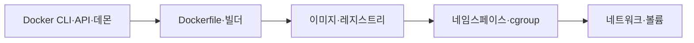
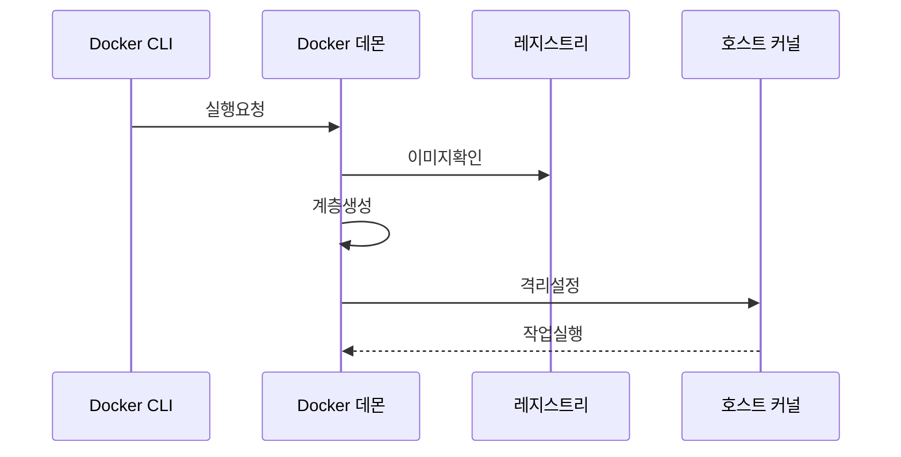

---
sidebar:
  order: 150
  label: "150. Docker 컨테이너 (Docker Container)"
  badge:
    text: "기출 · 70%"
    variant: note
title: "Docker 컨테이너 (Docker Container)"
date: "2026-07-25T00:40:00+09:00"
tags:
  - "notes-software"
weight: 150
extra:
  question_no: "150"
  source_status: "기출"
  source_history: "120회, 128회, 131회, 132회"
  priority: 70
  priority_note: "컨테이너 격리·이미지 구조는 반복 출제됐음"
---

## 미리 알고가기

- **컨테이너 이미지**: 애플리케이션 실행 파일·라이브러리·설정을 담은 불변 계층 패키지임
- **컨테이너**: 이미지에 쓰기 계층과 실행 설정을 더한 격리 프로세스임
- **네임스페이스**: 프로세스·네트워크·마운트 등 커널 자원의 가시 범위를 분리함
- **제어 그룹(Control Group, cgroup)**: ‘시그룹’으로 읽고 리눅스 내부 기능명의 소문자 축약 관례를 따른 표기이며 컨테이너 프로세스의 자원 사용량을 제한·계측함
- **중앙처리장치(Central Processing Unit, CPU)·입출력(Input/Output, I/O)**: 각각 ‘시피유·아이오’로 읽고 영문 머리글자와 입출력을 잇는 빗금 표기이며 제어 그룹이 사용량을 제한하는 처리·장치 자원임
- **리눅스 기능 권한(Linux Capability)**: 루트(root)의 전체 권한을 기능별로 나눠 컨테이너에 필요한 권한만 부여하는 커널 보안 단위임
- **도커·도커파일(Docker·Dockerfile)**: ‘도커·도커파일’로 읽는 공식 프로젝트·파일 이름으로 별도 약어 확장을 만들지 않으며 도커파일은 이미지 계층과 실행 기본값을 만드는 빌드 명령 문서임
- **레지스트리**: 이미지 계층과 태그·다이제스트를 저장하고 배포 노드에 전달함
- **볼륨**: 컨테이너 수명과 분리해 데이터를 호스트나 외부 스토리지에 보존함
- **명령줄 인터페이스(Command-Line Interface, CLI)·응용 프로그래밍 인터페이스(Application Programming Interface, API)·데몬**: 각각 ‘시엘아이·에이피아이’로 읽고 영문 머리글자를 딴 표기이며 CLI는 명령을 보내고 API는 요청 규격을 정하며 데몬은 수명주기를 실행함
- **빌드 문맥·빌더**: 문맥은 빌드 입력 파일 묶음이고 빌더는 Dockerfile로 이미지를 생성함
- **태그·다이제스트**: 태그는 변경 가능한 이름이고 다이제스트는 내용 기반 불변 식별자임
- **다단계 빌드**: 빌드 도구와 최종 실행 파일을 서로 다른 단계로 나눠 이미지 크기를 줄이는 방식임

## Ⅰ. 개요

- **정의/개념**: 실행 요소를 묶어 격리 프로세스로 실행함
- **배경/필요성**: 실행 환경 의존성 차이로 컨테이너 이미지 필요

### 쉽게 이해하기 (학습용)
- 실행 재료를 이미지로 묶고 격리된 컨테이너를 만듦

## Ⅱ. 특징

- Dockerfile 명령별 계층을 만들고 변경분만 빌드한다.
- 호스트 커널을 공유하며 프로세스와 네트워크를 격리한다.
- 자원 제한과 권한 제거를 통해 커널 권한 범위를 통제한다.
- 볼륨은 컨테이너 삭제 시 데이터 유실을 막는다.

### 쉽게 이해하기 (학습용)
- 실행 환경은 가볍게 하고 보관할 데이터는 밖에 둠

## Ⅲ. 아키텍처 및 구성요소

| 설계 요소 | 설명 |
|:---|:---|
| Docker CLI·API·데몬 | 요청을 받아 이미지와 컨테이너 수명주기를 관리함 |
| Dockerfile·빌더 | 명령과 빌드 문맥으로 이미지 계층을 생성함 |
| 이미지·레지스트리 | 불변 계층을 저장하고 배포 대상을 식별함 |
| 네임스페이스·cgroup | 가시 범위와 자원 사용량을 제한함 |
| 네트워크·볼륨 | 서비스 연결과 데이터 보존을 제공함 |

> 요약: 이미지를 받아 격리된 컨테이너와 볼륨을 구성함

### 쉽게 이해하기 (학습용)
- 이미지를 가져와 격리 공간과 저장소를 붙여 실행함

## Ⅳ. 원리 및 절차 흐름도

| 절차 | 설명 |
|:---|:---|
| **실행요청** | CLI가 실행 설정을 데몬에 전달함 |
| **이미지확인** | 로컬 이미지를 검사하고 레지스트리에서 가져옴 |
| **계층생성** | 쓰기 계층과 네트워크 인터페이스를 만듦 |
| **격리설정** | 네임스페이스와 cgroup 한도를 적용함 |
| **작업실행** | 주 프로세스를 구동하고 로그를 반영함 |

> 요약: 이미지 확인 후 격리 경계를 만들고 프로세스를 구동함

### 쉽게 이해하기 (학습용)
- 이미지 준비, 쓰기 공간 생성, 제한 적용 순으로 동작함

## Ⅴ. 종류 및 비교

| 비교축 | 이미지 | 컨테이너 |
|:---|:---|:---|
| 핵심 특징 | 불변의 읽기 전용 계층 패키지임 | 쓰기 계층과 실행 상태를 더한 프로세스임 |
| 적용 기준 | 배포 가능한 정적 패키지를 정의할 때 | 호스트와 격리하여 동적으로 실행할 때 |
| 주요 위험 | 취약 이미지·태그 변조 | 상태 유실·권한 과다 |

> 요약: 이미지는 불변 원본이고 컨테이너는 격리 프로세스임

### 쉽게 이해하기 (학습용)
- 이미지는 설계도이고 컨테이너는 실행 인스턴스임

## Ⅵ. 실무 사례

1. 배포는 이미지를 고정하고 시작시간을 확인함
2. 빌드는 다단계 빌드를 적용해 이미지 크기를 확인함

### 쉽게 이해하기 (학습용)
- 배포는 다이제스트 고정 후 시작 시간을 확인함
- 빌드는 다단계 적용 후 이미지 크기를 확인함

## Ⅶ. 결론

- 이미지는 다이제스트로 고정하고 데이터는 볼륨에 둠

### 쉽게 이해하기 (학습용)
- 실행 환경은 교체하고 보존 데이터는 밖에 남김
