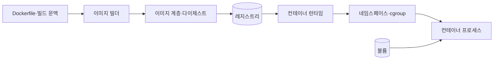
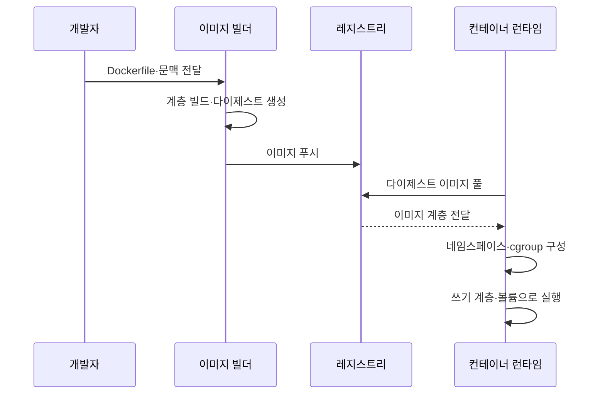

---
sidebar:
  order: 150
  label: "150. Docker 컨테이너 (Docker Container)"
  badge:
    text: "기출 · 70%"
    variant: note
title: "Docker 컨테이너 (Docker Container)"
date: "2026-07-27T23:59:59+09:00"
tags: ["notes-software"]
weight: 150
extra:
  question_no: "150"
  source_status: "기출"
  source_history: "120회, 128회, 131회, 132회"
  priority: 70
  priority_note: "컨테이너 격리·이미지 구조는 반복 출제됐음"
---

## 미리 알고가기

- **Docker**: ‘도커’로 읽는 공식 제품·프로젝트 이름이며, 이미지를 빌드·배포하고 컨테이너를 실행하는 도구 체계
- **컨테이너 이미지(Container Image)**: 애플리케이션·라이브러리·설정을 읽기 전용 계층으로 묶은 실행 원본
- **컨테이너(Container)**: 이미지에 쓰기 계층과 실행 설정을 더해 만든 격리 프로세스
- **Dockerfile**: ‘도커파일’로 읽는 공식 파일명이며, 이미지 계층과 실행 기본값을 선언하는 빌드 명령 문서
- **네임스페이스(Namespace)**: 프로세스·네트워크·마운트 등 커널 자원의 가시 범위를 분리하는 기능
- **제어 그룹(Control Group, cgroup)**: ‘시그룹’으로 읽고 Linux 기능의 축약 표기를 따르며, 프로세스 집합의 CPU·메모리·입출력을 제한·계측함
- **레지스트리(Registry)**: 이미지 계층과 태그·다이제스트를 저장·배포하는 서비스
- **다이제스트(Digest)**: 이미지 내용으로 계산한 불변 식별값
- **볼륨(Volume)**: 컨테이너 수명과 분리해 데이터를 보존·공유하는 저장 공간
- **다단계 빌드(Multi-stage Build)**: 빌드 도구와 최종 실행 파일을 서로 다른 단계로 분리해 최종 이미지 크기를 줄이는 방식

## Ⅰ. 개요

- 정의/개념: 이미지로 **애플리케이션 실행 환경을 격리·재현**
- 기존 한계: 서버별 의존성 차이의 **실행 실패·배포 편차**

### 쉽게 이해하기 (학습용)

- 프로그램과 실행 재료를 봉인된 원본으로 만들고 필요할 때 같은 격리 상자를 여러 개 실행한다.

## Ⅱ. 특징

- 이미지의 **읽기 전용 계층·불변 배포**
- 커널 공유 기반의 **프로세스 격리**
- 네임스페이스·cgroup의 **가시성·자원 통제**

### 쉽게 이해하기 (학습용)

- 같은 이미지로 실행 환경을 재현하고 각 프로세스가 볼 수 있는 자원과 사용할 수 있는 양을 제한한다.

## Ⅲ. 아키텍처 및 구성요소

| 구성요소 | 책임 |
|:---|:---|
| Dockerfile | 이미지의 **빌드 단계·기본 실행값** 선언 |
| 이미지 빌더 | 명령별 **읽기 전용 계층 생성** |
| 레지스트리 | 이미지의 **저장·배포·무결성 제공** |
| 컨테이너 런타임 | 이미지로 **격리 프로세스 생성** |
| 네임스페이스·cgroup | **자원 가시성·사용량 제한** |
| 볼륨 | 실행 수명 밖의 **데이터 영속화** |

> 요약: 불변 이미지를 런타임이 격리 프로세스와 볼륨으로 실행

### 쉽게 이해하기 (학습용)

- 제작 설명서로 원본 상자를 만들고 창고에 보관한 뒤 실행기가 자원 한도와 외부 저장 공간을 붙여 작동시킨다.

## Ⅳ. 원리 및 절차 흐름

| 절차 | 설명 |
|:---|:---|
| 빌드 입력 전달 | 명령·파일의 **빌드 문맥 구성** |
| 계층 빌드 | 명령별 **불변 이미지 계층 생성** |
| 이미지 푸시 | 레지스트리에 **다이제스트 등록** |
| 이미지 풀 | 노드가 **동일 내용 계층 확보** |
| 격리 구성 | 네임스페이스·**자원 한도 설정** |
| 컨테이너 실행 | 쓰기 계층·**볼륨 연결 후 기동** |

> 요약: 빌드한 동일 다이제스트를 격리 설정과 함께 실행

### 쉽게 이해하기 (학습용)

- 제작한 봉인 원본을 창고에 올리고 실행 서버가 같은 원본을 받아 개인 작업 공간과 보관함을 붙인다.

## Ⅴ. 종류 및 비교

| 이미지 구성 | 단일 단계 빌드 | 다단계 빌드 |
|:---|:---|:---|
| 적용 기준 | 단순 도구·**빌드 의존성 최소** | 컴파일 필요·**실행 이미지 경량화** |
| 핵심 특징 | 빌드·실행 파일의 **단일 단계 구성** | 빌드 산출물만 **최종 단계 복사** |
| 한계 | 빌드 도구 잔존·**이미지 비대화** | 단계 관리·**캐시 이해 필요** |

> 요약: 빌드 도구를 최종 이미지에서 제거하려면 다단계 빌드

### 쉽게 이해하기 (학습용)

- 조립 공구까지 배송하지 않으려면 제작 공간과 실제 배송 상자를 분리한다.

## Ⅵ. 실무 사례

1. Java 서비스는 **다단계 빌드**로 실행 파일만 이미지 포함
2. 상태 데이터는 **외부 볼륨**에 저장해 재생성 후 유지

### 쉽게 이해하기 (학습용)

- 컴파일 도구는 최종 상자에서 빼고 삭제돼도 남아야 할 자료는 외부 보관함에 둔다.

## Ⅶ. 결론

- 실행 재현은 **이미지 다이제스트**, 격리는 **Namespace·cgroup**

### 쉽게 이해하기 (학습용)

- 무엇을 실행할지는 불변 이미지가 정하고 무엇을 보고 얼마나 쓸지는 커널 격리 기능이 정한다.
