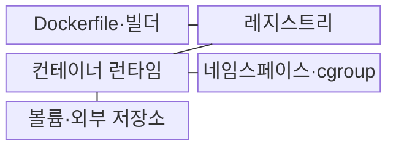
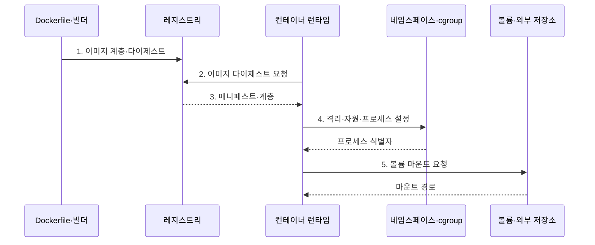

---
sidebar:
  order: 150
  label: "150. Docker 컨테이너 (Docker Container)"
  badge:
    text: "기출 · 70%"
    variant: note
title: "Docker 컨테이너 (Docker Container)"
date: "2026-08-02T12:00:00+09:00"
tags: ["notes-software"]
weight: 150
extra:
  question_no: "150"
  source_status: "기출"
  source_history: "120회, 128회, 131회, 132회"
  priority: 70
  priority_note: "컨테이너 격리·이미지 구조는 반복 출제됐음"
---

## Ⅰ. 개요

핵심 용어

- **호스트 커널 격리**: 같은 운영체제 커널에서 네임스페이스와 cgroup으로 프로세스 환경을 분리하는 방식이다.

- 정의/개념: 이미지와 **호스트 커널 격리**로 애플리케이션을 실행하는 프로세스 단위
- 배경/필요성: 서버별 라이브러리·설정 차이로 **동일 빌드 실행 결과** 불일치

### 쉽게 이해하기 (학습용)

- 같은 조리법과 재료를 봉인한 상자를 어느 주방에서든 열어 쓰듯, 이미지가 애플리케이션과 의존성을 묶어 같은 실행 환경을 반복 만든다.

## Ⅱ. 특징

핵심 용어

- **계층형 이미지**: 읽기 전용 파일 계층을 여러 이미지와 컨테이너가 공유하는 특성이다.

- 읽기 전용 계층을 공유하는 **계층형 이미지**
- 네임스페이스·cgroup 기반 **커널 격리**
- 새 이미지 교체와 **상태 외부화**의 불변 배포

### 쉽게 이해하기 (학습용)

- 같은 건물의 방들이 벽과 전기 차단기를 나눠 쓰듯, Namespace가 보이는 자원을 가르고 cgroup이 각 컨테이너의 사용량을 제한한다.

## Ⅲ. 구조 및 구성요소

핵심 용어

- **네임스페이스·cgroup**: 커널 자원의 가시 범위와 CPU·메모리 사용량을 통제하는 구성요소이다.

| 구성요소 | 책임 |
|:---|:---|
| Dockerfile·빌더 | 명령별 **이미지 계층·실행값** 생성 |
| 레지스트리 | 계층·태그·**다이제스트** 저장 |
| 컨테이너 런타임 | RootFS와 설정으로 **격리 프로세스** 생성 |
| 네임스페이스·cgroup | 커널 자원의 **가시성·사용량** 통제 |
| 볼륨·외부 저장소 | 컨테이너와 분리한 **영속 데이터** 보존 |

### 쉽게 이해하기 (학습용)

- 빌더가 만든 봉인 상자를 레지스트리에 두면 런타임이 이를 받아 개인 방과 전기 한도를 붙이고, 버려지면 안 되는 자료는 외부 보관함에 연결한다.

## Ⅳ. 흐름도

핵심 용어

- **3. 매니페스트·계층**: 다이제스트 검증 뒤 컨테이너의 루트 파일시스템을 조립하는 이미지 정보이다.

**동작 원리**

1. **이미지 계층·다이제스트**: 빌드 명령 결과를 불변 원본으로 저장
2. **이미지 다이제스트 요청**: 태그가 가리키는 정확한 원본 조회
3. **매니페스트·계층**: 다이제스트 검증 뒤 RootFS 계층 조립
4. **격리·자원·프로세스 설정**: 가시 범위와 CPU·메모리 한도 적용
5. **볼륨 마운트 요청**: 컨테이너 교체와 분리한 데이터 경로 연결

### 쉽게 이해하기 (학습용)

- 창고에서 봉인 상자의 지문을 확인해 꺼낸 뒤 개인 방과 전기 한도를 만들고, 상자를 교체해도 남을 자료는 외부 보관함에 연결한다.

## Ⅴ. 종류 및 비교

핵심 용어

- **컨테이너**: 호스트 커널을 공유하는 격리 프로세스로 빠른 배포와 수평 확장에 적합한 실행 방식이다.

| 실행 가상화 방식 | 컨테이너 | 가상 머신 |
|:---|:---|:---|
| 적용 기준 | **빠른 배포·수평 확장** | **커널 격리·전체 OS** 제어 |
| 핵심 특징 | 호스트 커널 공유 **격리 프로세스** | 하이퍼바이저 위 **게스트 OS** |
| 한계 | 커널 취약점의 **공유 영향** | 느린 시작·큰 **자원 점유** |

### 쉽게 이해하기 (학습용)

- 컨테이너는 같은 건물 안의 잠긴 방이라 빨리 만들 수 있고, 가상 머신은 기초 설비까지 나눈 별도 건물이라 무겁지만 커널 경계가 더 분명하다.

## Ⅵ. 실무 고려사항 및 대책

핵심 용어

- **공급망 위협**: 이미지 빌드 경로에 악성 또는 취약한 소프트웨어 계층이 유입되는 문제이다.

| 문제 | 대책 | 효과 |
|:---|:---|:---|
| 태그 재사용으로 달라지는 **배포 원본** | 버전 고정·**다이제스트** 배포 | 환경별 **이미지 차이 방지** |
| 빌드 경로로 유입되는 **공급망 위협** | 신뢰 원본·SBOM·**이미지 서명** | 악성·취약 **계층 차단** |
| 빌드 도구가 남은 **대형 이미지** | 다단계 빌드·최소 **기반 이미지** | 전송량·**공격 표면 감소** |
| 루트 사용자·리눅스 기능의 **과도 권한** | **비루트 사용자·기능 권한 제거**와 읽기 전용 | 컨테이너 탈출의 **피해 범위 완화** |
| 교체 시 사라지는 **로컬 상태** | 볼륨·외부 저장·**중앙 로그** | 데이터·감사 **증적 보존** |

### 쉽게 이해하기 (학습용)

- 조립 공구는 최종 배송 상자에서 빼고 상자 지문을 고정하며, 상자를 버려도 남아야 할 자료와 기록은 외부 보관함에 둔다.

## Ⅶ. 결론

핵심 용어

- **커널 격리**: 신뢰 경계상 운영체제 커널 자체를 분리해야 할 때 가상 머신을 선택하는 기준이다.

- **동일 커널·불변 배포**면 컨테이너, **커널 격리** 필요 시 가상 머신

### 쉽게 이해하기 (학습용)

- 같은 커널에서 빠르게 교체할 서비스는 컨테이너로 묶고, 커널 자체를 분리해야 하는 신뢰 경계라면 가상 머신을 선택한다.
