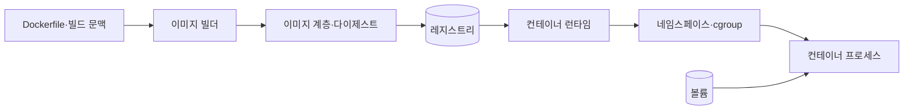
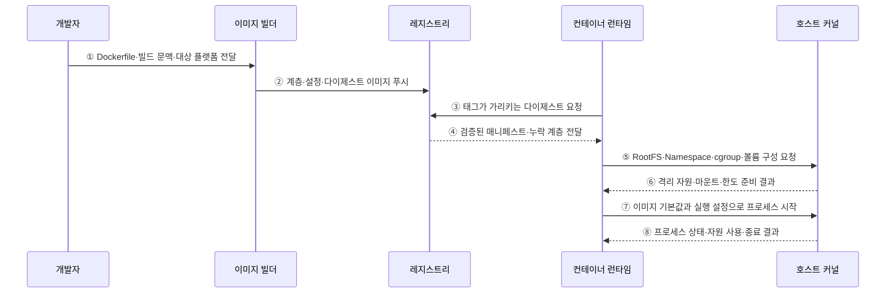

---
sidebar:
  order: 150
  label: "150. Docker 컨테이너 (Docker Container)"
  badge:
    text: "기출 · 70%"
    variant: note
title: "Docker 컨테이너 (Docker Container)"
date: "2026-07-27T23:59:59+09:00"
tags: ["notes-software"]
weight: 150
extra:
  question_no: "150"
  source_status: "기출"
  source_history: "120회, 128회, 131회, 132회"
  priority: 70
  priority_note: "컨테이너 격리·이미지 구조는 반복 출제됐음"
---

## 미리 알고가기

- **Docker**: ‘도커’로 읽는 공식 제품·프로젝트 이름이며, 이미지를 빌드·배포하고 컨테이너를 실행하는 도구 체계
- **컨테이너 이미지(Container Image)**: 애플리케이션·라이브러리·설정을 읽기 전용 계층으로 묶은 실행 원본
- **컨테이너(Container)**: 이미지에 쓰기 계층과 실행 설정을 더해 만든 격리 프로세스
- **Dockerfile**: ‘도커파일’로 읽는 공식 파일명이며, 이미지 계층과 실행 기본값을 선언하는 빌드 명령 문서
- **네임스페이스(Namespace)**: 프로세스·네트워크·마운트 등 커널 자원의 가시 범위를 분리하는 기능
- **제어 그룹(Control Group, cgroup)**: ‘시그룹’으로 읽고 Linux 기능의 축약 표기를 따르며, 프로세스 집합의 CPU·메모리·입출력을 제한·계측함
- **레지스트리(Registry)**: 이미지 계층과 태그·다이제스트를 저장·배포하는 서비스
- **다이제스트(Digest)**: 이미지 내용으로 계산한 불변 식별값
- **볼륨(Volume)**: 컨테이너 수명과 분리해 데이터를 보존·공유하는 저장 공간
- **다단계 빌드(Multi-stage Build)**: 빌드 도구와 최종 실행 파일을 서로 다른 단계로 분리해 최종 이미지 크기를 줄이는 방식

## Ⅰ. 개요

- Docker 컨테이너는 애플리케이션·라이브러리·기본 설정을 이미지로 묶고 호스트 커널의 격리 기능으로 실행하는 프로세스 단위이다.
- 서버마다 다른 의존성으로 생기는 실행 편차를 동일 이미지 다이제스트로 줄이고 빌드·배포·롤백 단위를 표준화한다.

### 쉽게 이해하기 (학습용)

- 프로그램과 실행 재료를 봉인한 원본에서 같은 작업 상자를 반복 실행한다.

## Ⅱ. 특징

- **계층형 이미지**: 읽기 전용 계층을 내용 기반 다이제스트로 공유하고 컨테이너마다 얇은 쓰기 계층을 더한다.
- **프로세스 격리**: Namespace가 프로세스·마운트·네트워크 등 보이는 범위를 나누고 cgroup이 자원 사용을 제한·계측한다.
- **커널 공유**: 별도 게스트 OS 없이 빠르게 시작하지만 같은 호스트 커널을 공유하므로 가상 머신과 격리 경계가 다르다.
- **불변 배포**: 실행 중 이미지를 고치지 않고 새 다이제스트를 빌드·검증·배포해 버전과 롤백을 명확히 한다.
- **상태 외부화**: 컨테이너 쓰기 계층은 교체 가능하게 보고 영속 데이터는 볼륨·외부 저장소에 둔다.

### 쉽게 이해하기 (학습용)

- 같은 원본을 쓰되 각 상자가 볼 것과 쓸 자원량을 커널이 제한한다.

## Ⅲ. 아키텍처 및 구성요소

**도표안 A — 구조도**

**도표안 B — sequenceDiagram**

| 구성요소 | 책임 |
|:---|:---|
| Dockerfile·빌드 문맥 | 빌드 단계·파일·환경·기본 실행값 선언 |
| 이미지 빌더 | 명령 결과를 계층·설정·매니페스트·다이제스트로 생성 |
| 레지스트리 | 이미지 계층·태그·다이제스트·서명·접근 정책 저장 |
| 컨테이너 런타임 | 이미지 RootFS와 실행 설정으로 격리 프로세스 생성·감시 |
| Namespace·cgroup | 커널 자원의 가시 범위와 CPU·메모리·I/O 사용 통제 |
| 볼륨·외부 저장소 | 컨테이너 교체와 분리해 영속 데이터 보존 |

**동작 원리**

- ① 개발자가 Dockerfile·빌드 문맥·대상 플랫폼을 이미지 빌더에 전달한다.
- ② 빌더가 재현 가능한 계층과 실행 설정을 만들고 내용 다이제스트와 함께 레지스트리에 푸시한다.
- ③ 컨테이너 런타임이 태그를 불변 배포 식별자로 믿지 않고 태그가 가리키는 다이제스트를 조회한다.
- ④ 레지스트리가 권한·무결성을 확인하고 매니페스트와 런타임에 없는 이미지 계층을 전달한다.
- ⑤ 런타임이 이미지 RootFS·쓰기 계층·볼륨·Namespace·cgroup 구성을 호스트 커널에 요청한다.
- ⑥ 커널이 격리된 자원 보기·마운트·네트워크와 자원 한도를 준비해 런타임에 반환한다.
- ⑦ 런타임이 이미지 기본값과 배포 시 설정을 결합해 격리 경계 안의 첫 프로세스를 시작한다.
- ⑧ 커널이 프로세스 상태·자원 사용·OOM·종료 코드를 런타임에 제공한다.

### 쉽게 이해하기 (학습용)

- 제작한 봉인 원본을 창고에서 받아 개인 작업 공간·자원 한도·외부 보관함을 붙여 실행한다.

## Ⅳ. 종류 및 비교

| 비교 항목 | 컨테이너 | 가상 머신 |
|:---|:---|:---|
| 격리 단위 | 호스트 커널을 공유하는 프로세스 | 하이퍼바이저 위의 게스트 OS |
| 배포 원본 | 애플리케이션·사용자 공간 이미지 | 가상 디스크·게스트 OS·애플리케이션 |
| 시작·밀도 | 빠른 시작·높은 밀도 | 상대적으로 느린 시작·큰 자원량 |
| 운영체제 범위 | 호스트 커널 계열에 제약 | 서로 다른 게스트 OS 실행 가능 |
| 격리 경계 | 커널 공유 위험을 별도 완화 | 별도 커널의 더 강한 경계 |
| 적합 상황 | 빠른 배포·수평 확장·일관된 앱 환경 | 강한 격리·전체 OS 제어·기존 워크로드 |

> 컨테이너는 보안 경계가 없다는 뜻도, 가상 머신과 같은 경계라는 뜻도 아니며 위협 모델에 따라 샌드박스·전용 노드·VM 격리를 조합한다.

### 쉽게 이해하기 (학습용)

- 컨테이너는 같은 건물의 칸막이 방, 가상 머신은 운영체제까지 따로 둔 건물에 가깝다.

## Ⅴ. 실무 고려사항 및 대책

| 고려사항 | 위험 | 대책 |
|:---|:---|:---|
| 이미지 재현성 | 가변 태그·외부 저장소 변경으로 다른 결과 | 버전 고정·다이제스트·잠금 파일·재현 빌드 |
| 공급망 | 악성·취약 Base Image와 비밀 포함 | 신뢰 원본·SBOM·서명·스캔·비밀 분리 |
| 이미지 크기 | 빌드 도구·캐시·불필요 파일 잔존 | 다단계 빌드·최소 Base·문맥 제외 |
| 실행 권한 | Root·과도한 Capability·호스트 마운트 | 비Root·Capability 제거·읽기 전용·Seccomp |
| 자원 | 제한 부재로 이웃 영향·OOM | 현실적 요청/제한·관찰·부하 시험 |
| 상태·로그 | 컨테이너 삭제 때 데이터·증거 손실 | 볼륨·외부 저장·표준 출력·중앙 로그 |

> **적용 사례**: Java 서비스는 다단계 빌드로 컴파일 도구를 제외하고 서명한 이미지 다이제스트를 배포하며 업무 데이터는 외부 볼륨·DB에 둔다.

### 쉽게 이해하기 (학습용)

- 조립 공구는 배송 상자에서 빼고 상자를 버려도 남을 자료는 밖에 보관한다.

## Ⅵ. 결론

- Docker 컨테이너의 핵심은 이미지로 사용자 공간을 재현하고 호스트 커널이 프로세스 가시성과 자원 사용을 격리하는 데 있다.
- 불변 다이제스트·공급망 검증·최소 권한·자원 한도·상태 외부화와 커널 공유 위협을 함께 관리해야 안전한 배포 단위가 된다.

### 쉽게 이해하기 (학습용)

- 무엇을 실행할지는 이미지가, 무엇을 보고 얼마나 쓸지는 커널 격리가 정한다.
