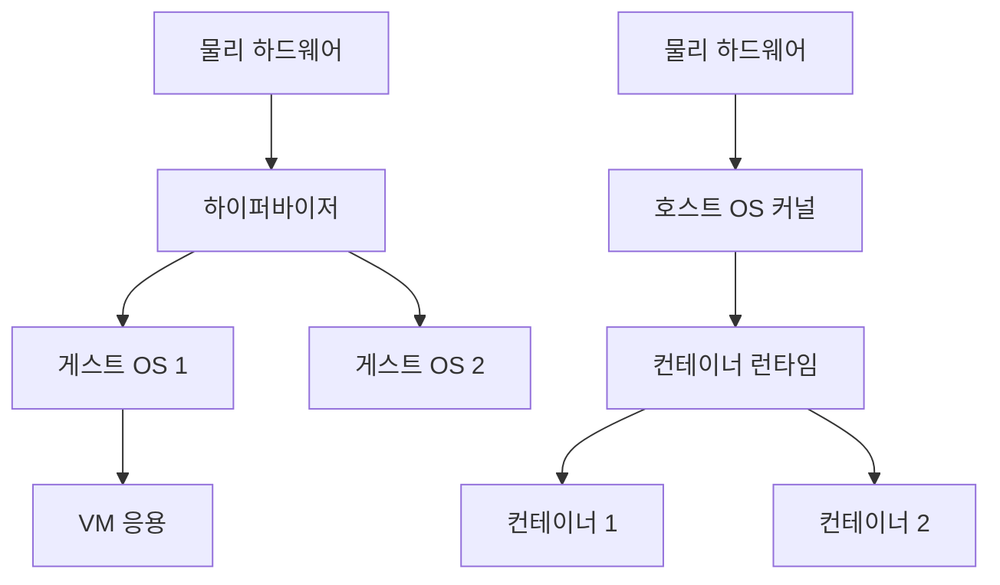
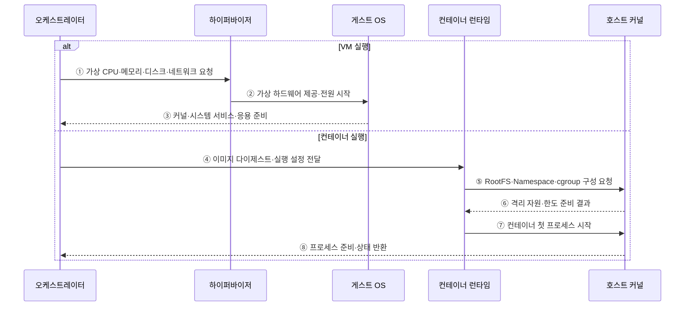

---
sidebar:
  order: 151
  label: "151. VM vs 컨테이너 비교 (VM vs Container)"
  badge:
    text: "기출 · 70%"
    variant: note
title: "VM vs 컨테이너 비교 (VM vs Container)"
date: "2026-07-27T23:59:59+09:00"
tags: ["notes-software"]
weight: 151
extra:
  question_no: "151"
  source_status: "기출"
  source_history: "128회, 131회, 132회, 137회"
  priority: 70
  priority_note: "가상머신·컨테이너 격리 비교가 반복 출제됨"
---

## 미리 알고가기

- **가상머신(Virtual Machine, VM)**: 가상 하드웨어 위에서 독립된 운영체제와 응용을 실행하는 격리 환경
- **운영체제(Operating System, OS)**: 프로세스·메모리·장치·파일을 관리하는 시스템 소프트웨어
- **하이퍼바이저(Hypervisor)**: 물리 자원을 가상 하드웨어로 분할해 여러 게스트 운영체제를 실행하는 계층
- **게스트 OS(Guest OS)**: VM 안에서 독립 커널·드라이버·시스템 서비스를 실행하는 운영체제
- **컨테이너(Container)**: 호스트 커널을 공유하며 응용 프로세스의 자원과 가시 범위를 분리한 실행 환경
- **격리 경계(Isolation Boundary)**: 한 워크로드의 권한·결함이 다른 워크로드와 호스트에 미치는 범위
- **네임스페이스(Namespace)**: 프로세스·네트워크·마운트 등 커널 자원의 가시 범위를 분리하는 기능
- **제어 그룹(Control Group, cgroup)**: 프로세스 집합의 CPU·메모리·입출력 사용량을 제한하고 계측하는 Linux 기능
- **컨테이너 런타임(Container Runtime)**: 이미지에서 컨테이너 프로세스와 커널 격리를 생성·관리하는 소프트웨어

## Ⅰ. 개요

- 가상 머신은 가상 하드웨어 위에 독립 게스트 OS를 실행하고 컨테이너는 호스트 커널을 공유하며 프로세스의 가시 범위와 자원 사용을 분리한다.
- 두 방식은 격리 경계·운영체제 자유도·시작 시간·배포 밀도가 달라 워크로드 신뢰 수준과 운영 요구에 맞춰 선택하거나 계층적으로 결합한다.

### 쉽게 이해하기 (학습용)

- VM은 집마다 설비를 두고 컨테이너는 한 건물 설비를 공유하며 방과 사용량을 나눈다.

## Ⅱ. 특징

- **VM 독립 커널**: 하이퍼바이저가 가상 CPU·메모리·장치를 제공하고 VM마다 게스트 커널과 시스템 서비스를 부팅한다.
- **컨테이너 공유 커널**: Namespace·cgroup·보안 정책으로 프로세스를 분리하며 애플리케이션 사용자 공간만 이미지로 배포한다.
- **격리와 오버헤드 절충**: VM은 더 큰 경계를 제공하지만 부팅·메모리·이미지 비용이 크고 컨테이너는 빠르고 밀도가 높다.
- **OS 호환성 차이**: VM은 서로 다른 게스트 OS를 실행할 수 있지만 컨테이너는 호스트 커널 계열과 기능에 제약된다.
- **계층적 결합**: 테넌트·신뢰 영역은 VM으로 나누고 각 VM 안의 서비스를 컨테이너로 빠르게 배포할 수 있다.

### 쉽게 이해하기 (학습용)

- 커널까지 나누면 무겁고 경계가 강하며, 커널을 공유하면 가볍고 공동 위험이 생긴다.

## Ⅲ. 아키텍처 및 구성요소

**도표안 A — 구조도**

**도표안 B — sequenceDiagram**

| 구성요소 | VM 책임 | 컨테이너 책임 |
|:---|:---|:---|
| 자원 분할 | 하이퍼바이저가 가상 하드웨어 제공 | 커널이 Namespace·cgroup 제공 |
| 운영체제 | VM별 독립 게스트 커널·서비스 | 호스트 커널 공유·사용자 공간만 분리 |
| 실행 원본 | OS를 포함한 가상 디스크·설정 | 애플리케이션 사용자 공간의 계층 이미지 |
| 시작 과정 | 가상 하드웨어 생성 후 OS 부팅 | RootFS·격리 설정 후 프로세스 시작 |
| 격리 경계 | 하이퍼바이저·가상 하드웨어·독립 커널 | 프로세스·공유 커널·보안 정책 |

**동작 원리**

- ① VM 실행 시 오케스트레이터가 하이퍼바이저에 가상 CPU·메모리·디스크·네트워크를 요청한다.
- ② 하이퍼바이저가 격리된 가상 하드웨어를 게스트 OS에 제공하고 가상 전원을 시작한다.
- ③ 게스트 OS가 커널·드라이버·시스템 서비스·응용을 부팅하고 준비 상태를 반환한다.
- ④ 컨테이너 실행 시 오케스트레이터가 런타임에 이미지 다이제스트와 실행 설정을 전달한다.
- ⑤ 런타임이 호스트 커널에 이미지 RootFS·쓰기 계층·Namespace·cgroup 구성을 요청한다.
- ⑥ 커널이 격리된 자원 보기와 사용 한도를 준비해 런타임에 반환한다.
- ⑦ 런타임이 별도 게스트 OS 부팅 없이 컨테이너의 첫 프로세스를 시작한다.
- ⑧ 커널과 런타임이 프로세스 준비 상태·자원 사용·종료 정보를 오케스트레이터에 제공한다.

### 쉽게 이해하기 (학습용)

- VM은 새 컴퓨터와 운영체제를 켜고 컨테이너는 켜진 커널에 분리된 작업 공간을 바로 만든다.

## Ⅳ. 종류 및 비교

| 비교 항목 | 가상 머신 | 컨테이너 |
|:---|:---|:---|
| 가상화 위치 | 하드웨어·장치 | 운영체제 커널 자원 |
| 커널 | VM별 독립 게스트 커널 | 호스트 커널 공유 |
| 시작·밀도 | OS 부팅으로 느리고 오버헤드 큼 | 프로세스 시작으로 빠르고 밀도 높음 |
| OS 선택 | 서로 다른 게스트 OS 가능 | 호스트 커널 계열에 제약 |
| 격리 | 불신 워크로드에 상대적으로 강한 경계 | 공유 커널 공격면을 별도 완화 |
| 운영 | 게스트 OS 패치·이미지·에이전트 | 이미지 공급망·런타임·호스트 커널 |
| 적합 | 테넌트 격리·기존 OS·전체 시스템 제어 | 빠른 배포·수평 확장·마이크로서비스 |

> 실제 격리 강도는 기술 이름만이 아니라 하이퍼바이저·커널·권한·장치 노출·패치·테넌트 배치 설정 전체에 좌우된다.

### 쉽게 이해하기 (학습용)

- 서로 믿기 어렵거나 다른 OS가 필요하면 VM, 같은 커널에서 빠르게 많이 띄우려면 컨테이너가 유리하다.

## Ⅴ. 실무 고려사항 및 대책

| 고려사항 | 위험 | 대책 |
|:---|:---|:---|
| 신뢰 경계 | 불신 테넌트를 공유 커널에 혼재 | 테넌트별 VM·전용 노드·샌드박스 |
| OS 요구 | 커널 모듈·드라이버·다른 OS 불일치 | VM 선택 또는 호스트/이미지 호환 검증 |
| 공급망 | VM·컨테이너 이미지의 취약점·비밀 | 신뢰 원본·SBOM·서명·스캔·패치 |
| 자원 격리 | CPU·메모리·I/O 이웃 간섭 | 예약·제한·우선순위·NUMA/I/O 관찰 |
| 상태 | 교체 시 로컬 데이터 손실 | 외부 저장·백업·복원·일관성 시험 |
| 운영 계층 | VM 안 컨테이너의 이중 패치·관측 누락 | 계층별 책임·자동화·통합 자산/로그 |

> **적용 사례**: 다중 고객 실행 환경은 고객별 VM으로 커널을 나누고 각 VM 안에서 고객 서비스를 컨테이너로 배포해 경계와 배포 속도를 결합한다.

### 쉽게 이해하기 (학습용)

- 고객끼리는 VM으로 커널을 나누고 고객 안의 서비스는 컨테이너로 빠르게 바꾼다.

## Ⅵ. 결론

- VM과 컨테이너의 본질적 차이는 독립 커널을 부팅하는가, 호스트 커널에서 프로세스를 격리하는가이다.
- 신뢰 경계·OS 요구·시작 속도·밀도·운영 비용을 기준으로 선택하고 필요하면 VM 경계 안에 컨테이너 배포를 결합해야 한다.

### 쉽게 이해하기 (학습용)

- 먼저 필요한 커널 경계를 정하고 그 안에서 배포 속도와 밀도를 높인다.
