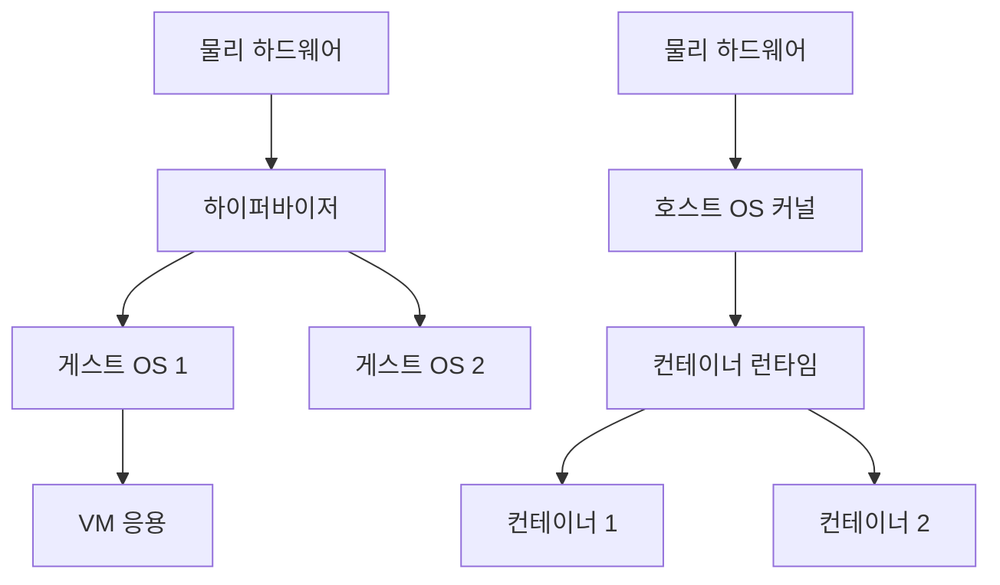
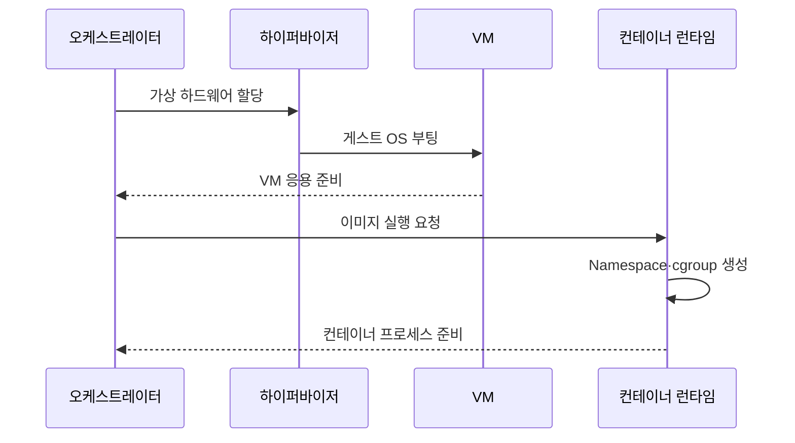

---
sidebar:
  order: 151
  label: "151. VM vs 컨테이너 비교 (VM vs Container)"
  badge:
    text: "기출 · 70%"
    variant: note
title: "VM vs 컨테이너 비교 (VM vs Container)"
date: "2026-07-27T23:59:59+09:00"
tags: ["notes-software"]
weight: 151
extra:
  question_no: "151"
  source_status: "기출"
  source_history: "128회, 131회, 132회, 137회"
  priority: 70
  priority_note: "가상머신·컨테이너 격리 비교가 반복 출제됨"
---

## 미리 알고가기

- **가상머신(Virtual Machine, VM)**: ‘브이엠’으로 읽고 영문 머리글자를 딴 약어이며, 가상 하드웨어 위에서 독립 운영체제와 응용을 실행하는 격리 환경
- **운영체제(Operating System, OS)**: ‘오에스’로 읽고 영문 머리글자를 딴 약어이며, 프로세스·메모리·장치·파일을 관리하는 시스템 소프트웨어
- **하이퍼바이저(Hypervisor)**: 물리 자원을 가상 하드웨어로 분할해 여러 게스트 운영체제를 실행하는 계층
- **게스트 OS(Guest OS)**: VM 안에서 독립 커널·드라이버·시스템 서비스를 실행하는 운영체제
- **컨테이너(Container)**: 호스트 커널을 공유하며 응용 프로세스의 자원과 가시 범위를 분리한 실행 환경
- **격리 경계(Isolation Boundary)**: 한 워크로드의 권한·결함이 다른 워크로드와 호스트에 미치는 범위
- **네임스페이스(Namespace)**: 프로세스·네트워크·마운트 등 커널 자원의 가시 범위를 분리하는 기능
- **제어 그룹(Control Group, cgroup)**: ‘시그룹’으로 읽고 Linux 기능의 축약 표기를 따르며, 프로세스 집합의 CPU·메모리·입출력을 제한·계측함
- **컨테이너 런타임(Container Runtime)**: 이미지에서 컨테이너 프로세스와 커널 격리를 생성·관리하는 소프트웨어

## Ⅰ. 개요

- 정의/개념: VM은 **하드웨어 가상화**, 컨테이너는 **OS 수준 격리**
- 기존 한계: 단일 실행 방식의 **격리 강도·배포 밀도 상충**

### 쉽게 이해하기 (학습용)

- VM은 집마다 기반 설비를 따로 두고 컨테이너는 한 건물 설비를 공유하되 방과 사용량을 나누는 방식이다.

## Ⅱ. 특징

- VM의 **독립 커널·강한 격리**
- 컨테이너의 **커널 공유·빠른 기동**
- VM 위 컨테이너의 **격리·배포 효율 결합**

### 쉽게 이해하기 (학습용)

- 커널까지 분리하면 무겁지만 경계가 강하고 커널을 공유하면 가볍지만 공유 커널의 위험을 함께 관리해야 한다.

## Ⅲ. 아키텍처 및 구성요소

| 구성요소 | VM 책임 | 컨테이너 책임 |
|:---|:---|:---|
| 자원 분할 계층 | 하이퍼바이저의 **가상 하드웨어 제공** | 커널의 **Namespace·cgroup 제공** |
| 운영체제 | VM별 **독립 게스트 OS** | 모든 컨테이너의 **호스트 커널 공유** |
| 실행 원본 | OS 포함 **VM 디스크 이미지** | 사용자 공간의 **계층 이미지** |
| 격리 경계 | 가상 하드웨어·**독립 커널** | 프로세스·**공유 커널 경계** |

> 요약: 독립 커널 여부가 격리 강도와 실행 밀도를 구분

### 쉽게 이해하기 (학습용)

- VM은 각 세대에 보일러까지 두고 컨테이너는 중앙 보일러를 공유하면서 방별 출입과 사용량을 제한한다.

## Ⅳ. 원리 및 절차 흐름

| 절차 | 설명 |
|:---|:---|
| 가상 하드웨어 할당 | VM용 **CPU·메모리·장치 구성** |
| 게스트 OS 부팅 | 독립 커널·**시스템 서비스 시작** |
| 이미지 실행 요청 | 컨테이너의 **사용자 공간 확보** |
| 커널 격리 생성 | 프로세스 가시성·**자원 한도 설정** |
| 실행 준비 | VM 응용 또는 **컨테이너 프로세스 기동** |

> 요약: VM은 OS 부팅, 컨테이너는 커널 격리 후 프로세스 기동

### 쉽게 이해하기 (학습용)

- VM은 새 컴퓨터와 운영체제를 켜는 절차가 필요하고 컨테이너는 실행 중인 커널에서 분리된 프로세스를 바로 만든다.

## Ⅴ. 종류 및 비교

| 실행 격리 | 가상머신 | 컨테이너 |
|:---|:---|:---|
| 적용 기준 | 불신 워크로드·**다른 OS 커널** | 동일 커널·**고밀도 빠른 배포** |
| 핵심 특징 | 가상 하드웨어의 **독립 게스트 OS** | Namespace·cgroup의 **프로세스 격리** |
| 한계 | 부팅·이미지·**자원 오버헤드** | 공유 커널·**격리 취약점 영향** |

> 요약: 커널 격리 요구와 기동·밀도 요구로 실행 방식 선택

### 쉽게 이해하기 (학습용)

- 서로 믿기 어렵거나 다른 운영체제가 필요하면 VM, 같은 커널에서 빠르게 많이 실행하려면 컨테이너가 적합하다.

## Ⅵ. 실무 사례

1. 다중 고객 실행 환경은 **VM 경계 안 컨테이너**로 격리 강화
2. 마이크로서비스는 **컨테이너 이미지**로 신속 배포·확장

### 쉽게 이해하기 (학습용)

- 고객끼리는 VM으로 커널을 나누고 각 고객의 서비스는 그 안에서 컨테이너로 빠르게 배포한다.

## Ⅶ. 결론

- 강한 격리는 **VM**, 고밀도 배포는 **컨테이너**, 혼합은 **VM 내 컨테이너**

### 쉽게 이해하기 (학습용)

- 보안 경계와 운영체제 요구를 먼저 보고, 그 안에서 배포 속도와 밀도를 최적화한다.
