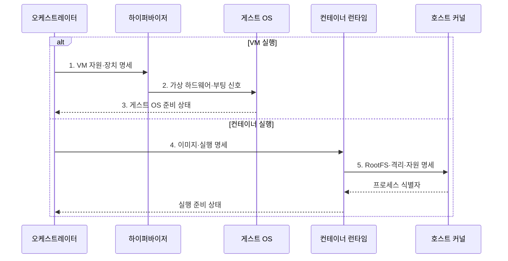

---
sidebar:
  order: 151
  label: "151. VM vs 컨테이너 비교 (VM vs Container)"
  badge:
    text: "기출 · 70%"
    variant: note
title: "VM vs 컨테이너 비교 (VM vs Container)"
date: "2026-08-02T23:21:00+09:00"
tags: ["notes-software"]
weight: 151
extra:
  question_no: "151"
  source_status: "기출"
  source_history: "128회, 131회, 132회, 137회"
  priority: 70
  priority_note: "가상머신·컨테이너 격리 비교가 반복 출제됨"
---

## Ⅰ. 개요

핵심 용어

- **가상 머신(Virtual Machine, VM)·컨테이너(Container)**: 가상 머신은 하이퍼바이저 위에서 독립 운영체제를 실행하고, 컨테이너는 호스트 커널을 공유하며 네임스페이스·제어 그룹으로 프로세스와 자원을 격리한다.

- 정의/개념: 독립 운영체제를 실행하는 가상 머신과 **호스트 커널을 공유하는 컨테이너**를 대비하는 실행 가상화 구조
- 배경/필요성: 신뢰 경계·운영체제 요구에 따른 **격리 강도·배포 밀도** 판단

#### 한줄 요약

- VM은 집마다 전기·배관까지 따로 두고 컨테이너는 한 건물 설비를 공유한 채 방만 나누듯, 커널 분리 여부가 격리 강도와 실행 무게를 가른다.

## Ⅱ. 특징

핵심 용어

- **VM 독립 커널**: 가상 머신은 하이퍼바이저 위에서 게스트 운영체제와 독립 커널을 실행해 강한 격리를 제공한다.
- **네임스페이스(Namespace)·제어 그룹(Control Group, cgroup)**: 컨테이너가 볼 수 있는 커널 자원을 분리하고 중앙처리장치·메모리 사용량을 제한하는 기능이다.

- 가상 하드웨어마다 부팅하는 **VM 독립 커널**
- 네임스페이스·cgroup 기반 **컨테이너 공유 커널**
- VM 신뢰 경계 안의 **컨테이너 계층 결합**

#### 한줄 요약

- 집 설비까지 분리하면 무겁지만 이웃 고장의 영향이 작고, 한 건물 설비를 공유하면 방은 빨리 만들 수 있지만 커널 결함이 공동 경계를 흔든다.

## Ⅲ. 구조 및 구성요소

핵심 용어

- **컨테이너 런타임**: 컨테이너 런타임은 이미지로부터 컨테이너를 생성하고 실행 수명주기를 관리하는 구성요소다.
- **하이퍼바이저(Hypervisor)**: 가상 머신별 가상 하드웨어와 격리 경계를 제공하는 구성요소이다.
- **게스트 운영체제(Guest Operating System, Guest OS)**: 가상 머신 안에서 독립 커널과 시스템 서비스를 실행하는 운영체제이다.

| 구성요소 | 책임 |
|:---|:---|
| 하이퍼바이저 | VM별 **가상 하드웨어** 제공 |
| 게스트 OS | VM별 **독립 커널**·시스템 서비스 |
| 호스트 커널 | 컨테이너의 **공유 커널** 자원 제공 |
| 컨테이너 런타임 | 이미지 기반 **격리 프로세스** 생성 |
| 격리 정책 | 네임스페이스·cgroup·**권한 경계** 통제 |

#### 한줄 요약

- 하이퍼바이저와 게스트 OS는 집마다 설비를 나누고, 호스트 커널과 런타임은 같은 건물 안에서 방과 사용량 경계만 나눈다.

## Ⅳ. 흐름도

핵심 용어

- **5. RootFS·격리·자원 명세**: 컨테이너 실행 전에 루트 파일 시스템, 격리 경계, CPU·메모리 한도를 함께 명세해야 한다.
- **루트 파일시스템(Root File System, RootFS)**: 컨테이너 프로세스가 루트 경로로 보는 이미지 기반 파일 체계이다.

**동작 원리**

1. **VM 자원·장치 명세**: 가상 CPU·메모리·장치 범위 확정
2. **가상 하드웨어·부팅 신호**: VM 경계 안에서 독립 커널 부팅
3. **게스트 OS 준비 상태**: 시스템 서비스와 애플리케이션 실행 완료
4. **이미지·실행 명세**: 컨테이너 원본·환경·권한 범위 확정
5. **RootFS·격리·자원 명세**: 프로세스 경계·사용 한도 적용

#### 한줄 요약

- VM은 빈 집의 설비와 운영체제를 모두 켠 뒤 입주하고, 컨테이너는 이미 켜진 건물에 새 방과 전기 한도만 만들어 들어간다.

## Ⅴ. 종류 및 비교

핵심 용어

- **가상 머신**: 가상 머신은 하드웨어를 가상화해 각 인스턴스가 독립 운영체제를 갖도록 하는 실행 환경이다.
- **컨테이너(Container)**: 호스트 커널을 공유하면서 프로세스·파일·네트워크·자원 사용을 격리한 실행 환경이다.

| 실행 가상화 방식 | 가상 머신 | 컨테이너 |
|:---|:---|:---|
| 적용 기준 | **테넌트 격리·다른 OS** | **빠른 배포·수평 확장** |
| 핵심 특징 | 가상 하드웨어·**독립 커널** | 호스트 커널 공유 **격리 프로세스** |
| 한계 | 부팅 시간·큰 **메모리 점유** | 커널 제약·**공유 공격면** |

#### 한줄 요약

- 서로 믿지 못하거나 다른 운영체제가 필요하면 집을 나누는 VM을, 같은 커널에서 빠르게 복제해야 하면 방을 나누는 컨테이너를 선택한다.

## Ⅵ. 실무 고려사항 및 대책

핵심 용어

- **공유 커널 위험**: 공유 커널 위험은 커널 취약점이 컨테이너 격리 경계를 넘어 호스트나 다른 워크로드에 영향을 줄 수 있는 위험이다.
- **소프트웨어 자재 명세서(Software Bill of Materials, SBOM)**: 이미지에 포함된 소프트웨어 구성요소와 버전을 기록한 목록이다.

| 문제 | 대책 | 효과 |
|:---|:---|:---|
| 비신뢰 테넌트의 **공유 커널 위험** | 테넌트별 VM·전용 노드·**샌드박스** | 커널 경계의 **침해 영향 격리** |
| 다른 커널·드라이버의 **OS 요구** | VM 선택·호스트 **이미지 호환** 검증 | 커널·드라이버 **불일치 방지** |
| 이미지 계층의 **공급망 취약점** | 신뢰 원본·SBOM·**서명 검증** | 취약·변조 **이미지 차단** |
| 공유 호스트의 **이웃 자원 간섭** | 예약·제한·우선순위·**I/O 계측** | 워크로드별 **성능 편차 감소** |

#### 한줄 요약

- 서로 다른 고객은 건물 설비까지 VM으로 나누고, 한 고객 안의 서비스는 같은 건물의 컨테이너 방으로 배치해 격리와 교체 속도를 함께 맞춘다.

## Ⅶ. 결론

핵심 용어

- **동일 커널·고밀도 배포**: 동일 커널을 공유하는 컨테이너는 운영체제 중복이 적어 빠른 시작과 고밀도 배포에 유리하다.

- **비신뢰·다른 OS**는 VM, **동일 커널·고밀도 배포**는 컨테이너

#### 한줄 요약

- 서로 믿지 못하거나 운영체제가 다르면 집을 나누고, 같은 커널을 믿을 수 있으면 한 건물 안의 방을 늘려 배포 속도와 밀도를 높인다.
