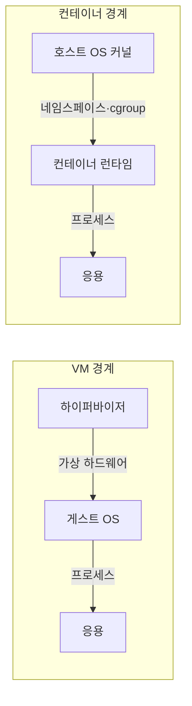

---
sidebar:
  order: 151
  label: "151. VM vs 컨테이너 비교 (VM vs Container)"
  badge:
    text: "기출 · 70%"
    variant: note
title: "VM vs 컨테이너 비교 (VM vs Container)"
date: "2026-07-25T00:40:00+09:00"
tags:
  - "notes-software"
weight: 151
extra:
  question_no: "151"
  source_status: "기출"
  source_history: "128회, 131회, 132회, 137회"
  priority: 70
  priority_note: "가상머신·컨테이너 격리 비교가 반복 출제됨"
---

## 미리 알고가기

- **가상머신(Virtual Machine, VM)**: ‘브이엠’으로 읽고 두 영문 단어의 머리글자를 딴 표기이며 가상 하드웨어 위에서 독립 운영체제와 응용을 실행하는 격리 환경
- **운영체제(Operating System, OS)**: ‘오에스’로 읽고 두 영문 단어의 머리글자를 딴 표기이며 프로세스·메모리·장치·파일 자원을 관리하는 시스템 소프트웨어
- **하이퍼바이저(Hypervisor)**: 물리 자원을 분할해 독립 OS를 실행하는 VM을 제공하는 제어 계층
- **게스트 OS(Guest OS)**: VM 안에서 독립 커널·드라이버·시스템 서비스를 실행하는 운영체제
- **컨테이너(Container)**: 호스트 커널을 공유하며 응용 프로세스의 자원과 가시 범위를 분리한 실행 환경
- **VM 이미지(VM Image)**: 게스트 OS·가상 디스크·설정을 묶어 VM 환경을 재현하는 파일
- **컨테이너 이미지(Container Image)**: 응용·런타임·사용자 공간 라이브러리를 계층으로 묶은 실행 원본
- **격리 경계**: 한 워크로드의 권한·결함이 호스트나 다른 워크로드에 미치는 범위를 정함
- **함께 쓰기**: VM 안에 컨테이너를 띄우면 VM의 강한 격리와 컨테이너의 빠른 배포를 같이 얻을 수 있음
- **네임스페이스(Namespace)**: 프로세스·네트워크·파일시스템 등 커널 자원의 가시 범위를 분리하는 기능
- **제어 그룹(Control Group, cgroup)**: ‘시그룹’으로 읽고 리눅스 기능명의 소문자 축약 관례를 따른 표기이며 프로세스 집합의 CPU·메모리·입출력 사용량을 제한·계측하는 커널 기능
- **중앙처리장치(Central Processing Unit, CPU)**: ‘시피유’로 읽고 세 영문 단어의 머리글자를 딴 표기이며 VM과 컨테이너에 할당·제한하는 처리 자원
- **컨테이너 런타임(Container Runtime)**: 이미지로 컨테이너 프로세스와 네임스페이스·cgroup을 생성·관리하는 소프트웨어
- **볼륨(Volume)**: 컨테이너 수명과 분리해 데이터를 보존·공유하는 저장 공간

## Ⅰ. 개요

- **정의/개념**: VM은 하드웨어, 컨테이너는 OS 격리
- **배경/필요성**: 격리 강도·배포 밀도 상충으로 방식 선택 필요

### 쉽게 이해하기 (학습용)
- VM은 운영체제 전체를 나누고 컨테이너는 호스트 커널 위의 프로세스를 나눈다.

## Ⅱ. 특징

- VM은 독립 커널로 운영체제 경계를 분리한다.
- 컨테이너는 커널 공유로 시작 시간·밀도 절감한다.

### 쉽게 이해하기 (학습용)
- VM은 커널까지 분리하고 컨테이너는 커널을 공유해 가볍게 실행된다.

## Ⅲ. 아키텍처 및 구성요소

| 설계 요소 | 설명 |
|:---|:---|
| VM 격리 계층 | 하이퍼바이저가 가상 하드웨어 제공 |
| 컨테이너 격리 계층 | 커널이 프로세스 자원·가시성 분리 |

> 요약: VM은 커널, 컨테이너는 프로세스 경계

### 쉽게 이해하기 (학습용)
- VM마다 게스트 운영체제가 있고 컨테이너마다 애플리케이션 실행 계층이 있다.

## Ⅳ. 원리 및 절차 흐름도

| 작동 원리 | 결과 |
|:---|:---|
| 하드웨어 가상화 | 게스트 커널·장치 경계 분리 |
| 네임스페이스·cgroup | 프로세스 가시성·자원 사용 분리 |

> 요약: 격리 계층이 실행 비용·장애 범위 결정

### 쉽게 이해하기 (학습용)
- 필요한 격리 수준을 먼저 정한 뒤 허용 가능한 시작 시간과 자원 비용을 비교한다.

## Ⅴ. 종류 및 비교

| 비교축 | VM | 컨테이너 |
|:---|:---|:---|
| 핵심 특징 | 가상 하드웨어 위에 게스트 커널을 실행함 | cgroup으로 분리하되 호스트 커널을 공유함 |
| 적용 기준 | 독립 OS 환경이나 강력한 격리가 필요할 때 | 빠른 배포와 높은 밀도 인프라를 구축할 때 |
| 주요 위험 | 이미지 크기·부팅·자원 오버헤드 | 커널 공유·격리 취약점 |

> 요약: VM은 독립 커널, 컨테이너는 프로세스 격리 중심임

### 쉽게 이해하기 (학습용)
- VM은 단독 주택이고 컨테이너는 같은 건물 설비를 공유하는 방에 가깝다.

## Ⅵ. 실무 사례

1. 다중 테넌트 코드는 VM으로 커널 경계 분리
2. 무상태 API는 컨테이너로 수평 복제

### 쉽게 이해하기 (학습용)
- 서로 신뢰하지 않는 고객 코드는 커널까지 다른 VM에 나눈다.
- 상태 없는 API는 가벼운 컨테이너를 여러 개 띄워 요청을 나눈다.

## Ⅶ. 결론

- 커널 격리는 VM, 배포 밀도는 컨테이너

### 쉽게 이해하기 (학습용)
- 공유 커널 위험을 허용할 수 없으면 VM을 선택한다.
