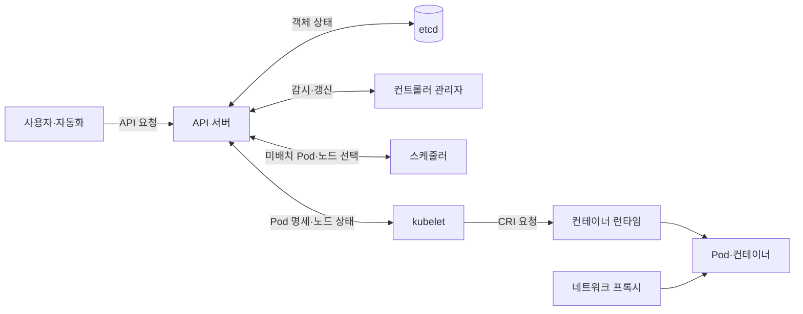
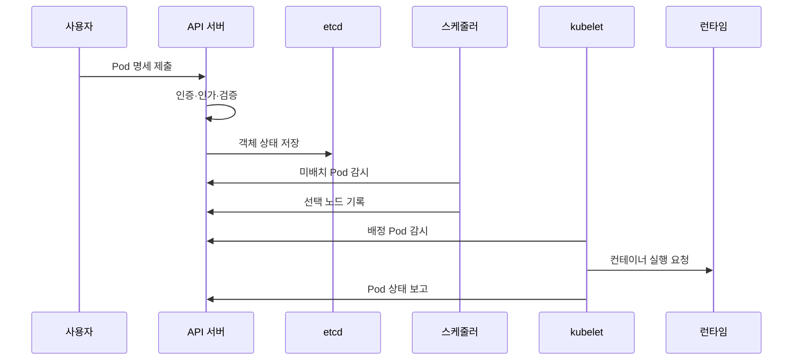

---
sidebar:
  order: 152
  label: "152. 쿠버네티스 아키텍처 (Kubernetes Architecture)"
  badge:
    text: "기출 · 85%"
    variant: note
title: "쿠버네티스 아키텍처 (Kubernetes Architecture)"
date: "2026-07-27T23:59:59+09:00"
tags: ["notes-software"]
weight: 152
extra:
  question_no: "152"
  source_status: "기출"
  source_history: "122회, 135회, 137회"
  priority: 85
  priority_note: "제어면·노드 역할과 동작 흐름이 반복 출제됨"
---

## 미리 알고가기

- **쿠버네티스(Kubernetes)**: ‘쿠버네티스’로 읽는 공식 프로젝트 이름이며, 컨테이너 워크로드의 실제 상태를 선언한 상태에 맞추는 오케스트레이션 플랫폼
- **원하는 상태·실제 상태(Desired·Actual State)**: 객체 명세에 선언한 목표 모습과 클러스터에 현재 실행 중인 모습
- **조정 루프(Reconciliation Loop)**: 원하는 상태와 실제 상태의 차이를 반복 감지해 생성·수정·삭제하는 제어
- **제어면(Control Plane)**: 응용 프로그래밍 인터페이스·상태 저장·스케줄링·조정 루프를 담당하는 관리 영역
- **응용 프로그래밍 인터페이스(Application Programming Interface, API)**: ‘에이피아이’로 읽고 영문 머리글자를 딴 약어이며, 객체를 조회·변경하는 공통 요청 규약
- **파드(Pod)**: 같은 네트워크·저장 공간을 공유하며 함께 배치되는 최소 컨테이너 실행 단위
- **etcd**: ‘이티시디’로 읽는 공식 프로젝트 이름이며, 쿠버네티스 API 객체 상태를 일관되게 저장하는 분산 키값 저장소
- **API 서버(kube-apiserver)**: ‘큐브 에이피서버’로 읽는 공식 구성요소 이름이며, 요청의 인증·인가·검증과 객체 상태 접근을 담당함
- **스케줄러(kube-scheduler)**: 미배치 Pod의 자원·정책 조건을 만족하는 노드를 선택함
- **컨트롤러 관리자(kube-controller-manager)**: 여러 조정 루프를 실행해 실제 상태를 원하는 상태에 맞춤
- **kubelet**: ‘큐블릿’으로 읽는 공식 구성요소 이름이며, 노드에 배정된 Pod를 컨테이너 런타임으로 실행하고 상태를 보고함
- **컨테이너 런타임 인터페이스(Container Runtime Interface, CRI)**: ‘시아르아이’로 읽고 영문 머리글자를 딴 약어이며, kubelet과 컨테이너 런타임 사이의 실행 규약

## Ⅰ. 개요

- **정의/개념**: 선언 상태와 실제 실행의 **차이를 지속 조정**
- **기존 한계**: 수동 배치·복구의 **상태 편차·장애 대응 지연**

### 쉽게 이해하기 (학습용)

- 원하는 실행 수와 조건을 적어 두면 관리부가 현재 상태를 계속 확인해 부족한 작업을 만들고 고장 난 작업을 대체한다.

## Ⅱ. 특징

- API 중심의 **선언 상태·객체 관리**
- 독립 컨트롤러의 **지속 조정·자가 복구**
- 제어면 판단과 **작업자 노드 실행 분리**

### 쉽게 이해하기 (학습용)

- 모든 변경은 공통 창구에 기록되고 여러 관리자가 상태 차이를 판단하며 작업 노드는 배정된 실행을 수행한다.

## Ⅲ. 아키텍처 및 구성요소

| 구성요소 | 책임 |
|:---|:---|
| API 서버 | 요청의 **인증·인가·검증·상태 접근** |
| etcd | API 객체의 **일관된 영속 상태 저장** |
| 스케줄러 | 미배치 Pod의 **실행 노드 선택** |
| 컨트롤러 관리자 | 상태 차이의 **감지·객체 조정** |
| kubelet | 배정 Pod의 **실행·상태 보고** |
| 컨테이너 런타임 | 이미지 기반 **컨테이너 생성·종료** |
| 네트워크 프록시 | 서비스의 **노드 트래픽 전달** |

> 요약: 제어면은 상태를 결정하고 노드는 Pod를 실행·보고

### 쉽게 이해하기 (학습용)

- 접수처가 모든 요청을 기록하면 배치 담당자와 상태 관리자가 결정을 내리고 현장 관리자가 컨테이너를 실행한다.

## Ⅳ. 원리 및 절차 흐름

| 절차 | 설명 |
|:---|:---|
| 명세 제출 | 원하는 상태의 **API 객체 생성** |
| 요청 검증 | 인증·인가·**정책·스키마 확인** |
| 상태 저장 | 객체의 **영속 기준 상태 기록** |
| 노드 선택 | 자원·정책 기반 **Pod 배치 결정** |
| Pod 실행 | kubelet의 **런타임 실행 요청** |
| 상태 보고 | 노드 실행 결과의 **API 상태 갱신** |

> 요약: API 상태를 감시한 제어면과 노드가 비동기적으로 조정

### 쉽게 이해하기 (학습용)

- 실행 요청이 장부에 기록되면 배치 담당자가 장소를 정하고 현장 관리자가 실행한 뒤 결과를 장부에 다시 적는다.

## Ⅴ. 종류 및 비교

| 실행 영역 | 제어면 | 작업자 노드 |
|:---|:---|:---|
| 적용 기준 | 클러스터 **상태 결정·관리** | 실제 **워크로드 실행** |
| 핵심 특징 | API·상태·**스케줄링·조정** | kubelet·런타임·**네트워크 처리** |
| 한계 | 장애 시 **관리·조정 중단** | 장애 시 **해당 Pod 실행 손실** |

> 요약: 제어면은 결정, 작업자 노드는 실행과 상태 보고

### 쉽게 이해하기 (학습용)

- 본부는 작업 수와 위치를 결정하고 현장은 컨테이너를 실행해 현재 상태를 보고한다.

## Ⅵ. 실무 사례

1. Deployment는 **ReplicaSet 컨트롤러**로 Pod 수 유지
2. 스케줄러는 **자원 요청·노드 제약**으로 실행 노드 선택

### 쉽게 이해하기 (학습용)

- 선언한 복제 수보다 Pod가 적으면 새로 만들고 각 Pod는 필요한 자원과 배치 규칙을 만족하는 노드로 간다.

## Ⅶ. 결론

- 상태 기준은 **API·etcd**, 조정은 **컨트롤러**, 실행은 **kubelet**

### 쉽게 이해하기 (학습용)

- 기준 상태를 저장하는 곳, 차이를 판단하는 곳, 실제 작업을 수행하는 곳의 책임을 구분해야 한다.
