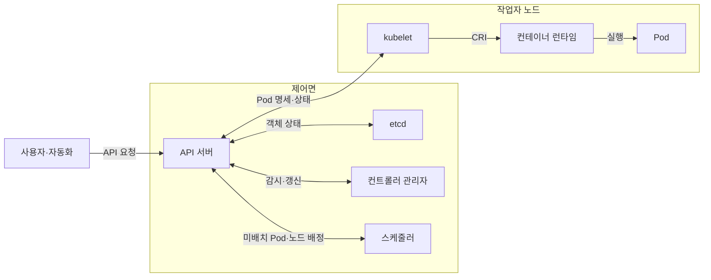
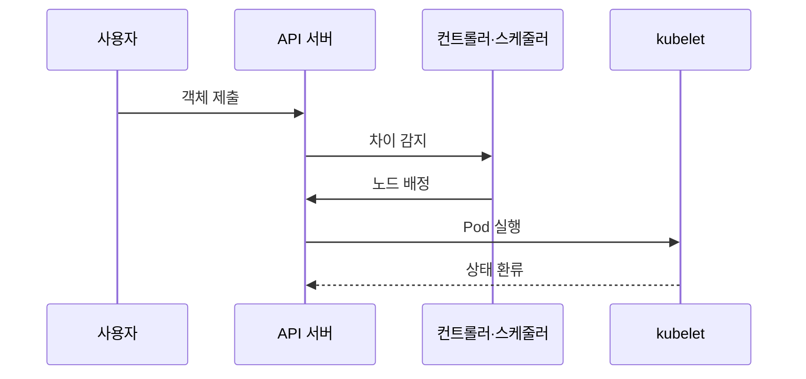

---
sidebar:
  order: 152
  label: "152. 쿠버네티스 아키텍처 (Kubernetes Architecture)"
  badge:
    text: "기출 · 85%"
    variant: note
title: "쿠버네티스 아키텍처 (Kubernetes Architecture)"
date: "2026-07-25T00:40:00+09:00"
tags:
  - "notes-software"
weight: 152
extra:
  question_no: "152"
  source_status: "기출"
  source_history: "122회, 135회, 137회"
  priority: 85
  priority_note: "제어면·노드 역할과 동작 흐름이 반복 출제됨"
---

## 미리 알고가기

- **쿠버네티스(Kubernetes)**: ‘쿠버네티스’로 읽는 공식 프로젝트 이름으로 별도 약어 확장을 만들지 않으며 컨테이너 워크로드를 선언 상태에 맞춰 자동 조정하는 플랫폼
- **원하는 상태(Desired State)**: 사용자가 객체 명세로 선언한 워크로드의 목표 모습
- **실제 상태(Actual State)**: 노드와 워크로드가 현재 실행 중인 모습
- **조정 루프(Reconciliation Loop)**: 두 상태의 차이를 감지하고 생성·수정·삭제해 차이를 줄이는 반복 제어
- **제어면(Control Plane)**: API·상태 저장·스케줄링·제어 루프를 담당하는 관리 영역
- **작업자 노드(Worker Node)**: kubelet·컨테이너 런타임·서비스 네트워크로 Pod를 실행하는 서버
- **응용 프로그래밍 인터페이스(Application Programming Interface, API)**: ‘에이피아이’로 읽고 세 영문 단어의 머리글자를 딴 표기이며 쿠버네티스 객체를 조회·변경하는 공통 요청 규약
- **파드(Pod)**: 같은 네트워크와 저장 공간을 공유하며 함께 배치되는 최소 컨테이너 실행 단위
- **이티시디(etcd)**: ‘이티시디’로 읽는 공식 프로젝트 이름으로 별도 약어 확장을 만들지 않으며 쿠버네티스 API 객체 상태를 일관되게 저장하는 분산 키·값 저장소
- **API 서버(kube-apiserver)**: ‘큐브 에이피서버’로 읽고 쿠버네티스 구성요소의 소문자·붙임표 식별자 관례를 따른 표기이며 요청 인증·인가·검증 후 객체 상태를 읽고 쓰는 제어면 진입점
- **스케줄러(kube-scheduler)**: 미배치 Pod의 자원·정책 조건을 만족하는 노드를 선택하는 제어면 구성요소
- **컨트롤러 관리자(kube-controller-manager)**: 여러 조정 루프를 실행해 실제 상태를 원하는 상태에 맞추는 구성요소
- **큐블릿(kubelet)**: ‘큐블릿’으로 읽는 쿠버네티스 공식 구성요소 이름으로 별도 약어 확장을 만들지 않으며 노드에 배정된 포드 명세를 런타임에 전달하고 상태를 보고함
- **컨테이너 런타임 인터페이스(Container Runtime Interface, CRI)**: ‘시아르아이’로 읽고 세 영문 단어의 머리글자를 딴 표기이며 큐블릿과 런타임의 실행 규약임
- **오픈 컨테이너 이니셔티브(Open Container Initiative, OCI)**: ‘오시아이’로 읽고 세 영문 단어의 머리글자를 딴 표기이며 컨테이너 이미지·실행 형식을 표준화하는 단체와 규격

## Ⅰ. 개요

- **정의/개념**: 선언 상태에 컨테이너 실행을 맞추는 조정 플랫폼
- **배경/필요성**: 장애·증설의 상태 편차로 지속 조정 제어 필요

### 쉽게 이해하기 (학습용)
- 원하는 상태를 기록하고 실제 상태를 일치시킴

## Ⅱ. 특징

- 모든 객체 변경은 API 서버에서 검증·저장한다.
- 독립 조정 루프가 실제 상태를 반복 보정한다.

### 쉽게 이해하기 (학습용)
- 제어부는 판단하고 작업 노드는 실행 후 결과를 보고함

## Ⅲ. 아키텍처 및 구성요소

| 설계 요소 | 설명 |
|:---|:---|
| kube-apiserver·etcd | API 요청을 인증하고 상태를 일관되게 저장함 |
| kube-scheduler | 실행 가능 노드를 필터링하고 배정함 |
| kube-controller-manager | 조정 루프로 원하는 상태와의 차이를 줄임 |
| kubelet·컨테이너 런타임 | 배정된 Pod 컨테이너와 실행 수명주기를 관리함 |
| 서비스 네트워크 | Service·Pod 통신 경로 구현 |

> 요약: API와 etcd가 상태를 저장하고 제어기가 조정함

### 쉽게 이해하기 (학습용)
- 상태 기록을 기준으로 제어기들이 담당 차이를 줄임

## Ⅳ. 원리 및 절차 흐름도

| 절차 | 설명 |
|:---|:---|
| 객체 제출 | 원하는 상태를 검증해 etcd 저장 |
| 차이 감지 | 컨트롤러가 부족한 복제본 생성 |
| 노드 배정 | 스케줄러가 실행 가능 노드 선택 |
| Pod 실행 | kubelet이 런타임에 실행 요청 |
| 상태 환류 | kubelet이 Pod·노드 상태 보고 |

> 요약: 선언된 상태가 각 제어기를 거쳐 실제 상태로 수렴함

### 쉽게 이해하기 (학습용)
- 선언이 저장되면 각 제어기가 순서대로 맞추고 확인함

## Ⅴ. 종류 및 비교

| 비교축 | Control Plane | Worker Node |
|:---|:---|:---|
| 핵심 특징 | 상태 저장과 지속 조정을 수행함 | 배정된 Pod 실행과 상태 보고를 함 |
| 적용 기준 | 전역 상태를 유지하고 스케줄을 통제할 때 | 배정된 Pod 실행과 트래픽을 처리할 때 |
| 주요 위험 | etcd·제어면 장애 | 노드 장애·자원 압박 |

> 요약: 제어부는 상태를 판단하고 작업 노드는 파드를 실행함

### 쉽게 이해하기 (학습용)
- 제어부는 계획을, 작업 노드는 실행과 보고를 담당함

## Ⅵ. 실무 사례

1. 제어면은 API 서버·etcd를 다중화해 관리 중단 방지
2. 배포 장애는 미배치 Pod와 노드 자원 조건 추적

### 쉽게 이해하기 (학습용)
- 제어 서버 하나가 고장 나도 다른 서버가 변경 요청을 받게 구성한다.
- Pod가 뜨지 않으면 스케줄러가 거부한 자원·정책 조건부터 찾는다.

## Ⅶ. 결론

- 상태 변경은 제어면, 실행 장애는 작업자 노드부터 추적

### 쉽게 이해하기 (학습용)
- 변경 요청 실패는 제어면을, 실행 실패는 해당 노드를 먼저 확인한다.
