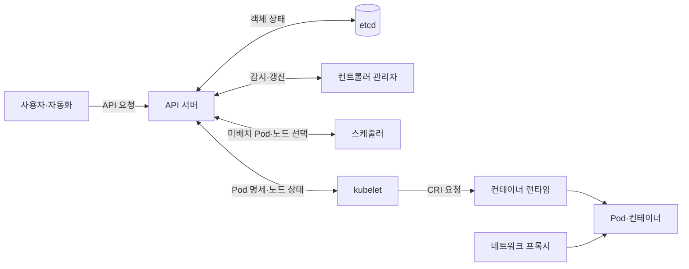
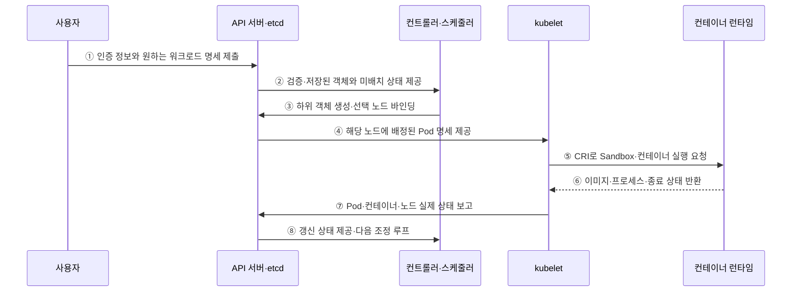

---
sidebar:
  order: 152
  label: "152. 쿠버네티스 아키텍처 (Kubernetes Architecture)"
  badge:
    text: "기출 · 85%"
    variant: note
title: "쿠버네티스 아키텍처 (Kubernetes Architecture)"
date: "2026-07-27T23:59:59+09:00"
tags: ["notes-software"]
weight: 152
extra:
  question_no: "152"
  source_status: "기출"
  source_history: "122회, 135회, 137회"
  priority: 85
  priority_note: "제어면·노드 역할과 동작 흐름이 반복 출제됨"
---

## 미리 알고가기

- **쿠버네티스(Kubernetes)**: 컨테이너 워크로드의 실제 상태를 선언한 목표 상태에 맞추는 오케스트레이션 플랫폼
- **원하는 상태·실제 상태(Desired·Actual State)**: 객체 명세에 선언한 목표 모습과 클러스터에 현재 실행 중인 모습
- **조정 루프(Reconciliation Loop)**: 원하는 상태와 실제 상태의 차이를 반복 감지해 생성·수정·삭제하는 제어
- **제어면(Control Plane)**: 응용 프로그래밍 인터페이스·상태 저장·스케줄링·조정 루프를 담당하는 관리 영역
- **응용 프로그래밍 인터페이스(Application Programming Interface, API)**: 쿠버네티스 객체를 조회·변경하는 공통 요청 규약
- **파드(Pod)**: 같은 네트워크·저장 공간을 공유하며 함께 배치되는 최소 컨테이너 실행 단위
- **etcd**: 쿠버네티스 API 객체의 상태를 일관되게 저장하는 분산 키값 저장소
- **API 서버(kube-apiserver)**: 요청의 인증·인가·검증과 객체 상태 접근을 담당하는 제어 평면 진입점
- **스케줄러(kube-scheduler)**: 미배치 Pod의 자원·정책 조건을 만족하는 노드를 선택함
- **컨트롤러 관리자(kube-controller-manager)**: 여러 조정 루프를 실행해 실제 상태를 원하는 상태에 맞춤
- **kubelet**: 노드에 배정된 Pod를 컨테이너 런타임으로 실행하고 상태를 보고하는 에이전트
- **컨테이너 런타임 인터페이스(Container Runtime Interface, CRI)**: kubelet과 컨테이너 런타임 사이의 컨테이너 실행 규약

## Ⅰ. 개요

- 쿠버네티스는 API 객체로 선언한 원하는 상태와 클러스터의 실제 상태를 독립 제어 루프가 반복 비교해 컨테이너 워크로드를 배치·복구·확장하는 오케스트레이션 플랫폼이다.
- 수동 배치와 장애 복구에서 생기는 상태 편차를 API 중심 상태 저장, 스케줄링, 조정, 노드 실행의 역할 분리로 줄인다.

### 쉽게 이해하기 (학습용)

- 원하는 수와 조건을 적으면 관리부가 차이를 찾아 부족한 작업을 만들고 고장 난 작업을 대체한다.

## Ⅱ. 특징

- **선언형 API**: 사용자는 수행 절차보다 원하는 객체 상태를 제출하고 모든 구성요소가 API를 통해 상태를 관찰·변경한다.
- **지속 조정**: 컨트롤러가 원하는 상태와 실제 상태의 차이를 반복 감지해 하위 객체를 생성·수정·삭제한다.
- **비동기 협력**: 컨트롤러·스케줄러·kubelet이 각자 감시와 갱신을 수행하므로 한 번의 중앙 절차가 아니라 상태 전이로 수렴한다.
- **제어·실행 분리**: 제어면은 상태와 배치를 결정하고 노드는 배정된 Pod를 런타임으로 실행해 결과를 보고한다.
- **확장 가능한 객체 모델**: Label·Controller·Custom Resource로 새로운 워크로드와 운영 제어를 같은 패턴에 추가한다.

### 쉽게 이해하기 (학습용)

- 공통 장부를 여러 관리자가 지켜보고 각자 맡은 차이를 고치며 현장은 배정된 작업을 실행한다.

## Ⅲ. 아키텍처 및 구성요소

**도표안 A — 구조도**

**도표안 B — sequenceDiagram**

| 구성요소 | 책임 |
|:---|:---|
| API 서버 | 인증·인가·Admission·검증과 객체 조회·변경의 유일한 공통 창구 |
| etcd | API 객체의 일관된 영속 기준 상태 저장 |
| 스케줄러 | 미배치 Pod의 자원·정책 조건을 평가해 실행 노드 선택 |
| 컨트롤러 관리자 | 객체별 원하는 상태와 실제 상태 차이를 하위 객체로 조정 |
| kubelet | 자신의 노드에 배정된 Pod를 실행·감시하고 상태 보고 |
| 컨테이너 런타임 | CRI 요청으로 Pod Sandbox·이미지·컨테이너 수명주기 수행 |
| 네트워크 데이터면 | Pod 연결과 Service 트래픽 전달 규칙 구현 |

**동작 원리**

- ① 사용자가 인증 정보와 Deployment 같은 원하는 워크로드 명세를 API 서버에 제출한다.
- ② API 서버가 인증·인가·Admission·스키마 검증을 거쳐 etcd에 저장하고 컨트롤러와 스케줄러의 감시에 제공한다.
- ③ 컨트롤러가 필요한 ReplicaSet·Pod를 만들고 스케줄러가 미배치 Pod의 적합 노드를 선택해 바인딩을 기록한다.
- ④ API 서버가 kubelet의 감시 요청에 해당 노드에 배정된 Pod 명세를 제공한다.
- ⑤ kubelet이 CRI를 통해 컨테이너 런타임에 Pod Sandbox와 컨테이너 실행을 요청한다.
- ⑥ 런타임이 이미지 확보·프로세스 실행·종료 상태를 kubelet에 반환한다.
- ⑦ kubelet이 Probe·컨테이너·Pod·노드의 실제 상태를 API 서버에 보고한다.
- ⑧ 갱신된 실제 상태를 컨트롤러가 다시 관찰하고 원하는 상태와 차이가 남으면 다음 조정을 수행한다.

### 쉽게 이해하기 (학습용)

- 요청을 장부에 적으면 본부가 작업과 장소를 정하고 현장이 실행 결과를 다시 적어 차이가 없어질 때까지 반복한다.

## Ⅳ. 종류 및 비교

| 비교 항목 | 제어면 | 작업자 노드 |
|:---|:---|:---|
| 핵심 역할 | 상태 접수·저장·배치·조정 결정 | 배정된 Pod·컨테이너·네트워크 실행 |
| 주요 구성 | API 서버·etcd·스케줄러·컨트롤러 관리자 | kubelet·컨테이너 런타임·네트워크 데이터면 |
| 상태 범위 | 클러스터 전체 객체와 원하는 상태 | 노드 자원·Pod·컨테이너의 실제 상태 |
| 장애 영향 | 새 변경·배치·조정이 지연되나 기존 Pod는 계속 실행 가능 | 해당 노드의 Pod·로컬 상태·트래픽 손실 |
| 확장·보호 | 다중 인스턴스·etcd Quorum·백업·접근 통제 | 노드 풀·격리·교체·Drain·자원 여유 |

> 제어면 장애가 즉시 모든 실행 중 컨테이너를 중지시키는 것은 아니지만 새 배치·복구·변경 능력을 잃으므로 장기 서비스 안정성이 저하된다.

### 쉽게 이해하기 (학습용)

- 본부는 수와 장소를 결정하고 현장은 컨테이너를 실행해 상태를 보고한다.

## Ⅴ. 실무 고려사항 및 대책

| 고려사항 | 위험 | 대책 |
|:---|:---|:---|
| etcd | Quorum 손실·지연·데이터 손상 | 홀수 멤버·낮은 지연·암호화·스냅숏 복원 시험 |
| API 접근 | 과도한 권한·Admission 우회 | 최소 RBAC·인증서·감사·Admission 정책 |
| 스케줄링 | 요청값 부정확·제약 충돌로 Pending | 현실적 요청·Affinity/Taint 단순화·용량 관찰 |
| 조정 루프 | 수동 변경이 컨트롤러에 되돌아감 | 선언 원본 변경·GitOps·소유 필드 이해 |
| 노드 장애 | 로컬 상태·단일 복제 Pod 손실 | 다중 복제·분산 배치·외부 상태·중단 예산 |
| 관측 | 객체 상태만 보고 사용자 장애 누락 | 이벤트·로그·지표·추적·SLO 연결 |

> **적용 사례**: Deployment의 ReplicaSet이 Pod 수를 유지하더라도 요청값과 분산 규칙이 잘못되면 새 Pod가 Pending이므로 제어면 상태와 실제 사용자 SLO를 함께 본다.

### 쉽게 이해하기 (학습용)

- 부족한 Pod를 만들어도 자원과 배치 조건을 만족하는 노드가 있어야 실제 실행된다.

## Ⅵ. 결론

- 쿠버네티스의 핵심은 명령을 순서대로 실행하는 것이 아니라 API의 원하는 상태와 노드의 실제 상태를 여러 제어 루프가 비동기적으로 수렴시키는 데 있다.
- API·etcd·스케줄러·컨트롤러·kubelet·런타임의 상태와 책임 경계를 이해하고 용량·권한·복구·관찰을 계층별로 검증해야 한다.

### 쉽게 이해하기 (학습용)

- 기준을 저장하는 곳, 차이를 판단하는 곳, 실제 실행하는 곳을 구분해야 한다.
