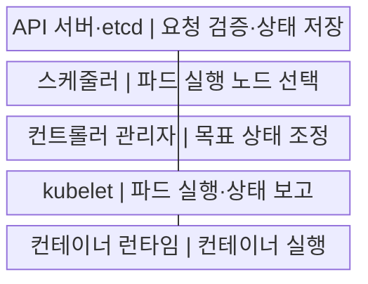
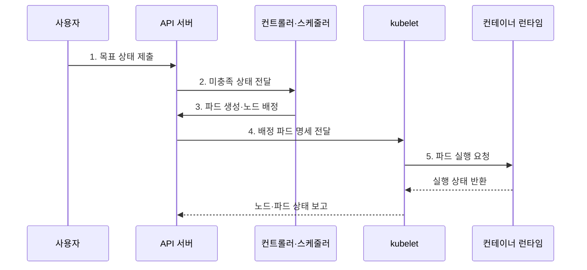

---
sidebar:
  order: 152
  label: "152. 쿠버네티스 아키텍처 (Kubernetes Architecture)"
  badge:
    text: "기출 · 85%"
    variant: note
title: "쿠버네티스 아키텍처 (Kubernetes Architecture)"
date: "2026-07-29T15:20:00+09:00"
tags: ["notes-software"]
weight: 152
extra:
  question_no: "152"
  source_status: "기출"
  source_history: "122회, 135회, 137회"
  priority: 85
  priority_note: "제어면과 작업 노드의 역할 및 상태 조정 원리 반복 출제"
---

## 미리 알고가기

- **쿠버네티스(Kubernetes)**: 선언한 상태에 맞춰 컨테이너 워크로드를 배치·복구·확장하는 오케스트레이션 플랫폼
- **목표 상태(Desired State)**: 사용자가 API 객체로 선언한 워크로드의 최종 상태
- **실제 상태(Actual State)**: 클러스터에서 현재 관측되는 워크로드의 실행 상태
- **조정 루프(Reconciliation Loop)**: 목표 상태와 실제 상태의 차이를 반복해서 해소하는 제어 절차
- **제어면(Control Plane)**: API 처리, 상태 저장, 배치 결정, 상태 조정을 담당하는 관리 영역
- **작업 노드(Worker Node)**: 파드와 컨테이너를 실제로 실행하는 서버
- **파드(Pod)**: 네트워크와 저장 공간을 공유하는 최소 배포 단위
- **etcd**: 쿠버네티스 API 객체의 상태를 저장하는 분산 키·값 저장소
- **kube-apiserver**: 인증·인가·검증을 거쳐 API 객체 접근을 중개하는 제어면 진입점
- **kube-scheduler**: 미배치 파드에 실행 노드를 선택하는 구성요소
- **kube-controller-manager**: 조정 루프를 실행해 실제 상태를 목표 상태에 맞추는 구성요소
- **kubelet**: 노드에 배정된 파드를 실행하고 상태를 보고하는 에이전트
- **컨테이너 런타임 인터페이스(CRI)**: kubelet과 컨테이너 런타임 사이의 실행 규약

## Ⅰ. 개요

- 정의/개념: **목표·실제 상태 차이**를 조정하는 컨테이너 제어 구조
- 배경/필요성: 배치·복구·확장의 **반복 운영 자동화**

### 쉽게 이해하기 (학습용)

- 운영자가 파드 수만 선언하면 제어면은 빈자리를 찾아 배치하고 장애로 사라진 파드를 다시 만들기 때문에 목표와 현실의 차이를 자동으로 좁힐 수 있다.

## Ⅱ. 특징

- **선언형 API** 기반 목표 상태 관리
- **지속 조정 루프** 기반 장애 복구
- **제어면·작업 노드 분리** 기반 역할 분담

### 쉽게 이해하기 (학습용)

- 실행 순서를 일일이 명령하는 대신 원하는 결과를 적어 두면 여러 제어기가 각자 맡은 차이를 계속 바로잡는 방식이다.

## Ⅲ. 구조 및 구성요소

| 구성요소 | 책임 |
|:---|:---|
| API 서버·etcd | 요청 검증·**API 상태 저장** |
| 스케줄러 | **파드 배치 노드** 선택 |
| 컨트롤러 관리자 | **목표·실제 상태 차이** 조정 |
| kubelet | 파드 실행·**노드 상태 보고** |
| 컨테이너 런타임 | **샌드박스·컨테이너** 실행 |

### 쉽게 이해하기 (학습용)

- API 서버가 주문을 받고 장부에 기록하면 스케줄러가 작업 장소를 정하고 kubelet과 런타임이 현장에서 파드를 실행한다.

## Ⅳ. 흐름도

**동작 원리**

1. **목표 상태 제출**: 인증·검증을 거친 객체 상태 저장
2. **미충족 상태 전달**: 목표·실제 상태 차이 관측
3. **파드 생성·노드 배정**: 복제본 생성과 실행 위치 결정
4. **배정 파드 명세 전달**: 대상 노드의 실행 명세 관측
5. **파드 실행 요청**: 샌드박스·컨테이너 생성

### 쉽게 이해하기 (학습용)

- 배포 객체를 제출하면 제어기가 부족한 파드를 만들고 스케줄러가 노드를 정한 뒤 kubelet이 런타임에 실행을 맡기는 한 흐름으로 이어진다.

## Ⅴ. 종류 및 비교

| 구분 | 제어면 | 작업 노드 |
|:---|:---|:---|
| 적용 기준 | **클러스터 상태·배치 결정** | **파드·컨테이너 실행** |
| 핵심 특징 | **API·etcd**·스케줄러·컨트롤러 | **kubelet·런타임**·네트워크 |
| 한계 | 장애 시 **관리 기능 저하** | 장애 시 **배치 파드 손실** |

### 쉽게 이해하기 (학습용)

- 제어면은 어디서 무엇을 실행할지 결정하고 작업 노드는 받은 명세대로 컨테이너를 움직인다는 경계로 구분하면 구성요소가 섞이지 않는다.

## Ⅵ. 실무 고려사항 및 대책

| 고려사항 | 대책 | 효과 |
|:---|:---|:---|
| etcd **장애·상태 손실** | 홀수 멤버·**정기 백업·복원 훈련** | 쿼럼 유지·**복구 시간 단축** |
| API **과도 권한** | **최소 RBAC·입학 제어** 정책 | **비인가 변경 차단** |
| 파드 **장기 미배치** | 요청량·제약·**노드 여유 감시** | **Pending 원인** 조기 제거 |
| 선언 상태 **임의 변경** | **GitOps·소유 필드** 관리 | **변경 추적·되돌리기** 확보 |
| **단일 노드 장애** | 복제본·**분산 배치·상태 점검** | 서비스 **중단 범위 축소** |

### 쉽게 이해하기 (학습용)

- 제어면만 이중화해도 요청량이 틀리거나 배치 제약이 충돌하면 파드가 멈추므로 상태 저장, 권한, 용량, 배치 조건을 함께 점검해야 한다.

## Ⅶ. 결론

- **가용성·배치 제약·복구 목표**로 제어면 이중화와 노드 분산 결정

### 쉽게 이해하기 (학습용)

- 관리 기능이 멈춰도 기존 파드는 잠시 동작할 수 있지만 새 배치와 복구는 중단되므로 요구 복구 시간에 맞춰 제어면과 노드를 각각 설계해야 한다.
