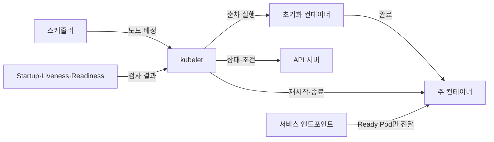
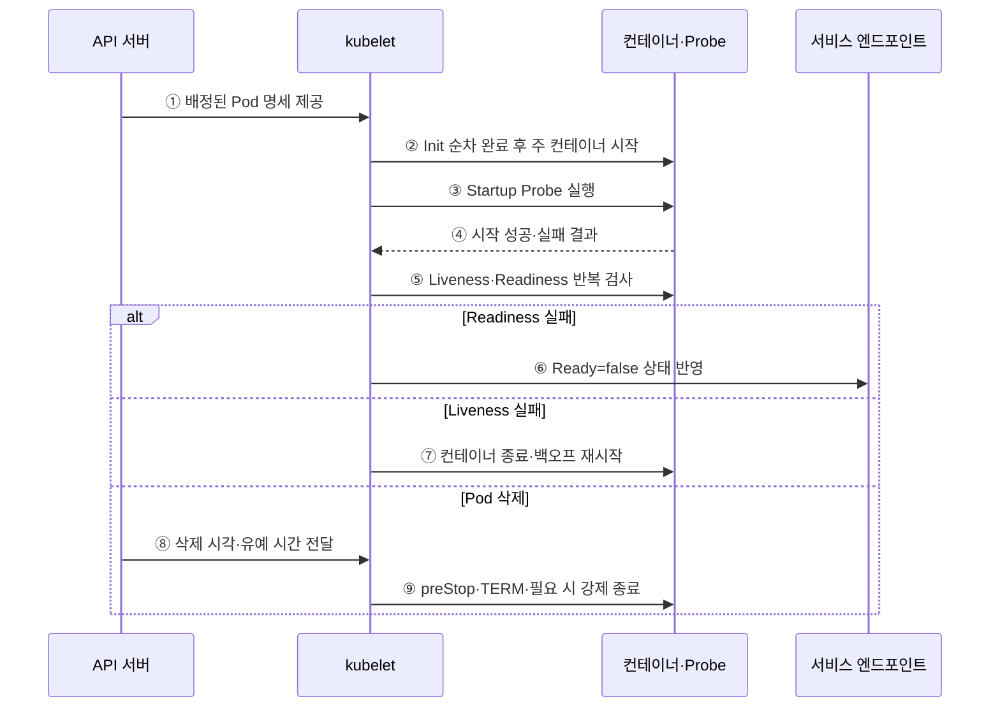

---
sidebar:
  order: 153
  label: "153. 쿠버네티스 Pod 생명주기 (Kubernetes Pod Lifecycle)"
  badge:
    text: "기출 · 30%"
    variant: note
title: "쿠버네티스 Pod 생명주기 (Kubernetes Pod Lifecycle)"
date: "2026-07-27T23:59:59+09:00"
tags: ["notes-software"]
weight: 153
extra:
  question_no: "153"
  source_status: "기출"
  source_history: "123회"
  priority: 30
  priority_note: "포드 상태 전이는 쿠버네티스 세부 절차에 해당함"
---

## 미리 알고가기

- **파드(Pod)**: 같은 노드에서 네트워크·저장 공간을 공유하는 최소 컨테이너 실행 단위
- **Pod 단계(Pod Phase)**: Pending·Running·Succeeded·Failed·Unknown으로 구분하는 Pod의 상위 실행 상태
- **컨테이너 상태(Container State)**: Waiting·Running·Terminated로 구분하는 개별 컨테이너의 현재 실행 상태
- **Pod 조건(Pod Condition)**: 스케줄·초기화·준비 상태의 참·거짓과 변경 이유를 기록한 값
- **재시작 정책(restartPolicy)**: Always·OnFailure·Never 중 컨테이너를 다시 시작할 조건을 정하는 Pod 명세
- **지수 백오프(Exponential Backoff)**: 반복 실패할수록 재시도 대기 시간을 배수로 늘리는 제어
- **시작 프로브(Startup Probe)**: 느린 애플리케이션의 시작 완료 여부를 검사하고 완료 전 활성·준비 검사를 유예함
- **활성 프로브(Liveness Probe)**: 컨테이너가 복구 불가능한 비정상 상태인지 검사해 실패 시 재시작하게 함
- **준비 프로브(Readiness Probe)**: Pod가 서비스 트래픽을 받을 준비가 됐는지 검사해 실패 시 엔드포인트에서 제외함
- **초기화 컨테이너(Init Container)**: 주 컨테이너보다 먼저 순서대로 실행되어 초기 작업을 완료하는 컨테이너
- **종료 유예 시간(Termination Grace Period)**: 삭제 요청 후 정상 정리를 기다렸다가 강제 종료하기 전까지의 시간
- **preStop 훅·TERM 신호**: ‘프리스톱·텀’으로 읽으며, 컨테이너가 연결·상태를 정리하도록 종료 직전에 실행·전달하는 알림

## Ⅰ. 개요

- 쿠버네티스 Pod 생명주기는 Pod 생성부터 노드 배치·초기화·실행·준비·재시작·종료까지의 상태와 제어를 말한다.
- Pod Phase·컨테이너 상태·Pod Condition·Probe를 분리해 “프로세스 실행”, “복구 필요”, “트래픽 수신 가능”을 서로 다른 판단으로 관리한다.

### 쉽게 이해하기 (학습용)

- 프로그램이 켜졌는지, 정상인지, 손님을 받을 준비가 됐는지를 따로 판단한다.

## Ⅱ. 특징

- **상태 계층 분리**: Pod Phase는 상위 진행 상태, Container State는 개별 실행 원인, Condition은 스케줄·초기화·준비 여부를 나타낸다.
- **순차 초기화**: Init Container가 순서대로 성공한 뒤 주 컨테이너를 시작해 선행 조건을 만든다.
- **Probe 목적 분리**: Startup은 느린 시작 보호, Liveness는 재시작 필요, Readiness는 트래픽 수신 가능성을 판단한다.
- **재시작 통제**: restartPolicy와 종료 원인에 따라 kubelet이 컨테이너를 다시 시작하고 반복 실패에는 백오프를 적용한다.
- **정상 종료**: 삭제 시 Ready 대상에서 빠지고 preStop·TERM·유예 시간 동안 연결과 상태를 정리한 뒤 필요하면 강제 종료한다.

### 쉽게 이해하기 (학습용)

- 문제에 따라 손님만 막을지 프로그램을 다시 켤지 구분한다.

## Ⅲ. 아키텍처 및 구성요소

**도표안 A — 구조도**

**도표안 B — sequenceDiagram**

| 구성요소 | 책임 |
|:---|:---|
| 스케줄러 | Pending Pod의 자원·정책 조건에 맞는 노드 선택 |
| kubelet | 배정 Pod의 컨테이너 실행·Probe·재시작·종료·상태 보고 |
| Init Container | 주 컨테이너 전에 순서대로 실행해 선행 작업 완료 |
| Startup Probe | 성공 전 Liveness·Readiness 검사를 유예해 느린 시작 보호 |
| Liveness Probe | 복구 불가능한 비정상 상태를 찾아 컨테이너 재시작 유도 |
| Readiness Probe | 트래픽 수신 가능 여부를 Condition과 Endpoint에 반영 |
| 종료 제어 | 삭제 시각·preStop·TERM·유예·강제 종료 관리 |

**동작 원리**

- ① API 서버가 스케줄러가 선택한 노드의 kubelet에 Pod 명세를 제공한다.
- ② kubelet이 Init Container를 순서대로 완료한 뒤 주 컨테이너를 시작한다.
- ③ Startup Probe가 설정되면 kubelet이 애플리케이션 시작 완료를 먼저 검사한다.
- ④ 시작 검사 결과가 실패하면 설정한 임계값까지 재검사하고, 성공한 뒤 Liveness·Readiness를 활성화한다.
- ⑤ kubelet이 Liveness와 Readiness를 각각의 주기·임계값으로 반복 검사한다.
- ⑥ Readiness 실패는 Pod를 실행 상태로 둘 수 있지만 Ready=false로 만들어 새 Service 트래픽 대상에서 제외한다.
- ⑦ Liveness 실패는 해당 컨테이너를 종료하고 restartPolicy와 백오프에 따라 재시작한다.
- ⑧ Pod 삭제 시 API 서버가 삭제 시각과 종료 유예 시간을 kubelet에 제공한다.
- ⑨ kubelet이 preStop과 TERM으로 정상 정리를 기다리고 유예 시간이 지나도 남으면 강제 종료한다.

### 쉽게 이해하기 (학습용)

- 준비가 안 되면 손님만 막고, 작동 불능이면 다시 켜며, 종료할 때는 남은 일을 정리한다.

## Ⅳ. 종류 및 비교

| 비교 항목 | Startup Probe | Liveness Probe | Readiness Probe |
|:---|:---|:---|:---|
| 판단 질문 | 애플리케이션 시작이 끝났는가 | 재시작해야 복구되는가 | 지금 새 요청을 받을 수 있는가 |
| 실패 효과 | 임계값 초과 시 컨테이너 재시작 | 컨테이너 재시작 | Ready=false·Service 대상 제외 |
| 검사 시점 | 시작 성공 전 | 시작 성공 후 지속 | 시작 성공 후 지속 |
| 적합 신호 | 내부 초기화·느린 JVM 기동 완료 | 교착·복구 불가 내부 상태 | 내부 준비·필수 의존성·과부하 |
| 오설정 위험 | 시작 지연 또는 조기 재시작 | 재시작 폭주·연쇄 장애 | 전체 Endpoint 제거·가용 용량 감소 |

> 외부 의존성 장애를 Liveness에 직접 연결하면 정상 Pod까지 반복 재시작해 장애를 키울 수 있으므로 재시작으로 복구되는 내부 상태만 검사한다.

### 쉽게 이해하기 (학습용)

- 시작 검사는 기다릴지, 활성 검사는 다시 켤지, 준비 검사는 손님을 받을지 결정한다.

## Ⅴ. 실무 고려사항 및 대책

| 고려사항 | 위험 | 대책 |
|:---|:---|:---|
| 검사 대상 | 외부 장애로 모든 Pod 재시작 | Liveness는 내부 복구 가능 상태로 제한 |
| 초기 지연 | 느린 시작을 Liveness 실패로 오판 | Startup Probe의 주기·임계값으로 최대 시작 시간 반영 |
| Readiness | 지나치게 민감해 Endpoint 전체 소실 | 업무 준비 신호·완화 임계값·최소 용량 |
| 백오프 | CrashLoop 원인이 가려진 채 지연 | 종료 이유·로그·이벤트·설정·의존성 확인 |
| 정상 종료 | 새 요청과 기존 연결이 종료 중 유입 | Ready 전환·preStop·TERM 처리·충분한 유예 |
| 로컬 상태 | 재시작·재배치 때 진행 데이터 손실 | 외부 체크포인트·멱등 처리·볼륨 정책 |

> **적용 사례**: 느린 Java 기동은 Startup Probe로 보호하고 DB 연결 실패는 Readiness로 트래픽만 막으며, Liveness는 내부 교착처럼 재시작으로 복구되는 상태를 검사한다.

### 쉽게 이해하기 (학습용)

- 시작은 충분히 기다리고 DB가 끊기면 무작정 재시작하지 말고 먼저 요청 대상에서 뺀다.

## Ⅵ. 결론

- Pod 생명주기의 핵심은 실행 중이라는 한 상태로 판단하지 않고 시작·활성·준비·종료를 서로 다른 신호와 제어 결과로 관리하는 데 있다.
- 기동 시간·재시작 복구 가능성·트래픽 준비·백오프·정상 종료·상태 외부화를 실제 장애 시나리오로 검증해야 한다.

### 쉽게 이해하기 (학습용)

- 프로세스가 켜졌다는 이유만으로 손님을 보내지 말고 각 검사의 역할을 나눠야 한다.
