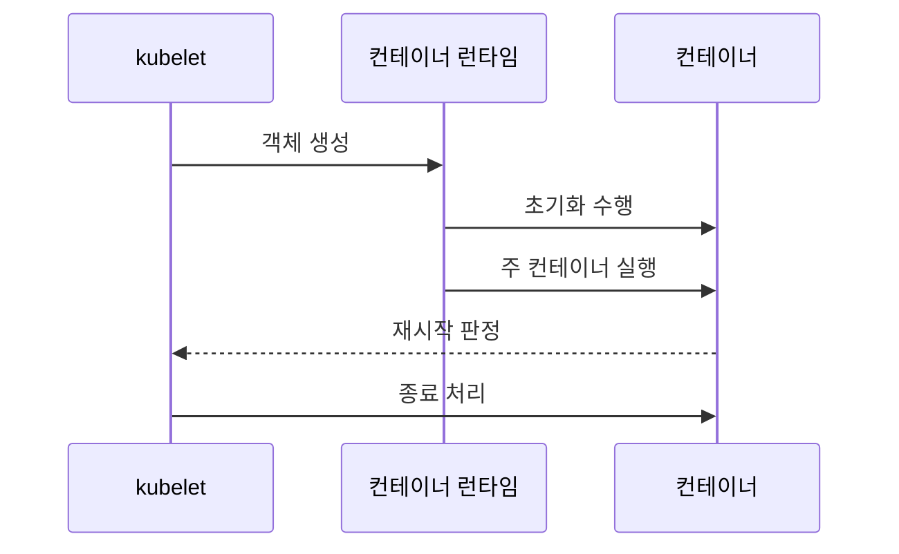

---
sidebar:
  order: 153
  label: "153. 쿠버네티스 Pod 생명주기 (Kubernetes Pod Lifecycle)"
  badge:
    text: "기출 · 30%"
    variant: note
title: "쿠버네티스 Pod 생명주기 (Kubernetes Pod Lifecycle)"
date: "2026-07-25T00:40:00+09:00"
tags:
  - "notes-software"
weight: 153
extra:
  question_no: "153"
  source_status: "기출"
  source_history: "123회"
  priority: 30
  priority_note: "포드 상태 전이는 쿠버네티스 세부 절차에 해당함"
---

## 미리 알고가기

- **파드(Pod)**: 같은 노드에서 네트워크·저장 공간을 공유하는 최소 컨테이너 실행 단위
- **포드 단계(Pod Phase)**: 대기(Pending)·실행(Running)·성공(Succeeded)·실패(Failed)·불명(Unknown)으로 구분되는 상위 실행 상태
- **컨테이너 상태(Container State)**: 대기(Waiting)·실행(Running)·종료(Terminated)로 구분되는 개별 컨테이너의 실행 단계
- **Pod 조건(Pod Condition)**: 스케줄·초기화·준비 같은 상태의 참·거짓과 변경 이유를 기록한 값
- **재시작 정책(restartPolicy)**: ‘리스타트 폴리시’로 읽고 쿠버네티스 명세 필드의 소문자·합성어 관례를 따른 표기이며 항상(Always)·실패 시(OnFailure)·안 함(Never) 중 재시작 조건을 정함
- **지수 백오프(Exponential Backoff)**: 반복 실패할수록 재시도 대기시간을 일정 배수로 늘리는 제어
- **시작·활성·준비 프로브(Startup·Liveness·Readiness Probe)**: 시작 완료, 재시작 필요, 트래픽 수신 가능 여부를 각각 검사함
- **초기화 컨테이너(Init Container)**: 주 컨테이너보다 먼저 순서대로 실행되어 초기 작업을 완료하는 컨테이너
- **고유 식별자(Unique Identifier, UID)**: ‘유아이디’로 읽고 영문 핵심어의 머리글자를 딴 표기이며 포드 객체를 같은 이름의 재생성 객체와 구분하는 불변 식별값
- **종료 유예시간(Termination Grace Period)**: 삭제 요청 뒤 정상 정리를 기다렸다가 강제 종료하기 전까지의 시간
- **종료 전 훅(preStop Hook)·종료 신호(TERM Signal)**: ‘프리스톱·텀’으로 읽고 명세 필드의 소문자 합성어와 Terminate의 축약 관례를 따른 표기이며 컨테이너가 연결과 상태를 정리하도록 종료 직전에 실행·전달하는 알림

## Ⅰ. 개요

- **정의/개념**: Pod 생성부터 실행·재시작·종료까지의 상태 전이
- **배경/필요성**: 실행·트래픽 가능 상태 차이로 프로브 구분 필요

### 쉽게 이해하기 (학습용)
- 생성 요청부터 실행과 재시작 및 종료까지의 상태를 기록함

## Ⅱ. 특징

- Pod 단계는 구간, 컨테이너 상태는 원인을 기록한다.
- 준비 실패는 제외, 활성 실패는 컨테이너 재시작한다.

### 쉽게 이해하기 (학습용)
- 실행 상태라고 즉시 트래픽을 받는 것은 아니며 준비를 봄

## Ⅲ. 아키텍처 및 구성요소

| 설계 요소 | 설명 |
|:---|:---|
| Pod phase·컨테이너 상태 | 생명주기를 요약하고 대기 및 종료 원인을 기록함 |
| Pod conditions | 조건별 참과 거짓을 표시함 |
| restartPolicy·Backoff | 종료 원인에 따른 재시작 대기시간을 정함 |
| Startup·Liveness·Readiness Probe | 시작과 생존 및 수신 가능 상태를 각각 판정함 |
| 종료 유예·훅 | 종료 전 연결 정리와 마감 시간 제공 |

> 요약: 상위 상태는 phase가, 세부 제어는 프로브가 결정함

### 쉽게 이해하기 (학습용)
- 상태표와 프로브 및 재시작 규칙이 파드 결과를 설명함

## Ⅳ. 원리 및 절차 흐름도

| 절차 | 설명 |
|:---|:---|
| 객체 생성 | Pod 샌드박스·네트워크 준비 |
| 초기화 수행 | 초기화 컨테이너를 순서대로 완료 |
| 주 컨테이너 실행 | 프로브로 시작·활성·준비 판정 |
| 재시작 판정 | 종료 원인과 restartPolicy 비교 |
| 종료 처리 | 유예시간 뒤 최종 단계 확정 |

> 요약: 준비 결과와 재시작 정책이 최종 상태를 가름

### 쉽게 이해하기 (학습용)
- 준비 후 동작하며 실패 시 정책에 따라 재시도함

## Ⅴ. 종류 및 비교

| 비교축 | 준비 구간 | 실행 구간 | 종료·불명 구간 |
|:---|:---|:---|:---|
| 핵심 특징 | 대기 상태로 표시됨 | 실행 상태로 표시됨 | 완료나 실패 등으로 표시됨 |
| 적용 기준 | 노드 미배정이나 초기 지연일 때 | 트래픽 처리와 재시작 여부 확인 시 | 임무 완료나 비정상 종료 판단 시 |
| 주요 위험 | 준비 검사 오판 | 재시작 루프·자원 부족 | 종료 지연·상태 원인 은폐 |

> 요약: phase는 구간을 나누고 원인은 세부 조건에서 확인함

### 쉽게 이해하기 (학습용)
- phase는 대략적인 구간이며 실제 원인은 조건에서 찾음

## Ⅵ. 실무 사례

1. API Pod는 준비·활성 프로브를 분리해 트래픽 보호
2. 배치 Pod는 종료 코드·restartPolicy로 재실행 결정

### 쉽게 이해하기 (학습용)
- API는 준비되기 전 요청을 받지 않고 멈춘 컨테이너만 다시 시작한다.
- 배치 작업은 종료 결과에 따라 같은 Pod에서 다시 실행할지 정한다.

## Ⅶ. 결론

- 트래픽은 준비 상태, 복구는 활성·종료 원인으로 결정

### 쉽게 이해하기 (학습용)
- Running만 보지 말고 준비 여부와 재시작 원인을 함께 확인한다.
