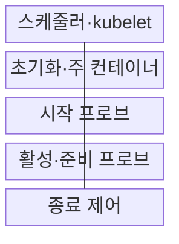
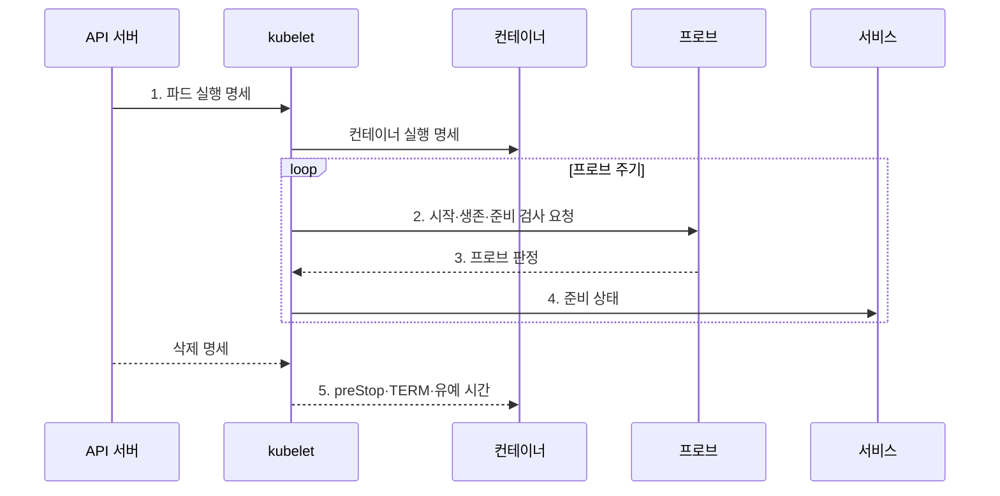

---
sidebar:
  order: 153
  label: "153. 쿠버네티스 Pod 생명주기 (Kubernetes Pod Lifecycle)"
  badge:
    text: "기출 · 30%"
    variant: note
title: "쿠버네티스 Pod 생명주기 (Kubernetes Pod Lifecycle)"
date: "2026-07-30T23:47:33+09:00"
tags: ["notes-software"]
weight: 153
extra:
  question_no: "153"
  source_status: "기출"
  source_history: "123회"
  priority: 30
  priority_note: "파드 상태 전이와 프로브 역할 구분 출제"
---

## 미리 알고가기

- **파드(Pod)**: 네트워크와 저장 공간을 공유하는 최소 컨테이너 배포 단위
- **파드 단계(Pod Phase)**: Pending·Running·Succeeded·Failed·Unknown으로 나타내는 상위 실행 상태
- **컨테이너 상태(Container State)**: Waiting·Running·Terminated로 나타내는 개별 컨테이너 상태
- **파드 조건(Pod Condition)**: 스케줄·초기화·준비 상태의 참·거짓과 변경 이유를 기록한 값
- **재시작 정책(restartPolicy)**: Always·OnFailure·Never 중 컨테이너 재시작 조건을 정하는 명세
- **지수 백오프(Exponential Backoff)**: 반복 실패할수록 재시도 대기 시간을 늘리는 제어
- **시작 프로브(Startup Probe)**: 느린 애플리케이션의 시작 완료 여부를 검사하는 진단
- **활성 프로브(Liveness Probe)**: 컨테이너의 복구 불가능 상태를 검사해 재시작을 결정하는 진단
- **준비 프로브(Readiness Probe)**: 파드의 트래픽 수신 가능 여부를 검사하는 진단
- **초기화 컨테이너(Init Container)**: 주 컨테이너보다 먼저 순서대로 실행되는 컨테이너
- **종료 유예 시간(Termination Grace Period)**: 삭제 요청 후 강제 종료 전까지 정상 정리를 기다리는 시간
- **preStop 훅**: 컨테이너 종료 직전에 연결과 상태 정리를 요청하는 처리
- **TERM 신호**: 프로세스에 정상 종료를 요청하는 운영체제 신호
- **응용 프로그래밍 인터페이스(Application Programming Interface, API)**: 쿠버네티스 객체를 정해진 형식으로 조회·변경하는 규약
- **kubelet**: 노드에 배정된 파드를 실행하고 상태를 API 서버에 보고하는 에이전트
- **서비스 엔드포인트(Service Endpoint)**: 서비스가 트래픽을 전달할 준비된 파드의 주소 목록
- **멱등 처리(Idempotent Processing)**: 같은 요청을 반복해도 최종 상태가 한 번 처리한 결과와 같은 성질

## Ⅰ. 개요

- 정의/개념: 파드 생성부터 종료까지 **실행·준비·복구 상태**를 관리하는 생명주기 모델
- 배경/필요성: 단일 실행 상태만으로는 **재시작·트래픽 허용** 판단 분리 불가

### 쉽게 이해하기 (학습용)

- 프로그램이 켜진 상태와 손님을 받을 준비가 된 상태는 다르므로 파드는 실행, 생존, 준비 여부를 서로 다른 신호로 표현한다.

## Ⅱ. 특징

- **파드 단계·조건**과 **컨테이너 상태**의 계층 표현
- 시작·활성·준비 **프로브 역할 분리**
- preStop·TERM과 유예 시간에 따른 **정상 종료**

### 쉽게 이해하기 (학습용)

- 시작이 늦은 상황, 멈춘 상황, 잠시 요청을 받지 못하는 상황을 구분해야 불필요한 재시작과 서비스 단절을 줄일 수 있다.

## Ⅲ. 구조 및 구성요소

| 구성요소 | 책임 |
|:---|:---|
| 스케줄러·kubelet | 노드 배정·**컨테이너 실행** |
| 초기화·주 컨테이너 | **선행 작업·업무 처리** |
| 시작 프로브 | **느린 시작** 보호 |
| 활성·준비 프로브 | **재시작·트래픽** 판정 |
| 종료 제어 | **정상 정리·강제 종료** |

### 쉽게 이해하기 (학습용)

- kubelet이 현장 관리자라면 초기화 컨테이너는 개점 준비, 프로브는 안전·영업 검사, 종료 제어는 폐점 정리 절차에 해당한다.

## Ⅳ. 흐름도

**동작 원리**

1. **파드 실행 명세**: 배정 노드의 컨테이너·자원·재시작 정책 확정
2. **시작·생존·준비 검사 요청**: 수명주기별 독립 상태 측정
3. **프로브 판정**: 재시작·트래픽 허용 근거 생성
4. **준비 상태**: 서비스 엔드포인트 포함 여부 갱신
5. **preStop·TERM·유예 시간**: 연결 정리 후 강제 종료 시점 적용

### 쉽게 이해하기 (학습용)

- 파드가 시작되면 kubelet은 세 가지 검사를 반복하고, 준비 검사 결과만 서비스에 반영해 요청 차단과 프로세스 재시작을 분리한다.

## Ⅴ. 종류 및 비교

| 프로브 유형 | Startup Probe | Liveness Probe | Readiness Probe |
|:---|:---|:---|:---|
| 적용 기준 | **느린 애플리케이션 시작** | **내부 복구 불가 상태** | **트래픽 수신 가능성** |
| 핵심 특징 | 성공 전 **다른 검사 유예** | 실패 시 **컨테이너 재시작** | 실패 시 **엔드포인트 제외** |
| 한계 | 설정 과다 시 **기동 지연** | 외부 장애 시 **재시작 폭주** | 오판 시 **가용 파드 감소** |

### 쉽게 이해하기 (학습용)

- 시작 검사는 기다릴 시간을, 활성 검사는 다시 켤 조건을, 준비 검사는 요청을 보낼 조건을 각각 결정한다.

## Ⅵ. 실무 고려사항 및 대책

| 고려사항 | 대책 | 효과 |
|:---|:---|:---|
| 외부 장애 **연동 검사** | 활성 검사를 **내부 상태로 제한** | **재시작 폭주** 방지 |
| 긴 **초기 기동 시간** | 시작 검사 **주기·임계값 산정** | **조기 종료** 방지 |
| **준비 파드 급감** | 완화 임계값·**최소 용량 확보** | 엔드포인트 **전멸 방지** |
| 처리 중 **요청 단절** | 준비 해제·**preStop·유예 확보** | **연결 정상 종료** |
| 재시작 시 **로컬 상태 손실** | **외부 저장·멱등 처리** 적용 | 중복·**데이터 손실 축소** |

### 쉽게 이해하기 (학습용)

- 데이터베이스가 잠시 느리다는 이유로 모든 컨테이너를 재시작하지 않도록 활성 검사는 내부 고장만 보고 준비 검사로 트래픽부터 걷어 내야 한다.

## Ⅶ. 결론

- 기동·생존·트래픽 상태에 맞춰 **프로브 역할**과 **종료 유예** 설정

### 쉽게 이해하기 (학습용)

- 느린 시작은 기다리고 내부 정지는 재시작하며 외부 의존 장애는 요청만 차단하는 기준으로 파드 생명주기를 설계해야 한다.
