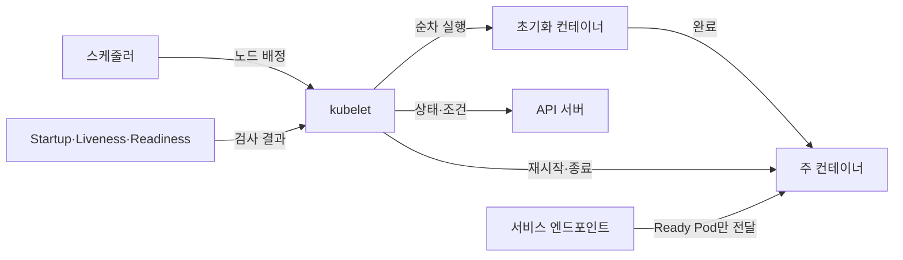
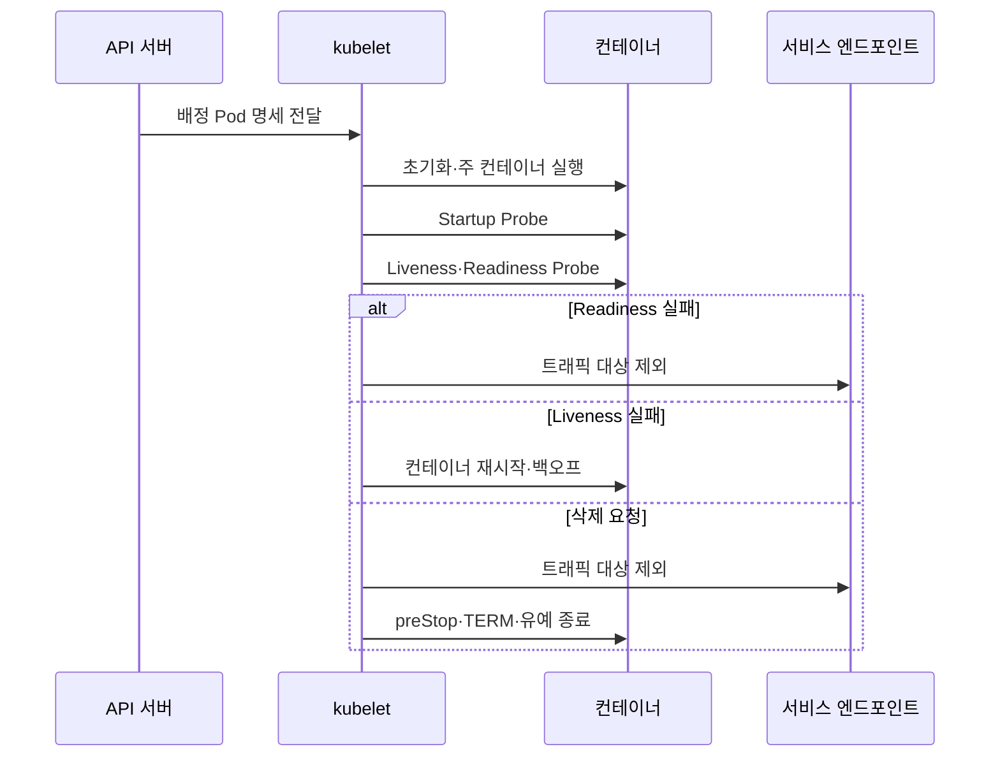

---
sidebar:
  order: 153
  label: "153. 쿠버네티스 Pod 생명주기 (Kubernetes Pod Lifecycle)"
  badge:
    text: "기출 · 30%"
    variant: note
title: "쿠버네티스 Pod 생명주기 (Kubernetes Pod Lifecycle)"
date: "2026-07-27T23:59:59+09:00"
tags: ["notes-software"]
weight: 153
extra:
  question_no: "153"
  source_status: "기출"
  source_history: "123회"
  priority: 30
  priority_note: "포드 상태 전이는 쿠버네티스 세부 절차에 해당함"
---

## 미리 알고가기

- **파드(Pod)**: 같은 노드에서 네트워크·저장 공간을 공유하는 최소 컨테이너 실행 단위
- **Pod 단계(Pod Phase)**: Pending·Running·Succeeded·Failed·Unknown으로 구분하는 Pod의 상위 실행 상태
- **컨테이너 상태(Container State)**: Waiting·Running·Terminated로 구분하는 개별 컨테이너의 현재 실행 상태
- **Pod 조건(Pod Condition)**: 스케줄·초기화·준비 상태의 참·거짓과 변경 이유를 기록한 값
- **재시작 정책(restartPolicy)**: ‘리스타트 폴리시’로 읽는 공식 명세 필드이며, Always·OnFailure·Never 중 컨테이너 재시작 조건을 정함
- **지수 백오프(Exponential Backoff)**: 반복 실패할수록 재시도 대기 시간을 배수로 늘리는 제어
- **시작 프로브(Startup Probe)**: 느린 애플리케이션의 시작 완료 여부를 검사하고 완료 전 활성·준비 검사를 유예함
- **활성 프로브(Liveness Probe)**: 컨테이너가 복구 불가능한 비정상 상태인지 검사해 실패 시 재시작하게 함
- **준비 프로브(Readiness Probe)**: Pod가 서비스 트래픽을 받을 준비가 됐는지 검사해 실패 시 엔드포인트에서 제외함
- **초기화 컨테이너(Init Container)**: 주 컨테이너보다 먼저 순서대로 실행되어 초기 작업을 완료하는 컨테이너
- **종료 유예 시간(Termination Grace Period)**: 삭제 요청 후 정상 정리를 기다렸다가 강제 종료하기 전까지의 시간
- **preStop 훅·TERM 신호**: ‘프리스톱·텀’으로 읽으며, 컨테이너가 연결·상태를 정리하도록 종료 직전에 실행·전달하는 알림

## Ⅰ. 개요

- **정의/개념**: Pod 생성부터 **배치·실행·재시작·종료의 상태 전이**
- **기존 한계**: 실행 상태만으로는 **트래픽 준비·복구 필요성 판별 불가**

### 쉽게 이해하기 (학습용)

- 프로그램이 켜졌다는 사실과 손님을 받을 준비가 됐다는 사실을 분리해 생성부터 종료까지 관리한다.

## Ⅱ. 특징

- Pod phase와 **컨테이너 상태·조건 분리**
- 프로브별 **시작·활성·트래픽 준비 판정**
- restartPolicy·백오프의 **재시작 통제**

### 쉽게 이해하기 (학습용)

- 전체 진행 단계와 개별 컨테이너 원인을 따로 기록하고, 문제 종류에 따라 트래픽만 빼거나 컨테이너를 다시 시작한다.

## Ⅲ. 아키텍처 및 구성요소

| 구성요소 | 책임 |
|:---|:---|
| 스케줄러 | Pending Pod의 **노드 배정** |
| kubelet | 컨테이너의 **실행·프로브·상태 보고** |
| 초기화 컨테이너 | 주 실행 전 **선행 작업 완료** |
| 프로브 | 시작·활성·**트래픽 준비 판정** |
| 재시작 정책 | 종료 원인별 **재시작 여부 결정** |
| 서비스 엔드포인트 | Ready Pod만 **트래픽 대상 포함** |

> 요약: kubelet이 프로브 결과로 재시작하고 Ready가 트래픽을 통제

### 쉽게 이해하기 (학습용)

- 현장 관리자가 준비 작업과 본 작업을 실행하고 건강 검사를 보며 재시작 여부와 손님을 받을 대상을 정한다.

## Ⅳ. 원리 및 절차 흐름

| 절차 | 설명 |
|:---|:---|
| Pod 명세 전달 | 배정 노드의 **실행 책임 부여** |
| 초기화·주 실행 | 선행 작업 후 **응용 컨테이너 기동** |
| 시작 검사 | 느린 응용의 **기동 완료 확인** |
| 활성·준비 검사 | 복구 필요와 **트래픽 가능성 분리** |
| 재시작·백오프 | 활성 실패의 **지연 재기동** |
| 정상 종료 | 엔드포인트 제외 후 **훅·신호·유예 적용** |

> 요약: 준비 실패는 트래픽 제외, 활성 실패는 컨테이너 재시작

### 쉽게 이해하기 (학습용)

- 준비가 안 됐으면 손님만 받지 않고, 작동 불능이면 다시 켜며, 종료할 때는 새 손님을 막고 기존 작업을 정리한다.

## Ⅴ. 종류 및 비교

| 상태 검사 | Startup Probe | Liveness Probe | Readiness Probe |
|:---|:---|:---|:---|
| 적용 기준 | 시작이 느린 **초기 기동 보호** | 교착·불능의 **자동 복구** | 의존성·과부하의 **트래픽 차단** |
| 핵심 특징 | 성공 전 **다른 프로브 유예** | 실패 시 **컨테이너 재시작** | 실패 시 **서비스 대상 제외** |
| 한계 | 임계값 과대·**장애 탐지 지연** | 오판 시 **불필요한 재시작** | 오판 시 **가용 용량 감소** |

> 요약: 기동 완료·프로세스 복구·트래픽 준비 목적을 분리

### 쉽게 이해하기 (학습용)

- 시작 검사는 준비 시간을 보호하고 활성 검사는 다시 켤지, 준비 검사는 손님을 받을지 결정한다.

## Ⅵ. 실무 사례

1. 느린 Java 기동은 **Startup Probe**로 조기 재시작 방지
2. DB 연결 장애는 **Readiness Probe**로 트래픽 대상 제외

### 쉽게 이해하기 (학습용)

- 시작 시간이 긴 서버는 충분히 기다리고 데이터베이스 연결이 끊긴 서버는 재시작보다 먼저 요청 배분에서 뺀다.

## Ⅶ. 결론

- 시작 보호는 **Startup**, 복구는 **Liveness**, 트래픽은 **Readiness**

### 쉽게 이해하기 (학습용)

- 프로세스가 실행 중이라는 이유만으로 트래픽을 보내지 말고 각 프로브의 제어 결과를 구분한다.
