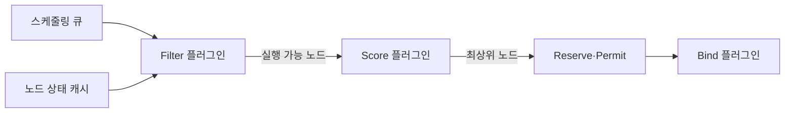
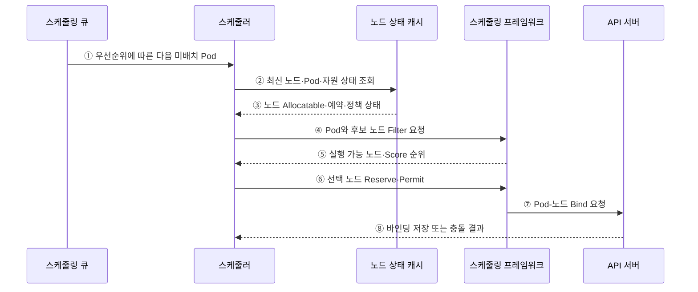

---
sidebar:
  order: 154
  label: "154. 쿠버네티스 Pod 스케줄링 (Kubernetes Pod Scheduling)"
  badge:
    text: "기출 · 70%"
    variant: note
title: "쿠버네티스 Pod 스케줄링 (Kubernetes Pod Scheduling)"
date: "2026-07-27T23:59:59+09:00"
tags:
  - "notes-software"
weight: 154
extra:
  question_no: "154"
  source_status: "기출"
  source_history: "135회"
  priority: 70
  priority_note: "배치 조건·우선순위·축출 판단이 최근 출제됨"
---

## 미리 알고가기

- **파드(Pod)**: 같은 노드에 함께 배치되는 최소 컨테이너 실행 단위
- **응용 프로그래밍 인터페이스 서버(Application Programming Interface Server, API Server)**: ‘에이피아이 서버’로 읽고 세 영문 핵심어의 머리글자를 딴 표기이며 포드·노드 객체를 검증·저장하고 바인딩 변경을 받는 제어면 진입점
- **쿠버네티스 스케줄러(Kubernetes Scheduler)**: 미배치 Pod의 조건을 만족하는 노드를 선택해 바인딩하는 제어면 구성요소
- **미배치 포드(Unscheduled Pod)·`.spec.nodeName`**: 필드 경로는 ‘닷 스펙 닷 노드 네임’으로 읽고 점(.)으로 객체 계층을 잇는 관례 표기이며 해당 노드 이름 필드가 없어 스케줄링 큐에서 선택을 기다리는 포드를 뜻함
- **자원 요청값·할당 가능량(Resource Request·Allocatable)**: 요청값은 포드 예약량이고 할당 가능량은 노드가 포드에 배정할 수 있는 CPU·메모리 총량
- **중앙처리장치(Central Processing Unit, CPU)**: ‘시피유’로 읽고 세 영문 단어의 머리글자를 딴 표기이며 스케줄러가 포드 요청값과 노드 할당 가능량을 비교하는 처리 자원
- **필터·점수(Filter·Score)**: 필터는 필수 조건 위반 노드를 제외하고 점수는 남은 노드를 선호 규칙으로 순위화함
- **테인트·톨러레이션(Taint·Toleration)**: 테인트는 노드의 거부 조건이고 톨러레이션은 Pod가 그 조건을 허용한다는 선언
- **친밀도(Affinity)**: Pod·노드 특성에 따른 공동·분리 배치의 필수 조건과 선호를 표현하는 규칙
- **토폴로지 분산(Topology Spread)**: 영역·노드별 Pod 수 편차를 제한해 복제본을 분산하는 규칙
- **큐 정렬(QueueSort)**: 우선순위와 대기 상태로 다음에 처리할 Pod 순서를 정하는 스케줄링 단계
- **예약·허가·바인딩(Reserve·Permit·Bind)**: 선택 노드 자원을 임시 예약하고 실행을 허가한 뒤 Pod에 노드 이름을 기록하는 단계
- **그래픽처리장치(Graphics Processing Unit, GPU)**: ‘지피유’로 읽고 세 영문 단어의 머리글자를 딴 표기이며 포드가 확장 자원으로 요청할 수 있는 병렬 연산 가속기

## Ⅰ. 개요

- 쿠버네티스 Pod 스케줄링은 미배치 Pod의 자원·정책 필수 조건을 만족하는 노드를 거른 뒤 선호 점수를 비교해 실행 노드를 바인딩하는 제어 과정이다.
- 수동 배치의 자원 편중과 정책 위반을 QueueSort·Filter·Score·Reserve·Permit·Bind 단계의 반복 가능한 결정으로 줄인다.

### 쉽게 이해하기 (학습용)
- 실행할 수 없는 노드를 먼저 빼고 남은 곳 중 가장 알맞은 곳을 고른다.

## Ⅱ. 특징

- **필수와 선호 분리**: 자원·필수 Affinity·Taint는 Filter에서 가능성을, 선호 Affinity·분산은 Score에서 순위를 정한다.
- **요청값 기반 판단**: 실제 순간 사용량이 아니라 Pod Request와 노드 Allocatable·기존 예약량으로 수용 가능성을 계산한다.
- **프레임워크 단계**: QueueSort→Filter→Score→Reserve→Permit→Bind 플러그인으로 선택 과정을 확장한다.
- **배정과 실행 분리**: 스케줄러는 `.spec.nodeName`을 기록하고 실제 이미지·컨테이너 실행은 선택 노드의 kubelet이 수행한다.
- **대기·재시도**: 가능한 노드가 없으면 Pending으로 두고 자원·정책·노드 상태 변화 때 다시 평가한다.

### 쉽게 이해하기 (학습용)
- 꼭 필요한 조건과 있으면 좋은 조건을 나눠야 대기 원인을 찾을 수 있다.

## Ⅲ. 아키텍처 및 구성요소

**도표안 A — 구조도**

**도표안 B — sequenceDiagram**

| 설계 요소 | 설명 |
|:---|:---|
| 스케줄링 큐·상태 캐시 | 미배치 Pod 순서와 Pod·노드·자원·정책 상태 제공 |
| Filter 플러그인 | Request·Affinity·Taint·포트·볼륨 등 필수 조건 검사 |
| Score 플러그인 | 자원 균형·지역성·분산·선호를 정규화·가중 합산 |
| Reserve·Permit | 바인딩 전 가정한 자원을 예약하고 승인·대기·거부 |
| Bind 플러그인 | 선택 노드를 Pod 바인딩으로 API 서버에 기록 |

**동작 원리**

- ① 스케줄링 큐가 우선순위와 대기 상태에 따라 다음 미배치 Pod를 스케줄러에 제공한다.
- ② 스케줄러가 캐시에서 최신 노드·실행 Pod·자원·정책 상태를 조회한다.
- ③ 캐시가 노드별 Allocatable·기존 Request·Label·Taint·토폴로지 정보를 반환한다.
- ④ 스케줄러가 대상 Pod와 후보 노드를 스케줄링 프레임워크의 Filter 단계에 전달한다.
- ⑤ 프레임워크가 필수 조건을 통과한 노드만 Score하고 가중 순위와 실패 이유를 반환한다.
- ⑥ 스케줄러가 최상위 노드를 가정해 자원을 Reserve하고 Permit 플러그인의 승인·대기·거부를 처리한다.
- ⑦ 승인되면 Bind 플러그인이 Pod와 선택 노드의 바인딩을 API 서버에 요청한다.
- ⑧ API 서버가 `.spec.nodeName` 반영 성공 또는 동시 상태 변경에 따른 충돌을 반환하며, 실패하면 예약을 해제하고 재시도한다.

### 쉽게 이해하기 (학습용)

- 대기표에서 작업을 꺼내 필수 조건으로 후보를 거르고 선호 점수로 자리를 확정한다.

## Ⅳ. 종류 및 비교

| 비교 항목 | Filter | Score |
|:---|:---|:---|
| 판단 질문 | 이 Pod를 이 노드에서 실행할 수 있는가 | 실행 가능 노드 중 어디가 더 좋은가 |
| 결과 | 통과 또는 실패 이유 | 정규화된 점수와 가중 합계 |
| 대표 조건 | 자원·필수 Affinity·Taint·포트·볼륨 | 선호 Affinity·자원 균형·이미지 지역성·분산 |
| 실패 영향 | 모든 노드 탈락 시 Pod Pending | 순위가 낮아질 뿐 실행 가능성은 유지 |
| 설계 위험 | 과도하거나 모순된 필수 조건 | 가중치 편향·특정 노드 집중 |

> Toleration은 Taint를 허용할 뿐 그 노드를 반드시 선택하게 하지 않으므로 Node Affinity·자원·Score 정책과 함께 해석해야 한다.

### 쉽게 이해하기 (학습용)
- Filter는 못 가는 곳을 빼고 Score는 갈 수 있는 곳의 순서를 정한다.

## Ⅴ. 실무 고려사항 및 대책

| 고려사항 | 위험 | 대책 |
|:---|:---|:---|
| Request | 실제 필요보다 과대·과소해 낭비·경합 | 사용 분포·성능 기반 요청값·VPA 권고 |
| 필수 제약 | Affinity·Taint·볼륨 조건 충돌 | Pending Event·플러그인 실패 이유·조건 최소화 |
| 우선순위 | 고우선 Pod가 저우선 Pod를 반복 축출 | 클래스 기준·중단 예산·기아 관찰 |
| 분산 | 복제본이 한 영역·노드에 집중 | Topology Spread·Anti-affinity·용량 확보 |
| 확장 연계 | 맞는 노드 풀이 없어 계속 Pending | 노드 자동 확장·템플릿 Label/Taint 일치 |
| 특수 자원 | GPU 종류·드라이버·토폴로지 불일치 | 확장 자원·Node Label·플러그인·사전 검증 |

> **적용 사례**: GPU Pod는 가속기 확장 자원과 호환 노드 Label을 필수로 두되 공급 가능한 노드 풀이 실제로 확장되는지 Pending 이벤트와 함께 시험한다.

### 쉽게 이해하기 (학습용)
- GPU 없는 노드는 빼되 조건에 맞는 GPU 노드가 실제 생길 수 있어야 한다.

## Ⅵ. 결론

- Pod 스케줄링의 핵심은 실행 가능한 노드를 Filter로 보장하고 그 안에서 Score로 배치 품질을 높인 뒤 원자적으로 바인딩하는 데 있다.
- Request·Affinity·Taint·토폴로지·우선순위·노드 확장의 상호작용과 Pending 실패 이유를 함께 검증해야 한다.

### 쉽게 이해하기 (학습용)
- 실행 불가 조건은 Filter에, 더 좋은 위치 조건은 Score에 둔다.
