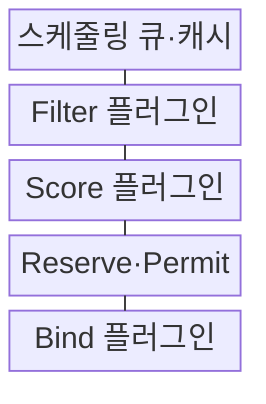
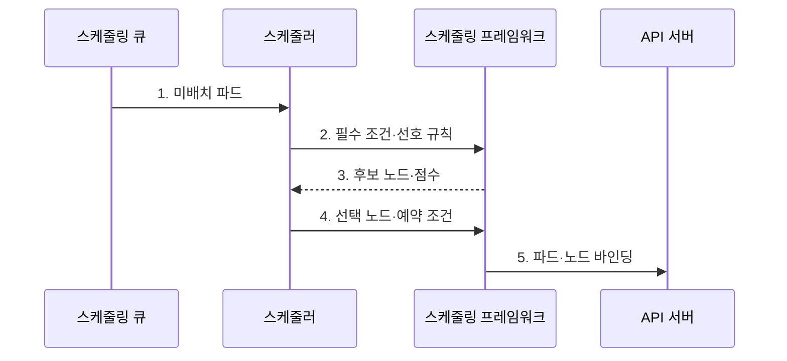

---
sidebar:
  order: 154
  label: "154. 쿠버네티스 Pod 스케줄링 (Kubernetes Pod Scheduling)"
  badge:
    text: "기출 · 70%"
    variant: note
title: "쿠버네티스 Pod 스케줄링 (Kubernetes Pod Scheduling)"
date: "2026-08-02T12:00:00+09:00"
tags:
  - "notes-software"
weight: 154
extra:
  question_no: "154"
  source_status: "기출"
  source_history: "135회"
  priority: 70
  priority_note: "배치 조건·우선순위·축출 판단이 최근 출제됨"
---

## Ⅰ. 개요

핵심 용어

- **실행 노드**: 스케줄링은 미배치 파드의 요구 조건을 만족하는 실행 노드를 선택하는 과정이다.

- 정의/개념: 필수 조건으로 노드를 거르고 선호 점수로 **실행 노드**를 선택하는 배치 절차
- 배경/필요성: 수동 배치는 노드 **용량 편중·필수 정책 위반** 유발

### 쉽게 이해하기 (학습용)
- 좌석 배정처럼 필수 조건에 맞지 않는 노드를 먼저 제외한 뒤 남은 후보의 점수를 비교하면 대기 원인과 선택 이유가 분명해진다.

## Ⅱ. 특징

핵심 용어

- **자원 요청값·할당 가능량**: 스케줄러는 파드의 자원 요청값과 노드의 할당 가능량을 비교해 수용 가능성을 판단한다.

- **필수·선호 분리** 기반 후보 선별
- **자원 요청값·할당 가능량** 기반 수용량 계산
- **플러그인 단계** 기반 정책 확장

### 쉽게 이해하기 (학습용)
- GPU처럼 반드시 필요한 조건은 필터에 두고 같은 영역 선호처럼 선택 가능한 조건은 점수에 두어야 파드가 불필요하게 대기하지 않는다.

## Ⅲ. 구조 및 구성요소

핵심 용어

- **Filter 플러그인**: Filter 플러그인은 필수 조건을 만족하지 못하는 노드를 후보에서 제외한다.

| 구성요소 | 책임 |
|:---|:---|
| 스케줄링 큐·캐시 | 파드 순서·**노드 상태 제공** |
| Filter 플러그인 | **필수 배치 조건** 검사 |
| Score 플러그인 | 후보 노드 **선호 순위 계산** |
| Reserve·Permit | **선택 노드 예약·실행 허가** |
| Bind 플러그인 | **파드·노드 관계** 기록 |

### 쉽게 이해하기 (학습용)

- 대기열은 접수 창구, 필터는 입장 조건 검사, 점수는 좌석 선호 계산, 바인딩은 최종 좌석표 기록에 해당한다.

## Ⅳ. 흐름도

핵심 용어

- **3. 후보 노드·점수**: 필터링을 통과한 후보 노드에 점수를 매겨 가장 적합한 노드를 선택한다.

**동작 원리**

1. **미배치 파드**: 우선순위·대기 상태에 따라 다음 배치 대상 선택
2. **필수 조건·선호 규칙**: 요청량·테인트·친밀도 조건 전달
3. **후보 노드·점수**: 필수 조건 통과 노드의 선호 순위 산출
4. **선택 노드·예약 조건**: 가정 자원 확보와 실행 허가
5. **파드·노드 바인딩**: 선택 노드 이름의 API 기록

### 쉽게 이해하기 (학습용)

- 파드 하나를 대기열에서 꺼낸 뒤 실행 불가능한 노드를 버리고 남은 후보를 채점해 가장 높은 노드를 객체에 기록한다.

## Ⅴ. 종류 및 비교

핵심 용어

- **Score**: Score 단계는 선호 조건과 자원 균형 등을 평가해 후보 노드의 우선순위를 정한다.

| 스케줄링 단계 | Filter | Score |
|:---|:---|:---|
| 적용 기준 | **실행 가능 여부 판정** | **가능 노드 선호 순위** |
| 핵심 특징 | 자원·필수 **친밀도·테인트 검사** | 자원 균형·**분산 점수** |
| 한계 | 조건 충돌 시 **장기 미배치** | **가중치 편향·노드 집중** |

### 쉽게 이해하기 (학습용)
- 필터 조건을 지나치게 좁히면 후보 자체가 사라지고 점수 조건만 바꾸면 파드는 실행되면서 배치 위치만 달라진다.

## Ⅵ. 실무 고려사항 및 대책

핵심 용어

- **필수 조건 충돌**: 필수 조건 충돌은 노드 선택자, 어피니티, 테인트 허용 조건 등이 동시에 충족되지 않아 배치가 막히는 문제다.

| 문제 | 대책 | 효과 |
|:---|:---|:---|
| 실사용량과 다른 **요청값**으로 노드 낭비·경합 | 사용 분포·**VPA 권고**로 요청값 산정 | **자원 낭비·노드 경합** 감소 |
| 친밀도·테인트의 **필수 조건 충돌**로 후보 소멸 | 미배치 사유 확인 후 **필수 조건 최소화** | **장기 미배치** 해소 |
| 낮은 우선순위 파드의 반복 축출로 **기아** 발생 | 우선순위 등급·**대기 시간** 감시 | **반복 축출·기아** 완화 |
| 복제본의 노드 집중으로 단일 장애 영향 확대 | **토폴로지 분산·반친밀도** 적용 | 노드·영역별 **장애 영향** 분산 |
| 자동 확장 노드의 레이블·테인트 불일치 | 노드 **템플릿·배치 조건** 동기화 | 확장 후 **미배치** 방지 |

### 쉽게 이해하기 (학습용)
- GPU 파드에 필수 레이블을 요구했다면 노드 자동 확장 템플릿에도 같은 레이블과 자원 정보가 있어야 새 노드가 생긴 뒤 배치된다.

## Ⅶ. 결론

핵심 용어

- **배치 선호**: 배치 선호는 반드시 충족할 필요는 없지만 만족할수록 높은 점수를 주는 스케줄링 기준이다.

- 자원·**필수 조건**은 필터, **배치 선호**는 점수, 용량 부족은 노드 확장으로 처리

### 쉽게 이해하기 (학습용)
- 실행 불가능 조건은 필터에만 두고 장애 분산 같은 선호는 점수로 표현해야 가용 후보를 유지하면서 배치 품질을 높일 수 있다.
