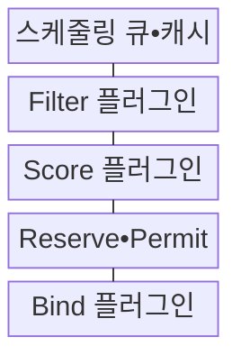
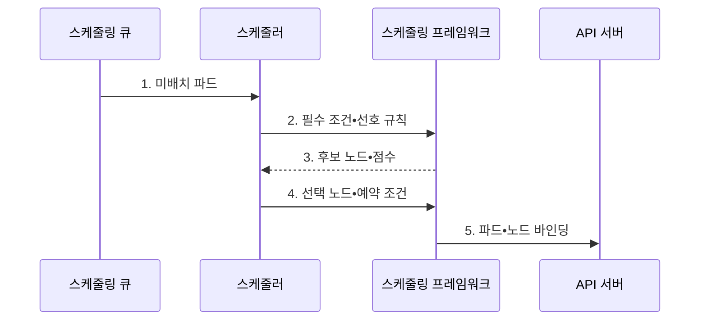

---
sidebar:
  order: 154
  label: "154. 쿠버네티스 Pod 스케줄링 (Kubernetes Pod Scheduling)"
  badge:
    text: "기출 • 70%"
    variant: note
title: "쿠버네티스 Pod 스케줄링 (Kubernetes Pod Scheduling)"
date: "2026-08-03T08:48:47+09:00"
tags:
  - "notes-software"
weight: 154
extra:
  question_no: "154"
  source_status: "기출"
  source_history: "135회"
  priority: 70
  priority_note: "배치 조건•우선순위•축출 판단이 최근 출제됨"
---

## Ⅰ. 개요

핵심 용어

- **쿠버네티스 파드 스케줄링(Kubernetes Pod Scheduling)**: 스케줄러가 미배치 파드에 대해 필수 조건으로 후보 노드를 거르고 선호 점수로 실행 노드를 선택•바인딩하는 배치 과정이다.

- 정의/개념: 미배치 파드의 필수 조건으로 노드를 필터링하고 선호 점수로 **실행 노드** 를 선택•바인딩하는 스케줄링 절차
- 배경/필요성: 수동 배치는 노드 **용량 편중•필수 정책 위반** 유발

#### 한줄 요약
- 좌석 배정처럼 필수 조건에 맞지 않는 노드를 먼저 제외한 뒤 남은 후보의 점수를 비교하면 대기 원인과 선택 이유가 분명해진다.

## Ⅱ. 특징

핵심 용어

- **자원 요청값•할당 가능량**: 스케줄러는 파드의 자원 요청값과 노드의 할당 가능량을 비교해 수용 가능성을 판단한다.
- **필수•선호 분리**: 반드시 만족해야 하는 조건은 필터로, 만족할수록 좋은 조건은 점수로 표현하는 원칙이다.
- **플러그인 단계**: 필터•점수•예약•허가•바인딩 단계마다 스케줄링 정책을 확장하는 구조이다.

- **필수•선호 분리** 기반 후보 선별
- **자원 요청값•할당 가능량** 기반 수용량 계산
- **플러그인 단계** 기반 정책 확장

#### 한줄 요약
- GPU처럼 반드시 필요한 조건은 필터에 두고 같은 영역 선호처럼 선택 가능한 조건은 점수에 두어야 파드가 불필요하게 대기하지 않는다.

## Ⅲ. 구조 및 구성요소

핵심 용어

- **Filter 플러그인**: Filter 플러그인은 필수 조건을 만족하지 못하는 노드를 후보에서 제외한다.
- **스케줄링 큐•캐시**: 미배치 파드의 처리 순서와 최신 노드 상태를 제공하는 구성요소이다.
- **점수(Score) 플러그인**: 선호 조건과 자원 균형을 평가해 후보 노드의 순위를 계산하는 구성요소이다.
- **예약•허가(Reserve•Permit)**: 선택 노드의 자원을 가정상 확보하고 최종 실행을 허가하는 단계이다.
- **바인딩(Bind) 플러그인**: 선택한 노드와 파드의 관계를 응용 프로그래밍 인터페이스 서버에 기록하는 구성요소이다.

| 구성요소 | 책임 |
|:---|:---|
| 스케줄링 큐•캐시 | 파드 순서•**노드 상태 제공** |
| Filter 플러그인 | **필수 배치 조건** 검사 |
| Score 플러그인 | 후보 노드 **선호 순위 계산** |
| Reserve•Permit | **선택 노드 예약•실행 허가** |
| Bind 플러그인 | **파드•노드 관계** 기록 |

#### 한줄 요약

- 대기열은 접수 창구, 필터는 입장 조건 검사, 점수는 좌석 선호 계산, 바인딩은 최종 좌석표 기록에 해당한다.

## Ⅳ. 흐름도

핵심 용어

- **3. 후보 노드•점수**: 필터링을 통과한 후보 노드에 점수를 매겨 가장 적합한 노드를 선택한다.
- **응용 프로그래밍 인터페이스(Application Programming Interface, API) 서버**: 최종 파드•노드 바인딩을 클러스터 상태로 기록하는 제어면 접점이다.
- **1. 미배치 파드**: 우선순위와 대기 상태에 따라 큐에서 선택한 다음 배치 대상이다.
- **2. 필수 조건•선호 규칙**: 자원 요청량•테인트•친밀도와 선호 조건을 스케줄링 프레임워크에 전달하는 단계이다.
- **4. 선택 노드•예약 조건**: 최고 점수 노드의 자원을 가정상 확보하고 실행 허가 조건을 확인하는 단계이다.
- **5. 파드•노드 바인딩**: 선택 노드 이름을 파드 객체에 기록해 배치를 확정하는 단계이다.

**동작 원리**

1. **미배치 파드**: 우선순위•대기 상태에 따라 다음 배치 대상 선택
2. **필수 조건•선호 규칙**: 요청량•테인트•친밀도 조건 전달
3. **후보 노드•점수**: 필수 조건 통과 노드의 선호 순위 산출
4. **선택 노드•예약 조건**: 가정 자원 확보와 실행 허가
5. **파드•노드 바인딩**: 선택 노드 이름의 API 기록

#### 한줄 요약

- 파드 하나를 대기열에서 꺼낸 뒤 실행 불가능한 노드를 버리고 남은 후보를 채점해 가장 높은 노드를 객체에 기록한다.

## Ⅴ. 종류 및 비교

핵심 용어

- **Score**: Score 단계는 선호 조건과 자원 균형 등을 평가해 후보 노드의 우선순위를 정한다.
- **필터(Filter)**: 자원•필수 친밀도•테인트 허용 조건을 검사해 실행 불가능한 노드를 제외하는 단계이다.
- **노드 친밀도(Node Affinity)**: 노드 레이블을 기준으로 파드가 배치될 필수 조건이나 선호 조건을 표현하는 규칙이다.
- **테인트•톨러레이션(Taint•Toleration)**: 노드가 파드를 배제하는 조건과 파드가 해당 배제를 허용하는 선언의 쌍이다.

| 스케줄링 단계 | 판정 내용 | 산출물 |
|:---|:---|:---|
| **Filter** | 자원•필수 **노드 친밀도•테인트•톨러레이션** 충족 여부 | 실행 가능한 **후보 노드 집합** |
| **Score** | 자원 균형•분산 등 **선호 규칙** | 후보별 점수와 **노드 우선순위** |

#### 한줄 요약
- 필터 조건을 지나치게 좁히면 후보 자체가 사라지고 점수 조건만 바꾸면 파드는 실행되면서 배치 위치만 달라진다.

## Ⅵ. 실무 고려사항 및 대책

핵심 용어

- **필수 조건 충돌**: 필수 조건 충돌은 노드 선택자, 어피니티, 테인트 허용 조건 등이 동시에 충족되지 않아 배치가 막히는 문제다.
- **수직형 포드 오토스케일러(Vertical Pod Autoscaler, VPA) 권고**: 사용 이력으로 산정한 적정 중앙처리장치•메모리 요청값이다.
- **기아(Starvation)**: 낮은 우선순위 작업이 반복 축출되거나 뒤로 밀려 실행 기회를 장기간 얻지 못하는 현상이다.
- **토폴로지 분산•반친밀도**: 복제본이 같은 노드•영역에 몰리지 않도록 배치 위치를 분산하는 규칙이다.

| 문제 | 대책 | 효과 |
|:---|:---|:---|
| 실사용량과 다른 **요청값** 으로 노드 낭비•경합 | 사용 분포•**VPA 권고** 로 요청값 산정 | **자원 낭비•노드 경합** 감소 |
| 친밀도•테인트의 **필수 조건 충돌** 로 후보 소멸 | 미배치 사유 확인 후 **필수 조건 최소화** | **장기 미배치** 해소 |
| 낮은 우선순위 파드의 반복 축출로 **기아** 발생 | 우선순위 등급•**대기 시간** 감시 | **반복 축출•기아** 완화 |
| 복제본의 노드 집중으로 단일 장애 영향 확대 | **토폴로지 분산•반친밀도** 적용 | 노드•영역별 **장애 영향** 분산 |
| 자동 확장 노드의 레이블•테인트 불일치 | 노드 **템플릿•배치 조건** 동기화 | 확장 후 **미배치** 방지 |

#### 한줄 요약
- GPU 파드에 필수 레이블을 요구했다면 노드 자동 확장 템플릿에도 같은 레이블과 자원 정보가 있어야 새 노드가 생긴 뒤 배치된다.

## Ⅶ. 결론

핵심 용어

- **배치 선호**: 배치 선호는 반드시 충족할 필요는 없지만 만족할수록 높은 점수를 주는 스케줄링 기준이다.

- 자원•**필수 조건** 은 필터, **배치 선호** 는 점수, 용량 부족은 노드 확장으로 처리

#### 한줄 요약
- 실행 불가능 조건은 필터에만 두고 장애 분산 같은 선호는 점수로 표현해야 가용 후보를 유지하면서 배치 품질을 높일 수 있다.
