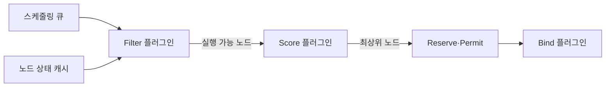
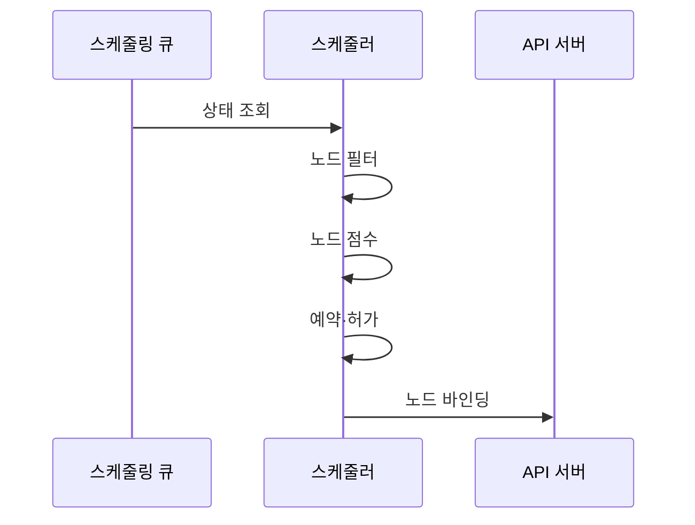

---
sidebar:
  order: 154
  label: "154. 쿠버네티스 Pod 스케줄링 (Kubernetes Pod Scheduling)"
  badge:
    text: "기출 · 70%"
    variant: note
title: "쿠버네티스 Pod 스케줄링 (Kubernetes Pod Scheduling)"
date: "2026-07-27T23:59:59+09:00"
tags:
  - "notes-software"
weight: 154
extra:
  question_no: "154"
  source_status: "기출"
  source_history: "135회"
  priority: 70
  priority_note: "배치 조건·우선순위·축출 판단이 최근 출제됨"
---

## 미리 알고가기

- **파드(Pod)**: 같은 노드에 함께 배치되는 최소 컨테이너 실행 단위
- **응용 프로그래밍 인터페이스 서버(Application Programming Interface Server, API Server)**: ‘에이피아이 서버’로 읽고 세 영문 핵심어의 머리글자를 딴 표기이며 포드·노드 객체를 검증·저장하고 바인딩 변경을 받는 제어면 진입점
- **쿠버네티스 스케줄러(Kubernetes Scheduler)**: 미배치 Pod의 조건을 만족하는 노드를 선택해 바인딩하는 제어면 구성요소
- **미배치 포드(Unscheduled Pod)·`.spec.nodeName`**: 필드 경로는 ‘닷 스펙 닷 노드 네임’으로 읽고 점(.)으로 객체 계층을 잇는 관례 표기이며 해당 노드 이름 필드가 없어 스케줄링 큐에서 선택을 기다리는 포드를 뜻함
- **자원 요청값·할당 가능량(Resource Request·Allocatable)**: 요청값은 포드 예약량이고 할당 가능량은 노드가 포드에 배정할 수 있는 CPU·메모리 총량
- **중앙처리장치(Central Processing Unit, CPU)**: ‘시피유’로 읽고 세 영문 단어의 머리글자를 딴 표기이며 스케줄러가 포드 요청값과 노드 할당 가능량을 비교하는 처리 자원
- **필터·점수(Filter·Score)**: 필터는 필수 조건 위반 노드를 제외하고 점수는 남은 노드를 선호 규칙으로 순위화함
- **테인트·톨러레이션(Taint·Toleration)**: 테인트는 노드의 거부 조건이고 톨러레이션은 Pod가 그 조건을 허용한다는 선언
- **친밀도(Affinity)**: Pod·노드 특성에 따른 공동·분리 배치의 필수 조건과 선호를 표현하는 규칙
- **토폴로지 분산(Topology Spread)**: 영역·노드별 Pod 수 편차를 제한해 복제본을 분산하는 규칙
- **큐 정렬(QueueSort)**: 우선순위와 대기 상태로 다음에 처리할 Pod 순서를 정하는 스케줄링 단계
- **예약·허가·바인딩(Reserve·Permit·Bind)**: 선택 노드 자원을 임시 예약하고 실행을 허가한 뒤 Pod에 노드 이름을 기록하는 단계
- **그래픽처리장치(Graphics Processing Unit, GPU)**: ‘지피유’로 읽고 세 영문 단어의 머리글자를 딴 표기이며 포드가 확장 자원으로 요청할 수 있는 병렬 연산 가속기

## Ⅰ. 개요

- **정의/개념**: 필수 조건과 점수로 **파드 실행 노드 배정**
- **기존 한계**: 수동 배치의 **자원 편중·정책 위반**

### 쉽게 이해하기 (학습용)
- 실행 불가 노드를 제외한 뒤 적합한 곳을 선택함

## Ⅱ. 특징

- 필수 조건 미충족 시 배정 없이 대기·재시도한다.
- 선호 조건은 실행 가능성을 막지 않고 순위만 변경한다.

### 쉽게 이해하기 (학습용)
- 필수 조건과 선호 조건을 분리해야 실패 원인을 안다

## Ⅲ. 아키텍처 및 구성요소

| 설계 요소 | 설명 |
|:---|:---|
| 스케줄링 큐·상태 캐시 | 미배치 파드를 정렬하고 자원 정보를 제공함 |
| Filter 플러그인 | 자원·친밀도·테인트 조건 검사 |
| Score 플러그인 | 자원 배치·지역성·분산 선호를 점수화함 |
| Reserve·Permit | 바인딩 전 자원을 임시 예약하고 승인함 |
| Bind 플러그인 | 선택 노드를 Pod 명세에 기록 |

> 요약: 파드는 필터와 점수를 거쳐 노드에 배정됨

### 쉽게 이해하기 (학습용)
- 대기열, 필터, 점수 구성요소가 배치 결정을 함

## Ⅳ. 원리 및 절차 흐름도

| 절차 | 설명 |
|:---|:---|
| 상태 조회 | 다음 Pod와 최신 노드 상태 선택 |
| 노드 필터 | 필수 조건 위반 노드 제외 |
| 노드 점수 | 실행 가능 노드의 선호 순위 계산 |
| 예약·허가 | 선택 노드 자원 임시 예약·승인 |
| 노드 바인딩 | Pod에 선택 노드 이름 기록 |

> 요약: 필수 통과 노드만 점수화하고 배정함

### 쉽게 이해하기 (학습용)
- 후보를 거르고 순위를 정해 노드를 기록함

## Ⅴ. 종류 및 비교

| 스케줄링 단계 | Filter | Score |
|:---|:---|:---|
| 적용 기준 | 필수 자원·**배치 조건 판정** | 후보 노드의 **선호 순위 결정** |
| 핵심 특징 | 부적합 노드 **후보 제외** | 적합 노드의 **가중 점수 계산** |
| 한계 | 과도한 제약·**배치 불가** | 점수 편향·**자원 불균형** |

> 요약: 필터는 가능성을 판정하고 점수는 우선순위를 정함

### 쉽게 이해하기 (학습용)
- 필터는 미달을 제외하고 점수는 순서를 정함

## Ⅵ. 실무 사례

1. GPU Pod는 가속기 자원·노드 라벨을 필수 조건화
2. API 복제본은 영역별 토폴로지 편차 제한

### 쉽게 이해하기 (학습용)
- GPU가 없는 노드는 처음부터 제외해 잘못된 배정을 피한다.
- API 복제본은 한 장애 영역에 몰리지 않도록 나눠 배치한다.

## Ⅶ. 결론

- 필수 조건은 필터에, 선호는 점수에 분리함

### 쉽게 이해하기 (학습용)
- 실행 불가 조건은 Filter, 더 나은 위치는 Score에 둔다.
