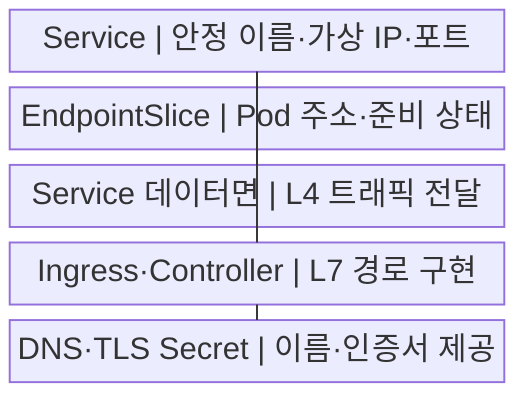
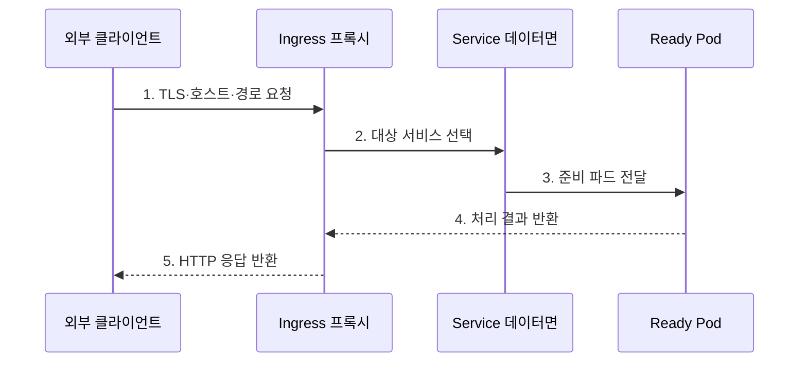

---
sidebar:
  order: 155
  label: "155. 쿠버네티스 서비스·인그레스 (Kubernetes Service Ingress)"
  badge:
    text: "기출 · 70%"
    variant: note
title: "쿠버네티스 서비스·인그레스 (Kubernetes Service Ingress)"
date: "2026-07-29T15:50:00+09:00"
tags:
  - "notes-software"
weight: 155
extra:
  question_no: "155"
  source_status: "기출"
  source_history: "137회"
  priority: 70
  priority_note: "서비스 노출과 경로 제어가 최근 설계축임"
---

## 미리 알고가기

- **서비스(Service)**: 교체되는 포드 집합에 고정 인터넷 프로토콜 주소·도메인 이름·포트를 제공하는 쿠버네티스 네트워크 객체
- **파드(Pod)**: 같은 노드에 배치되어 네트워크를 공유하는 최소 컨테이너 실행 단위
- **도메인 이름 시스템(Domain Name System, DNS)**: 호스트 이름을 네트워크 주소로 변환하는 이름 서비스
- **인터넷 프로토콜(Internet Protocol, IP)**: 서비스와 파드의 네트워크 주소를 식별하는 통신 규약
- **엔드포인트 슬라이스(EndpointSlice)**: Service가 전달할 준비된 Pod IP·포트를 분할 저장하는 객체
- **ClusterIP·NodePort·LoadBalancer**: 클러스터 내부 가상 IP, 모든 노드의 고정 포트, 외부 로드밸런서로 Service를 각각 노출하는 유형
- **HTTP·HTTPS**: 인그레스가 호스트·경로를 판정하고 암호화하는 웹 통신 규약
- **인그레스(Ingress)**: HTTP(S) 호스트·경로 규칙을 서비스 백엔드에 연결하는 API 객체
- **인그레스 컨트롤러(Ingress Controller)**: Ingress를 감시해 프록시·로드밸런서의 실제 라우팅 설정으로 구현하는 소프트웨어
- **인그레스 클래스(IngressClass)**: Ingress를 처리할 컨트롤러와 설정 종류를 지정하는 객체
- **전송 계층 보안(Transport Layer Security, TLS)**: 인증서로 서버 신원을 확인하고 HTTP 통신을 암호화하는 규약
- **시크릿(Secret)**: 인증서·토큰 같은 민감 설정을 저장하는 Kubernetes 객체
- **계층 4·계층 7(Layer 4·Layer 7, L4·L7)**: L4는 포트·연결, L7은 HTTP 호스트·경로로 대상을 판정하는 통신 계층
- **targetPort**: Service 포트가 최종 전달될 파드의 수신 포트
- **NetworkPolicy**: 파드 사이의 허용 통신 방향과 대상을 선언하는 정책
- **웹 애플리케이션 방화벽(Web Application Firewall, WAF)**: 웹 요청의 공격 패턴을 검사·차단하는 보안 장치

## Ⅰ. 개요

- 정의/개념: Service·Ingress **접점·경로 제어**
- 배경/필요성: 파드 주소 변화와 **내부 발견·외부 진입 분리**

### 쉽게 이해하기 (학습용)
- 파드가 교체돼 주소가 바뀌어도 Service라는 대표번호는 유지되고 Ingress는 외부 요청의 주소와 경로를 보고 대표번호를 선택한다.

## Ⅱ. 특징

- **고정 이름·가상 IP** 기반 안정 접점
- **Ready Endpoint** 기반 트래픽 전달
- **호스트·경로·TLS** 기반 L7 라우팅

### 쉽게 이해하기 (학습용)
- Service는 준비된 파드 목록을 한 주소 뒤에 모으고 인그레스 컨트롤러는 선언된 웹 규칙을 실제 프록시 설정으로 바꾼다.

## Ⅲ. 구조 및 구성요소

| 구성요소 | 책임 |
|:---|:---|
| Service | 선택자·포트·**가상 IP 선언** |
| EndpointSlice | 파드 주소·**준비 상태 저장** |
| Service 데이터면 | 가상 IP·**백엔드 L4 전달** |
| Ingress·Controller | **호스트·경로 규칙** 구현 |
| DNS·TLS Secret | **외부 이름·인증서** 제공 |

### 쉽게 이해하기 (학습용)

- DNS와 인증서가 건물 이름과 신분을 보장하면 인그레스가 안내하고 Service가 준비된 파드 중 한 곳으로 연결한다.

## Ⅳ. 흐름도

**동작 원리**

1. **TLS·호스트·경로 요청**: 인증서 검증·라우팅 키 추출
2. **대상 서비스 선택**: 인그레스 규칙과 백엔드 대조
3. **준비 파드 전달**: EndpointSlice 기반 목적지 선택
4. **처리 결과 반환**: 애플리케이션 응답의 프록시 전달
5. **HTTP 응답 반환**: 외부 연결로 결과 송신

### 쉽게 이해하기 (학습용)

- 외부 요청은 인그레스에서 호스트와 경로로 서비스가 정해지고 그 서비스의 준비된 파드에만 전달된다.

## Ⅴ. 종류 및 비교

| 노출 객체 | Service | Ingress |
|:---|:---|:---|
| 적용 기준 | **내부 발견·안정 L4 접점** | **외부 HTTP·L7 분기** |
| 핵심 특징 | **Selector·EndpointSlice**·포트 | **호스트·경로·TLS**·백엔드 |
| 한계 | **Selector·Port**·Endpoint 오류 | Controller·Class·**인증서 의존** |

### 쉽게 이해하기 (학습용)
- Service는 파드 교체를 숨기는 내부 접점이고 Ingress는 여러 접점을 하나의 외부 주소와 인증서 뒤에 배치하는 규칙이다.

## Ⅵ. 실무 고려사항 및 대책

| 고려사항 | 대책 | 효과 |
|:---|:---|:---|
| **선택자·포트 불일치** | 레이블·targetPort·**목록 대조** | **백엔드 누락** 방지 |
| 종료 파드 **요청 유입** | 준비 검사·**연결 배출·유예** 적용 | 처리 중 **연결 단절 감소** |
| **인증서·DNS 불일치** | 자동 갱신·**만료 경보·대상 검증** | 외부 **접속 실패 예방** |
| 컨트롤러별 **경로 차이** | **명시 경로·통합 시험** 적용 | 재작성·**우선순위 오류 감소** |
| 관리 경로 **외부 노출** | 인증·**NetworkPolicy·WAF** 적용 | **우회 접근 차단** |

### 쉽게 이해하기 (학습용)
- 배포 중 파드가 바뀌어도 내부 호출은 Service 이름을 사용하고 준비 해제와 연결 배출을 묶어 기존 요청이 끝날 시간을 확보해야 한다.

## Ⅶ. 결론

- **내부 발견·L7·TLS**로 Service·Ingress 경계 설정

### 쉽게 이해하기 (학습용)
- 내부 통신은 Service 이름을 기준으로 하고 외부 웹 진입만 Ingress에 모아 주소 안정성과 경로 정책을 분리해야 한다.
