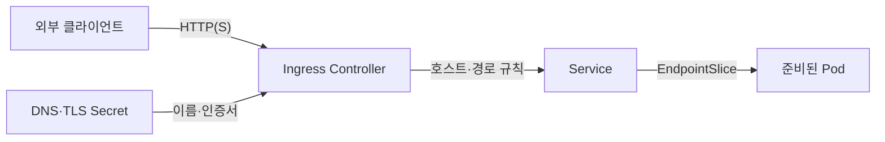
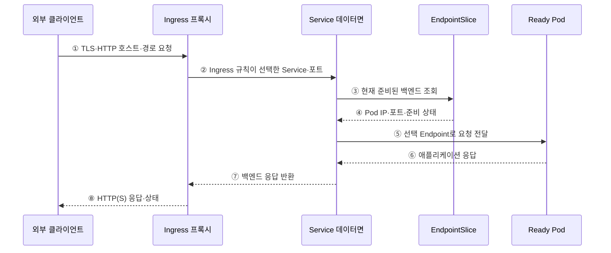

---
sidebar:
  order: 155
  label: "155. 쿠버네티스 서비스·인그레스 (Kubernetes Service Ingress)"
  badge:
    text: "기출 · 70%"
    variant: note
title: "쿠버네티스 서비스·인그레스 (Kubernetes Service Ingress)"
date: "2026-07-27T23:59:59+09:00"
tags:
  - "notes-software"
weight: 155
extra:
  question_no: "155"
  source_status: "기출"
  source_history: "137회"
  priority: 70
  priority_note: "서비스 노출과 경로 제어가 최근 설계축임"
---

## 미리 알고가기

- **서비스(Service)**: 교체되는 포드 집합에 고정 인터넷 프로토콜 주소·도메인 이름·포트를 제공하는 쿠버네티스 네트워크 객체
- **파드(Pod)**: 같은 노드에 배치되어 네트워크를 공유하는 최소 컨테이너 실행 단위
- **도메인 이름 시스템(Domain Name System, DNS)**: ‘디엔에스’로 읽고 세 영문 단어의 머리글자를 딴 표기이며 호스트 이름을 네트워크 주소로 변환하는 이름 서비스
- **인터넷 프로토콜(Internet Protocol, IP)**: ‘아이피’로 읽고 두 영문 단어의 머리글자를 딴 표기이며 서비스와 포드의 네트워크 주소를 식별하는 통신 규약
- **엔드포인트 슬라이스(EndpointSlice)**: Service가 전달할 준비된 Pod IP·포트를 분할 저장하는 객체
- **ClusterIP·NodePort·LoadBalancer**: 클러스터 내부 가상 IP, 모든 노드의 고정 포트, 외부 로드밸런서로 Service를 각각 노출하는 유형
- **하이퍼텍스트 전송 프로토콜·보안형 HTTP(Hypertext Transfer Protocol·HTTP Secure, HTTP·HTTPS)**: 각각 ‘에이치티티피·에이치티티피에스’로 읽고 영문 머리글자와 보안을 뜻하는 S를 붙인 표기이며 인그레스가 호스트·경로를 판정하고 암호화하는 응용 계층 규약
- **인그레스(Ingress)**: HTTP(S) 호스트·경로 규칙을 서비스 백엔드에 연결하는 API 객체
- **인그레스 컨트롤러(Ingress Controller)**: Ingress를 감시해 프록시·로드밸런서의 실제 라우팅 설정으로 구현하는 소프트웨어
- **인그레스 클래스(IngressClass)**: Ingress를 처리할 컨트롤러와 설정 종류를 지정하는 객체
- **전송 계층 보안(Transport Layer Security, TLS)**: 인증서로 서버 신원을 확인하고 HTTP 통신을 암호화하는 규약
- **시크릿(Secret)**: 인증서·토큰 같은 민감 설정을 저장하는 Kubernetes 객체
- **게이트웨이 API(Gateway API)**: ‘게이트웨이 에이피아이’로 읽으며 인프라·라우팅 역할을 객체별로 분리해 HTTP와 확장 경로를 구성하는 후속 API
- **계층 4·계층 7(Layer 4·Layer 7, L4·L7)**: ‘엘포·엘세븐’으로 읽고 Layer의 머리글자 뒤에 계층 번호를 붙인 표기이며 L4는 포트·전송 연결, L7은 HTTP 호스트·경로로 전달 대상을 판정함
- **통합 자원 식별자(Uniform Resource Locator, URL)**: ‘유알엘’로 읽고 세 영문 단어의 머리글자를 딴 관례 표기이며 인그레스가 서비스 백엔드를 고를 때 사용하는 요청 경로를 포함함

## Ⅰ. 개요

- Kubernetes Service는 교체되는 Pod 집합에 안정적인 이름·가상 IP·포트를 제공하고 Ingress는 외부 HTTP(S)의 호스트·경로를 Service 백엔드에 연결한다.
- Pod IP 변화와 외부 웹 라우팅을 분리해 내부 서비스 발견·L4 전달과 외부 L7 진입 정책을 서로 다른 객체와 데이터면으로 관리한다.

### 쉽게 이해하기 (학습용)
- Service는 내부 대표번호이고 Ingress는 외부 요청을 나누는 안내 데스크이다.

## Ⅱ. 특징

- **안정적인 내부 접점**: Service가 Selector로 선택한 Pod의 EndpointSlice를 통해 고정 이름·가상 IP·포트를 제공한다.
- **준비 상태 연계**: Ready한 Endpoint를 기본 전달 대상으로 사용해 교체·장애 Pod로 새 트래픽이 가는 것을 줄인다.
- **다양한 노출 범위**: ClusterIP·NodePort·LoadBalancer가 클러스터 내부·노드 포트·외부 L4 접점을 제공한다.
- **L7 라우팅**: Ingress가 HTTP(S) 호스트·경로·TLS와 Service 백엔드를 선언하고 Controller가 실제 프록시 설정으로 구현한다.
- **구현 의존성**: Ingress API만 생성해도 Controller가 없으면 동작하지 않으며 세부 기능은 IngressClass와 구현에 따라 다르다.

### 쉽게 이해하기 (학습용)
- Service는 바뀌는 목적지를 모으고 Ingress Controller는 외부 웹 규칙을 실제 경로로 만든다.

## Ⅲ. 아키텍처 및 구성요소

**도표안 A — 구조도**

**도표안 B — sequenceDiagram**

| 설계 요소 | 설명 |
|:---|:---|
| Service | Selector·포트·가상 IP·노출 유형으로 안정 접점 선언 |
| EndpointSlice | Service에 연결된 Pod IP·포트·준비·종료 상태를 분할 저장 |
| Service 데이터면 | 구현별 규칙으로 가상 IP 또는 Endpoint에 L4 트래픽 전달 |
| Ingress | HTTP(S) 호스트·경로·TLS·Service 백엔드 규칙 선언 |
| IngressClass·Controller | 처리할 구현을 선택하고 프록시·로드밸런서에 규칙 반영 |
| DNS·TLS Secret | 외부 이름을 접점에 연결하고 인증서·키 제공 |

**동작 원리**

- ① 외부 클라이언트가 DNS로 찾은 Ingress 접점에 TLS와 HTTP 호스트·경로를 포함한 요청을 보낸다.
- ② Ingress 프록시가 인증서와 호스트·경로 규칙을 확인해 대상 Service와 포트를 선택한다.
- ③ Service 데이터면이 현재 EndpointSlice에서 전달 가능한 백엔드를 조회한다.
- ④ EndpointSlice가 Pod IP·포트와 Ready·Terminating 같은 상태를 제공한다.
- ⑤ 데이터면이 정책에 따라 Ready Endpoint 하나를 골라 Pod에 요청을 전달한다.
- ⑥ Pod 애플리케이션이 처리 결과를 Service 데이터면에 반환한다.
- ⑦ Service 경로가 백엔드 응답을 Ingress 프록시에 반환한다.
- ⑧ Ingress 프록시가 TLS 연결을 통해 클라이언트에 HTTP 상태와 응답을 전달한다.

### 쉽게 이해하기 (학습용)

- 안내 데스크가 주소와 길을 보고 대표번호를 고르면 Service가 준비된 직원에게 연결한다.

## Ⅳ. 종류 및 비교

| 비교 항목 | Service | Ingress |
|:---|:---|:---|
| 목적 | 동적 Pod 집합의 안정적 L4 접점 | 외부 HTTP(S)의 L7 진입·분기 |
| 선택 기준 | Selector·EndpointSlice·포트 | 호스트·경로·TLS·백엔드 Service |
| 노출 유형 | ClusterIP·NodePort·LoadBalancer | Controller가 제공하는 외부 프록시 |
| 필수 구현 | 클러스터 Service 데이터면 | 별도 Ingress Controller·IngressClass |
| 대표 오류 | Selector·Port·Ready Endpoint 누락 | Class·호스트·경로·인증서·Backend 오류 |
| 확장 방향 | L4·내부 발견 중심 | 복잡한 역할·경로는 Gateway API 검토 |

> Ingress가 Service를 대체하는 것이 아니라 외부 L7 규칙의 최종 백엔드로 Service를 참조한다.

### 쉽게 이해하기 (학습용)
- Service는 대표번호, Ingress는 주소와 요청 내용으로 대표번호를 고르는 안내 데스크이다.

## Ⅴ. 실무 고려사항 및 대책

| 고려사항 | 위험 | 대책 |
|:---|:---|:---|
| Selector·Port | Endpoint 없음·잘못된 대상 포트 | Label·targetPort·EndpointSlice 대사 |
| 준비·종료 | 시작 전·종료 중 Pod로 요청 | Readiness·종료 유예·연결 Drain |
| TLS·DNS | 인증서 이름/만료·DNS 대상 불일치 | 자동 발급·갱신·만료 경보·DNS 검증 |
| 경로 | Rewrite·우선순위·정규식 구현 차이 | Controller별 통합 시험·명시 경로 |
| 클라이언트 IP | 프록시 계층에서 원본 주소 손실·위조 | 신뢰 프록시 범위·전달 헤더 정책 |
| 접근 통제 | 외부 노출·관리 경로 우회 | 최소 노출·NetworkPolicy·인증·WAF·감사 |

> **적용 사례**: 내부 API는 ClusterIP를 사용하고 외부 HTTPS는 Ingress로 분기하며, Readiness 실패·인증서 교체·Pod 종료 중에도 요청이 안전하게 빠지는지 시험한다.

### 쉽게 이해하기 (학습용)
- 내부 호출은 바뀌는 Pod 주소가 아니라 고정 Service 이름을 사용한다.

## Ⅵ. 결론

- Service의 핵심은 동적 Pod 집합을 안정적인 L4 접점으로 만드는 것이고 Ingress의 핵심은 외부 HTTP(S)를 그 Service들로 분기하는 것이다.
- Selector·Endpoint 준비 상태·TLS·DNS·Controller 구현·종료 Drain을 함께 검증해 내부 발견과 외부 진입의 책임을 분리해야 한다.

### 쉽게 이해하기 (학습용)
- 내부 대표번호와 외부 웹 안내 규칙의 역할을 나눠야 한다.
